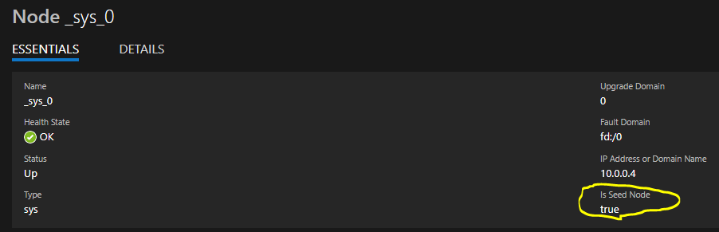

# Common issues customers experience when using Auto-scale with Service Fabric clusters

## **Reference**: https://docs.microsoft.com/en-us/azure/service-fabric/service-fabric-cluster-scale-up-down

1. Scaling down the primary node type to less than the minimum number required based on the cluster [Reliability level](https://docs.microsoft.com/en-us/azure/service-fabric/service-fabric-cluster-capacity#the-reliability-characteristics-of-the-cluster) can make the cluster unstable or can bring it down completely. This could result in data loss for your applications and for the system services.  In extreme cases you may need to rebuild the cluster.

2. For the auto-scale (Scale down scenario) to work correctly out of the box, the [Durability level](https://docs.microsoft.com/en-us/azure/service-fabric/service-fabric-cluster-capacity#the-durability-characteristics-of-the-cluster) of the cluster has to be "Gold" or "Silver", but **cannot** be Bronze.  These higher durability levels will add a new System Infrastructure service which will intercept requests for scale down and do the correct things to ensure the SF cluster remains healthy.

3. Auto-scale below the minimum number of Nodes will damage the cluster configuration.

    - The minimum number of nodes that you must have for the primary node type is driven by the reliability level you have chosen. Read more about [Reliability levels](https://docs.microsoft.com/en-us/azure/service-fabric/service-fabric-cluster-capacity#the-reliability-characteristics-of-the-cluster)

    - If you scale the Primary nodetype below the minimum number of nodes required by your Durability you can unintentially remove one or more of the seed nodes.  Seed nodes are simply the nodes in the Primary nodetype which are designated to run the fabric:/system services and are part of the configuration stored both on the Cluster and in the Service Fabric Resource Provider (SFRP).

    - Missing seed nodes can cause various issues including failed runtime upgrades, failed application upgrades, and failed configuration upgrades. 

    - Deleting more than two (2) seed nodes is not a recoverable scenario, you will need to rebuild the cluster.

        - [How to Fix one missing seednode](./How%20to%20Fix%20one%20missing%20seednode.md)

        - [How to Fix two missing seednode](./How%20to%20Fix%20two%20missing%20seednode.md)

4. Deallocating VM's or the VMMS associated with a Service Fabric cluster will damage the cluster configuration and possible cause data loss.

    - We **do not recommend** deallocating any VMSS which is part of a Service Fabric Cluster, this is essentially the same as scaling to 0 nodes, and in the Primary nodetype it will cause cluster instability.  In both primary and secondary nodetype it may cause data loss.

    - Service Fabric runs all its Stateful System services in the Primary node type in your cluster, specifically on the seed nodes. So at a minimum you should never shut down or scale down the number of instances in the primary node type less than what the reliability tier warrants, but at minimum more than 1/2 of the Seed nodes in the Primary nodetype must always be left up running to maintain quorum or the ring can collapse.

    - Two issues with the stop (Deallocate)

        -   When you resize or **Stop (Deallocate)** a virtual machine, this action destroys the contents of the D: (temporary disk) and may even trigger placement of the virtual machine to a new hypervisor. A planned or unplanned maintenance event may also trigger this placement. This can cause data loss on any Stateful services running on the nodes, including System services. 

        -   It is possible on the Start (**Reallocate**), the VMMS will come up with a new IP address, in which case Service Fabric Resource Provider will no longer recognize the node(s) and the cluster will be down. 

## **Best Practices**

if you have development or QA environments which are only needed for a short duration, a better solution would be to  provision the cluster on demand through a PS script.

-   Create an ARM template with your desired security settings, vm configurations, and any custom cluster or placement settings.  

-   Create a script accepting parameters such as **Location, Resource Group name** and **Cluster name** to : 

    -   deploy this ARM template, passing in any parameters needed (typical deployment for new cluster is about 15-20 min) 

    -   deploy the latest versions of your applications from your build drop 

-   Delete the Resource Group when the cluster is no longer needed, all cluster, vmss, and related resources will be removed. 

    -   If you have any custom configurations, Azure resources such as static IP, or a pre-configured v-net, those can be stored in a different RG as required and would not need to be deleted\\recreated each time. 
