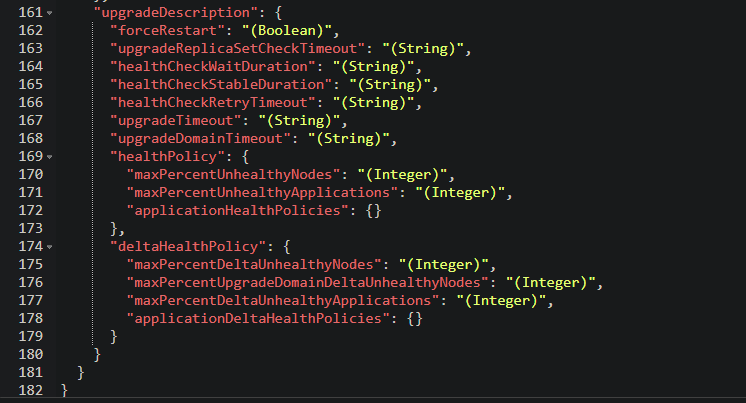

# Fabric Upgrade Policy - Define a Custom Fabric Upgrade Policy

Service Fabric uses the Fabric Upgrade Policy to describe how the cluster is upgraded and verified. The default values for these settings are not stored in the cluster manifest or template for an Azure cluster. This document describes different methods to view, use, and modify these settings.

## Default settings for Fabric Upgrade Policy

```json
"upgradeDescription": {
      "forceRestart": false,
      "upgradeReplicaSetCheckTimeout": "1.00:00:00",
      "healthCheckWaitDuration": "00:00:30",
      "healthCheckStableDuration": "00:01:00",
      "healthCheckRetryTimeout": "00:45:00",
      "upgradeTimeout": "12:00:00",
      "upgradeDomainTimeout": "02:00:00",
      "healthPolicy": {
        "maxPercentUnhealthyNodes": 0,
        "maxPercentUnhealthyApplications": 0
      },
      "deltaHealthPolicy": {
        "maxPercentDeltaUnhealthyNodes": 0,
        "maxPercentUpgradeDomainDeltaUnhealthyNodes": 0,
        "maxPercentDeltaUnhealthyApplications": 0
      }
    },
```

## Required settings for Fabric Upgrade Policy

```json
"upgradeDescription": {
      "upgradeReplicaSetCheckTimeout": "1.00:00:00",
      "healthCheckWaitDuration": "00:00:30",
      "healthCheckStableDuration": "00:01:00",
      "healthCheckRetryTimeout": "00:45:00",
      "upgradeTimeout": "12:00:00",
      "upgradeDomainTimeout": "02:00:00",
      "healthPolicy": {
        "maxPercentUnhealthyNodes": 0,
        "maxPercentUnhealthyApplications": 0
      }
    },
```

## View Fabric Upgrade Policy Settings

For an Azure cluster, to view the Fabric Upgrade Policy, navigate to the Service Fabric Cluster resource in https://portal.azure.com. If custom settings have been defined, the settings can be viewed using https://resources.azure.com and navigating to cluster resource or by powershell cmdlet [get-azServiceFabricCluster](https://docs.microsoft.com/powershell/module/az.servicefabric/get-azservicefabriccluster). For standalone clusters, use powershell cmdlet [get-serviceFabricClusterConfiguration](https://docs.microsoft.com/powershell/module/servicefabric/get-servicefabricclusterconfiguration?view=azureservicefabricps).


## Modify default Fabric Upgrade Policy Settings

For an Azure cluster, to modify the Fabric Upgrade Policy, navigate to the Service Fabric Cluster resource in https://portal.azure.com. Other modifications options are update and redeploy ARM template, or use https://resources.azure.com. The 'upgradeDescription' section is configured in the 'properties' parent section.




## Use Fabric Upgrade Policy Settings to force node restart during Upgrade

There are some scenarios where it is necessary to force the node to restart during Upgrade. Enabling / disabling certain Service Fabric system services / features is an example. To force a node restart during upgrade, **temporarily** set 'forceRestart' to 'true'.

> ### :exclamation:NOTE: After Upgrade has completed, it is necessary to set 'forceRestart' back to default of 'false'.

```json
"upgradeDescription": {
      "forceRestart": true, // <--- set to 'false' after upgrade
      "upgradeReplicaSetCheckTimeout": "1.00:00:00",
      "healthCheckWaitDuration": "00:00:30",
      "healthCheckStableDuration": "00:01:00",
      "healthCheckRetryTimeout": "00:45:00",
      "upgradeTimeout": "12:00:00",
      "upgradeDomainTimeout": "02:00:00",
      "healthPolicy": {
        "maxPercentUnhealthyNodes": 0,
        "maxPercentUnhealthyApplications": 0
      },
      "deltaHealthPolicy": {
        "maxPercentDeltaUnhealthyNodes": 0,
        "maxPercentUpgradeDomainDeltaUnhealthyNodes": 0,
        "maxPercentDeltaUnhealthyApplications": 0
      }
    },
```

## Reference

[ClusterUpgradePolicy](https://docs.microsoft.com/en-us/dotnet/api/microsoft.azure.management.servicefabric.models.clusterupgradepolicy?view=azure-dotnet)

