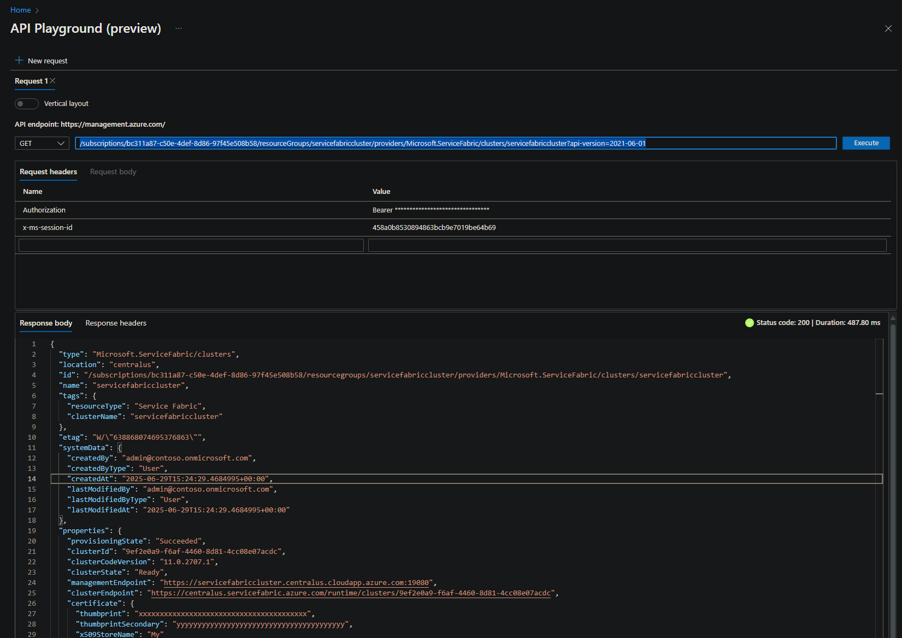
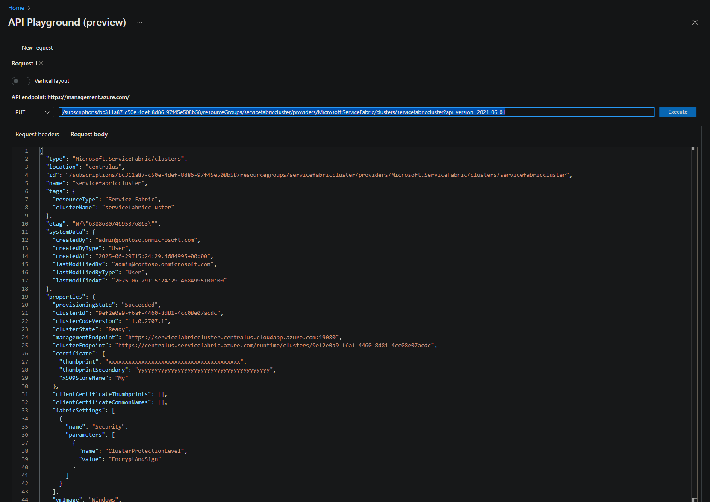
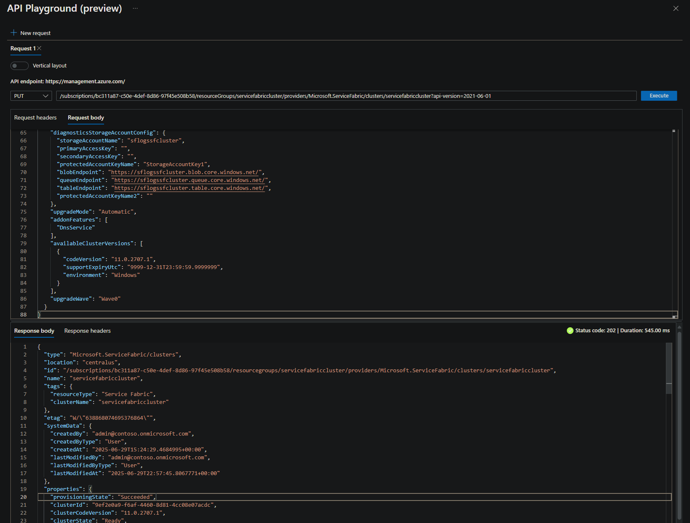

# Fabric Upgrade Policy - Define a Custom Fabric Upgrade Policy

Service Fabric uses the Fabric Upgrade Policy to describe how the cluster is upgraded and verified. The default values for these settings are not stored in the cluster manifest or template for an Azure cluster. This document describes different methods to view, use, and modify these settings.

## Default settings for Fabric Upgrade Policy

```json
"upgradeDescription": {
      "forceRestart": false,
      "upgradeReplicaSetCheckTimeout": "1.00:00:00",
      "healthCheckWaitDuration": "00:00:30",
      "healthCheckStableDuration": "00:01:00",
      "healthCheckRetryTimeout": "00:45:00",
      "upgradeTimeout": "12:00:00",
      "upgradeDomainTimeout": "02:00:00",
      "healthPolicy": {
        "maxPercentUnhealthyNodes": 0,
        "maxPercentUnhealthyApplications": 0
      },
      "deltaHealthPolicy": {
        "maxPercentDeltaUnhealthyNodes": 0,
        "maxPercentUpgradeDomainDeltaUnhealthyNodes": 0,
        "maxPercentDeltaUnhealthyApplications": 0
      }
    },
```

## Required settings for Fabric Upgrade Policy

```json
"upgradeDescription": {
      "upgradeReplicaSetCheckTimeout": "1.00:00:00",
      "healthCheckWaitDuration": "00:00:30",
      "healthCheckStableDuration": "00:01:00",
      "healthCheckRetryTimeout": "00:45:00",
      "upgradeTimeout": "12:00:00",
      "upgradeDomainTimeout": "02:00:00",
      "healthPolicy": {
        "maxPercentUnhealthyNodes": 0,
        "maxPercentUnhealthyApplications": 0
      }
    },
```

## View Fabric Upgrade Policy Settings

To view the Fabric Upgrade Policy, navigate to the Service Fabric Cluster resource in <https://portal.azure.com>.


If custom settings have been defined, the settings can be viewed by selecting the `JSON View` in the top right corner on `Overview` page, using [`Resource Explorer`](https://portal.azure.com/#view/HubsExtension/ArmExplorerBlade), or by using PowerShell cmdlet [Get-AzServiceFabricCluster](https://docs.microsoft.com/powershell/module/az.servicefabric/get-azservicefabriccluster). For standalone clusters, use PowerShell cmdlet [Get-ServiceFabricClusterConfiguration](https://docs.microsoft.com/powershell/module/servicefabric/get-servicefabricclusterconfiguration?view=azureservicefabricps).


## Modify default Fabric Upgrade Policy Settings

To modify the Fabric Upgrade Policy, navigate to the Service Fabric Cluster resource in <https://portal.azure.com>. Options not available in the resource portal blade can be modified using an updated ARM template or by using [`API Playground`](https://portal.azure.com/#view/Microsoft_Azure_Resources/ArmPlayground). The 'upgradeDescription' section is configured in the 'properties' parent section.

1. Open [Resource Explorer](https://portal.azure.com/#view/HubsExtension/ArmExplorerBlade) in [Azure Portal](https://portal.azure.com/) to browse and view resources.

1. Select the specific subscription, resource group, and then resource under 'Resources':

    ```text
    Subscriptions
        └───<subscription name>
            └───ResourceGroups
                └───<resource group name>
                    └───Resources
                        └───<cluster resource name>
    ```

    

1. To modify this resource, triple-click to copy the complete resource URI with API version from the read-only box to the right of the `Open Blade` button for modification using [`API Playground`](https://portal.azure.com/#view/Microsoft_Azure_Resources/ArmPlayground) as described below.

1. Navigate to [API Playground](https://ms.portal.azure.com/#view/Microsoft_Azure_Resources/ArmPlayground) in [Azure Portal](https://portal.azure.com/) and paste the copied resource URI with API version from Resource Explorer into the input box to the right of the HTTP Request Method.

1. Select `Execute` to view the configuration of the specified resource.

1. The `Response Body` will display the configuration of the resource similar to the Resource Explorer view. This response body can be copied and pasted into `Request Body` field above to modify the configuration. Example:

    

1. Set the request method to `PUT`, select `Request Body`, and paste the copied response body.

1. Modify the configuration as needed. Example:

    

1. Select `Execute` to modify the configuration. In the `Response Body`, verify that `Status Code` is '200' and `provisioningState` is 'Updating' or 'Succeeded'. Example:

    

1. The provisioning status can be monitored in the [Azure Portal](https://portal.azure.com/) or by performing additional `Get` requests from [API Playground](https://ms.portal.azure.com/#view/Microsoft_Azure_Resources/ArmPlayground).

## Use Fabric Upgrade Policy Settings to Force Node Restart During Upgrade

There are some scenarios where it is necessary to force the node to restart during an upgrade. Enabling or disabling certain Service Fabric system services or features is an example. To force a node restart during an upgrade, **temporarily** set 'forceRestart' to 'true'.

> ### :exclamation:NOTE: After upgrade has completed, it is necessary to set 'forceRestart' back to default value of 'false'

```json
"upgradeDescription": {
      "forceRestart": true, // <--- set to 'false' after upgrade
      "upgradeReplicaSetCheckTimeout": "1.00:00:00",
      "healthCheckWaitDuration": "00:00:30",
      "healthCheckStableDuration": "00:01:00",
      "healthCheckRetryTimeout": "00:45:00",
      "upgradeTimeout": "12:00:00",
      "upgradeDomainTimeout": "02:00:00",
      "healthPolicy": {
        "maxPercentUnhealthyNodes": 0,
        "maxPercentUnhealthyApplications": 0
      },
      "deltaHealthPolicy": {
        "maxPercentDeltaUnhealthyNodes": 0,
        "maxPercentUpgradeDomainDeltaUnhealthyNodes": 0,
        "maxPercentDeltaUnhealthyApplications": 0
      }
    },
```

## Reference

[ClusterUpgradePolicy](https://docs.microsoft.com/en-us/dotnet/api/microsoft.azure.management.servicefabric.models.clusterupgradepolicy?view=azure-dotnet)

[Azure Resource Explorer Alternatives](./azure-resource-explorer-alternatives.md)
