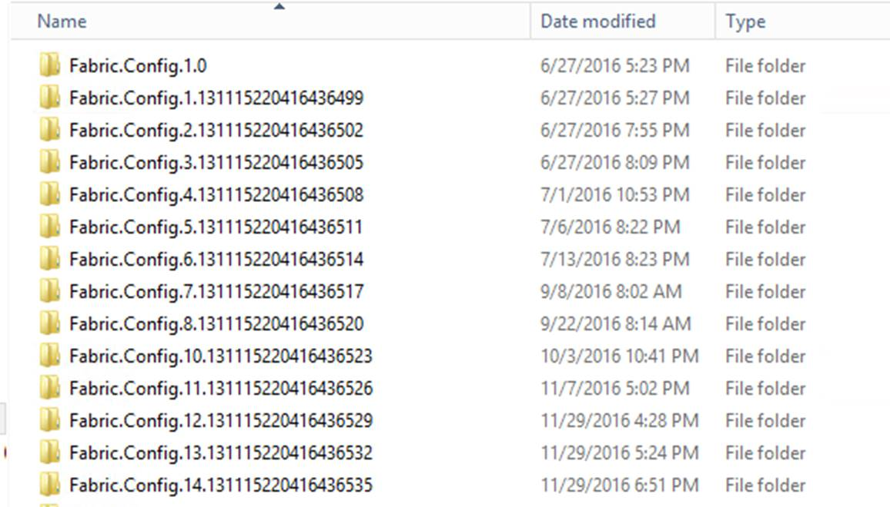
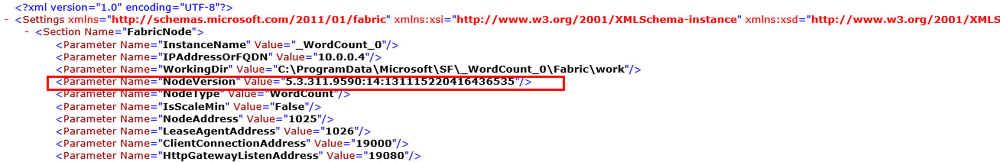

# Get Cluster Upgrade history

## **Steps** 

1. RDP to one node in your primary node type.

2. Change to the directory, D:\\SvcFab\\**node_name**\\Fabric

```command
    cd D:\\SvcFab\\_sys_0\\Fabric
```
3. You will be see all history upgrade info:

    


4. Go to individual version and timestamp one by one

    - Note file/folder timestamps
    - Open the Settings.xml
        - NodeVersion parameter contains the SF Runtime version information

        


## Get Cluster Upgrade history and other events using the EventStore

- See example in [How to Query EventStore from PowerShell](./How%20to%20Query%20EventStore%20from%20PowerShell.md)