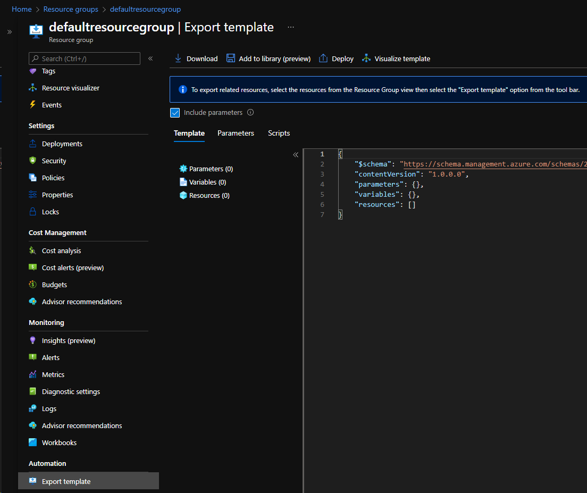

# How to Export Service Fabric Managed Cluster Configuration

## Overview

There are different methods available to export current state of a Service Fabric Managed Cluster. The following describes processes for using Azure portal and PowerShell with 'Az' Azure module. These processes can be used for Disaster Recovery, Redeployment, or as a base cluster template for duplication.  

Service Fabric Managed clusters creates a secondary resource group that contains virtual machine scale sets (vmss), load balancer, storage, and network resources. This secondary resource group naming convention is 'SFC_<cluster guid>'. This secondary resource group **does not** need to be exported. Exporting the main resource group containing the managed cluster is all that is required.

## Export Service Fabric Managed Cluster from Azure portal

1. Navigate to Azure portal https://portal.azure.com. 

1. Select the resource group for the service fabric managed cluster.

1. In left view panel under 'Automation', select 'Export Template'. Ensure 'Include Parameters' is checked, then select 'Download'.

    

## Export Service Fabric Managed Cluster from Azure PowerShell

**NOTE: This requires Azure powershell module 'Az'. To install / update module from admin powershell prompt: Install-Module Az -AllowClobber -Force**

```powershell
$resourceGroupName = ''

# Install-Module Az -AllowClobber -Force
Import-Module Az
Connect-AzAccount
Export-AzResourceGroup -ResourceGroupName $resourceGroupName `
    -Path $pwd `
    -IncludeParameterDefaultValue `
    -IncludeComments `
    -Force

```

## Import exported template

Depending on scenario, make modifications to template if necessary in the parameters and / or template files. When ready to import, the following powershell command can be used. Modify variables as needed.

```powershell
$resourceGroupName = ''
$deploymentName = $resourceGroupName + (get-date).ToString("yyMMddHHmmss")
$templateFile = '.\template.json'
$templateParameterFile = '.\template.parameters.json'

New-AzResourceGroupDeployment -Name $deploymentName `
            -ResourceGroupName $resourceGroupName `
            -DeploymentDebugLogLevel All `
            -TemplateFile $templateFile `
            -TemplateParameterObject $templateParameterFile `
            -Verbose

```

## Reference

Example exported Service Fabric Managed cluster template:

```json
{
  "$schema": "https://schema.management.azure.com/schemas/2019-04-01/deploymentTemplate.json#",
  "contentVersion": "1.0.0.0",
  "parameters": {
    "managedClusters_name": {
      "defaultValue": "<cluster name>",
      "type": "String"
    }
  },
  "variables": {},
  "resources": [
    {
      "type": "Microsoft.ServiceFabric/managedClusters",
      "apiVersion": "2021-11-01-preview",
      "name": "[parameters('managedClusters_name')]",
      "comments": "Generalized from resource: '/subscriptions/<subscription>/resourcegroups/<resource group name>/providers/Microsoft.ServiceFabric/managedClusters/<cluster name>'.",
      "location": "eastus",
      "sku": {
        "name": "Standard"
      },
      "properties": {
        "clusterUpgradeMode": "Automatic",
        "clusterUpgradeCadence": "Wave0",
        "adminUserName": "cloudadmin",
        "dnsName": "[parameters('managedClusters_name')]",
        "clientConnectionPort": 19000,
        "httpGatewayConnectionPort": 19080,
        "allowRdpAccess": false,
        "clients": [
          {
            "isAdmin": true,
            "thumbprint": "<thumbprint>"
          }
        ],
        "addonFeatures": [
          "DnsService"
        ],
        "enableAutoOSUpgrade": false,
        "zonalResiliency": true
      }
    },
    {
      "type": "Microsoft.ServiceFabric/managedClusters/nodetypes",
      "apiVersion": "2021-11-01-preview",
      "name": "[concat(parameters('managedClusters_name'), '/nodetype1')]",
      "comments": "Generalized from resource: '/subscriptions/<subscription>/resourcegroups/<resource group name>/providers/Microsoft.ServiceFabric/managedClusters/<cluster name>/nodetypes/nodetype1'.",
      "location": "eastus",
      "dependsOn": [
        "[resourceId('Microsoft.ServiceFabric/managedClusters', parameters('managedClusters_name'))]"
      ],
      "sku": {
        "name": "Standard_P2",
        "tier": "Standard",
        "capacity": 6
      },
      "properties": {
        "isPrimary": true,
        "vmImagePublisher": "MicrosoftWindowsServer",
        "vmImageOffer": "WindowsServer",
        "vmImageSku": "2019-Datacenter",
        "vmImageVersion": "latest",
        "vmSize": "Standard_D2s_v3",
        "vmInstanceCount": 6,
        "dataDiskSizeGB": 256,
        "dataDiskType": "StandardSSD_LRS",
        "dataDiskLetter": "S",
        "placementProperties": {},
        "capacities": {},
        "applicationPorts": {
          "startPort": 20000,
          "endPort": 30000
        },
        "ephemeralPorts": {
          "startPort": 49152,
          "endPort": 65534
        },
        "vmSecrets": [],
        "vmExtensions": [],
        "isStateless": false,
        "multiplePlacementGroups": false,
        "enableEncryptionAtHost": false,
        "enableAcceleratedNetworking": false,
        "useTempDataDisk": false
      }
    }
  ]
}
```