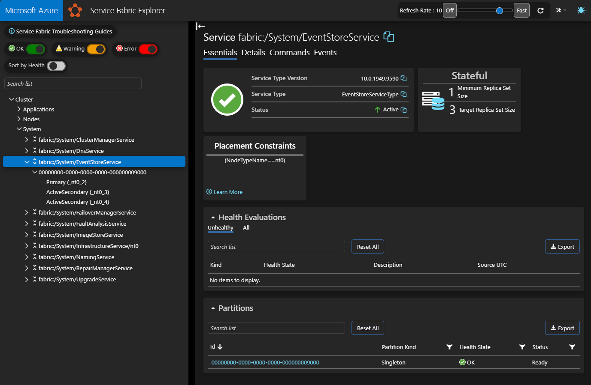
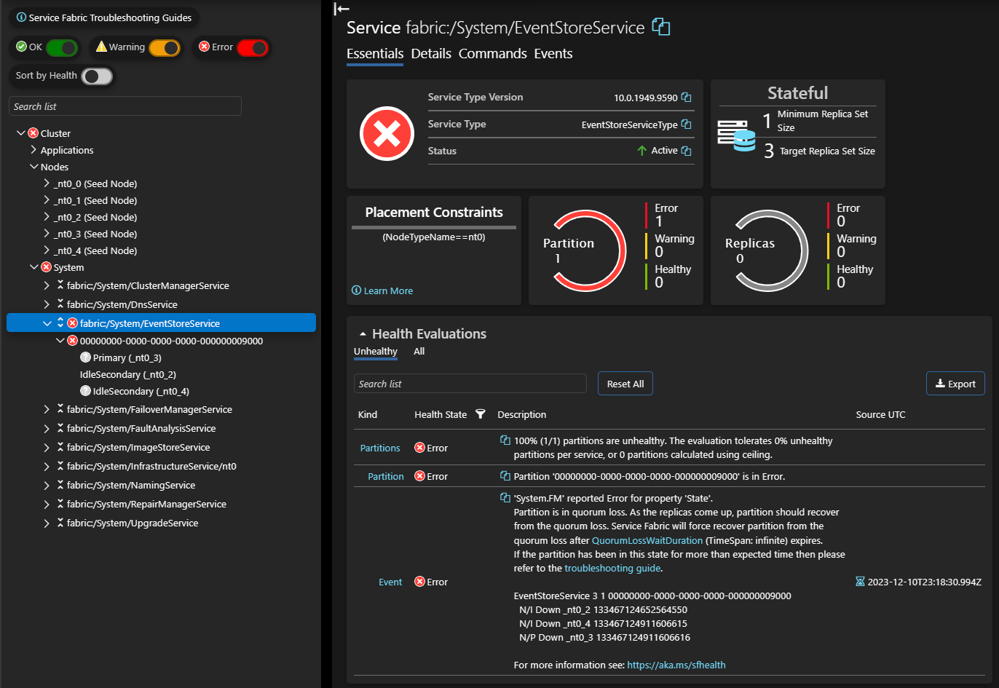

# How to Rotate Access Keys of Storage Account for Service Fabric logs

This troubleshooting guide describes the steps to rotate Storage Account Keys for the storage account used for Service Fabric diagnostic logs. This guide is applicable for Service Fabric clusters only. Service Fabric Managed clusters do not use storage account keys for connectivity to the storage account. [EventStore Overview](https://learn.microsoft.com/azure/service-fabric/service-fabric-diagnostics-eventstore)

Best practice is to provision and manage Service Fabric clusters using ARM templates. This guide describes the steps to rotate Storage Account Keys using ARM templates. If you are not using ARM templates to provision and manage Service Fabric clusters, you can use [resources.azure.com](https://resources.azure.com) to modify the Service Fabric resource to rotate Storage Account Keys.

## Process

1. Verify cluster state before starting process.
2. Verify cluster configuration for storage account keys.
    1. Determine current active storage account key.
3. Using ARM Template method or https://resources.azure.com, modify each node type to rotate storage account key.
    1. Setting inactive storage account key.
    1. Setting active storage account key.
4. Verify cluster state after completing process.
5. Troubleshooting.

## Verify cluster state before starting process

Verify current state of 'EventStoreService' system service and overall cluster health in Service Fabric Explorer (SFX) before starting this key rotation process. The cluster should be in a healthy state with no errors or warnings before proceeding with storage account key rotation excluding errors or warnings for expired storage keys. If the cluster is not in a healthy state, resolve the errors or warnings before proceeding with storage account key rotation as this may block the cluster from processing the configuration change.



## Modify using ARM Template

### Validate current configuration

Use the following steps to validate current configuration of Service Fabric resource and Virtual Machine Scale Set (VMSS) extensions. See [Microsoft.Compute virtualMachineScaleSets](https://learn.microsoft.com/azure/templates/microsoft.compute/virtualmachinescalesets) and [Microsoft.ServiceFabric clusters](https://learn.microsoft.com/azure/templates/microsoft.servicefabric/clusters) for reference.

1. For each node type / Virtual Machine Scale Set (VMSS), verify current Service Fabric extension storage configuration.
    * In the Service Fabric VM Extension section, verify there are two storage keys configured and 'StorageAccountKey2' refers to key2 of storage account. If configured with only one key 'StorageAccountKey1', add a second key 'StorageAccountKey2'.

        ```json
        "virtualMachineProfile": {
            "extensionProfile": {
                "extensions": [
                    {
                        "name": "[concat(parameters('vmNodeType0Name'),'_ServiceFabricNode')]",
                        "properties": {
                            "type": "ServiceFabricNode",
                            "autoUpgradeMinorVersion": true,
                            "protectedSettings": {
                                "StorageAccountKey1": "[listKeys(resourceId('Microsoft.Storage/storageAccounts', parameters('supportLogStorageAccountName')),'2015-05-01-preview').key1]",
                                "StorageAccountKey2": "[listKeys(resourceId('Microsoft.Storage/storageAccounts', parameters('supportLogStorageAccountName')),'2015-05-01-preview').key2]"
                            },
                            "publisher": "Microsoft.Azure.ServiceFabric",
        ...
        ```

2. Verify current active Storage Account Key configuration for Service Fabric resource.

    This can be verified by looking at 'protectedAccountKeyName' in 'diagnosticsStorageAccountConfig' section under Service Fabric resource of the ARM template. In this example, 'StorageAccountKey1' is the active account key.
    <!-- github md doesnt currently support indented block quotes for icons. just highlight instead -->
    **NOTE: Modifying the Service Fabric resource requires a full cluster Upgrade Domain (UD) walk.**

    ```json
    {
        "apiVersion": "2020-03-01",
        "type": "Microsoft.ServiceFabric/clusters",
        "name": "[parameters('clusterName')]",
        "location": "[parameters('clusterLocation')]",
        "dependsOn": [
            "[concat('Microsoft.Storage/storageAccounts/', parameters('supportLogStorageAccountName'))]"
        ],
        "properties": {
            "addOnFeatures": [
                "DnsService",
                "RepairManager"
            ],
            "certificate": {
                "thumbprint": "[parameters('certificateThumbprint')]",
                "x509StoreName": "[parameters('certificateStoreValue')]"
            },
            "clientCertificateCommonNames": [],
            "clientCertificateThumbprints": [],
            "clusterState": "Default",
            "diagnosticsStorageAccountConfig": {
                "blobEndpoint": "[reference(concat('Microsoft.Storage/storageAccounts/', parameters('supportLogStorageAccountName')), variables('storageApiVersion')).primaryEndpoints.blob]",
                "protectedAccountKeyName": "StorageAccountKey1", // <--- current active storage account key
                "queueEndpoint": "[reference(concat('Microsoft.Storage/storageAccounts/', parameters('supportLogStorageAccountName')), variables('storageApiVersion')).primaryEndpoints.queue]",
                "storageAccountName": "[parameters('supportLogStorageAccountName')]", // <--- storage account name
                "tableEndpoint": "[reference(concat('Microsoft.Storage/storageAccounts/', parameters('supportLogStorageAccountName')), variables('storageApiVersion')).primaryEndpoints.table]"
            },
    ```

### Setting inactive storage account key

1. Rotate inactive Storage Account Key. In this guide, 'StorageAccountKey2' of storage account is the inactive account. Rotate 'StorageAccountKey2' of storage account using by clicking 'Rotate key' in the storage account 'Access Keys'. See [Manually Rotate Access Keys](https://learn.microsoft.com/azure/storage/common/storage-account-keys-manage?tabs=azure-portal#manually-rotate-access-keys") for detailed steps.

    

2. After rotation, for each node type, choose one of these actions to update Service Fabric resource to point to new 'StorageAccountKey2'.

    * **Parameterized template:** If template property value is parameterized as shown below, verify 'supportLogStorageAccountName' and redeploy template in incremental mode.

        ```json
            "protectedSettings": {
            "StorageAccountKey1": "[listKeys(resourceId('Microsoft.Storage/storageAccounts', parameters('supportLogStorageAccountName')),'2015-05-01-preview').key1]",
            "StorageAccountKey2": "[listKeys(resourceId('Microsoft.Storage/storageAccounts', parameters('supportLogStorageAccountName')),'2015-05-01-preview').key2]"
        },
        ```

    * **Non-parameterized template:** If template property value is not parameterized, use updated 'StorageAccountKey2' from storage account and modify 'diagnosticsStorageAccountConfig' section of  Service Fabric resource. Redeploy template in incremental mode.

        ```diff
            "protectedSettings": {
            "StorageAccountKey1": "<StorageAccountKey1>",
        -   "StorageAccountKey2": "<(old) StorageAccountKey2>"
        +   "StorageAccountKey2": "<(new) StorageAccountKey2>"
        },
        ```

3. **Optional:** To verify configuration, set the value of 'protectedAccountKeyName' to 'StorageAccountKey2' in 'diagnosticsStorageAccountConfig' section of the Service Fabric resource.

    ```diff
    "diagnosticsStorageAccountConfig": {
        "blobEndpoint": "[reference(concat('Microsoft.Storage/storageAccounts/', parameters('supportLogStorageAccountName')), variables('storageApiVersion')).primaryEndpoints.blob]",
    -       "protectedAccountKeyName": "StorageAccountKey1",
    +       "protectedAccountKeyName": "StorageAccountKey2"
    ```

4. Deploy the ARM template to update the Service Fabric resource.

    ```powershell
    New-AzResourceGroupDeployment -ResourceGroupName '<resource group name>' `
        -TemplateFile '<template file path>' `
        -TemplateParameterFile '<template parameter file path>' `
        -Mode Incremental
    ```

5. After template updates have been deployed, verify successful configuration by reviewing cluster state in Service Fabric Explorer. The cluster nodes should not have any new warnings or errors related to the storage account. Additionally, selecting the 'Events' tab for the cluster in SFX should show a new event with the following message: "Storage account key rotation completed successfully".

### Setting active storage account key

1. If the inactive key is still valid, set the value of 'protectedAccountKeyName' to the inactive key in 'diagnosticsStorageAccountConfig' section of the Service Fabric resource. In this guide, 'StorageAccountKey2' of storage account is the inactive key.

    ```diff
    "diagnosticsStorageAccountConfig": {
        "blobEndpoint": "[reference(concat('Microsoft.Storage/storageAccounts/', parameters('supportLogStorageAccountName')), variables('storageApiVersion')).primaryEndpoints.blob]",
    -       "protectedAccountKeyName": "StorageAccountKey1",
    +       "protectedAccountKeyName": "StorageAccountKey2"
    ```

2. Rotate the active Storage Account Key. In this guide, 'StorageAccountKey1' of storage account is the active key. Rotate 'StorageAccountKey1' of storage account using by clicking 'Rotate key' in the storage account 'Access Keys'. See [Manually Rotate Access Keys](https://learn.microsoft.com/azure/storage/common/storage-account-keys-manage?tabs=azure-portal#manually-rotate-access-keys") for detailed steps.

3. After rotation, for each node type, choose one of these actions to update Service Fabric resource to point to  new 'StorageAccountKey1'.

    * **Parameterized template:** If template property value is parameterized as shown below, verify 'supportLogStorageAccountName' and redeploy template in incremental mode.

        ```json
            "protectedSettings": {
            "StorageAccountKey1": "[listKeys(resourceId('Microsoft.Storage/storageAccounts', parameters('supportLogStorageAccountName')),'2015-05-01-preview').key1]",
            "StorageAccountKey2": "[listKeys(resourceId('Microsoft.Storage/storageAccounts', parameters('supportLogStorageAccountName')),'2015-05-01-preview').key2]"
        },
        ```

    * **Non-parameterized template:** Else, if template property value is not parameterized, use updated 'StorageAccountKey1' from storage account and modify 'diagnosticsStorageAccountConfig' section of  Service Fabric resource. Redeploy template in incremental mode.

        ```diff
            "protectedSettings": {
        -   "StorageAccountKey1": "<(old) StorageAccountKey1>"
        +   "StorageAccountKey1": "<(new) StorageAccountKey1>"
            "StorageAccountKey2": "<StorageAccountKey2>",
        },
        ```

4. **Optional:** To verify configuration and set the active key back to 'StorageAccountKey1', set the value of 'protectedAccountKeyName' to 'StorageAccountKey1' in 'diagnosticsStorageAccountConfig' section of the Service Fabric resource.

    ```diff
    "diagnosticsStorageAccountConfig": {
        "blobEndpoint": "[reference(concat('Microsoft.Storage/storageAccounts/', parameters('supportLogStorageAccountName')), variables('storageApiVersion')).primaryEndpoints.blob]",
    -       "protectedAccountKeyName": "StorageAccountKey2",
    +       "protectedAccountKeyName": "StorageAccountKey1"
    ```

5. Deploy the ARM template to update the Service Fabric resource.

    ```powershell
    New-AzResourceGroupDeployment -ResourceGroupName '<resource group name>' `
        -TemplateFile '<template file path>' `
        -TemplateParameterFile '<template parameter file path>' `
        -Mode Incremental
    ```

6. After template updates have been deployed, verify successful configuration by reviewing cluster state in Service Fabric Explorer. The cluster nodes should not have any new warnings or errors related to the storage account.

## Modify using resources.azure.com

### Validate current configuration

Use the following steps to validate current active storage account key in the Service Fabric resource configuration. See [Microsoft.ServiceFabric clusters](https://learn.microsoft.com/azure/templates/microsoft.servicefabric/clusters) for reference.

1. In <https://resources.azure.com>, navigate to the service fabric cluster:

    ```text
        subscriptions
        └───%subscription name%
            └───resourceGroups
                └───%resource group name%
                    └───providers
                        └───Microsoft.ServiceFabric
                            └───clusters
                                └───%cluster name%
    ```

    

2. The 'protectedAccountKeyName' value in 'diagnosticsStorageAccountConfig' section under Service Fabric resource of the ARM template contains the active key name.

    ```json
    "diagnosticsStorageAccountConfig": {
        "blobEndpoint": "https://sflogsstorageaccount.blob.core.windows.net/",
        "protectedAccountKeyName": "StorageAccountKey1", // <-- current active storage account key
        "queueEndpoint": "https://sflogsstorageaccount.queue.core.windows.net/",
        "storageAccountName": "sflogsstorageaccount", // <-- storage account name
        "tableEndpoint": "https://sflogsstorageaccount.table.core.windows.net/"
    },
    ```

### Setting inactive storage account key

1. Rotate inactive Storage Account Key. In this guide, 'StorageAccountKey2' of storage account is inactive. Rotate 'StorageAccountKey2' of storage account by clicking 'Rotate key' in the storage account 'Access Keys'. See [Manually Rotate Access Keys](https://learn.microsoft.com/azure/storage/common/storage-account-keys-manage?tabs=azure-portal#manually-rotate-access-keys") for detailed steps.

2. For each node type, navigate to the virtual machine scale set configured for the cluster:

    ```text
        subscriptions
        └───%subscription name%
            └───resourceGroups
                └───%resource group name%
                    └───providers
                        └───Microsoft.Compute
                            └───virtualMachineScaleSets
                                └───%virtual machine scale set name%
    ```

    

3. At top of page, click "Read/Write" permission and "Edit" to edit configuration.

4. Navigate to '/properties/virtualMachineProfile/extensionProfile/extensions'. In the Service Fabric extension, add 'protectedSettings' section. Add the storage account key name and value for the new inactive key. Replace '\<StorageAccountKey2>' with the key of the storage account.

    ```diff
    "virtualMachineProfile": {
        "extensionProfile": {
            "extensions": [
                {
                    "name": "[concat(parameters('vmNodeType0Name'),'_ServiceFabricNode')]",
                    "properties": {
                        "type": "ServiceFabricNode",
                        "autoUpgradeMinorVersion": true,
    +                    "protectedSettings": {
    +                        "StorageAccountKey2": "<StorageAccountKey2>"
    +                    },
                        "publisher": "Microsoft.Azure.ServiceFabric",
    ...
    ```

5. At top of page, click PUT.

6. **Wait** for the virtual machine scale set 'Updating' 'provisioningState' for the storage keys to complete. At the top of page, click GET to check status. Verify "provisioningState" shows "Succeeded". If "provisioningState" equals "Updating", continue to periodically click GET at top of page to re-query scale set.

    

7. **Optional:** To verify configuration, set the value of 'protectedAccountKeyName' to 'StorageAccountKey2' in 'diagnosticsStorageAccountConfig' section of the Service Fabric resource. Click "Read/Write" permission and "Edit" to edit configuration.

    ```diff
    "diagnosticsStorageAccountConfig": {
        "blobEndpoint": "[reference(concat('Microsoft.Storage/storageAccounts/', parameters('supportLogStorageAccountName')), variables('storageApiVersion')).primaryEndpoints.blob]",
    -       "protectedAccountKeyName": "StorageAccountKey1",
    +       "protectedAccountKeyName": "StorageAccountKey2"
    ```

8. At top of page, click PUT.

### Setting active storage account key

1. If the inactive key is still valid, set the value of 'protectedAccountKeyName' to the inactive key in 'diagnosticsStorageAccountConfig' section of the Service Fabric resource. In this guide, 'StorageAccountKey2' of storage account is the inactive key. At top of page, click "Read/Write" permission and "Edit" to edit configuration.

    ```diff
    "diagnosticsStorageAccountConfig": {
        "blobEndpoint": "https://sflogsstorageaccount.blob.core.windows.net/",
    -   "protectedAccountKeyName": "StorageAccountKey1",
    +   "protectedAccountKeyName": "StorageAccountKey2",
        "queueEndpoint": "https://sflogsstorageaccount.queue.core.windows.net/",
        "storageAccountName": "sflogsstorageaccount",
        "tableEndpoint": "https://sflogsstorageaccount.table.core.windows.net/"
    },
    ```

2. At top of page, click PUT.

3. **Wait** for the service fabric 'Updating' 'provisioningState' for the protectedAccountKeyName to complete. At the top of page, click GET to check status. Verify "provisioningState" shows "Succeeded". If "provisioningState" equals "Updating", continue to periodically click GET at top of page to re-query scale set.

4. Rotate active Storage Account Key. In this guide, 'StorageAccountKey1' of storage account is active. Rotate 'StorageAccountKey1' of storage account by clicking 'Rotate key' in the storage account 'Access Keys'. See [Manually Rotate Access Keys](https://learn.microsoft.com/azure/storage/common/storage-account-keys-manage?tabs=azure-portal#manually-rotate-access-keys") for detailed steps.

5. For each node type, navigate to the virtual machine scale set configured for the cluster:

    ```text
        subscriptions
        └───%subscription name%
            └───resourceGroups
                └───%resource group name%
                    └───providers
                        └───Microsoft.Compute
                            └───virtualMachineScaleSets
                                └───%virtual machine scale set name%
    ```

6. Click "Read/Write" permission and "Edit" to edit configuration.

7. Navigate to '/properties/virtualMachineProfile/extensionProfile/extensions'. In the Service Fabric extension, add 'protectedSettings' section. Add the storage account key name and value for the new active key. Replace '\<StorageAccountKey1>' with the key of the storage account.

    ```diff
    "virtualMachineProfile": {
        "extensionProfile": {
            "extensions": [
                {
                    "name": "[concat(parameters('vmNodeType0Name'),'_ServiceFabricNode')]",
                    "properties": {
                        "type": "ServiceFabricNode",
                        "autoUpgradeMinorVersion": true,
    +                    "protectedSettings": {
    +                        "StorageAccountKey1": "<StorageAccountKey1>"
    +                    },
                        "publisher": "Microsoft.Azure.ServiceFabric",
    ...
    ```

8. At top of page, click PUT.

9. **Wait** for the virtual machine scale set 'Updating' 'provisioningState' for the storage keys to complete. At the top of page, click GET to check status. Verify "provisioningState" shows "Succeeded". If "provisioningState" equals "Updating", continue to periodically click GET at top of page to re-query scale set.

10. **Optional:** To verify configuration and set the active key back to 'StorageAccountKey1', set the value of 'protectedAccountKeyName' to 'StorageAccountKey1' in 'diagnosticsStorageAccountConfig' section of the Service Fabric resource. Click "Read/Write" permission and "Edit" to edit configuration.

    ```diff
    "diagnosticsStorageAccountConfig": {
        "blobEndpoint": "[reference(concat('Microsoft.Storage/storageAccounts/', parameters('supportLogStorageAccountName')), variables('storageApiVersion')).primaryEndpoints.blob]",
    -       "protectedAccountKeyName": "StorageAccountKey2",
    +       "protectedAccountKeyName": "StorageAccountKey1"
    ```

11. At top of page, click PUT.

## Troubleshooting

1. If the cluster is not in a healthy state after the storage account key rotation, check the status of cluster system service 'fabric:/System/EventStoreService' in Service Fabric Explorer. If the cluster 'fabric:/System/EventStoreService' is in an error or warning state, the error message should indicate whether the storage account key configured is valid.

    

2. Check the cluster system service 'fabric:/System/EventStoreService' in Service Fabric Explorer for the following error message:

    ```text
    'FabricDCA' reported Error for property 'DataCollectionAgent.Blob_WindowsFabric_AzureBlobServiceFabricEtw_BlobInitializer'. 
    The Data Collection Agent (DCA) encountered an exception when trying to initialize Azure Storage. 
    Diagnostics information will be left uncollected if this continues to happen.. 
    Failed trying to access storage account. Please verify if the connection string provided is correct. 
    AccountName: sflogsstorageaccount ContainerName : fabriclogs-a1be7d22-6f5d-4c0b-aca8-d9be5dfde24c. The remote server returned an error: (403) Forbidden.
    ```

    ```text
    'System.FM' reported Error for property 'State'.
    Partition is in quorum loss. As the replicas come up, partition should recover from the quorum loss. Service Fabric will force recover partition from the quorum loss after <a href="https://docs.microsoft.com/dotnet/api/system.fabric.description.statefulservicedescription.quorumlosswaitduration?view=azure-dotnet ">QuorumLossWaitDuration</a> (TimeSpan: infinite) expires.
    If the partition has been in this state for more than expected time then please refer to the <a href="https://docs.microsoft.com/azure/service-fabric/service-fabric-disaster-recovery#random-failures-leading-to-service-failures ">troubleshooting guide</a>.

    EventStoreService 3 3 00000000-0000-0000-0000-000000009000
    N/S Down _nt0_0 133456514055978671
    N/S Ready _nt0_2 133456514280436309
    N/P Down _nt0_1 133456514280436310
    ```

3. Check the Application Event Log on the cluster nodes for errors or exceptions for 'EventStore.Service.exe' indicating a configuration issue with the storage account key.:

    ```text
    Log Name:      Application
    Source:        Windows Error Reporting
    Date:          12/4/2023 2:01:54 PM
    Event ID:      1001
    Task Category: None
    Level:         Information
    Keywords:      Classic
    User:          N/A
    Computer:      nt0000000
    Description:
    Fault bucket 1491601584461759603, type 5
    Event Name: CLR20r3
    Response: Not available
    Cab Id: 0

    Problem signature:
    P1: EventStore.Service.exe
    P2: 10.0.1949.9590
    P3: 652ec981
    P4: System
    P5: 4.8.4682.0
    P6: 6541ba61
    P7: a24
    P8: 20
    P9: System.Net.WebException
    P10: 
    ```
