# How to Setup Azure Alerts for Service Fabric Node Performance Counters

## Overview

This troubleshooting guide describes setting up Azure Alerts based on Service Fabric node performance counter using Windows Azure Diagnostics (WAD) and [Custom Metrics](https://docs.microsoft.com/azure/azure-monitor/essentials/metrics-custom-overview).  

Custom Metrics are configured via WadCfg and require the use of System Managed Identity. See [Sending guest OS metrics using Azure Resource Manager](https://docs.microsoft.com/azure/azure-monitor/essentials/collect-custom-metrics-guestos-resource-manager-vmss). As noted in link above, there may be costs associated with setting up custom metrics. See 'Custom Metrics' in [Azure Monitor Pricing](https://azure.microsoft.com//pricing/details/monitor/).

'Classic' metrics are another option for performance counter upload which is configured by adding 'metrics' section to WadCfg. Classic metrics do not require system managed identity, but do require resourceId and are not usable for Azure Alerts.  

For complete schema information, see [Windows Diagnostics Extension Schema](https://docs.microsoft.com/azure/azure-monitor/agents/diagnostics-extension-schema-windows) for complete schema information.

## Getting current WadCfg

If cluster is deployed and maintained by using ARM template, edit template.json and navigate to section 'WadCfg' in nodetype extensions.  

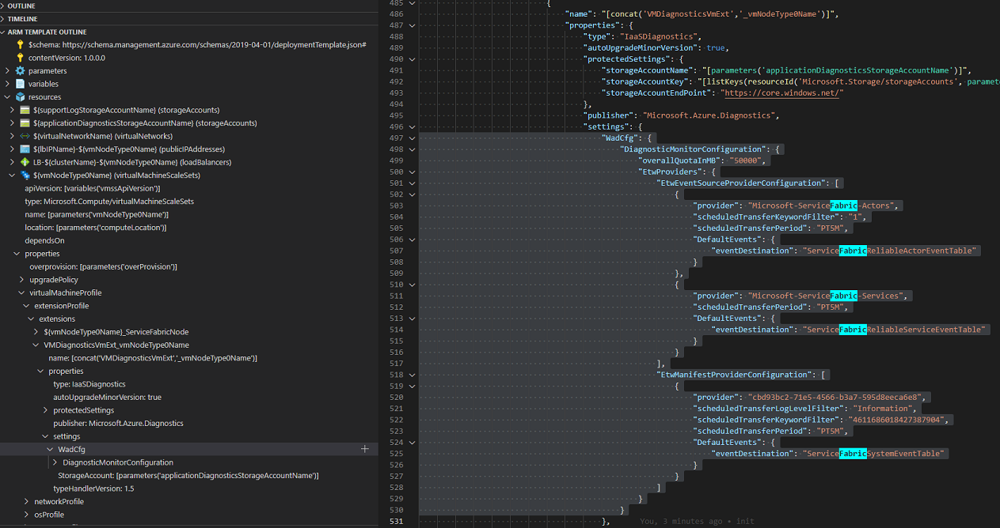

If cluster was deployed from Azure portal and template was not saved, use https://resources.azure.com. Navigate to 'subscription', 'resourceGroups', {{ resource group }}, 'providers', 'Microsoft.Compute', 'virtualMachineScaleSets', {{ nodetype }}.  

```text
    subscriptions
    └───%subscription name%
        └───resourceGroups
            └───%resource group name%
                └───providers
                    └───Microsoft.Compute
                        └───virtualMachineScaleSets
                            └───%virtual machine scale set name%
```

Click "Read/Write" permission and "Edit" to edit configuration.

  


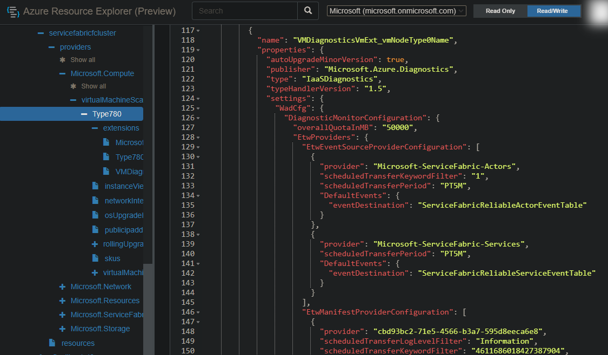

### IaaSDiagnostics default WadCfg

```json
{
    "name": "[concat('VMDiagnosticsVmExt','_vmNodeType0Name')]",
    "properties": {
        "type": "IaaSDiagnostics",
        "autoUpgradeMinorVersion": true,
        "protectedSettings": {
            "storageAccountName": "[parameters('applicationDiagnosticsStorageAccountName')]",
            "storageAccountKey": "[listKeys(resourceId('Microsoft.Storage/storageAccounts', parameters('applicationDiagnosticsStorageAccountName')),'2015-05-01-preview').key1]",
            "storageAccountEndPoint": "https://core.windows.net/"
        },
        "publisher": "Microsoft.Azure.Diagnostics",
        "settings": {
            "WadCfg": {
                "DiagnosticMonitorConfiguration": {
                    "overallQuotaInMB": "50000",
                    "EtwProviders": {
                        "EtwEventSourceProviderConfiguration": [
                            {
                                "provider": "Microsoft-ServiceFabric-Actors",
                                "scheduledTransferKeywordFilter": "1",
                                "scheduledTransferPeriod": "PT5M",
                                "DefaultEvents": {
                                    "eventDestination": "ServiceFabricReliableActorEventTable"
                                }
                            },
                            {
                                "provider": "Microsoft-ServiceFabric-Services",
                                "scheduledTransferPeriod": "PT5M",
                                "DefaultEvents": {
                                    "eventDestination": "ServiceFabricReliableServiceEventTable"
                                }
                            }
                        ],
                        "EtwManifestProviderConfiguration": [
                            {
                                "provider": "cbd93bc2-71e5-4566-b3a7-595d8eeca6e8",
                                "scheduledTransferLogLevelFilter": "Information",
                                "scheduledTransferKeywordFilter": "4611686018427387904",
                                "scheduledTransferPeriod": "PT5M",
                                "DefaultEvents": {
                                    "eventDestination": "ServiceFabricSystemEventTable"
                                }
                            }
                        ]
                    }
                }
            },
            "StorageAccount": "[parameters('applicationDiagnosticsStorageAccountName')]"
        },
        "typeHandlerVersion": "1.5"
    }
}
```

## Adding System Managed Identity

As described in [Sending guest OS metrics using Azure Resource Manager](https://docs.microsoft.com/azure/azure-monitor/essentials/collect-custom-metrics-guestos-resource-manager-vmss), add 'systemAssigned' for the 'Microsoft.Compute/virtualMachineScaleSets' 'identity' type.

```json
{
    "apiVersion": "[variables('vmssApiVersion')]",
    "type": "Microsoft.Compute/virtualMachineScaleSets",
    "name": "[parameters('vmNodeType0Name')]",
    "location": "[parameters('computeLocation')]",
    "dependsOn": [
        "[concat('Microsoft.Network/virtualNetworks/', parameters('virtualNetworkName'))]",
        "[concat('Microsoft.Network/loadBalancers/', concat('LB','-', parameters('clusterName'),'-',parameters('vmNodeType0Name')))]",
        "[concat('Microsoft.Storage/storageAccounts/', parameters('supportLogStorageAccountName'))]",
        "[concat('Microsoft.Storage/storageAccounts/', parameters('applicationDiagnosticsStorageAccountName'))]"
    ],
    "properties": {
```

```diff
diff --git a/template/template.json b/template/template.json
index f11bcae..eb140d3 100644
--- a/template/template.json
+++ b/template/template.json
@@ -443,6 +443,9 @@
             "type": "Microsoft.Compute/virtualMachineScaleSets",
             "name": "[parameters('vmNodeType0Name')]",
             "location": "[parameters('computeLocation')]",
+            "identity": {
+                "type": "systemAssigned"
+            },
             "dependsOn": [
                 "[concat('Microsoft.Network/virtualNetworks/', parameters('virtualNetworkName'))]",
```

## Adding performance counters

Add the performance counter(s) to be alerted on. Not all counters are able to be configured for alerting using Custom Metrics. Review links about 'Design limitations and considerations' for counters. To see a list of counters available and syntax, [RDP](https://docs.microsoft.com/azure/service-fabric/service-fabric-cluster-remote-connect-to-azure-cluster-node) to a node and start 'Performance Monitor' (perfmon.exe).

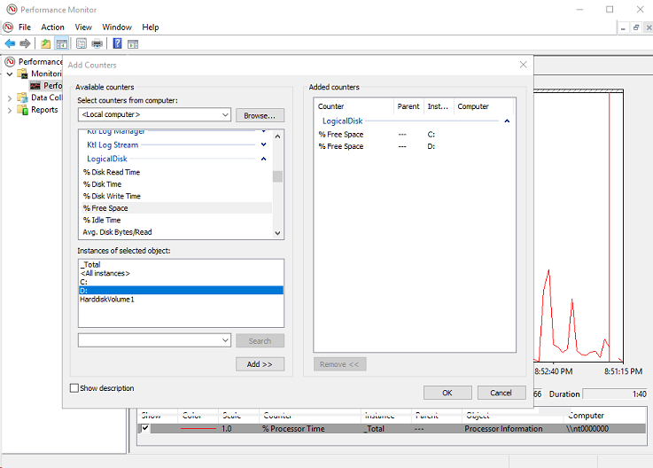

After adding the counters of interest to perfmon, select 'Properties' to see the counter names as they should be configured in WadCfg. In this example, 'Object' 'LogicalDisk' is selected with both 'C:' and 'D:' instances added. In 'Properties' view, '\LogicalDisk(C:)\% Free Space' and '\LogicalDisk(D:)\% Free Space' are shown.

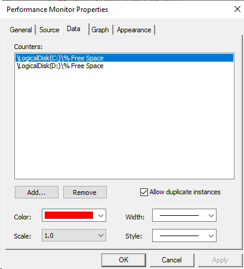

Powershell can also be used to enumerate list of counters.

```powershell
Get-Counter -ListSet * | Select-Object CounterSetName, Paths | Sort-Object CounterSetName
```

Add / Modify [PerformanceCounters Element](https://docs.microsoft.com/azure/azure-monitor/agents/diagnostics-extension-schema-windows#performancecounters-element)

Example adding PerformanceCounters element and counters to WadCfg

```diff
The file will have its original line endings in your working directory
diff --git a/template/template.json b/template/template.json
index eb140d3..a249f60 100644
--- a/template/template.json
+++ b/template/template.json
@@ -500,6 +500,21 @@
                                         "WadCfg": {
                                             "DiagnosticMonitorConfiguration": {
                                                 "overallQuotaInMB": "50000",
+                                                "PerformanceCounters": {
+                                                    "scheduledTransferPeriod": "PT1M",
+                                                    "PerformanceCounterConfiguration": [
+                                                        {
+                                                            "counterSpecifier": "\\LogicalDisk(C:)\\% Free Space",
+                                                            "sampleRate": "PT10S"
+                                                        },
+                                                        {
+                                                            "counterSpecifier": "\\LogicalDisk(D:)\\% Free Space",
+                                                            "sampleRate": "PT10S"
+                                                        }
+                                                    ]
+                                                },
                                                 "EtwProviders": {
                                                     "EtwEventSourceProviderConfiguration": [
                                                         {
```

## Add sink

Starting with Diagnostics extension version 1.5, 'sinks' has been added to implement a sink location to send diagnostic data. Using 'sink' and Custom Metrics, performance counter data can be uploaded and viewed in Azure Portal. 'SinksConfig' element provides a list of locations to send diagnostics data to. Examples are, 'AzureMonitorSink', 'ApplicationInsights', and 'EventHub'. In this example, 'AzureMonitor' is being used.

```diff
diff --git a/template/template.json b/template/template.json
index a249f60..469dbf0 100644
--- a/template/template.json
+++ b/template/template.json
@@ -502,6 +502,7 @@
                                                 "overallQuotaInMB": "50000",
                                                 "PerformanceCounters": {
                                                     "scheduledTransferPeriod": "PT1M",
+                                                    "sinks": "AzureMonitorSink",
                                                     "PerformanceCounterConfiguration": [
                                                         {
@@ -545,6 +546,14 @@
                                                         }
                                                     ]
                                                 }
+                                            },
+                                            "SinksConfig": {
+                                                "Sink": [
+                                                    {
+                                                        "name": "AzureMonitorSink",
+                                                        "AzureMonitor": {
+                                                            "resourceId": ""
+                                                        }
+                                                    }
+                                                ]
                                             }
                                         },
                                         "StorageAccount": "[parameters('applicationDiagnosticsStorageAccountName')]"
```

## Updating deployment configuration

If using a template to modify configuration, once .\template.json has been modified, run 'test-azResourceGroupDeployment' and 'new-azResourceGroupDeployment' to deploy new template.

```powershell
PS C:\>test-azResourceGroupDeployment -resourceGroupName servicefabriccluster -templateFile .\template.json -verbose
VERBOSE: 17:58:51 - Template is valid.
PS C:\>new-azResourceGroupDeployment -resourceGroupName servicefabriccluster -templateFile .\template.json -deploymentDebugLogLevel all -verbose
```

If using https://resources.azure.com, in 'Edit' configuration, once all changes have been made, select 'PUT' to update the configuration. Status of update will be viewable in [Azure portal](https://portal.azure.com).


To troubleshoot errors while modifying a resource configuration, for example, an exclamation or warning icon is temporarily displayed, scroll to the bottom of the page and review the error:


## Validating configuration

After successful deployment, within a few minutes, the new metrics should be available in [Metrics Explorer](https://ms.portal.azure.com/#blade/Microsoft_Azure_Monitoring/AzureMonitoringBrowseBlade/metrics) blade (part of Azure Monitor) in portal. Navigate to the resource group and 'Virtual machine scale set'. Same information is available under the resource and resource group.

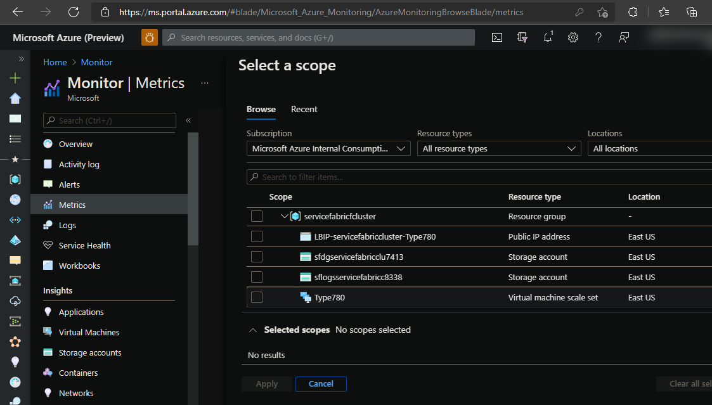

In 'Metric Namespace' dropdown, 'Virtual Machine Guest' option should now be available.

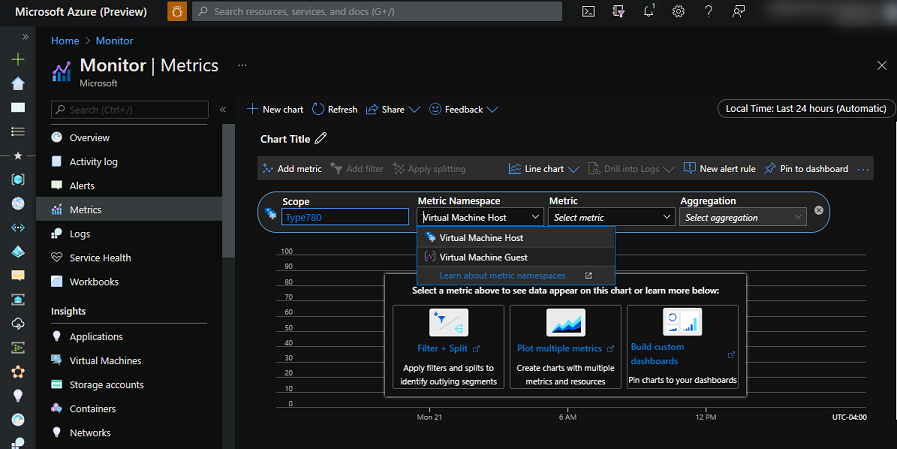

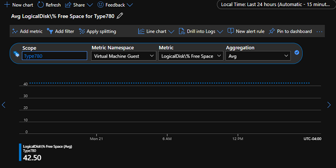

'Apply splitting' to view each node.

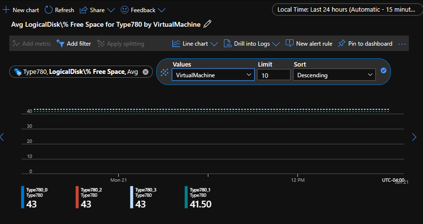

'Add filter' to filter on the counter instances for this example are drives 'C:' and 'D:'.

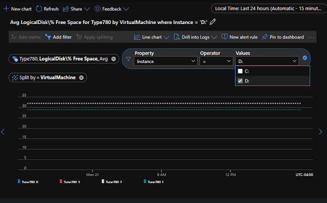

## Adding an Azure Alert

Like Metrics, Alerts can be created and viewed from Azure Monitor, resource, and from resource group. From [Validating configuration](#validating-configuration) section above, a new alert can be added by selecting 'New alert rule'. Or, a new alert can be created from 'Alerts' view. In the follow example, the 'Condition' trigger is configured to raise an error level event when disk space on drive D: is less than 5%.

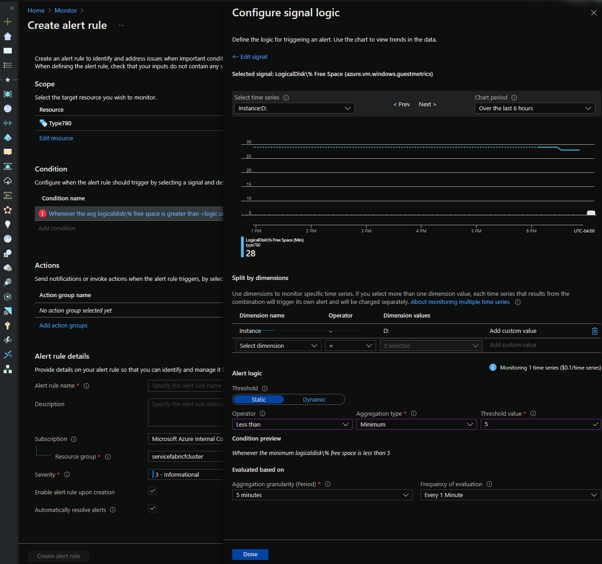

Add one or more actions to take when alert is triggered such as a notification. A common action is to setup email / SMS notifications as shown below.

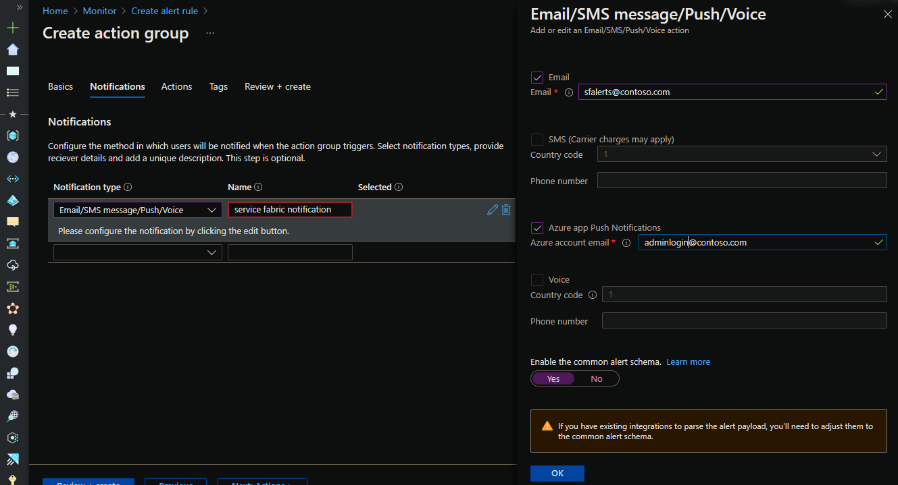

Set the appropriate 'Alert rule name', 'Severity', and 'Resource group'.
When complete, select 'Create alert rule'.

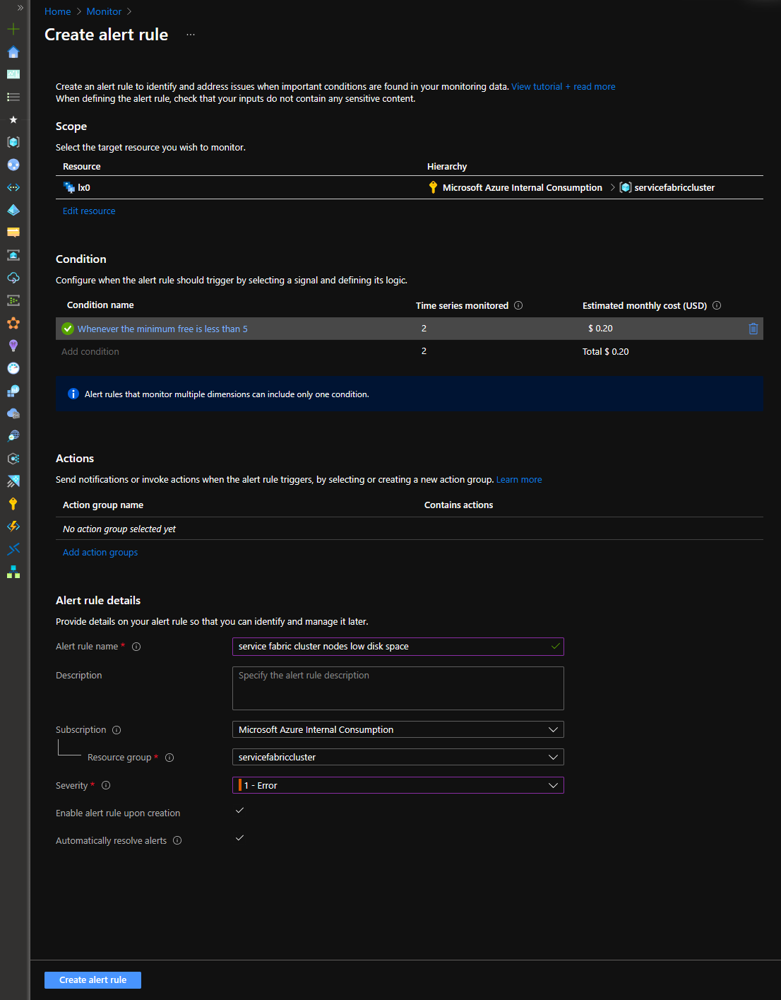

## Reference WadCfg with common counters

```json
// this requires systemAssigned managed identity configuration in scaleset resource as mentioned above
//            "identity": {
//                "type": "systemAssigned"
//            },

"WadCfg": {
    "DiagnosticMonitorConfiguration": {
        "overallQuotaInMB": "50000",
        "PerformanceCounters": {
            "scheduledTransferPeriod": "PT1M",
            "sinks": "AzureMonitorSink",
            "PerformanceCounterConfiguration": [
                {
                    "counterSpecifier": "\\LogicalDisk(C:)\\% Free Space",
                    "sampleRate": "PT10S"
                },
                {
                    "counterSpecifier": "\\LogicalDisk(D:)\\% Free Space",
                    "sampleRate": "PT10S"
                },
                {
                    "counterSpecifier": "\\Memory\\Available MBytes",
                    "sampleRate": "PT10S"
                },
                {
                    "counterSpecifier": "\\Memory\\Pages/sec",
                    "sampleRate": "PT10S"
                },
                {
                    "counterSpecifier": "\\Paging File(_Total)\\% Usage",
                    "sampleRate": "PT10S"
                },
                {
                    "counterSpecifier": "\\PhysicalDisk(C:)\\Current Disk Queue Length",
                    "sampleRate": "PT10S"
                },
                {
                    "counterSpecifier": "\\PhysicalDisk(D:)\\Current Disk Queue Length",
                    "sampleRate": "PT10S"
                },
                {
                    "counterSpecifier": "\\Process(_Total)\\Handle Count",
                    "sampleRate": "PT10S"
                },
                {
                    "counterSpecifier": "\\Process(_Total)\\Private Bytes",
                    "sampleRate": "PT10S"
                },
                {
                    "counterSpecifier": "\\Process(_Total)\\Thread Count",
                    "sampleRate": "PT10S"
                },
                {
                    "counterSpecifier": "\\Processor(_Total)\\% Processor Time",
                    "sampleRate": "PT10S"
                },
                {
                    "counterSpecifier": "\\TCPv4\\Connections Established",
                    "sampleRate": "PT10S"
                },
                {
                    "counterSpecifier": "\\TCPv4\\Segments Received/sec",
                    "sampleRate": "PT10S"
                },
                {
                    "counterSpecifier": "\\TCPv4\\Segments Retransmitted/sec",
                    "sampleRate": "PT10S"
                },
                {
                    "counterSpecifier": "\\TCPv4\\Segments Sent/sec",
                    "sampleRate": "PT10S"
                }
            ]
        },
        "EtwProviders": {
            "EtwEventSourceProviderConfiguration": [
                {
                    "provider": "Microsoft-ServiceFabric-Actors",
                    "scheduledTransferKeywordFilter": "1",
                    "scheduledTransferPeriod": "PT5M",
                    "DefaultEvents": {
                        "eventDestination": "ServiceFabricReliableActorEventTable"
                    }
                },
                {
                    "provider": "Microsoft-ServiceFabric-Services",
                    "scheduledTransferPeriod": "PT5M",
                    "DefaultEvents": {
                        "eventDestination": "ServiceFabricReliableServiceEventTable"
                    }
                }
            ],
            "EtwManifestProviderConfiguration": [
                {
                    "provider": "cbd93bc2-71e5-4566-b3a7-595d8eeca6e8",
                    "scheduledTransferLogLevelFilter": "Information",
                    "scheduledTransferKeywordFilter": "4611686018427387904",
                    "scheduledTransferPeriod": "PT5M",
                    "DefaultEvents": {
                        "eventDestination": "ServiceFabricSystemEventTable"
                    }
                }
            ]
        }
    },
    "SinksConfig": {
        "Sink": [
            {
                "name": "AzureMonitorSink",
                "AzureMonitor": {
                    "resourceId": ""
                }
            }
        ]
    }
},
```

## Troubleshooting

Errors in WadCfg may be logged in the extension status log. See [Azure Diagnostics Troubleshooting](https://docs.microsoft.com/en-us/azure/azure-monitor/agents/diagnostics-extension-troubleshooting)

```json
[{
    "status": {
        "code": -108,
        "configurationAppliedTime": "2021-06-22T16:43:36Z",
        "formattedMessage": {
            "lang": "en-US",
            "message": "Object reference not set to an instance of an object. See the troubleshooting guide to diagnose the problem: https:\/\/go.microsoft.com\/fwlink\/?linkid=852271"
        },
        "name": "Microsoft.Azure.Diagnostics.IaaSDiagnostics",
        "operation": "DiagnosticPluginLauncher",
        "status": "error",
        "substatus": [{
            "code": -106,
            "formattedMessage": {
                "lang": "en-us",
                "message": "Failed to parse the WAD config file"
            },
            "status": "error"
        }, {
            "code": -106,
            "formattedMessage": {
                "lang": "en-us",
                "message": "DiagnosticsPlugin launch failed with exit code -106"
            },
            "status": "error"
        }, {
            "code": -106,
            "formattedMessage": {
                "lang": "en-us",
                "message": "Error starting the diagnostics extension"
            },
            "status": "error"
        }]
    },
    "timestampUTC": "2021-06-22T16:43:28.5474058Z",
    "version": 1
}]
```
