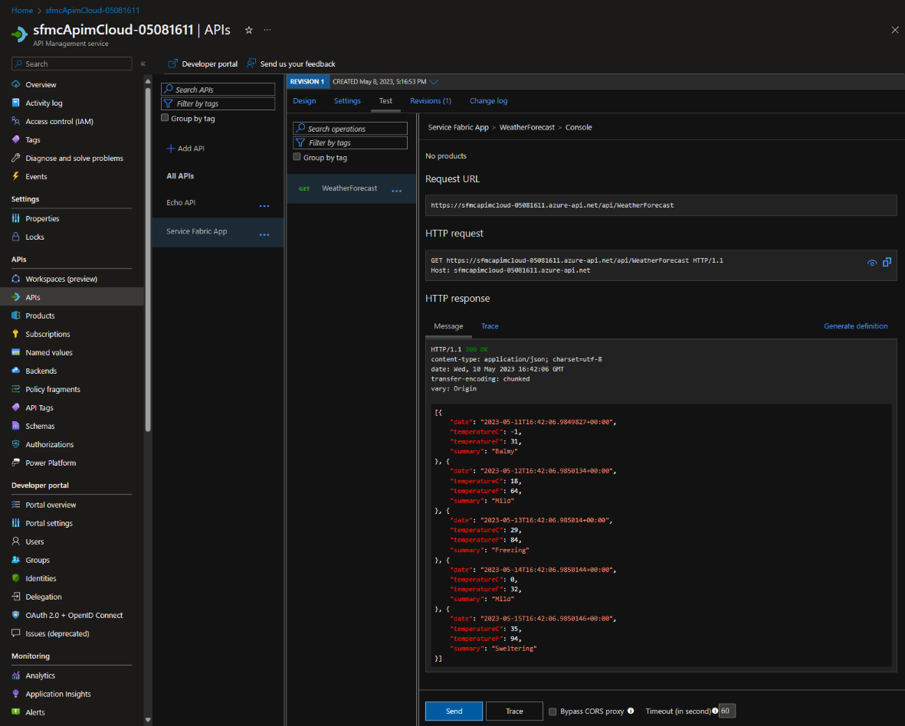
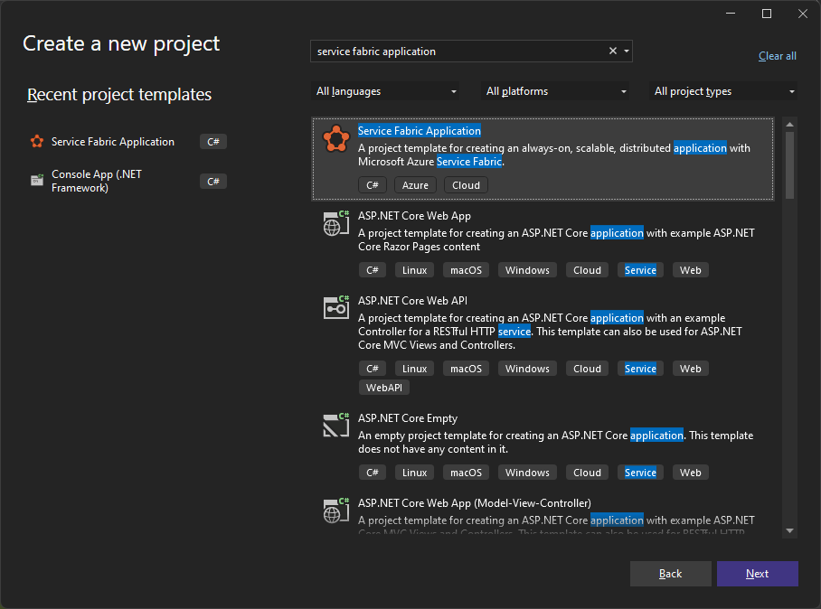
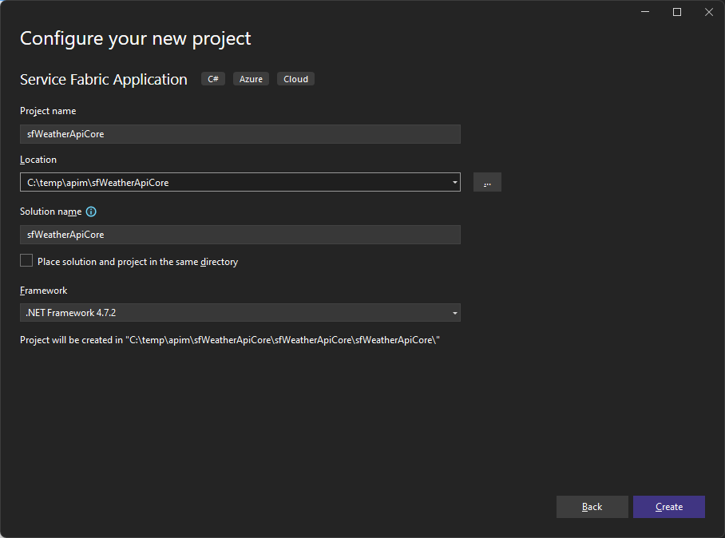
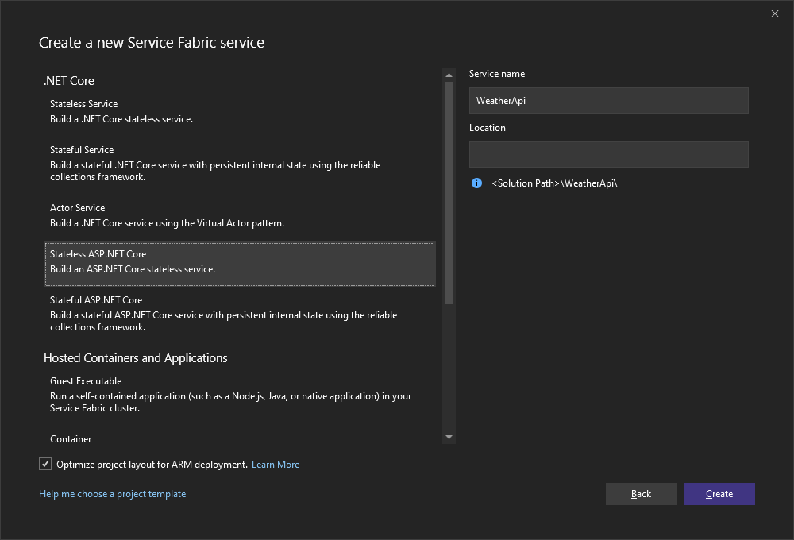
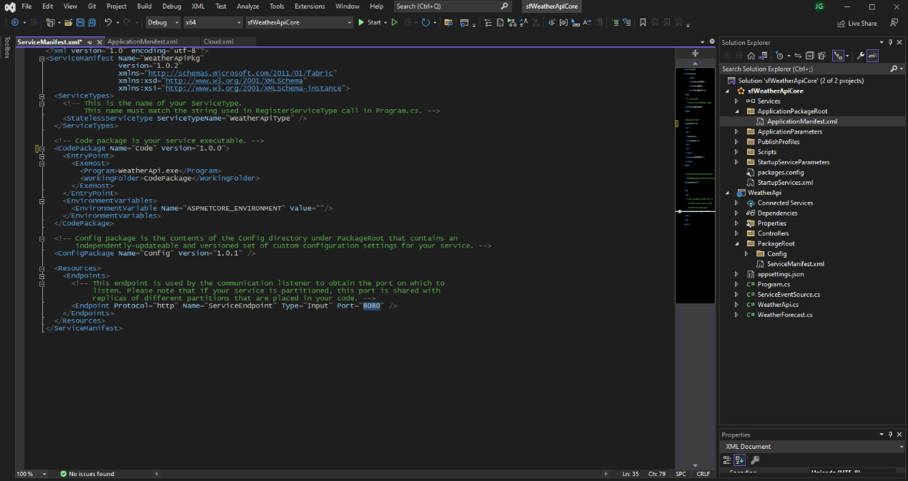
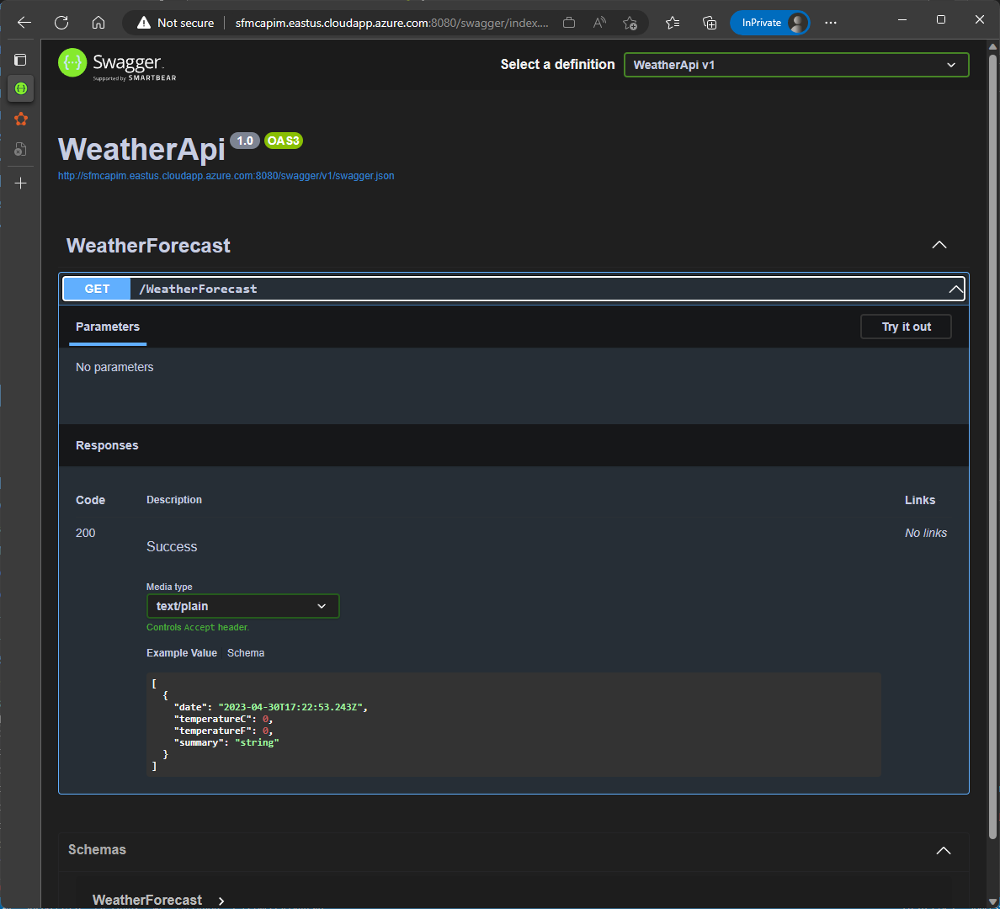

# How to configure APIM Service Fabric Managed Cluster Service Connection

The steps below describe how to configure [Azure API Management](https://learn.microsoft.com/azure/api-management/) (APIM) to route traffic to a back-end service in a Service Fabric managed cluster using PowerShell. For unmanaged clusters, use [Integrate API Management with Service Fabric in Azure](https://learn.microsoft.com/azure/service-fabric/service-fabric-tutorial-deploy-api-management).

Service Fabric Managed Clusters provision and manage the 'server' certificate including the rollover process before certificate expiration.
There is currently no notification when this occurs.
APIM service connections use X509 Certificate authentication requiring the configuration of the server certificate thumbprint.
When the certificate is rolled over, the APIM connection will fail to connect to cluster causing applications to fail.

## Requirements

- Service Fabric managed cluster deployed using an existing external virtual network. See [Bring your own virtual network](https://learn.microsoft.com/azure/service-fabric/how-to-managed-cluster-networking#bring-your-own-virtual-network) in [Configure network settings for Service Fabric managed clusters](https://learn.microsoft.com/azure/service-fabric/how-to-managed-cluster-networking) for additional  information.
- [Azure API Management](https://learn.microsoft.com/azure/api-management/).
- Azure Key vault with certificate.

## Process

1. First, use New-AzResourceGroup to create a resource group to host the virtual network. Run the following code to create a resource group named TestRG in the eastus Azure region.

    ```powershell
    $resourceGroupName = 'testrg'
    $location = 'eastus'
    New-AzResourceGroup -Name $resourceGroupName -location $location
    ```

1. Create a Network Security Group for APIM

    ```powershell
    $networkSecurityGroup = New-AzNetworkSecurityGroup -Name 'vnet-apim-nsg' -ResourceGroupName $resourceGroupName  -Location $location
    ```

1. Configure NSG rules for APIM (Management endpoint for Azure portal and PowerShell)

    ```powershell
    Add-AzNetworkSecurityRuleConfig -Name 'AllowManagementEndpoint' `
      -NetworkSecurityGroup $networkSecurityGroup `
      -Description 'Management endpoint for Azure portal and PowerShell' `
      -Access Allow `
      -Protocol Tcp `
      -Direction Inbound `
      -Priority 300 `
      -SourceAddressPrefix ApiManagement `
      -SourcePortRange * `
      -DestinationAddressPrefix VirtualNetwork `
      -DestinationPortRange 3443

    ## Updates the network security group. ##
    Set-AzNetworkSecurityGroup -NetworkSecurityGroup $networkSecurityGroup
    ```

    > Note: Create more rules as needed as per [https://learn.microsoft.com/azure/api-management/virtual-network-reference?tabs=stv2#required-ports](https://learn.microsoft.com/azure/api-management/virtual-network-reference?tabs=stv2#required-ports)

1. Use New-AzVirtualNetwork to create a virtual network named VNet with IP address prefix 10.0.0.0/16 in the TestRG resource group and eastus 2 location.

    ```powershell
    $vnet = @{
        Name = 'VNet'
        ResourceGroupName = $resourceGroupName
        Location = $location
        AddressPrefix = '10.0.0.0/16'
    }

    $virtualNetwork = New-AzVirtualNetwork @vnet
    ```

1. Use Add-AzVirtualNetworkSubnetConfig to create a subnet configuration named default with address prefix 10.0.0.0/24.

    ```powershell
    $sfmcSubnet = @{
        Name = 'sfmc'
        VirtualNetwork = $virtualNetwork
        AddressPrefix = '10.0.0.0/24'
    }

    $apimSubnet = @{
        Name = 'apim'
        VirtualNetwork = $virtualNetwork
        AddressPrefix = '10.0.1.0/24'
        NetworkSecurityGroup = $networkSecurityGroup
    }

    Add-AzVirtualNetworkSubnetConfig @sfmcSubnet
    Add-AzVirtualNetworkSubnetConfig @apimSubnet
    ```

1. Then associate the subnets configuration to the virtual network with Set-AzVirtualNetwork.

    ```powershell
    $virtualNetwork | Set-AzVirtualNetwork
    ```

1. Prepare the steps for SFMC BYOVNET as per [Bring your own virtual network](https://learn.microsoft.com/azure/service-fabric/how-to-managed-cluster-networking#bring-your-own-virtual-network)

    - Get the service Id from your subscription for Service Fabric Resource Provider application:

      ```powershell
      $sfrpPrincipals = @(Get-AzADServicePrincipal -DisplayName 'Azure Service Fabric Resource Provider')
      ```

    - Obtain the SubnetId from the existing VNet:

      ```powershell
      $sfmcSubnetId = ((Get-AzVirtualNetwork -Name $vnet.name -ResourceGroupName $resourceGroupName).Subnets | Where Name -eq $sfmcSubnet.Name | Select Id).Id
      ```

    - Run the following PowerShell command using the principal ID from previous steps, and assignment scope Id obtained above:

      ```powershell
      foreach($sfrpPrincipal in $sfrpPrincipals) {
        New-AzRoleAssignment -PrincipalId $sfrpPrincipal.Id -RoleDefinitionName 'Network Contributor' -Scope $sfmcSubnetId
      }
      ```

1. Create a Public IP Address (for APIM)

    ```powershell
    $domainNameLabel = 'apimip'
    $ip = @{
        Name = 'apimip'
        ResourceGroupName = $resourceGroupName
        Location = $location
        Sku = 'Standard'
        AllocationMethod = 'Static'
        IpAddressVersion = 'IPv4'
        DomainNameLabel = $domainNameLabel
    }

    New-AzPublicIpAddress @ip
    ```

1. Create API Management Service with External VNET integration (It takes around 1 hour)

    ```powershell
    $apimSubnetId = ((Get-AzVirtualNetwork -Name $vnet.name -ResourceGroupName $resourceGroupName).Subnets | Where Name -eq $apimSubnet.Name | Select Id).Id
    $apimNetwork = New-AzApiManagementVirtualNetwork -SubnetResourceId $apimSubnetId
    $publicIpAddressId = (Get-AzPublicIpAddress -Name $ip.name -ResourceGroupName $resourceGroupName | Select Id).Id
    $apimName = 'myApimCloud'
    $adminEmail = 'admin@contoso.com'
    $organization = 'contoso'

    New-AzApiManagement -ResourceGroupName $resourceGroupName `
      -Location $location `
      -Name $apimName `
      -Organization $organization `
      -AdminEmail $adminEmail `
      -VirtualNetwork $apimNetwork `
      -VpnType 'External' `
      -Sku 'Developer' `
      -PublicIpAddressId $publicIpAddressId
    ```

1. Create the SFMC within the VNET previously created.
    > Example existing vnet managed cluster ARM template below: [SFMC ARM deployment template](#sfmc-arm-deployment-template).

    > Multiple nodetype example here: [Standard SKU Service Fabric managed cluster, 2 node types, deployed in to existing subnet](https://github.com/Azure-Samples/service-fabric-cluster-templates/tree/master/SF-Managed-Standard-SKU-2-NT-BYOVNET).

    ```powershell
    $templateFile = "$pwd\sfmc-template.json"
    $adminPassword = '<enter a password>'
    $clientCertificateThumbprint = '<enter a thumbprint>'

    $sfmc = @{
      clusterName = 'sfmcapim'
      clusterSku = 'Standard'
      adminUserName = 'cloudadmin'
      adminPassword = $adminPassword
      clientCertificateThumbprint = $clientCertificateThumbprint
      nodeType1name = 'nodetype1'
      nodeType1vmSize = 'Standard_D2s_v3'
      nodeType1vmInstanceCount = 5
      nodeType1dataDiskSizeGB = 256
      nodeType1vmImagePublisher = 'MicrosoftWindowsServer'
      nodeType1vmImageOffer = 'WindowsServer'
      nodeType1vmImageSku = '2022-Datacenter'
      nodeType1vmImageVersion = 'latest'
      subnetId = $sfmcSubnetId
    }

    New-AzResourceGroupDeployment -Name 'sfmcDeployment' `
      -ResourceGroupName $resourceGroupName `
      -TemplateFile $templateFile `
      -TemplateParameterObject $sfmc
    ```

1. Deploy a simple ASP.NET Web API service to Service Fabric. See [WeatherForecast](#weatherforecast-service-fabric-api-example) example below.

1. Create a system-assigned managed identity for APIM

    ```powershell
    # Get an API Management instance
    $apimService = Get-AzApiManagement -ResourceGroupName $resourceGroupName -Name $apimName

    # Update an API Management instance
    Set-AzApiManagement -InputObject $apimService -SystemAssignedIdentity
    ```

1. Configure new Key vault Access policy using a managed identity on existing key vault.

    ```powershell
    $keyVaultName = 'apimKV'
    $managedIdentityId = (Get-AzADServicePrincipal -SearchString $apimName).Id

    Set-AzKeyVaultAccessPolicy -VaultName $keyVaultName -ObjectId $managedIdentityId  -PermissionsToSecrets get,list
    ```

1. Create a keyVault Certificate in APIM

    ```powershell
    $kvcertId = 'apimcloud-com'
    $secretIdentifier = 'https://apimKV.vault.azure.net/secrets/apimcloud-com/xxxxxxxxxxxxxxxxxxxxxxxxxxxxxxxx'
    $apiMgmtContext = New-AzApiManagementContext -ResourceGroupName $resourceGroupName -ServiceName $apimName
    
    $keyvault = New-AzApiManagementKeyVaultObject -SecretIdentifier $secretIdentifier
    $keyVaultCertificate = New-AzApiManagementCertificate -Context $apiMgmtContext -CertificateId $kvcertId -KeyVault $keyvault
    ```

1. Create a Service Fabric Backend in APIM using certificate common name (Get the serverX509Name from the Cluster Manifest)

    > Find the apim-backend.json ARM template below: [APIM ARM deployment template](#apim-arm-deployment-template)

    ```powershell
    $serviceFabricAppUrl = 'fabric:/sfWeatherApiCore/WeatherApi' # 'fabric:/<Application>/<Service>
    $clusterName = 'sfmcapim'
    $clusterResource = Get-AzResource -Name $clusterName -ResourceType 'Microsoft.ServiceFabric/managedclusters'
    $cluster = Get-AzServiceFabricManagedCluster -Name $clustername -ResourceGroupName $clusterResource.ResourceGroupName
    $serverCertThumbprint = $clusterResource.Properties.clusterCertificateThumbprints
    $x509CertName = $cluster.ClusterId.Replace('-','')

    $backend = @{
      apimName = $apimName
      backendName = 'ServiceFabricBackend'
      description = 'Service Fabric backend'
      clientCertificateThumbprint = $keyVaultCertificate.Thumbprint
      managementEndpoints = @("https://$($cluster.Fqdn):$($cluster.HttpGatewayConnectionPort)")
      maxPartitionResolutionRetries = 5
      serviceFabricManagedClusterId = $cluster.ClusterId
      protocol = 'http'
      url = $serviceFabricAppUrl
      validateCertificateChain = $false
      validateCertificateName = $false
    }

    $backend | ConvertTo-Json

    New-AzResourceGroupDeployment -Name 'apimBackendDeployment' `
      -ResourceGroupName $resourceGroupName `
      -TemplateFile "$pwd\apim-backend.json" `
      -TemplateParameterObject $backend
    ```

1. Create an API in APIM

    ```powershell
    $apiId = 'service-fabric-weatherforecast-app'
    $apiName = 'Service Fabric WeatherForecast App'
    $serviceUrl = 'http://servicefabric' # this value is not used for service fabric and can be any value

    New-AzApiManagementApi -Context $apiMgmtContext `
      -ApiId $apiId `
      -Name $apiName `
      -ServiceUrl $serviceUrl `
      -Protocols @('http', 'https') `
      -Path 'api'
    ```

1. Create an Operation

    ```powershell
    $operationId = 'service-fabric-weatherforecast-app-operation'
    $operationName = 'Service Fabric WeatherForecast App Operation'

    New-AzApiManagementOperation -Context $apiMgmtContext `
      -ApiId $apiId `
      -OperationId $operationId `
      -Name $operationName `
      -Method 'GET' `
      -UrlTemplate '' `
      -Description ''
    ```

1. Create a Policy

    ```powershell
    $sfResolveCondition = '@((int)context.Response.StatusCode != 200)'
    $policyString = "
    <policies>
        <inbound>
            <base />
            <set-backend-service backend-id=`"$($backend.backendName)`" sf-resolve-condition=`"$sfResolveCondition`" sf-service-instance-name=`"$serviceFabricAppUrl`" />
        </inbound>
        <backend>
            <base />
        </backend>
        <outbound>
            <base />
        </outbound>
        <on-error>
            <base />
        </on-error>
    </policies>"

    Set-AzApiManagementPolicy -Context $apiMgmtContext `
      -ApiId $apiId `
      -Policy $policyString `
      -Format 'application/vnd.ms-azure-apim.policy.raw+xml'
    ```

## Test

- To test APIM connection navigate to the APIM service API in [Azure Portal](https://ms.portal.azure.com/#view/HubsExtension/BrowseResource/resourceType/Microsoft.ApiManagement%2Fservice)

- Create a new API Operation. In this example the only available API is 'WeatherForecast'.

    

- Test operation

    

- If needed, trace operation

    

## Troubleshooting

- Verify ability to connect successfully to cluster using PowerShell. The 'servicefabric' module is required and is installed as part of Service Fabric SDK.

  ```powershell
  import-module servicefabric
  import-module az.resources

  $clusterEndpoint = 'sfmcapim.eastus.cloudapp.azure.com:19000'
  $clusterName = 'sfmcapim'

  $clusterResource = Get-AzResource -Name $clusterName -ResourceType 'Microsoft.ServiceFabric/managedclusters'
  $serverCertThumbprint = $clusterResource.Properties.clusterCertificateThumbprints

  Connect-ServiceFabricCluster -ConnectionEndpoint $clusterEndpoint `
    -AzureActiveDirectory `
    -ServerCertThumbprint $serverCertThumbprint `
    -Verbose
  ```

- Test network connectivity to cluster management port. Run PowerShell command 'test-netconnection' command to cluster http endpoint, providing tcp port. Default port is 19080.

  ```powershell
  $clusterEndpoint = 'sfmcapim.eastus.cloudapp.azure.com'
  $clusterHttpPort = 19080
  Test-NetConnection -ComputerName $clusterEndpoint -Port $clusterHttpPort
  ```

- Test API response directly from cluster

  ```powershell
  $clusterEndpoint = 'sfmcapim.eastus.cloudapp.azure.com'
  $apiPort = 8080
  Test-NetConnection -ComputerName $clusterEndpoint -Port $apiPort
  Invoke-RestMethod "http://$($clusterEndpoint):$($apiPort)/WeatherForecast"
  
  date                  temperatureC temperatureF summary
  ----                  ------------ ------------ -------
  5/11/2023 10:11:03 AM           54          129 Mild
  5/12/2023 10:11:03 AM            9           48 Sweltering
  5/13/2023 10:11:03 AM           21           69 Sweltering
  5/14/2023 10:11:03 AM           54          129 Scorching
  5/15/2023 10:11:03 AM           42          107 Scorching
  ```

- Test connectivity to APIM

  ```powershell
  $apimEndpoint = 'sfmcapimcloud.azure-api.net'
  $apimPort = 443
  Test-NetConnection -ComputerName $apimEndpoint -Port $apimPort
  Invoke-RestMethod "https://$($clusterEndpoint):$($apiPort)/api/WeatherForecast"
  ```

## Reference

### SFMC ARM deployment template

sfmc-template.json

```json
{
    "$schema": "https://schema.management.azure.com/schemas/2019-04-01/deploymentTemplate.json#",
    "contentVersion": "1.0.0.0",
    "parameters": {
        "clusterName": {
            "type": "string",
            "minLength": 4,
            "maxLength": 23,
            "metadata": {
                "description": "Name of your cluster - Between 3 and 23 characters. Letters and numbers only"
            }
        },
        "clusterSku": {
            "type": "string",
            "allowedValues": [
                "Basic",
                "Standard"
            ],
            "defaultValue": "Standard"
        },
        "adminUserName": {
            "type": "string",
            "defaultValue": "vmadmin"
        },
        "adminPassword": {
            "type": "securestring"
        },
        "clientCertificateThumbprint": {
            "type": "string"
        },
        "nodeType1Name": {
            "type": "string",
            "maxLength": 9,
            "defaultValue": "NT1"
        },
        "nodeType1VmSize": {
            "type": "string",
            "defaultValue": "Standard_D2s_v3"
        },
        "nodeType1VmInstanceCount": {
            "type": "int",
            "defaultValue": 5
        },
        "nodeType1DataDiskSizeGB": {
            "type": "int",
            "defaultValue": 256
        },
        "nodeType1managedDataDiskType": {
            "type": "string",
            "allowedValues": [
                "Standard_LRS",
                "StandardSSD_LRS",
                "Premium_LRS"
            ],
            "defaultValue": "StandardSSD_LRS"
        },
        "nodeType1vmImagePublisher": {
            "type": "string",
            "defaultValue": "MicrosoftWindowsServer"
        },
        "nodeType1vmImageOffer": {
            "type": "string",
            "defaultValue": "WindowsServer"
        },
        "nodeType1vmImageSku": {
            "type": "string",
            "defaultValue": "2022-Datacenter"
        },
        "nodeType1vmImageVersion": {
            "type": "string",
            "defaultValue": "latest"
        },
        "subnetId": {
            "type": "string",
            "metadata": {
                "description": "/subscriptions/<subscription id>/resourceGroups/<resource group name>/providers/Microsoft.Network/virtualNetworks/<vnet name>/subnets/<subnet name>"
            }
        }
    },
    "variables": {
        "sfApiVersion": "2022-01-01"
    },
    "resources": [
        {
            "apiVersion": "[variables('sfApiVersion')]",
            "type": "Microsoft.ServiceFabric/managedclusters",
            "name": "[parameters('clusterName')]",
            "location": "[resourcegroup().location]",
            "sku": {
                "name" : "[parameters('clusterSku')]"
            },
            "properties": {
                "subnetId": "[parameters('subnetId')]",
                "dnsName": "[toLower(parameters('clusterName'))]",
                "adminUserName": "[parameters('adminUserName')]",
                "adminPassword": "[parameters('adminPassword')]",
                "clientConnectionPort": 19000,
                "httpGatewayConnectionPort": 19080,
                "allowRdpAccess": false,
                "enableIpv6": false,
                "addonFeatures": [
                    "DnsService"
                ],
                "clients" : [
                    {
                        "isAdmin" : true,
                        "thumbprint" : "[parameters('clientCertificateThumbprint')]"
                    }
                ],
                "loadBalancingRules": [
                    {
                        "frontendPort": 443, 
                        "backendPort": 443,
                        "protocol": "tcp",
                        "probeProtocol": "tcp"
                    },
                    {
                        "frontendPort": 8080, 
                        "backendPort": 8080,
                        "protocol": "tcp",
                        "probeProtocol": "tcp"
                    }
                ]
            },
            "tags": {
                "Environment": "APIM-SF"
            }
        },
        {
            "apiVersion": "[variables('sfApiVersion')]",
            "type": "Microsoft.ServiceFabric/managedclusters/nodetypes",
            "name": "[concat(parameters('clusterName'), '/', parameters('nodeType1Name'))]",
            "location": "[resourcegroup().location]",
            "dependsOn": [
              "[concat('Microsoft.ServiceFabric/managedclusters/', parameters('clusterName'))]"
            ],
            "properties": {
                "isPrimary": true,
                "vmImagePublisher": "[parameters('nodeType1vmImagePublisher')]",
                "vmImageOffer": "[parameters('nodeType1vmImageOffer')]",
                "vmImageSku": "[parameters('nodeType1vmImageSku')]",
                "vmImageVersion": "[parameters('nodeType1vmImageVersion')]",
                "vmSize": "[parameters('nodeType1VmSize')]",
                "vmInstanceCount": "[parameters('nodeType1VmInstanceCount')]",
                "dataDiskSizeGB": "[parameters('nodeType1DataDiskSizeGB')]",
                "dataDiskType": "[parameters('nodeType1managedDataDiskType')]",
                "applicationPorts": {
                    "startPort": 20000,
                    "endPort": 30000
                },
                "ephemeralPorts": {
                    "startPort": 49152,
                    "endPort": 65534
                }
            }
        }
    ],
    "outputs": {
        "serviceFabricExplorer": {
            "value": "[concat('https://', reference(parameters('clusterName')).fqdn, ':', reference(parameters('clusterName')).httpGatewayConnectionPort)]",
            "type": "string"
        },
        "clientConnectionEndpoint": {
            "value": "[concat(reference(parameters('clusterName')).fqdn, ':', reference(parameters('clusterName')).clientConnectionPort)]",
            "type": "string"
        },
        "clusterProperties": {
            "value": "[reference(parameters('clusterName'))]",
            "type": "object"
        }
    }
}
```

### APIM ARM deployment template

apim-backend.json

```json
{
    "$schema": "https://schema.management.azure.com/schemas/2019-04-01/deploymentTemplate.json#",
    "contentVersion": "1.0.0.0",
    "parameters": {
        "apimName": {
            "type": "string"
        },
        "backendName": {
            "type": "string"
        },
        "description": {
            "type": "string"
        },
        "clientCertificatethumbprint": {
            "type": "string"
        },
        "managementEndpoints": {
            "type": "array"
        },
        "maxPartitionResolutionRetries": {
            "type": "int"
        },
        "serviceFabricManagedClusterId": {
            "type": "string"
        },
        "protocol": {
            "type": "string"
        },
        "url": {
            "type": "string"
        },
        "validateCertificateChain": {
            "type": "bool"
        },
        "validateCertificateName": {
            "type": "bool"
        }
    },
    "variables": {
        "issuerThumbprints": [
            "4A34324798CDE744B6BB83C08FFE12559603972E",
            "7E1B85B7A502F2EA8346F2E74126B5276E34EAF5",
            "88092B4018F3E6441F8C79A8E87BD4168439DE59",
            "9FD805A36EFDFB632705992DBA09DDA6E039F34A",
            "C91D63F5F70A9BBEEE8C2FA38433458314844814",
            "E80D143BE075B64469975A2D5D3761A72B4DE228"
        ],
        "x509CertificateName": "[concat(replace(parameters('serviceFabricManagedClusterId'),'-',''),'.sfmc.azclient.ms')]"
    },
    "resources": [
        {
            "type": "Microsoft.ApiManagement/service/backends",
            "apiVersion": "2022-08-01",
            "name": "[concat(parameters('apimName'), '/', parameters('backendName'))]",
            "properties": {
                "description": "[parameters('description')]",
                "properties": {
                    "serviceFabricCluster": {
                        "clientCertificatethumbprint": "[parameters('clientCertificatethumbprint')]",
                        "managementEndpoints": "[parameters('managementEndpoints')]",
                        "maxPartitionResolutionRetries": "[parameters('maxPartitionResolutionRetries')]",
                        "copy": [
                            {
                                "name": "serverX509Names",
                                "count": "[length(variables('issuerThumbprints'))]",
                                "input": {
                                    "name": "[variables('x509CertificateName')]",
                                    "issuerCertificateThumbprint": "[variables('issuerThumbprints')[copyIndex('serverX509Names')]]"
                                }
                            }
                        ]
                    }
                },
                "protocol": "[parameters('protocol')]",
                "tls": {
                    "validateCertificateChain": "[parameters('validateCertificateChain')]",
                    "validateCertificateName": "[parameters('validateCertificateName')]"
                },
                "url": "[parameters('url')]"
            }
        }
    ]
}
```

### WeatherForecast Service Fabric Api Example

To create an example .net core api service fabric application project to test the apim connection setup, the builtin .net Core Stateless Web Api template can be used as shown in figures below:

#### **Create Service Fabric Application Project**



#### **Configure project**



#### **Create a new service**



#### **Create a new ASP.NET Core web application**


#### **Modify ApplicationManifest.xml**

To use the swagger functionality configured in template, set the ASPNETCORE_ENVIRONMENT variable to 'development' in 'ApplicationManifest.xml'.


#### **Modify ServiceManifest.xml**

To configure the web application TCP listening port, modify 'ServiceManifest.xml' file and set 'Port' to '8080'. This step is not required but can help with testing / troubleshooting.



#### **Publish application and verify**

After modifications above, publish application to service fabric cluster.

To verify deployment, use Service Fabric Explorer (SFX) to check application configuration and status.


To verify Api functionality, use PowerShell, Postman, or browser. 

NOTE: NSG and Load balancer rules will need to be configured for APIM port 443 and API test port 8080 being used in this example before a connection can be made.


