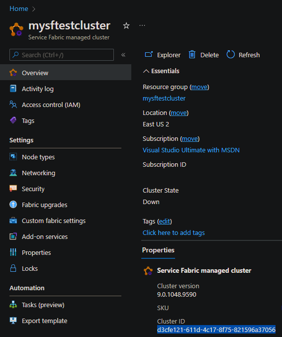
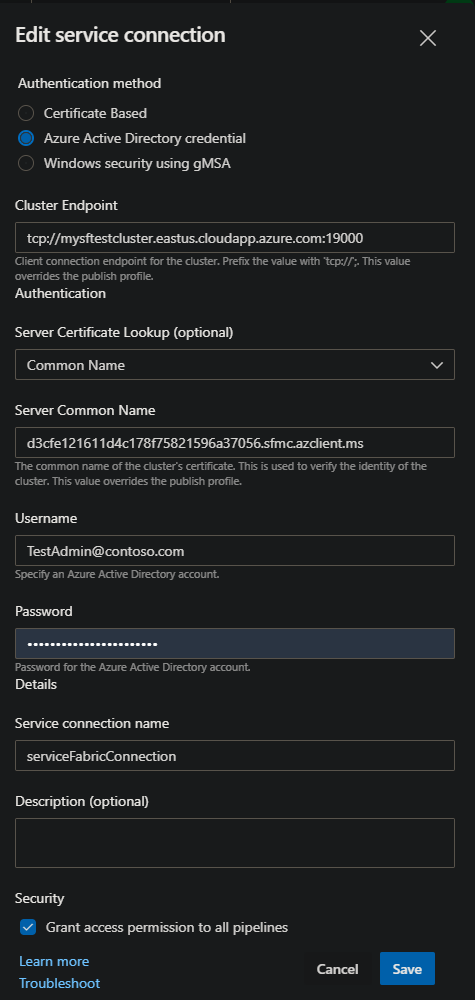

# How to configure Azure Devops for a Service Fabric Cluster

The steps below describe how to configure and Azure Devops (ADO) for Service Fabric clusters. For Service Fabric Managed clusters, refer to this article [How to configure Azure Devops Service Fabric Managed Cluster connection](./How%20to%20configure%20Azure%20Devops%20for%20Service%20Fabric%20Managed%20Cluster.md).  

There are multiple ways to configure Azure Devops for connectivity to Service Fabric clusters. This article will cover the recommended approach when using a Service Fabric service connection. For ARM template deployments in ADO, see [How to configure Azure Devops for Service Fabric ARM deployments](./How%20to%20configure%20Azure%20Devops%20for%20Service%20Fabric%20ARM%20deployments.md).

For Service Fabric service connection configurations, the recommended approach is to use Azure Active Directory (AAD) for authentication and certificate common name for server certificate lookup. This approach is maintenance free and provides the best security. This is the only configuration that supports parallel deployments per agent host. See [Agent limitations](#agent-limitations).

## Azure Devops Service Connection with Azure Active Directory (AAD / Entra)

Using AAD for the Service Fabric service connection is considered a best practice for security and maintenance. This is the recommended approach for Service Fabric clusters or applications that are not deployed and maintained via ARM templates.

## Azure Devops Service Connection with Certificate Common Name

If AAD is not an option, the next best approach is to use the certificate common name for server certificate lookup. This approach is maintenance free, but does not provide the same level of security as AAD. This configuration is not supported for parallel deployments per agent host.

## Azure Devops Service Connection with Certificate Thumbprint

This configuration should only be used if above configuration is not possible. This configuration requires the certificate to be in base64 encoded format. This configuration is not supported for parallel deployments per agent host. When certificate expires, it must be updated in ADO.

## Agent Configuration

Ensure agent is configured with the latest version of the [Service Fabric SDK](https://learn.microsoft.com/azure/service-fabric/service-fabric-get-started#install-the-sdk-and-tools). This is required for the Service Fabric tasks to work correctly.

## Agent limitations

Any Service Fabric service connection configuration that requires the certificate in base64 encoded format is not supported for parallel deployments per agent host. For security reasons, at start of deployment, the certificate is installed onto the agent host. At end of deployment, the certificate is removed. Any other deployments that are running on the same agent host using this certificate may fail.

Mitigation options:

- Use a Service Fabric service connection with AAD as described [above](#azure-devops-service-connection-with-azure-active-directory-aad--entra).

- Use one agent host per parallel deployment.

- Use ARM templates for cluster or application deployments.

<!-- todo insert base64 pic -->

## Requirements

- Service Fabric Cluster with Azure Active Directory enabled. See [Service Fabric cluster security scenarios](https://docs.microsoft.com/azure/service-fabric/service-fabric-cluster-security#client-to-node-azure-active-directory-security-on-azure) and [Service Fabric Azure Active Directory configuration in Azure portal](https://learn.microsoft.com/azure/service-fabric/service-fabric-cluster-creation-setup-azure-ad-via-portal) for additional information.

  

- Azure Devops user configured to use the 'Cluster' App Registration that is configured for the cluster.

## Process

- Verify [Requirements](#requirements).
- In Azure Devops, create / modify the 'Service Fabric' service connection to be used with the build / release pipelines for the managed cluster.
- [Test](#test) connection.

### Service Fabric Service Connection

Create / Modify the Service Fabric Service Connection to provide connectivity to Service Fabric managed cluster from ADO pipelines.
For maintenance free configuration, only 'Azure Active Directory credential' authentication  and 'Common Name' server certificate lookup is supported.

#### Service Fabric Service Connection Properties

- **Authentication method:** Select 'Azure Active Directory credential'.
- **Cluster Endpoint:** Enter connection endpoint for cluster. This is in the format of tcp://{{cluster name}}.{{azure region}}.cloudapp.azure.com:{{cluster endpoint port}}.
  - Example: tcp://mysftestcluster.eastus.cloudapp.azure.com:19000
- **Server Certificate Lookup (optional):** Select 'Common Name'.
- **Server Common Name** Enter the managed cluster server certificate common name. The common name format is {{cluster guid id with no dashes}}.sfmc.azclient.ms. This name can also be found in the cluster manifest in Service Fabric Explorer (SFX).
  - Example: d3cfe121611d4c178f75821596a37056.sfmc.azclient.ms

    

- **Username:** Enter an Azure AD user that has been added to the managed clusters 'Cluster' App Registration in UPN format. This can be tested by connecting to SFX as the Azure AD user.
- **Password:** Enter Azure AD users password. If this is a new user, ensure account is not prompting for a password change. This can be tested by connecting to SFX as the Azure AD user.
- **Service connection name:** Enter a descriptive name of connection.

  

## Test

Use builtin task 'Service Fabric PowerShell' in pipeline to test connection.

```yaml
trigger:
  - main

pool:
  vmImage: "windows-latest"

variables:
  System.Debug: true
  sfmcServiceConnectionName: serviceFabricConnection

steps:
  - task: ServiceFabricPowerShell@1
    inputs:
      clusterConnection: $(sfmcServiceConnectionName)
      ScriptType: "InlineScript"
      Inline: |
        $psversiontable
        $env:connection
        [environment]::getenvironmentvariables().getenumerator()|sort Name
```

## Troubleshooting

- Error: ##[debug]System.AggregateException: One or more errors occurred. ---> System.Fabric.FabricTransientException: Could not ping any of the provided Service Fabric gateway endpoints. ---> System.Runtime.InteropServices.COMException: Exception from HRESULT: 0x80071C49
- Test network connectivity. Add a powershell task to pipeline to run 'test-netconnection' command to cluster endpoint, providing tcp port. Default port is 19000.
  - Example:
  
  ```yaml
  - powershell: |
      $psversiontable
      [environment]::getenvironmentvariables().getenumerator()|sort Name
      $publicIp = (Invoke-RestMethod https://ipinfo.io/json).ip
      write-host "---`r`ncurrent public ip:$publicIp" -ForegroundColor Green
      write-host "test-netconnection $env:clusterEndpoint -p $env:clusterPort"
      $result = test-netconnection $env:clusterEndpoint -p $env:clusterPort
      write-host "test net connection result: $($result | fl * | out-string)"
      if(!($result.TcpTestSucceeded)) { throw }
    errorActionPreference: stop
    displayName: "PowerShell Troubleshooting Script"
    failOnStderr: true
    ignoreLASTEXITCODE: false
    env:  
      clusterPort: 19000
      clusterEndpoint: xxxxxx.xxxxx.cloudapp.azure.com
  ```

- Verify configured Azure AD user is able to logon successfully to cluster using SFX or powershell. The 'servicefabric' module is installed as part of Service Fabric SDK.

  ```powershell
  import-module servicefabric
  import-module az.resources

  $clusterEndpoint = 'mysftestcluster.eastus.cloudapp.azure.com:19000'
  $clusterName = 'mysftestcluster'

  $clusterResource = Get-AzResource -Name $clusterName -ResourceType 'Microsoft.ServiceFabric/managedclusters'
  $serverCertThumbprint = $clusterResource.Properties.clusterCertificateThumbprints

  Connect-ServiceFabricCluster -ConnectionEndpoint $clusterEndpoint `
    -AzureActiveDirectory `
    -ServerCertThumbprint $serverCertThumbprint `
    -Verbose
  ```
- Use logging from task to assist with issues.
- Enabling System.Debug in build yaml or in release variables will provide additional output.

