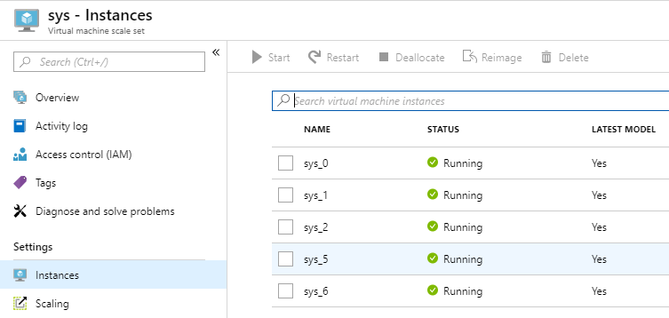
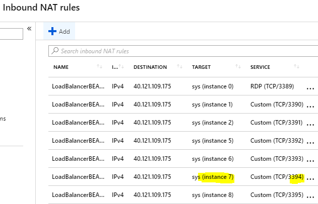
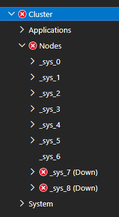
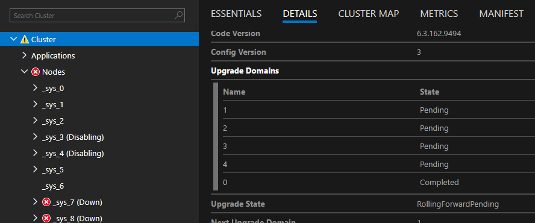
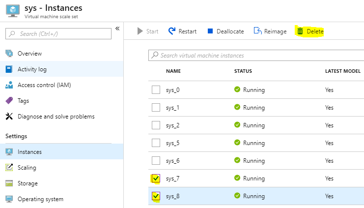
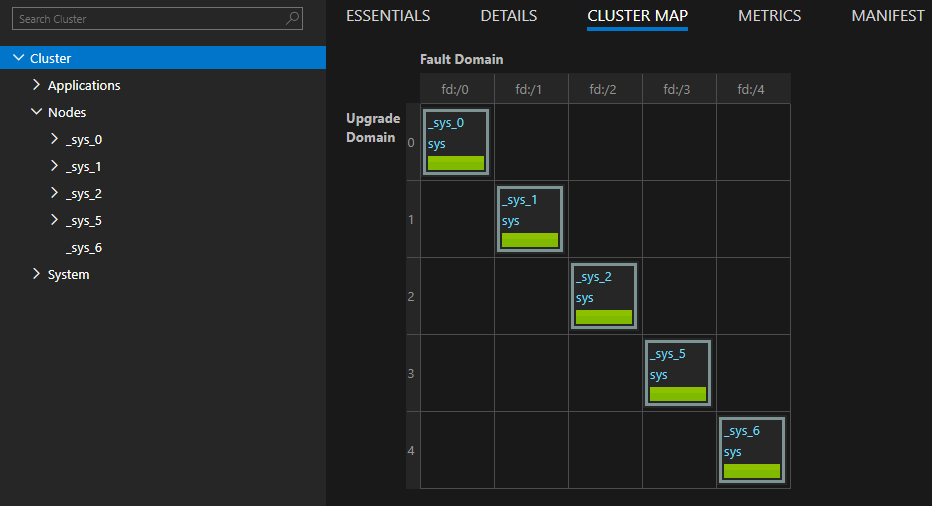

# NOTE: This article is depreciated for clusters running 6.4 CU3 or later.  Recent changes to the Service Fabric Resource Provider will now automatically detect and repair missing seed nodes.  Simply make sure there are an adequate number of nodes in your primary nodetype to meet the Reliability requirements, and after 15 minutes the seed node configuration should repair itself.


##  How to recover missing seed nodes from a cluster using the Automated script FixMissingSeednode.ps1

**Minimum requirement**: We need to have at a [quorum of seed nodes](https://docs.microsoft.com/en-us/azure/service-fabric/service-fabric-common-questions#what-is-the-minimum-size-of-a-service-fabric-cluster-why-cant-it-be-smaller) in a healthy state.
- If you are missing **more** than one seednode you must repair/fake all the seed nodes using this procedure (steps 2-3) before kicking off the configuration upgrade (steps 6+). This is because if there are any seed nodes missing in a cluster, the upgrade will fail with PreSafetyCheck on EnsureSeedNodeQuorum.

## **Symptoms** 

- Cluster runtime upgrades fail
- Cluster configuration upgrades will still with a presafety check on EnsureSeedNodeQuorum.
- Application upgrades fail and give "seed quorum lost" error.
- The VM in the virtual machine scale set (Instances list) with the matching Node name listed in <Infrastructure><Votes> section was deleted and the Node is no longer showing in Service Fabric Explorer 

## **Which nodes are seed nodes?**

- run **Get-ServiceFabricClusterManifest** from PowerShell and review the <Infrastructure><Votes> configuration

```PowerShell
    PS D:\Temp> Get-ServiceFabricClusterManifest
    ...
    <Infrastructure>
        <PaaS>
        <Roles>
            <Role RoleName="sys" NodeTypeRef="sys" RoleNodeCount="5" />
        </Roles>
        <Votes>
            <Vote NodeName="_sys_0" IPAddressOrFQDN="10.0.0.4" Port="1025" />
            <Vote NodeName="_sys_1" IPAddressOrFQDN="10.0.0.5" Port="1025" />
            <Vote NodeName="_sys_2" IPAddressOrFQDN="10.0.0.6" Port="1025" />
            <Vote NodeName="_sys_3" IPAddressOrFQDN="10.0.0.7" Port="1025" />
            <Vote NodeName="_sys_4" IPAddressOrFQDN="10.0.0.8" Port="1025" />
        </Votes>
        </PaaS>
    </Infrastructure>
```

As you can see in this example, there are 5 nodes configured as seed nodes, with these specific names and ip addresses. 


## **Determine which seed nodes were removed**

- Review nodes in the underlying Virtual machine scale set for the primary nodetype (sys in this example)

    - View from the Azure Portal

        

    - or via PowerShell

```PowerShell
        PS C:\temp> Get-AzureRmVmssVM -ResourceGroupName "samplegroup" -VMScaleSetName "sys"

        ResourceGroupName  Name Location            Sku Capacity InstanceID ProvisioningState
        -----------------  ---- --------            --- -------- ---------- -----------------
        SAMPLEGROUP      _sys_0   westus Standard_D1_v2                   0         Succeeded
        SAMPLEGROUP      _sys_1   westus Standard_D1_v2                   1         Succeeded
        SAMPLEGROUP      _sys_2   westus Standard_D1_v2                   2         Succeeded
        SAMPLEGROUP      _sys_5   westus Standard_D1_v2                   3         Succeeded
        SAMPLEGROUP      _sys_6   westus Standard_D1_v2                   4         Succeeded
```

- Comparing this list from the list of seed nodes you can see **two nodes** are missing, **_sys_3_** and **_sys_4**.  The nodes may have been removed intentionally or by accident through a mis-configured auto-scale configuration.

## **Steps to Repair**

1. Since we are missing two nodes, increase the VMSS instance count by +2, for this example from 5 to 7.  If there were only 3 nodes in the VMMS and this is a Silver Reliability cluster, you would need to add +4 nodes (scale up from 3 to 7), two nodes to act as replacements and two nodes to be used by the script to fake the missing seed nodes.

    - This can be done 
        - Using Azure Portal - Resource Group -> Scaling
        - Using PowerShell - https://docs.microsoft.com/en-us/azure/virtual-machine-scale-sets/virtual-machine-scale-sets-manage-powershell#change-the-capacity-of-a-scale-set
        - For detailed instructions on modifying VMSS resources, see [Managing Azure Resources](../Deployment/managing-azure-resources.md)

    - In our example we will assume these new nodes are called _sys_7 and _sys_8 

2. RDP into the first new node instance(**_sys_7**), we will refer to this as the **Fake seed node**. 

    - You can find the IP and Port to connect to from the Load Balancer -> Inbound NAT rules

    

    - Open a PowerShell prompt and capture the IP address assigned in the vnet, for this example we will assume the Fake seed nodes IP address is 10.0.0.9

3. Open PowerShell prompt and excecute the PowerShell command similar to this, substituting **_sys_3** with the name of your missing seed node, and **10.0.0.9** with the IP address of the current **Fake seed node** which you are running this command on.

```PowerShell
    (new-object net.webclient).downloadfile("https://raw.githubusercontent.com/Azure/Service-Fabric-Troubleshooting-Guides/master/Scripts/FixMissingSeednode.ps1","d:\FixMissingSeednode.ps1");
    d:\FixMissingSeednode.ps1 -NodeToFake '_sys_3' -TemporaryNodeIpAddress '10.0.0.9'
```


4. Open task manager, and switch to the details tab.  Within a few minutes you should see **FabricGateway.exe** started up

    - Once this step is done, you will should see **_sys_3** has returned in SFX and is identified as a **seed node = true** on the Node -> Essential view. 

        **Note:** if node _sys_3 is showing Disabled you should be able to Activate from SFX


5. Now **repeat steps 3 and 4** to reconfigure _sys_8 to a Fake seed node for _sys_4.

```PowerShell
    (new-object net.webclient).downloadfile("https://raw.githubusercontent.com/Azure/Service-Fabric-Troubleshooting-Guides/master/Scripts/FixMissingSeednode.ps1","d:\FixMissingSeednode.ps1");
    d:\FixMissingSeednode.ps1 -NodeToFake '_sys_4' -TemporaryNodeIpAddress '10.0.0.10'
```

- When complete the cluster should look like this

    


6. _sys_7 and _sys_8 will now be shown in a down state(Error) - this is expected

    - By changing the _sys_7 VMMS instance into being recognized in SF as _sys_3, we have created an inconsistency we now need to cleanup by removing the **Fake seed node** _sys_3.  The Virtual machine scale set still identifies this node as _sys_7 and the Service Fabric Resource Provider thinks it is _sys_3).
    - By changing the _sys_8 VMMS instance into being recognized in SF as _sys_4, we have created an inconsistency we now need to cleanup by removing the **Fake seed node** _sys_4.  The Virtual machine scale set still identifies this node as _sys_8 and the Service Fabric Resource Provider thinks it is _sys_4).

        - If these cleanup steps are not done then any future VMSS reimage operations to either _sys_7 or _sys_8 VMSS instances, they will be reset back to their original state in the Service Fabric cluster, again causing the cluster to have missing seed node(s).


7. From a different machine (such as your Dev Machine) disable the two **extra nodes** and the two **Fake seed node(s)** with -Intent **RemoveNode**

```PowerShell
    Connect-ServiceFabricCluster -ConnectionEndpoint ...
    Disable-ServiceFabricNode -NodeName _sys_7 -Intent RemoveNode -Force
    Disable-ServiceFabricNode -NodeName _sys_8 -Intent RemoveNode -Force
    Disable-ServiceFabricNode -NodeName _sys_3 -Intent RemoveNode -Force
    Disable-ServiceFabricNode -NodeName _sys_4 -Intent RemoveNode -Force
```
- Disabling _sys_3 and _sys_4 with the RemoveNode intent will cause a series of cluster configuration upgrades to start, which will attempt to move the **seed node** status from _sys_3 and _sys_4 and apply this status to other existing nodes.  In our example the best candidates (nodes not already seed nodes) will be the only possible nodes left which are _sys_5 and _sys_6.

    NOTE: **VERY IMPORTANT** 
    - You will see the _sys_3 and _sys_4 node status in Disab[**ling**] state for some time while the upgrades go through, you **must wait** patiently until the Status is "**Disabled**", failure to wait at this step can cause the configuration upgrade to fail which may leave the cluster in an unrecovereable state.
    
    - Call **Get-ServiceFabricClusterUpgrade** to check the progress and wait until all nodes are **Disabled** or Down.

    


8. Once _sys_3 and _sys_4 are disabled, you can reduce the VMSS instance count by 2 from the Azure Portal to remove the two VM's we temporarily added (_sys_7 & _sys_8)

    - This can be done 
        - Using Azure Portal - Resource Group -> Scaling
        - Using PowerShell - https://docs.microsoft.com/en-us/azure/virtual-machine-scale-sets/virtual-machine-scale-sets-manage-powershell#change-the-capacity-of-a-scale-set
        - Using Azure Portal - vmss -> instances (manually delete the nodes _sys_7 and _sys_8)
        - For detailed instructions on modifying VMSS resources, see [Managing Azure Resources](../Deployment/managing-azure-resources.md)

        


9. From the PowerShell window you can now remove the nodestate for all the nodes marked as (Down)

```PowerShell
    Connect-ServiceFabricCluster -ConnectionEndpoint ...
    Remove-ServiceFabricNodeState -NodeName _sys_7 -Force
    Remove-ServiceFabricNodeState -NodeName _sys_8 -Force
    Remove-ServiceFabricNodeState -NodeName _sys_3 -Force
    Remove-ServiceFabricNodeState -NodeName _sys_4 -Force
```


10. The cluster should now be healthy for _sys_0,1,2,5,6 and all should be marked as 'Is Seed Node = true'

    


## **Notes**

**Note 1** : In some cases a seed node (say _sys_1) was removed from SFX but the underlying VM Instance from the Virtual machine scale set (VMMS) was not actually deleted.  Simply rebooting this VM instance will cause  the node to reconfigure and try to rejoin the cluster automatically.

**Note 2**: In some cases a seed node (say _sys_1) was removed from the VMMS but is still showing as in SFX in a **Down** state, you can follow these step.

1.  Increase the VM instance count by 1 using [Resource Explorer](https://portal.azure.com/#view/Microsoft_Azure_Resources/ResourceManagerBlade/~/resourceexplorer) or [API Playground](https://portal.azure.com/#view/Microsoft_Azure_Resources/ResourceManagerBlade/~/armapiplayground) in the Azure Portal

2.  Disable the node - **Disable-ServiceFabricNode -NodeName _sys_1 -Intent RemoveNode**  (This will trigger a complete UD walk)

3. Wait for the Cluster Upgrade to complete
    - you can verify the cluster status by calling **Get-ServiceFabricClusterUpgrade**

4.  Remove the down node by calling 'Remove-ServiceFabricNodeState -NodeName _sys_1'

