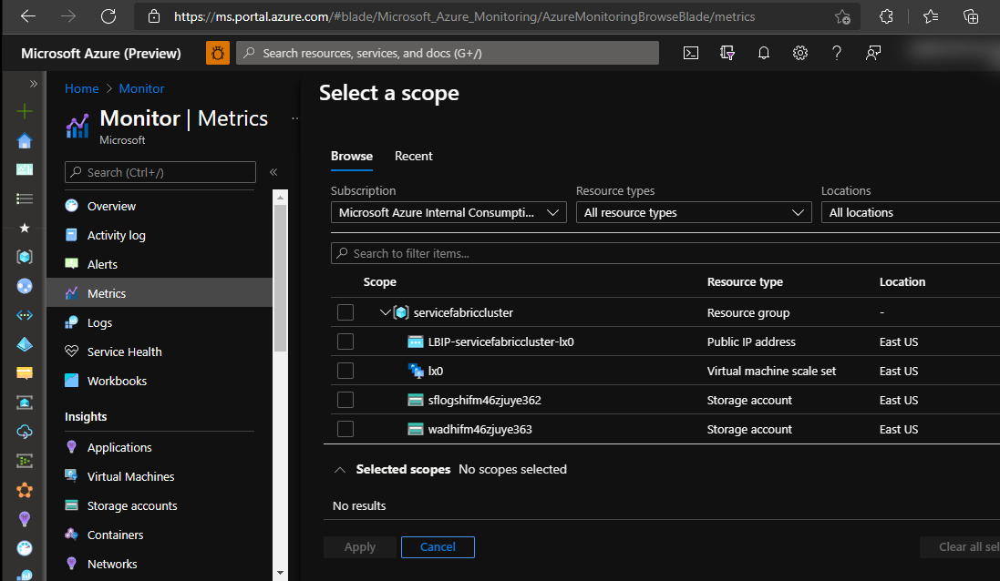
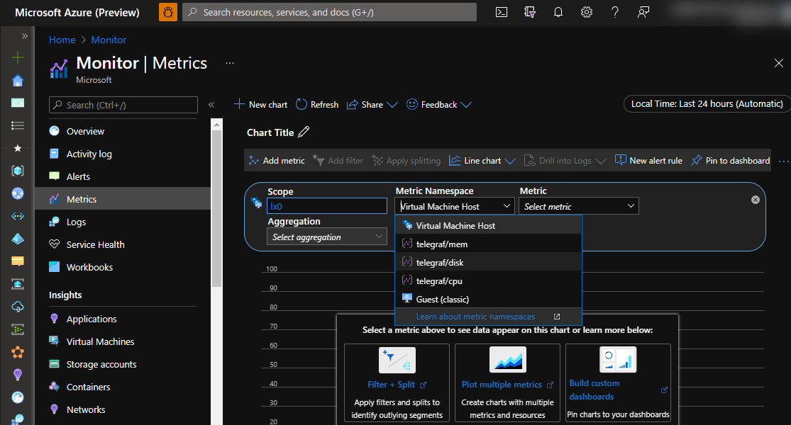
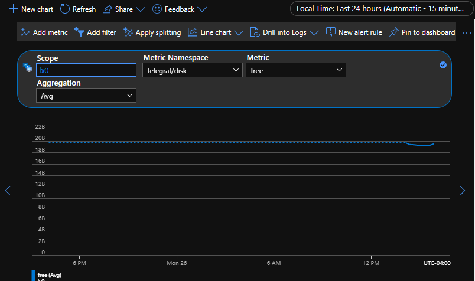
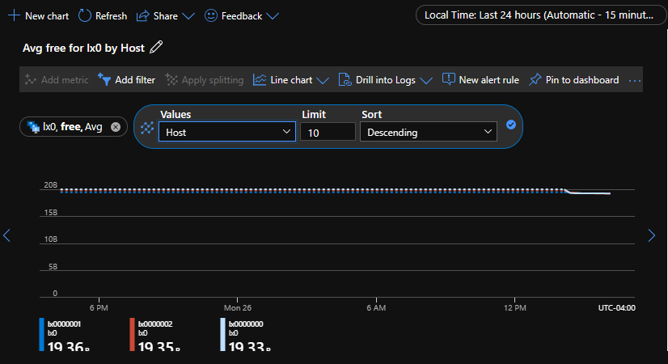
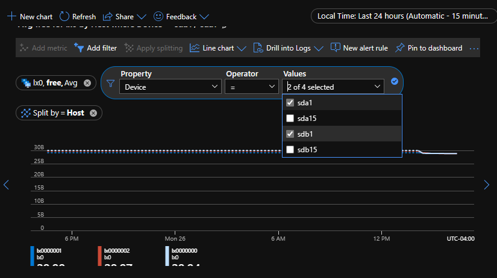
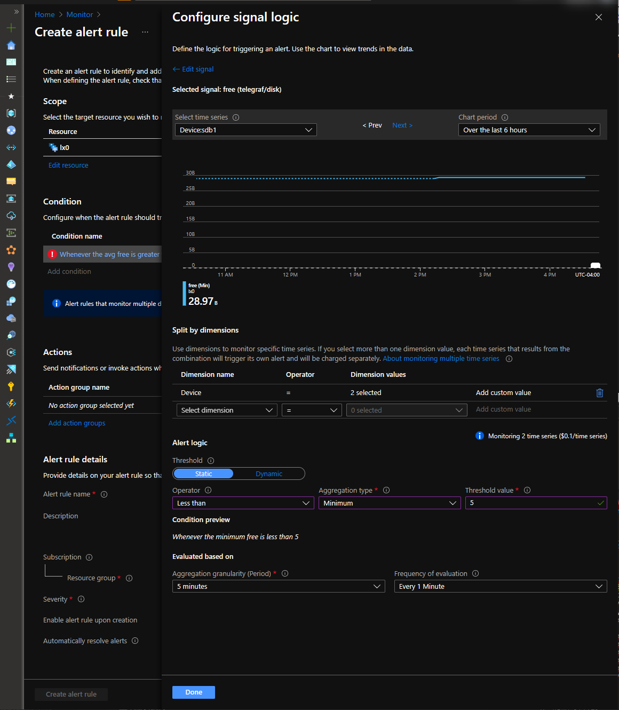

# How to setup Azure Alerts for Service Fabric Linux node performance counters

## Overview

This troubleshooting guide describes setting up Azure Alerts based on Service Fabric Linux node performance counters using [telegraf agent](https://docs.microsoft.com/en-us/azure/azure-monitor/essentials/collect-custom-metrics-linux-telegraf) and [Custom Script Extensions (CSE)](https://docs.microsoft.com/en-us/azure/virtual-machines/extensions/custom-script-linux).  

Custom Metrics with telegraf require the use of System Managed Identity to circumvent the need for local telegraf.conf configuration. See [azure_monitor](https://github.com/influxdata/telegraf/tree/master/plugins/outputs/azure_monitor) plugin readme. There may be costs associated with setting up custom metrics. See 'Custom Metrics' in [Azure Monitor Pricing](https://azure.microsoft.com//pricing/details/monitor/).

'Classic' and 'Custom' metrics without telegraf are other options for performance counter upload which is configured by adding 'metrics' section to LadCfg. Neither Custom or Classic metrics require system managed identity, but do require resourceId and are not usable for Azure Alerts.  

## Installing telegraf with Custom Script Extension

There are multiple ways to install telegraf on the virtual machine scale sets. For linux, one option is CSE. To use CSE, the extension resource needs to be added to ARM template. ProtectedSetting 'script' needs to be populated with a script converted to base64 string. Other installation methodology examples not in this document are cloud-init, which is more useful but only processed on initial deployments, and Desired State Configuration (DSC) which is full featured but requires additional setup.

In this script, 'cpu', 'memory', and 'disk' (cpu:mem:disk) telegraf plugins are configured. For complete list of telegraf plugin information, see [Telegraf plugins](https://docs.influxdata.com/telegraf/v1.19/plugins/).

Below is an example bash script that can be run either manually on a node through ssh or from one of the methods above.  

```bash
#!/bin/bash
# https://docs.microsoft.com/en-us/azure/azure-monitor/essentials/collect-custom-metrics-linux-telegraf
# https://docs.influxdata.com/telegraf/v1.19/introduction/installation/
#
log_file="/tmp/cse.log"
echo "start $(date)" >> $log_file
whoami >> $log_file
pwd >> $log_file
# download the package to the VM 
curl -s https://repos.influxdata.com/influxdb.key | sudo apt-key add -
source /etc/lsb-release >> $log_file
echo "deb https://repos.influxdata.com/${DISTRIB_ID,,} ${DISTRIB_CODENAME} stable" | sudo tee /etc/apt/sources.list.d/influxdb.list
# install the package
sudo apt-get update && sudo apt-get install telegraf >> $log_file
sudo service telegraf start >> $log_file
# generate the new Telegraf config file in the current directory
telegraf --input-filter cpu:mem:disk --output-filter azure_monitor config > azm-telegraf.conf
# replace the example config with the new generated config
sudo cp azm-telegraf.conf /etc/telegraf/telegraf.conf >> $log_file
# stop the telegraf agent on the VM
sudo systemctl stop telegraf >> $log_file
# start the telegraf agent on the VM to ensure it picks up the latest configuration
sudo systemctl start telegraf >> $log_file
echo "this has been written via cse $(date)" >> $log_file
```

For use with CSE protectedSetting or setting 'script', the script above will need to be converted to base64 string as shown below.

```powershell
  $inputString = @'
  #!/bin/bash
  # https://docs.microsoft.com/en-us/azure/azure-monitor/essentials/collect-custom-metrics-linux-telegraf
  # https://docs.influxdata.com/telegraf/v1.19/introduction/installation/
  #
  log_file="/tmp/cse.log"
  echo "start $(date)" >> $log_file
  whoami >> $log_file
  pwd >> $log_file
  # download the package to the VM 
  curl -s https://repos.influxdata.com/influxdb.key | sudo apt-key add -
  source /etc/lsb-release >> $log_file
  echo "deb https://repos.influxdata.com/${DISTRIB_ID,,} ${DISTRIB_CODENAME} stable" | sudo tee /etc/apt/sources.list.d/influxdb.list
  # install the package
  sudo apt-get update && sudo apt-get install telegraf >> $log_file
  sudo service telegraf start >> $log_file
  # generate the new Telegraf config file in the current directory
  telegraf --input-filter cpu:mem:disk --output-filter azure_monitor config > azm-telegraf.conf
  # replace the example config with the new generated config
  sudo cp azm-telegraf.conf /etc/telegraf/telegraf.conf >> $log_file
  # stop the telegraf agent on the VM
  sudo systemctl stop telegraf >> $log_file
  # start the telegraf agent on the VM to ensure it picks up the latest configuration
  sudo systemctl start telegraf >> $log_file
  echo "this has been written via cse $(date)" >> $log_file
  '@
  [convert]::ToBase64String([text.encoding]::UTF8.GetBytes($inputString))

IyEvYmluL3NoCiMgZG93bmx...dWx0cy50eHQ=
```

Or, if in a linux session, use the following command to generate base64 string from existing script file.

```bsh
vadmin@lx0000000:/tmp$ cat cse.sh | base64 -w0
IyEvYmluL3NoCiMgaHR0cHM6Ly9kb2NzLm1pY3J...RtcC9jbG91ZC1pbml0LXJlc3VsdHMudHh0Cg==
vadmin@lx0000000:/tmp$ 
```

If cluster is deployed and maintained by using ARM template, edit template.json and navigate to 'extensions' section in 'virtualMachineProfile' in 'Microsoft.Compute/virtualMachineScaleSets' resource.
Take entire base64 string output from powershell above for the value of 'script' in ARM template.

```json
,
{
  "name": "config-app",
  "type": "Extensions",
  "properties": {
    "publisher": "Microsoft.Azure.Extensions",
    "type": "CustomScript",
    "typeHandlerVersion": "2.1",
    "autoUpgradeMinorVersion": true,
    "settings": {
      "skipDos2Unix":false,
      "timestamp":123456789,
      "script": "<base64-script-to-execute>"
    }
  }
}
```

Below is the base CSE extension schema, with unneeded properties removed, base64 string from powershell output above added to 'script'.  
NOTE: 'timestamp' is an integer property that is used to trigger reprocessing of script by modifying to new integer value.

```diff
@@ -470,6 +473,21 @@
                                     "typeHandlerVersion": "1.1"
                                 }
                             },
+                            {
+                                "name": "config-app",
+                                "type": "Extensions",
+                                "properties": {
+                                    "publisher": "Microsoft.Azure.Extensions",
+                                    "type": "CustomScript",
+                                    "typeHandlerVersion": "2.1",
+                                    "autoUpgradeMinorVersion": true,
+                                    "settings": {
+                                        "skipDos2Unix": false,
+                                        "timestamp": 123456789,
+                                        "script": "IyEvYml...G9nX2ZpbGUK"
+                                    }
+                                }
+                            },
                             {
                                 "name": "[concat('VMDiagnosticsVmExt','_vmNodeType0Name')]",
                                 "properties": {
```


If cluster was deployed from Azure portal and template was not saved, use https://resources.azure.com. Navigate to 'subscription', 'resourceGroups', {{ resource group }}, 'providers', 'Microsoft.Compute', 'virtualMachineScaleSets', {{ nodetype }}.  

```text
    subscriptions
    └───%subscription name%
        └───resourceGroups
            └───%resource group name%
                └───providers
                    └───Microsoft.Compute
                        └───virtualMachineScaleSets
                            └───%virtual machine scale set name%
```

Click "Read/Write" permission and "Edit" to edit configuration.

  


## Adding System Managed Identity

As described in [Sending guest OS metrics using Azure Resource Manager](https://docs.microsoft.com/azure/azure-monitor/essentials/collect-custom-metrics-guestos-resource-manager-vmss), add 'systemAssigned' for the 'Microsoft.Compute/virtualMachineScaleSets' 'identity' type.

Setting up System Managed Identity provides the scaleset node configuration information to telegraf. The alternative is the 'telegraf.conf' would need to be configured with 'resource_id' and 'region' information. [Telegraf Azure Monitor Configuration](https://github.com/influxdata/telegraf/tree/master/plugins/outputs/azure_monitor) has additional information on manual configuration.

To enable System Managed Identity, navigate to the 'virtualMachineScaleSet' base resource:

```json
,
"identity": {
    "type": "systemAssigned"
},
```

Add 'identity' 'type' value "systemAssigned" as shown below.

```diff
diff --git a/template/template.json b/template/template.json
index 1d7e7be..5bede68 100644
--- a/template/template.json
+++ b/template/template.json
@@ -430,6 +430,9 @@
         {
             "apiVersion": "[variables('vmssApiVersion')]",
             "type": "Microsoft.Compute/virtualMachineScaleSets",
+                        "identity": {
+                "type": "systemAssigned"
+            },
             "name": "[parameters('vmNodeType0Name')]",
             "location": "[parameters('computeLocation')]",
             "dependsOn": [
```

## Updating deployment configuration

If using a template to modify configuration, after .\template.json has been modified, run 'Test-AzResourceGroupDeployment' and 'New-AzResourceGroupDeployment' to deploy new template.

```powershell
PS C:\>Test-AzResourceGroupDeployment -ResourceGroupName servicefabriccluster -TemplateFile .\template.json -Verbose
VERBOSE: 17:58:51 - Template is valid.
PS C:\>New-AzResourceGroupDeployment -ResourceGroupName servicefabriccluster -TemplateFile .\template.json -DeploymentDebugLogLevel All -Verbose
```

If using https://resources.azure.com, in 'Edit' configuration, after all changes have been made, select 'PATCH' to update the configuration. Status of update will be viewable in [Azure portal](https://portal.azure.com).


## Validating configuration

After successful deployment, within a few minutes, the new metrics should be available in [Metrics Explorer](https://ms.portal.azure.com/#blade/Microsoft_Azure_Monitoring/AzureMonitoringBrowseBlade/metrics) blade (part of Azure Monitor) in portal. Navigate to the resource group and 'Virtual machine scale set'. Same information is available under the resource and resource group.



In 'Metric Namespace' dropdown, multiple 'telegraf' options should now be available. see [Troubleshooting](#troubleshooting) section at end of this document if telegraf metrics are not available.





'Apply splitting' to view each node.



'Add filter' to filter on the counter instances for this example are drives 'C:' and 'D:'.



## Adding an Azure Alert

Like Metrics, Alerts can be created and viewed from Azure Monitor, resource, and from resource group. From [Validating configuration](#validating-configuration) section above, a new alert can be added by selecting 'New alert rule'. Or, a new alert can be created from 'Alerts' view. In the follow example, the 'Condition' trigger is configured to raise an error level event when disk space on drive D: is less than 5%.



Add one or more actions to take when alert is triggered such as a notification. A common action is to setup email / SMS notifications as shown below.


Set the appropriate 'Alert rule name', 'Severity', and 'Resource group'.
When complete, select 'Create alert rule'.


## Troubleshooting

### Telegraf metrics are not displayed in portal

This can have many causes. Ssh to a node and check the following:
- sudo systemctl status telegraf  
    If telegraf service is installed and started:  
    - check telegraf configuration and enable debug
      - sudo nano /etc/telegraf/telegraf.conf
      - set 'debug' = 'true'
      - sudo systemctl stop telegraf
      - sudo systemctl start telegraf
      - sudo systemctl status telegraf
    - check [System Managed Identity configuration](https://docs.microsoft.com/en-us/azure/virtual-machines/linux/instance-metadata-service?tabs=linux#tabpanel_1_linux)
      - curl -H Metadata:true --noproxy "*" "http://169.254.169.254/metadata/instance?api-version=2021-02-01"  

    If telegraf service is not installed:
    - check status of Custom Script Extension in portal
    - check log files on node
      - /var/log/waagent.log
    - save and run script manually on node

- look for errors in cse.log: cat /tmp/cse.log

### resources.azure.com

To troubleshoot errors while modifying a resource configuration, for example, an exclamation or warning icon is temporarily displayed, scroll to the bottom of the page and review the error:


