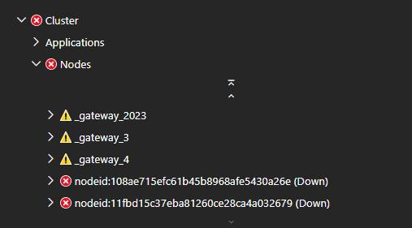

# Phantom nodes show in Service Fabric Explorer

## **Symptoms**

You may notice down nodes with name similar to "nodeid:<nodenum>", please refer below screen for more details :



## **Cause**

This was a known issue with the Federation layer which intermittently added back the previously removed nodes. This was fixed in 6.2

## **Mitigation**

```PowerShell
    Remove-ServiceFabricNodeState -NodeName nodeid:108ae715efc61b45..26e -Force
```
