# Service Fabric Managed Cluster monitoring with Azure Monitor

## Overview

Below describes the different monitoring agent configurations available as part of Azure Monitor. [Windows Azure Diagnostics (WAD)](#windows-azure-diagnostics-wad) is legacy but currently provides the most comprehensive level of monitoring. See [Azure Monitor Overview](https://docs.microsoft.com/azure/azure-monitor/overview) for detailed information about monitoring in Azure. Links to ARM templates for each configuration are provided under each agent configuration below.

## Azure Monitor Agent

[Standard SKU Service Fabric managed cluster, 1 node type with Azure Monitor enabled](https://github.com/Azure-Samples/service-fabric-cluster-templates/blob/master/SF-Managed-Standard-SKU-1-NT-AzureMonitor)

[Standard SKU Service Fabric managed cluster, 2 node types with Azure Monitor enabled](https://github.com/Azure-Samples/service-fabric-cluster-templates/tree/master/SF-Managed-Standard-SKU-2-NT-AzureMonitor)

### Standard SKU Service Fabric managed cluster with Azure Monitor agent enabled

The templates above deploy a Service Fabric managed cluster with Azure Monitor enabled. Azure Monitor Agent is the new / current logging extension meant to replace other existing extensions. However, Windows Azure Diagnostics (WAD) currently provides the most comprehensive level of monitoring. See [Windows Azure Diagnostics (WAD)](#windows-azure-diagnostics-wad) for additional information.

### Azure Monitor Data Collection Rules configuration

Configuration of Azure Monitor data collection is centralized and configurable via Azure Portal or PowerShell among other options. To configure using Azure Portal:

**NOTE: This configuration does require the use of System Managed Identity**

1. Navigate to 'Data Collection Rule' in 'Monitor' in Azure portal: https://ms.portal.azure.com/#blade/Microsoft_Azure_Monitoring/AzureMonitoringBrowseBlade/dataCollectionRules

2. Select 'Create' to create a new rule.

    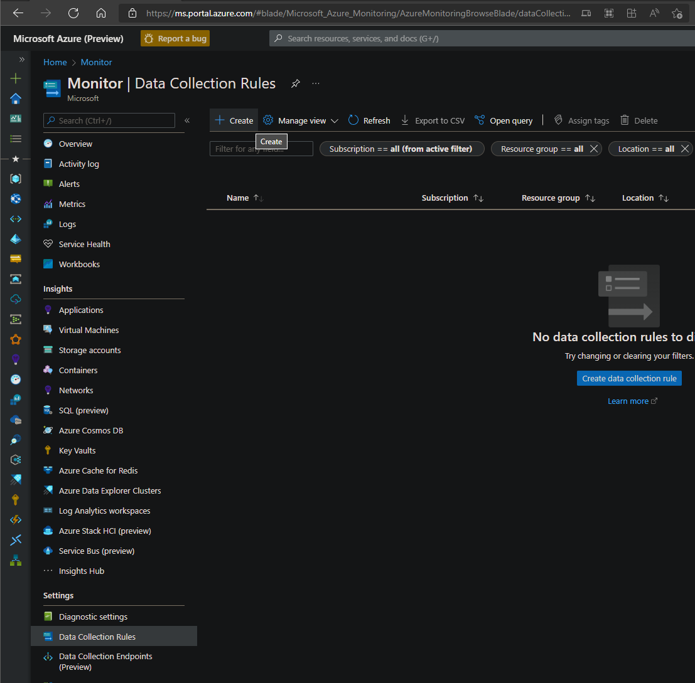

3. Set 'Rule Name' and 'Resource Group'

    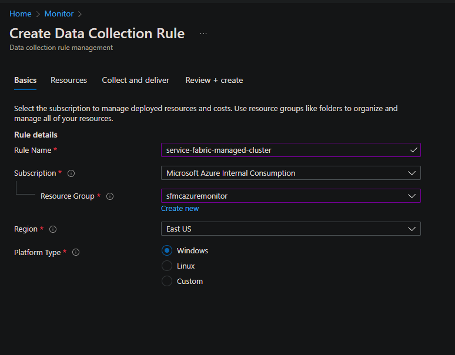

4. Select the corresponding 'SFC_{{cluster id}}' resource group and node type(s) to monitor

    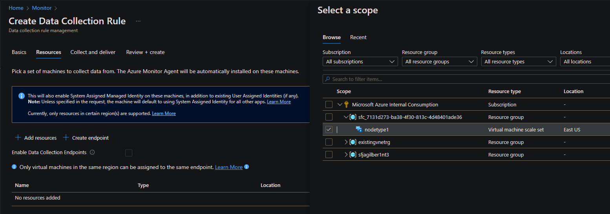

5. Select 'Add data source' to add 'Windows event logs' and 'Performance counters'.

    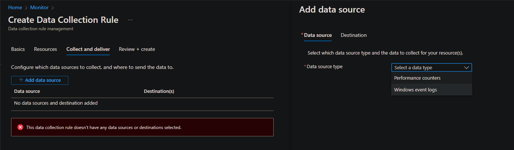

6. Storing data collected in Log Analytics is not free. To reduce the amount of data collected, use custom logs and XPath for filtering. See [Azure Monitor Pricing](https://azure.microsoft.com/en-us/pricing/details/monitor/). Default filters for Service Fabric clusters:

    ```text
    System!*[System[Provider[@Name='Microsoft Antimalware']]]
    System!*[System[Provider[@Name='NTFS'] and (EventID=55)]]
    System!*[System[Provider[@Name='disk'] and (EventID=7 or EventID=52 or EventID=55)]]
    Application!*[System[(Level=1 or Level=2 or Level=3)]]
    Microsoft-ServiceFabric/Admin!*[System[(Level=1 or Level=2 or Level=3)]]
    Microsoft-ServiceFabric/Audit!*[System[(Level=1 or Level=2 or Level=3)]]
    Microsoft-ServiceFabric/Operational!*[System[(Level=1 or Level=2 or Level=3)]]
    ```

    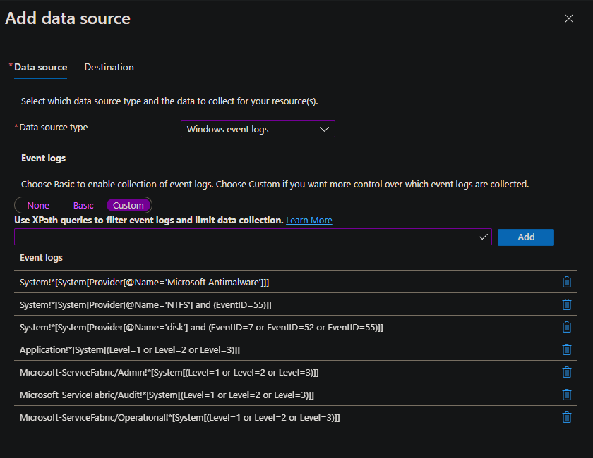

7. Select 'Add destination' to add Log Analytics workspace for data destination.

    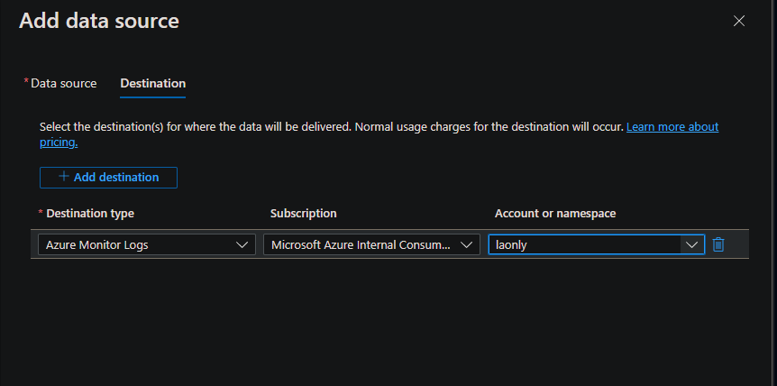


8. For Performance Counters, select 'Add data source' and select 'Performance Counters'. Monitoring Service Fabric nodes for performance issues is similar to general server performance troubleshooting. The counters that are autopopulated in the drop downs can be used. 'Basic' as the name suggests, contains minimum performance counter configuration. 'Custom' has more counters covering, cpu, memory, and disk.

    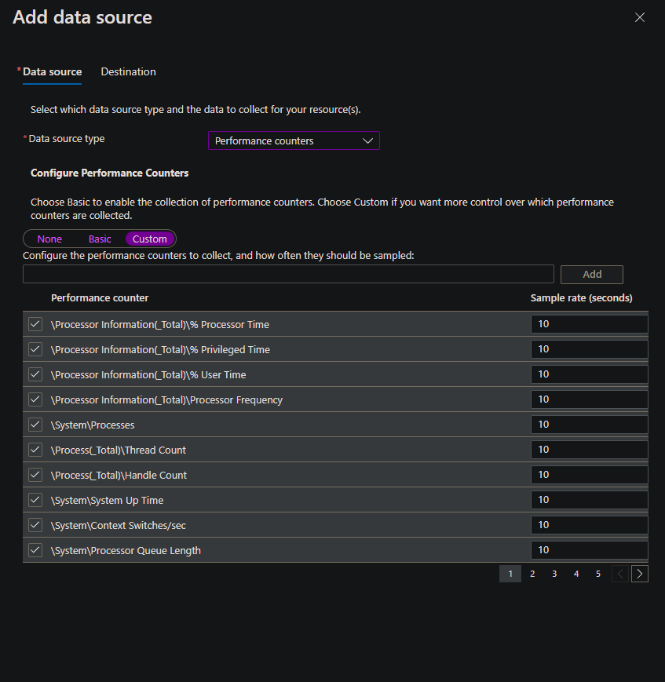

9. Select appropriate counters and destination for the performance counters and 'Add data source'.

10. With event and counter data sources configured, 'Review and create' the Data Collection Rule.

    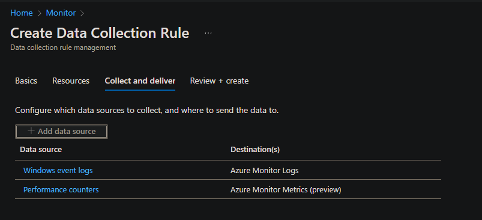

    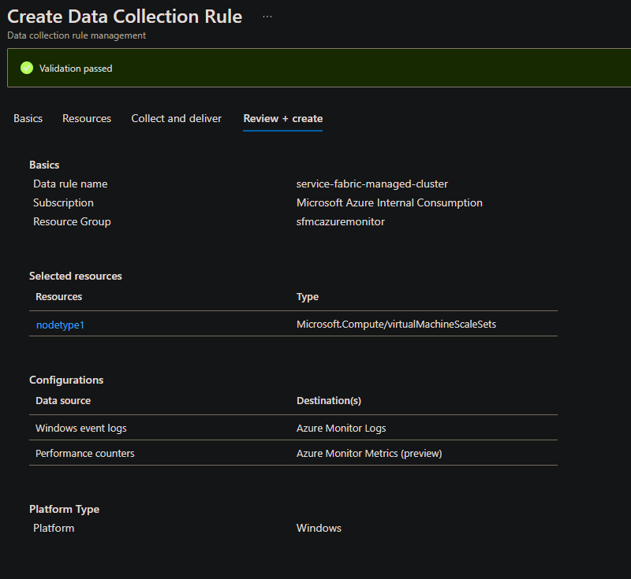

11. Once rule is created, data collection should be initiated.

    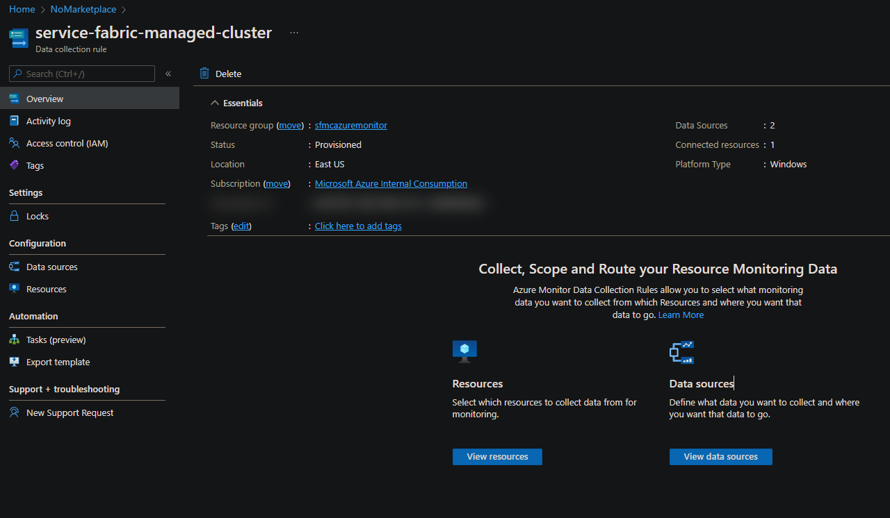

## Log Analytics

### Log Analytics Templates

[Standard SKU Service Fabric managed cluster, 1 node type with Log Analytics enabled](https://github.com/Azure-Samples/service-fabric-cluster-templates/tree/master/SF-Managed-Standard-SKU-2-NT-LogAnalytics)

[Standard SKU Service Fabric managed cluster, 2 node types with Log Analytics enabled](https://github.com/Azure-Samples/service-fabric-cluster-templates/tree/master/SF-Managed-Standard-SKU-2-NT-LogAnalytics)

### Standard SKU Service Fabric managed cluster with Log Analytics enabled

The templates above deploy a Service Fabric managed cluster with Log Analytics enabled. Windows Azure Diagnostics (WAD) currently provides the most comprehensive level of monitoring. See [Windows Azure Diagnostics (WAD)](#windows-azure-diagnostics-wad) for additional information.

### Log Analytics ETW Configuration flow

Log Analytics can query Windows Event Logs and Performance counters directly using a centralized configuration in Azure configured in Azure portal. ETW can be queried indirectly by using WAD to configure and upload ETW events to configured table storage account, Application Insights, or Event Hub as examples. See [Collecting Event Tracing for Windows (ETW) Events for analysis Azure Monitor Logs](https://docs.microsoft.com/azure/azure-monitor/agents/data-sources-event-tracing-windows).

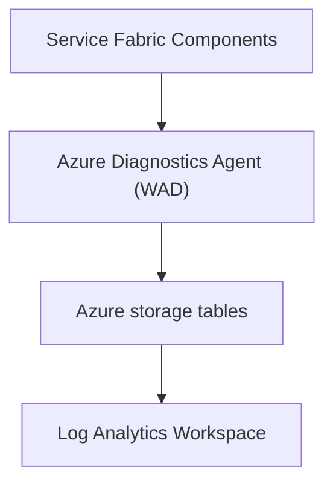

### Performance Counter configuration

See [Collect Windows and Linux performance data sources with Log Analytics agent](https://docs.microsoft.com/azure/azure-monitor/agents/data-sources-performance-counters) for detailed configuration information for windows event log configuration.

Add desired counter names in the Log Analytics workspace 'Agents Configuration' blade. Below is a list of common non Service Fabric specific counters:

```
LogicalDisk(*)\% Free Space
Memory(*)\Available MBytes
Memory(*)\Pages/sec
Paging File(*)\% Usage
PhysicalDisk(*)\Current Disk Queue Length
Process(*)\Handle Count
Process(*)\Private Bytes
Process(*)\Thread Count
Processor(*)\% Processor Time
TCPv4(*)\Connections Established
TCPv4(*)\Segments Received/sec
TCPv4(*)\Segments Retransmitted/sec
TCPv4(*)\Segments Sent/sec

```

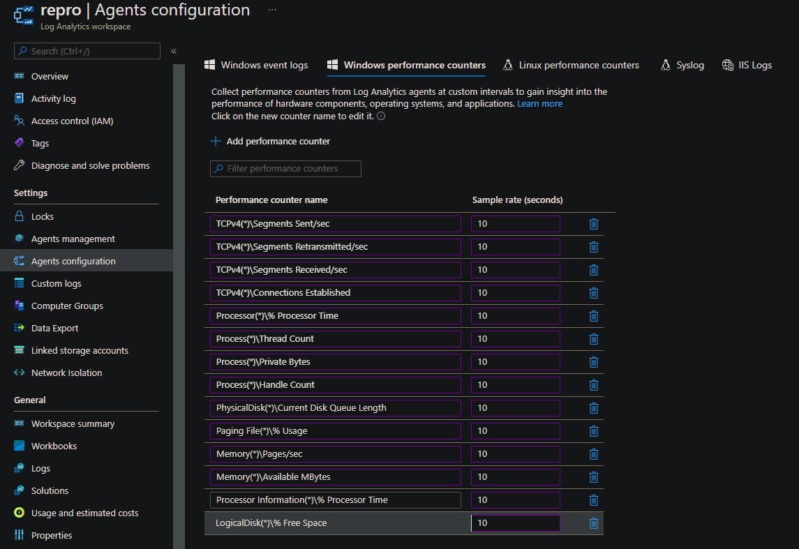

### Windows Event log configuration

See [Collect Windows event log data sources with Log Analytics agent](https://docs.microsoft.com/azure/azure-monitor/agents/data-sources-windows-events) for detailed configuration information for windows event log configuration.

#### Service Fabric Specific Event Logs

Service Fabric Event logs will not be pre-populated in the drop down list and need to be manually entered. Add desired event log names in the Log Analytics workspace 'Agents Configuration' blade. The following lists the available Service Fabric specific event logs:

```
Microsoft-ServiceFabric/Operational
Microsoft-ServiceFabric/Admin
Microsoft-ServiceFabric/Audit
```

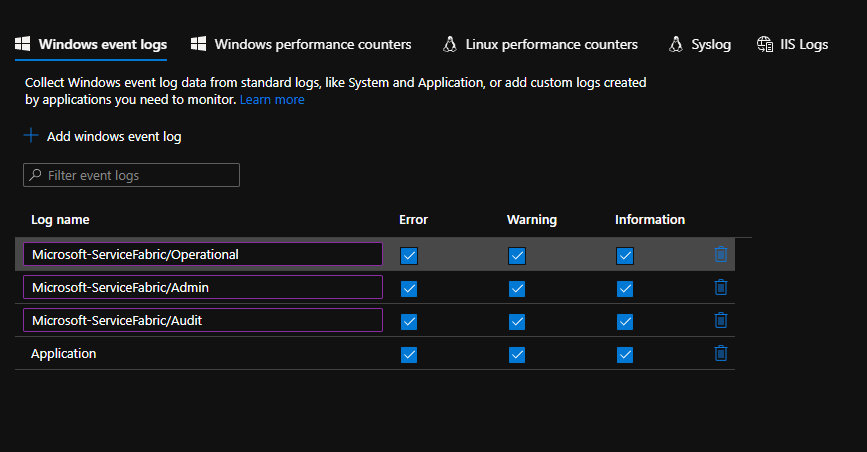

## Windows Azure Diagnostics (WAD)

### WAD Templates

[Standard SKU Service Fabric managed cluster, 1 node type with Windows Azure Diagnostics (WAD) enabled](https://github.com/Azure-Samples/service-fabric-cluster-templates/tree/master/SF-Managed-Standard-SKU-1-NT-WAD)

[Standard SKU Service Fabric managed cluster, 2 node types with Windows Azure Diagnostics (WAD) enabled](https://github.com/Azure-Samples/service-fabric-cluster-templates/tree/master/SF-Managed-Standard-SKU-2-NT-WAD)

### Standard SKU Service Fabric managed cluster with Windows Azure Diagnostics (WAD) enabled

The templates above deploy a Service Fabric managed cluster with Windows Azure Diagnostics (WAD) enabled. WAD currently provides the most comprehensive level of monitoring: events, counters, Event Tracing for Windows (ETW) as well as other information. Managed Identity read and assign Role Assignment is required for access from nodetype nodes to diagnostics storage account. 'f1a07417-d97a-45cb-824c-7a7467783830' is the Role Definition Id. See [Resources](#resources) for additional information.

To enumerate Service Fabric Resource Provider (SFRP) Id for subscription, execute the following powershell commands and select 'Id' value. This Id is used in template for parameter 'subscriptionSFRPId'.  

**NOTE: The 'Id' value is different for each Azure subscription:**

```powershell
Login-AzAccount
Select-AzSubscription -SubscriptionId {{subscription id}}
Get-AzADServicePrincipal -DisplayName "Azure Service Fabric Resource Provider"

DisplayName                              Id                                     AppId
-----------                              --                                     -----
'Azure Service Fabric Resource Provider' '39276235-4e4a-43f0-8523-ff0de6cbe12a' 'ac0b81e8-b54c-46e1-8b00-ce4aed8ba469'
```

For reference, to enumerate role definition, use the following. 'f1a07417-d97a-45cb-824c-7a7467783830' is the value to be used in template for parameter 'roleDefinitionId'.  

```powershell
PS C:\> get-azroledefinition | where id -ieq 'f1a07417-d97a-45cb-824c-7a7467783830'

Name             : Managed Identity Operator
Id               : 'f1a07417-d97a-45cb-824c-7a7467783830'
IsCustom         : False
Description      : Read and Assign User Assigned Identity
Actions          : {Microsoft.ManagedIdentity/userAssignedIdentities/*/read, Microsoft.ManagedIdentity/userAssignedIdentities/*/assign/action,
                   Microsoft.Authorization/*/read, Microsoft.Insights/alertRules/*…}
NotActions       : {}
DataActions      : {}
NotDataActions   : {}
AssignableScopes : {/}
```

## Use Powershell to deploy your cluster

Go through the process of creating the cluster as described in [Creating Service Fabric Cluster via arm](https://docs.microsoft.com/azure/service-fabric/service-fabric-cluster-creation-via-arm)

## Resources

For more info, see:

- [Service Fabric managed cluster overview](https://docs.microsoft.com/azure/service-fabric/overview-managed-cluster) for details on managed clusters.

- [Service Fabric managed cluster template format](https://docs.microsoft.com/azure/templates/microsoft.servicefabric/2021-05-01/managedclusters) for more details on modifying this ARM template to meet your requirements.

- [Overview of Azure Monitor agents](https://docs.microsoft.com/azure/azure-monitor/agents/agents-overview) for a summary of different monitoring agents available and capabilities.

- [Performance monitoring with the Windows Azure Diagnostics extension](https://docs.microsoft.com/azure/service-fabric/service-fabric-diagnostics-perf-wad) for service fabric specific ETW and metric configuration information.

- [Windows Diagnostics Extension Schema](https://docs.microsoft.com/azure/azure-monitor/agents/diagnostics-extension-schema-windows) for WadCfg schema definition information.

- [List Azure Role Definitions](https://docs.microsoft.com/azure/role-based-access-control/role-definitions-list) for additional information about Role Definitions and Assignments.
