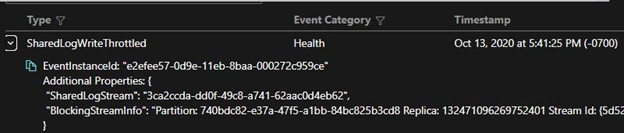

# Shared Log Writes Throttled
Reliable Collections use Write Ahead Log to persist transactions for a Stateful Service. The write ahead log is comprised of the highly performant shared log and the replica dedicated log. The shared log is shared by all the replicas on the node. All transaction records are first written to this shared log. Later, in the background, these records are extracted and flushed to the respective dedicated replica logs.
Sometimes the shared log may reach its near full capacity (90%). When this happens, the writes are throttled to allow the background task to flush the records to the dedicated log. During this time, the write performance is degraded due to throttling.
This may occur due to any of the following:
1.	Occasional burst in the write rate. Thus, the rate at which the background task is flushing the records to dedicated log falls much behind the rate at which the shared log is getting filled. This condition is usually transient and will clear up once the write rate is stabilized.
2.	Write to the dedicated log failed. The shared log is implemented as a circular buffer. So, if a dedicated log write fails, the record may block the flushing of the other records which may eventually lead to shared log full.
3.	Replica was aborted. When the replica is aborted, sometimes the log doesn’t get the chance to flush the records to the replica dedicated log. Thus, records for the replica in the shared log remains which may block the shared log truncation and eventually lead to shared log full.

## Shared Log Write Throttled and Unthrottled Event
When the Shared log is nearing its full capacity (90% by default), the writes to the log are throttled. At this time, ‘SharedLogWriteThrottled’ platform event is raised by the Service Fabric which can be viewed in the SFX.

 
If the condition is normalized, another event ‘SharedLogWriteUnthrottled’ is raised.

 

# Mitigation
If the shared log throttling is due to condition (1) above, it should get unthrottled after some time. But if the problem persists, then try to restart the replica if it is still open. If the replica is already closed, or restarting the replica didn’t help then restarting the node should mitigate the problem.
