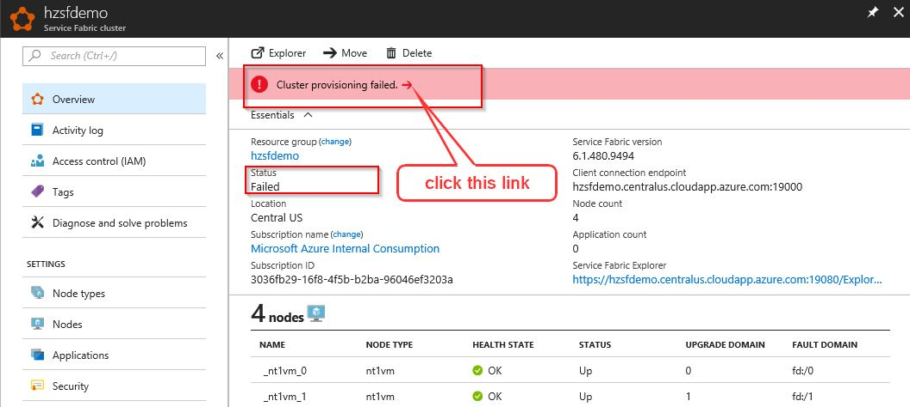
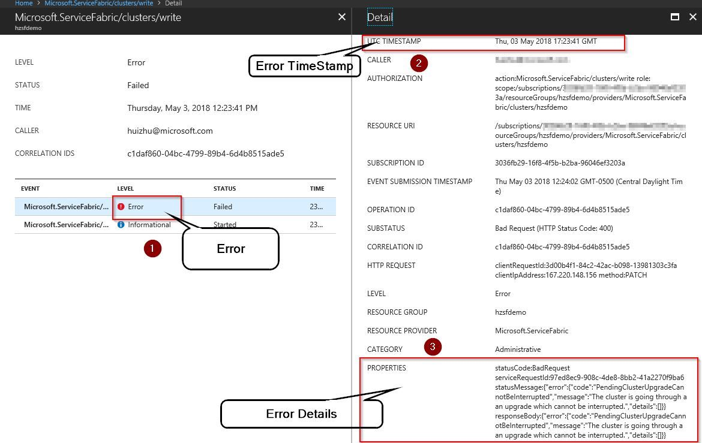
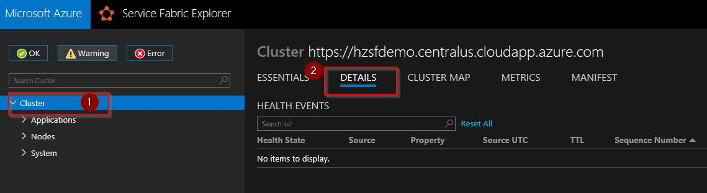
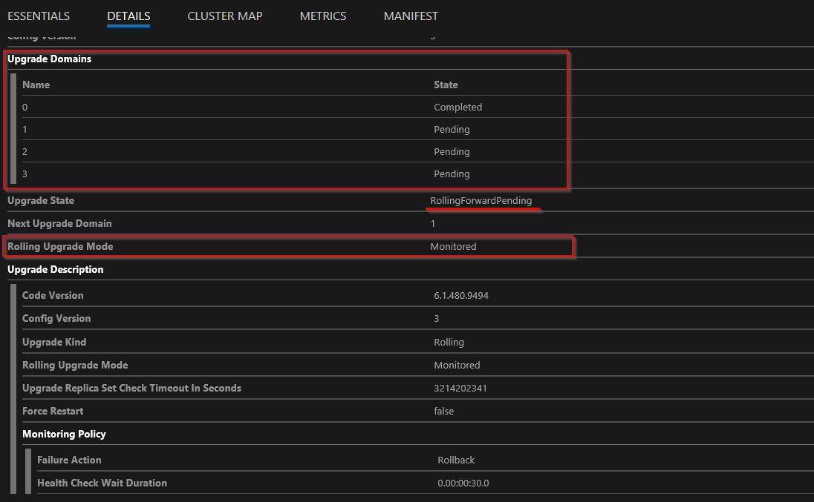
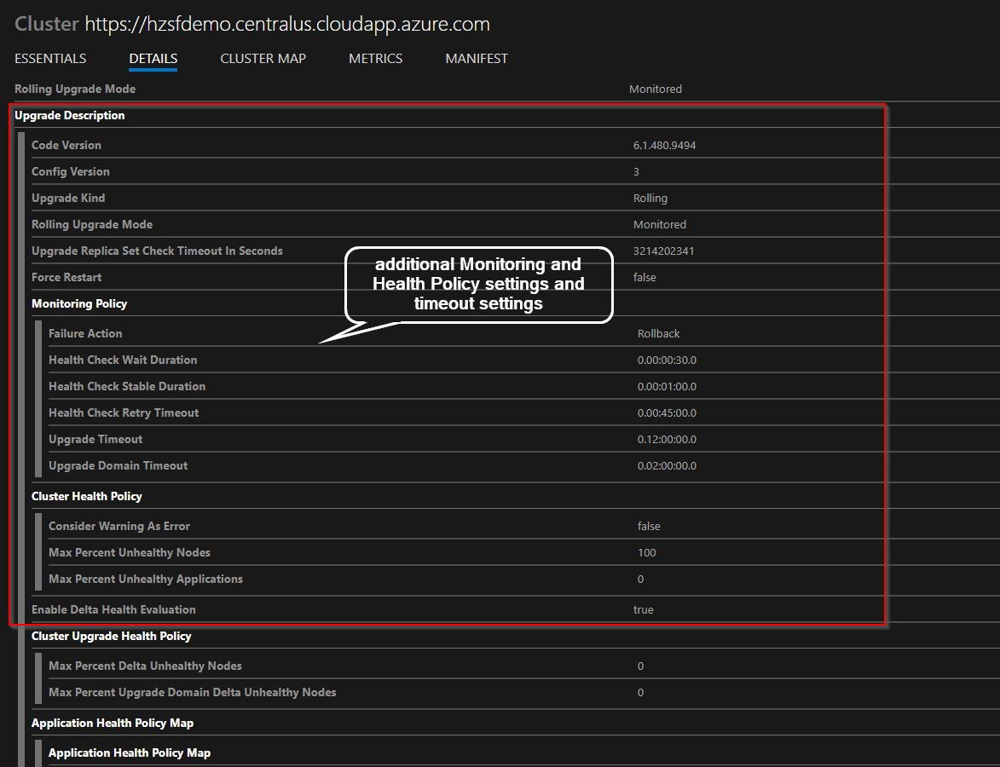
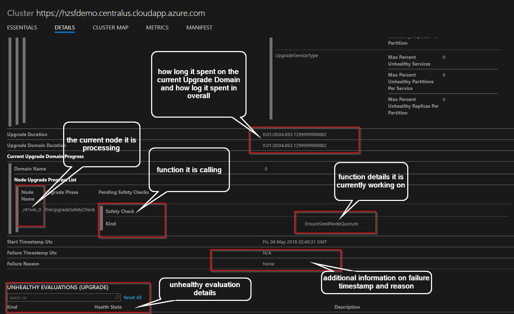
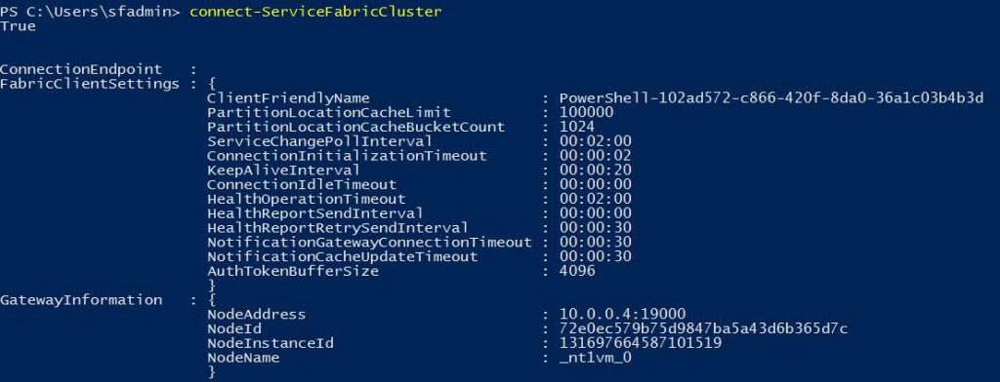
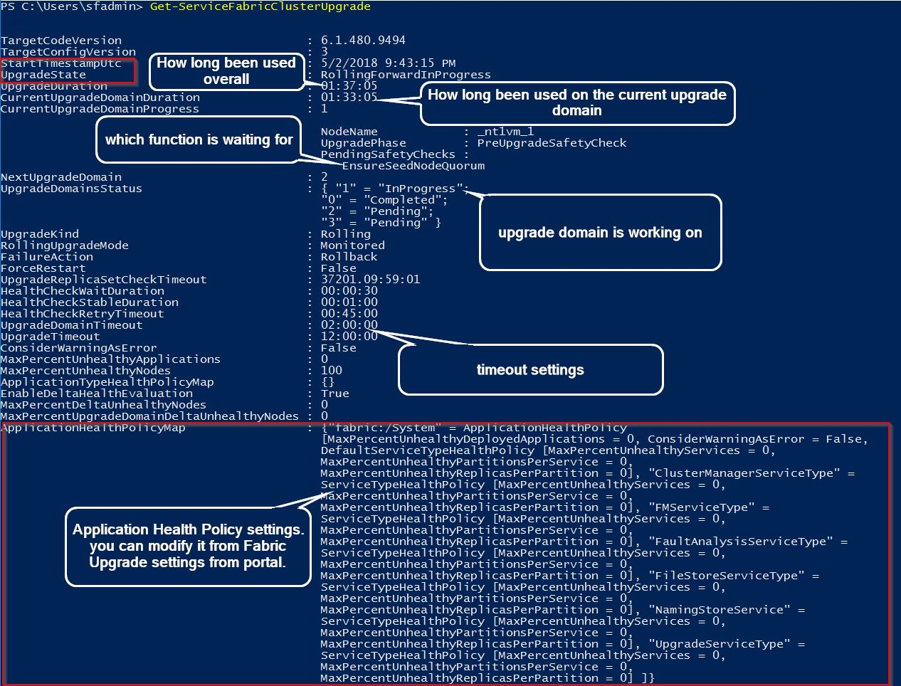
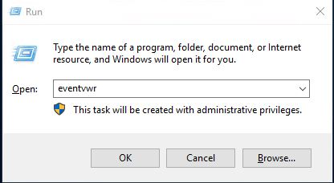
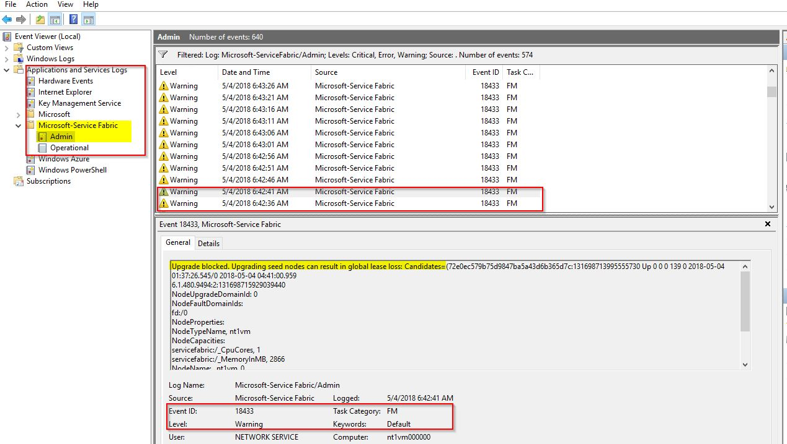

## **Troubleshooting overview**
We refer Service Fabric Cluster Upgrade as the Fabric Upgrade. Fabric Upgrade failures can be caused by multiple reasons, some common issues were listed below:

1.  Missing seed node or not enough seed node number to match reliability settings.

2.  Upgrade stuck for waiting for PreUpgradeSafetyCheck/SafetyCheck

3.  Upgrade timeout due to incorrect upgrade settings and health policy settings, such as Slow processing of upgrade domain due to a disk IO performance issue or incorrect (too short) timeout settings.

4.  There are some customer SF applications in error state during cluster upgrade which fails our MaxPercentUnhealthyApplications evaluation

5.  Delta unhealthy (node or application) evaluation failed. but typically we don't pay much attention in those Delta Nodes or Applications CheckHealthEvaluation settings.

6.  Cluster manifest upgrade interrupted and rolled back automatically by SFRP resource provider.

7.  Cluster upgrade stuck on node due to installation package failure

8.  Cluster upgrade stuck due to Fabric Installer crash or hang issues. For example, you disabled the windows upgrade or didn\'t configure POA (Patch Orchestration Application) correctly, FabricInstallerSvc is missing the C/C++ runtime package.

9.  Cluster upgrade failed due to fabric:/System/InfrastructureService/{nodetype} was in Quorum loss, where {nodetype} had been previously removed or scaled to 0 nodes. 
     - See suggested mitigation for this here - https://learn.microsoft.com/en-us/azure/service-fabric/service-fabric-how-to-remove-node-type

In order to get root cause analysis (RCA), you can open a support ticket with Microsoft or self help first by quickly checking Fabric Upgrade details from either PowerShell - Get-ServiceFabricClusterUpgrade or from Service Fabric Explorer (SFX).

## **Troubleshooting steps**

1.  Look your Portal/Service Fabric /Overview Blade

    

    - After clicking the link, you will get the error details, for example
    

2.  Check Service Fabric Explorer (SFX)

    - Open you SFX Url link from portal, click \"Cluster\" and go to the \"details\" Tab, for example, my SFX Url is:\
        > <https://hzsfdemo.centralus.cloudapp.azure.com:19080/Explorer/index.html#/tab/details>

        

    - First, you will see the Upgrade Domain walk and UD processing information

        

    - Second, you will get the Health and Monitoring Policy and Timeout settings

        

    - Finally, you will be able to see the current upgrade status and what the upgrade is working on.

        

    - For my scenario, it is waiting for EnsureSeedNodeQuorum for about 1:20+ hours. Now, you narrowed down the issue to ENUM type **EnsureSeedNodeQuorum**. You can check the explanation for it @ https://msdn.microsoft.com/en-us/library/azure/mt163586.aspx and start to understand the possible cause of the problem.

3. Use PowerShell Get-ServiceFabricClusterUpgrade to get the upgrade status and error during and after the upgrade

    - Call Connect-ServiceFabricCluster from a RDP session on one of primary nodetype node without any parameter. Since you are in VM already, this will bypass the security check. Or you can pass the X509Certificate or AADCredential to make the connection per [Connect-ServiceFabricCluster](https://docs.microsoft.com/en-us/powershell/module/servicefabric/connect-servicefabriccluster?view=azureservicefabricps) doc.

        

    - Call [Get-ServiceFabricClusterUpgrade](https://docs.microsoft.com/en-us/powershell/module/servicefabric/get-servicefabricclusterupgrade?view=azureservicefabricps) during the Fabric Upgrade or even after the Fabric Upgrade.

        

        For our situation, the upgrade domain 1 stuck on the PreUpgradeSaftyCheck for EnsureSeedNodeQuorum till upgrade domain timeout.

        Now, you narrowed down the ENUM type EnsureSeedNodeQuorum. You can check the additional explanation for it
        @ https://msdn.microsoft.com/en-us/library/azure/mt163586.aspx

4. Additional, RDP into the node and check event viewer for \"Microsoft-Service Fabric\" Admin and Operational Event logs

    - RDP and Open eventvwr for the Service Fabric cluster node

        

    - Check Application and Services Logs \-\-- \> Microsoft-Service Fabric Event and check both Admin/Operational event for errors and warnings details

        

5. In conclusion, the issue is identified as a seed node missing problem. See [How to Fix one missing seed node](How%20to%20Fix%20one%20missing%20seed%20node.md)

