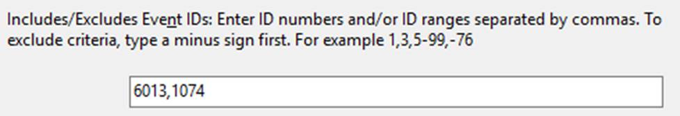

# Why did my node Reboot?

## **Check Eventlogs**
Event Viewer -> Windows Logs -> System -> select "Filter Current Logs" -> and include just 6013,1074

  

You should see events similar to this if WU was the reason the node was restarted:

```EventInfo
  Information 7/15/2016 11:00:00 AM User32 1074 None
  Reason Code: 0x80020002
    The process C:\\Windows\\system32\\wuauclt.exe (FRONTEND01) has initiated the restart of computer FRONTEND01 on behalf of user FRONTEND01\\adminuser for the following reason: Operating System: Recovery (Planned)
  Shutdown Type: restart

  Comment:
  Information 7/15/2016 7:00:01 AM EventLog 6013 None
  The system uptime is 305578 seconds.
```

## Other events you can filter on to find additional info indicating reboot events
- [Event ID 6005](http://www.microsoft.com/technet/support/ee/transform.aspx?ProdName=Windows%20Operating%20System&ProdVer=5.2&EvtID=6005&EvtSrc=EventLog&LCID=1033): "The event log service was started." You will see many of these at a system startup.
- [Event ID 6006](http://www.microsoft.com/technet/support/ee/transform.aspx?ProdName=Windows%20Operating%20System&ProdVer=5.2&EvtID=6006&EvtSrc=EventLog&LCID=1033): "The event log service was stopped." You will see many of these at a system shutdown.
- [Event ID 6008](http://www.microsoft.com/technet/support/ee/transform.aspx?ProdName=Windows%20Operating%20System&ProdVer=5.0&EvtID=6008&EvtSrc=User32&LCID=1033/): \"The previous system shutdown was unexpected.\" Records that the system started after it was not shut down properly.
- [Event ID 6009](http://www.microsoft.com/technet/support/ee/transform.aspx?ProdName=Windows%20Operating%20System&ProdVer=5.2&EvtID=6009&EvtSrc=EventLog&LCID=1033): Indicates the Windows product name, version, build number, service pack number, and operating system type detected at time.
- Event ID 6013: Displays the uptime of the computer. There is no TechNet page for this id.
- [Event ID 1074](http://www.microsoft.com/technet/support/ee/transform.aspx?ProdName=Windows%20Operating%20System&ProdVer=5.2&EvtID=1074&EvtSrc=User32&LCID=1033): \"The process X has initiated the restart / shutdown of computer on behalf of user Y for the following reason: Z.\" Indicates that an application or a user initiated a restart or shutdown.
- [Event ID 1076](http://www.microsoft.com/technet/support/ee/transform.aspx?ProdName=Windows%20Operating%20System&ProdVer=5.2&EvtID=1076&EvtSrc=USER32&LCID=1033): \"The reason supplied by user X for the last unexpected shutdown of this computer is: Y.\" Records when the first user with shutdown privileges logs on to the computer after an unexpected restart or shutdown and supplies a reason for the occurrence.

## **Additional tip**
- On Windows 2012-R2 check c:\windows\windowsupdate.log to match up the time with the above event log entries
- On Windows 2016, a powershell cmdlet Get-WindowsUpdateLog
  - This cmdlet consolidates the logs into C:\Users\username\Desktop\WindowsUpdate.log
