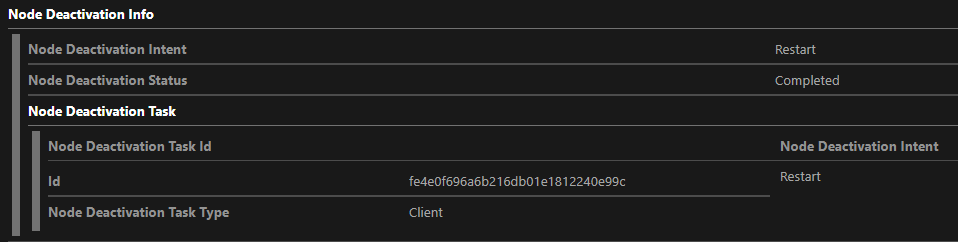
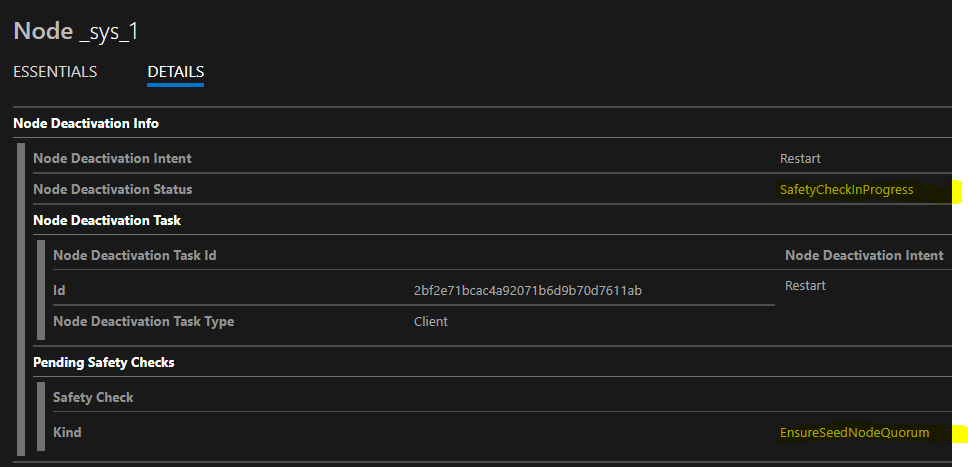

# Why is my node unhealthy (Deactivating/Deactivated/Down)?

Deactivating nodes is how MR-enabled clusters ([Silver or Gold durability](https://docs.microsoft.com/en-us/azure/service-fabric/service-fabric-cluster-capacity#the-durability-characteristics-of-the-cluster)) coordinate with Azure-initiated maintenance or update actions. When Azure notifies us that a job is pending, we deactivate the affected nodes.  When the deactivation completes, we send approval of the job to Azure.  When Azure has completed the pending work, they notify us again and we reactivate the affected nodes. So deactivated nodes are expected as part of normal operation on clusters configured on Silver or Gold durability.

You can check the node list in SFX (or Get-ServiceFabricNode) to see what repair task is causing the node to be deactivated. This generally indicates the source of the deactivation ("Node Deactivation Task Id" in SFX).  	

| Task type | TaskId Prefix | Explaination |
|---|---|---|
| Repair | Azure/PlatformUpdate | An update to the physical host, initiated by Azure Compute |
| Repair | Azure/PlatformMaintenance | Maintenance initiated by Azure Compute, e.g. network switch maintenance, or service healing (moving the VM to another physical host) |
| Repair | Azure/TenantUpdate | User-initiated update of the VMSS, e.g. adding or removing VMs, changing VMSS config, changing guest OS, changing network config
| Repair | Azure/TenantMaintenance | User-initiated repair e.g. VM reboot
| Client | <node id in hex> | User requested deactivation via API (e.g. Disable-ServiceFabricNode)

If any nodes are in Disabling for a long time, this generally indicates an issue with the cluster.  This is often a stuck lifecycle operation (e.g. failing to respond to a Close or a RunAsync cancellation token, resulting in stuck reconfig), or a safety issue (e.g. not enough healthy replicas due to an app issue), or a capacity issue (e.g. trying to remove VMs such that there would be an insufficient number of seed nodes for the configured [Reliability Level](https://docs.microsoft.com/en-us/azure/service-fabric/service-fabric-cluster-capacity#the-reliability-characteristics-of-the-cluster) of the cluster, or an insufficient number of nodes to replace the replicas that will be lost).  The node details tab in SFX will show the safety check that is not passing.

## Client example

## Node stuck in Disabling state

## Troubleshooting nodes stuck in Disabling state
Look at node list for nodes in Disabling, and view details to see if they are in SafetyCheckInProgress and why

- EnsureSeedNodeQuorum
    - Are you removing seed nodes?
    - Avoid removing seed nodes when possible.
    - This may require multiple passes of SF cluster config upgrades to reconfigure the seed node set.  This can take a very long time.
    - Will your attempted removal put you below the minimum number of nodes needed for your chosen reliabilityLevel?  Decrease the cluster's reliabilityLevel first.

- EnsurePartitionQuorum
    - If the deactivation intent is Restart, then loss of the node may cause quorum loss for a partition.  Check the status of the partition shown, and correct any problems.
    - If the deactivation intent is RemoveData or RemoveNode, then make sure you have sufficient capacity remaining in the cluster to build replacement replicas for all replicas on this node, satisfying placement, domain, and capacity constraints.  You may need to reduce the Target/MinReplicaSetSize for your services (or the cluster reliabilityLevel if the partition belongs to a system service).

## Troubleshooting Node stuck in Down state

For Windows based clusters, it is possible to find some information for the node going down in Events tab for the node.
- Node Deactivation events should have information. BatchId field has some information based on if it contains the following
    - Tenant Update / Tenant Maintenance – initiated by customer or on behalf of the customer through VMSS
    - Platform Update / Platform Maintenance – initiated by Azure for updating some underlying infrastructure
    - POA / POS – Initiated by Patch Orchestration service deployed by the customer to install OS updates
    - Client – Initiated by the customer by calling one of the SF commands to deactivate the node
- No Deactivation events, but has Node Closed
    - SF closed the node for some reason. Currently it is not possible to determine the cause without looking at the detailed SF traces
- No Deactivation or close events before Node Down event – this typically means unplanned event has happened
    - Networking issues causing node to not be able to communicate with other nodes
    - Underlying VM was terminated ungracefully
    - Automatic Windows Update is enabled in the OS – this will result in ungraceful restart of the VM from a SF point of view
        - Use VMSS automatic OS upgrade configuration to convert this to graceful operations in SF. This is the preferred option
        - POA is an alternative if OS upgrade should be scheduled at specific time. Automatic OS upgrade currently does not allow specifying a schedule to apply updates

Other reasons for nodes going down:
- Service Fabric will bring down the node for maintenance only for cluster upgrades. The SFX Details tab at cluster level should show the duration of the upgrade and Events at Cluster level should show the exact time UD was updated. Corresponding Node Close & Node down events during the period will be due to SF upgrade
- SF version upgrade is initiate automatically if the settings for the cluster specify Automatic Upgrade. These typically happen week days business hours PST / PDT
- Other customer initiated SF config upgrades can also bring down a node to apply the change
- High resource usage that makes the VM not responsive or slow can trigger a VM reboot at the OS level
- High resource usage that makes the VM not responsive or slow that prevents SF services running on the VM to not be able to communicate with other nodes
- Automatic Windows Updates enabled in the OS

If any nodes are in Down state for a long time, this generally indicates an issue with the node itself.  There are several root causes, the main reasons we have seen are when the node is unable to complete some part of the bootstrap process (Configure the Node, Install Service Fabric, rejoin the cluster)

- For some scenarios, such as an expired certificate or out of diskspace, you may be able to RDP into the affected node and determine the cause by checking the following logs:
    - Application Event Logs
    - VM Extensions logs
        - "C:\\WindowsAzure\\Logs\AggregateStatus\\aggregatestatus.json"
        - "C:\\WindowsAzure\\Logs\\Plugins\\Microsoft.Azure.ServiceFabric.ServiceFabricNode\\**\[extension version\]**\\CommandExecution.log"
