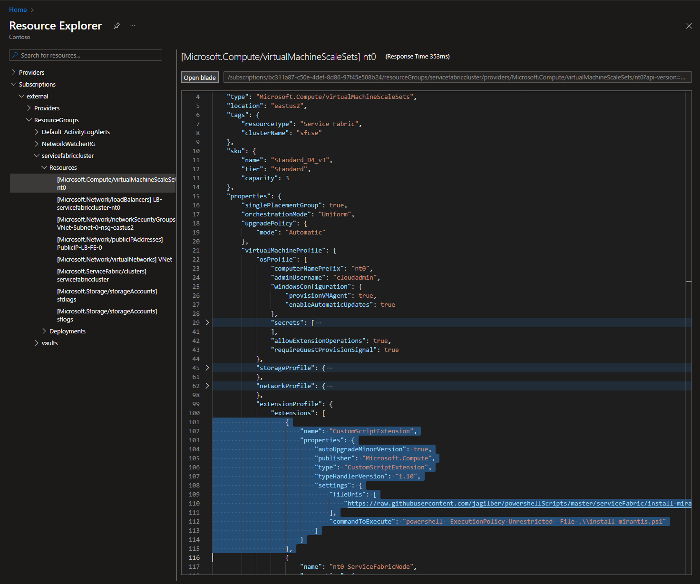
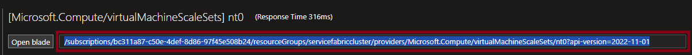
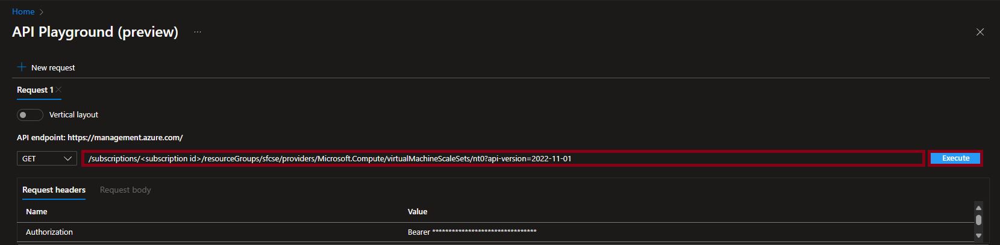
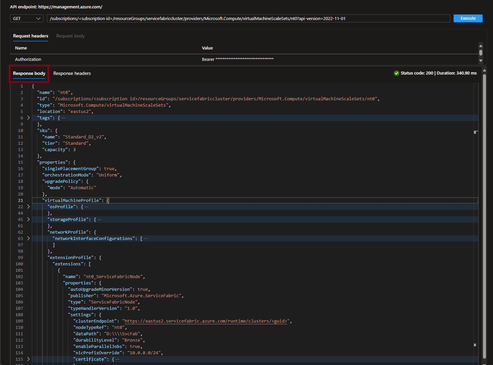
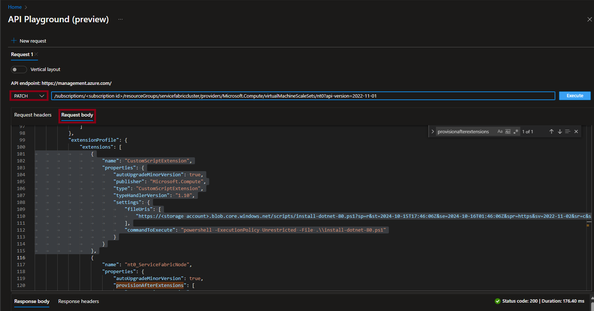
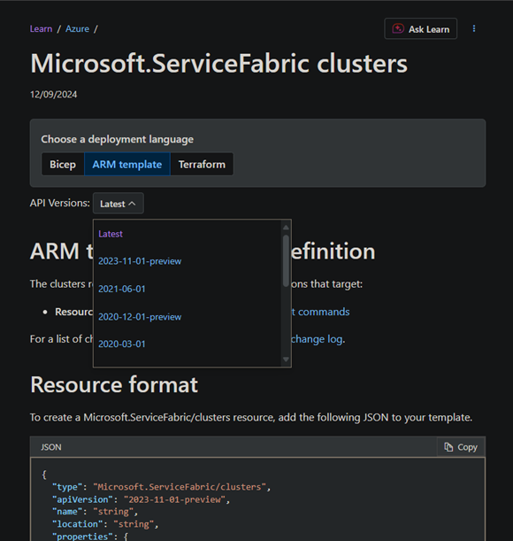
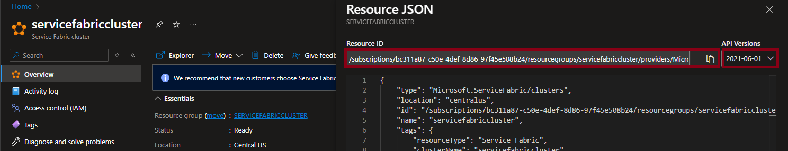

# Azure Resource Explorer Alternatives

With the deprecation of Azure Resource Explorer `https://resources.azure.com/`, some alternatives to manage Azure resources are below:

1. **Azure Portal**: Azure Portal is the primary interface for managing Azure resources. It provides a graphical interface to view and manage resources, including resource groups, virtual machines, storage accounts, and more.
    - **Advantages**: User-friendly, comprehensive, and integrated with other Azure services.
    - **Disadvantages**: Requires a browser. Users may find it cumbersome for large-scale operations or automation tasks.

1. **Azure PowerShell**: Azure PowerShell is a set of cmdlets for managing Azure resources from the command line. It is particularly useful for Windows users and integrates well with other PowerShell scripts and modules.
    - **Advantages**: Powerful scripting capabilities commonly used in automation for Azure with ability to access detailed resource information.
    - **Disadvantages**: Requires knowledge of PowerShell syntax and may not be as user-friendly for those unfamiliar with PowerShell.

1. **Azure CLI**: Similar to Azure PowerShell, the Azure Command-Line Interface (CLI) is a cross-platform command-line tool that allows you to manage Azure resources. It provides commands for creating, updating, and deleting resources, as well as querying resource information.
    - **Advantages**: Scriptable, can be used in automation scripts, and provides detailed information about resources.
    - **Disadvantages**: Requires knowledge of command-line syntax and may not be as user-friendly for those unfamiliar with CLI tools.

## Azure Portal

Azure Portal provides blades for managing and for viewing Azure resources. [Resource Explorer](https://portal.azure.com/#view/HubsExtension/ArmExplorerBlade) blade is most similar to `Azure Resource Explorer` that allows graphical navigation however it is read only. [API Playground](https://ms.portal.azure.com/#view/Microsoft_Azure_Resources/ArmPlayground) can be used to view or modify resources but requires knowledge of the resource's ID and API version. Here are steps to view and modify resources:

### Using Azure Portal to view resources

1. Open [Resource Explorer](https://portal.azure.com/#view/HubsExtension/ArmExplorerBlade) in [Azure Portal](https://portal.azure.com/) to browse and view resources.

2. Select the specific subscription, resource group, and then resource under 'Resources':

    ```text
    Subscriptions
        └───<subscription name>
            └───ResourceGroups
                └───<resource group name>
                    └───Resources
                        └───<resource name>
    ```

    

3. If intent is to modify this resource, triple-click to copy the complete resource uri with api version from the read-only box to the right of `Open Blade` button for modification using `API Playground` described below. Example:

    

### Using Azure Portal to update resources

To use `API Playground` to modify the configuration of a resource, the resource uri with api version must be provided. Use the [Using Azure Portal to view resources](#using-azure-portal-to-view-resources) steps above to copy the resource uri with api version from Resource Explorer. Another option is to get the resource uri from the `Resource JSON` views that are available on resources in Azure Portal. The `Resource JSON` view can be accessed by selecting the `JSON View` link on the top right side resource blade. This will open a new window with the JSON representation of the resource, including the resource uri and api version.

The resource uri format is as follows:

```text
/<subscription id>/resourceGroups/<resource group name>/providers/<resource provider>/<resource type>/<resource name>?api-version=<api version>
```

1. Navigate to [API Playground](https://ms.portal.azure.com/#view/Microsoft_Azure_Resources/ArmPlayground) in [Azure Portal](https://portal.azure.com/) and paste the copied resource uri with api version from Resource Explorer into the input box to the right of the HTTP Request Method.

2. Select `Execute` to view the configuration of the specified resource. Example:

    

3. The `Response Body` will display the configuration of the resource similar to the Resource Explorer view. This response body can be copied and pasted into the `Request Body` above to modify the configuration. Example:

    

4. Set the request method to `PUT` or `PATCH` depending on update type, select `Request Body`, and paste the copied response body. Modify the configuration as needed. Example:

    

5. Select `Execute` to modify the configuration. In the `Response Body`, verify the `Status Code` is '200' and the `provisioningState` is 'Updating' or 'Succeeded'. The provisioning status can be monitored in the [Azure Portal](https://portal.azure.com/) or by performing additional `Get` requests from [Resource Explorer](https://portal.azure.com/#view/HubsExtension/ArmExplorerBlade) or [API Playground](https://ms.portal.azure.com/#view/Microsoft_Azure_Resources/ArmPlayground). Example:

    

## PowerShell

> [!NOTE]
> These steps require Azure PowerShell 'Az' modules. Specifically `Az.Accounts` and `Az.Resources` are the two modules being used. If these are not installed, you can install by using the following command(s):

Connect to Azure account  with [`Connect-AzAccount`](https://learn.microsoft.com/powershell/module/az.accounts/connect-azaccount) cmdlet. This will prompt for credentials and allow you to select the subscription you want to work with. If you have multiple subscriptions, you can specify the subscription name or ID using the `-Subscription` parameter.

1. Open Azure PowerShell and log in to your Azure account:
  
  ```powershell
  # install all Az modules
  #Install-Module -Name Az -AllowClobber -Force

  # or install specific Az modules
  # Install-Module -Name Az.Accounts -AllowClobber -Force
  # Install-Module -Name Az.Resources -AllowClobber -Force

  Import-Module Az.Accounts
  Import-Module Az.Resources
  Connect-AzAccount
  ```

### Using PowerShell to view resources

Use the following steps to view resources with PowerShell:

1. Use the [`Get-AzResource`](https://learn.microsoft.com/powershell/module/az.resources/get-azresource) cmdlet to list all resources in a specific resource group:

   ```powershell
   $resources = Get-AzResource -ResourceGroupName <resource group name>
   $resources
   ```

1. To view a specific resource, use the [`Get-AzResource`](https://learn.microsoft.com/powershell/module/az.resources/get-azresource) cmdlet with the `-ResourceId` parameter:

   ```powershell
   $resource = Get-AzResource -ResourceId <resource id>
   $resource
   ```

### Using PowerShell to update resources

Use the following steps to update resources with PowerShell:

1. Use the [`Set-AzResource`](https://learn.microsoft.com/powershell/module/az.resources/set-azresource) cmdlet to update the resource. For example, to update a property of a resource:

   ```powershell
    Set-AzResource -ResourceId <resource id> -Properties @{<property name> = <new value>}
    ```

1. To verify the update, use the [`Get-AzResource`](https://learn.microsoft.com/powershell/module/az.resources/get-azresource) cmdlet again:

   ```powershell
   Get-AzResource -ResourceId <resource id>
   ```

### Using PowerShell to export ARM template

Use the [`Export-AzResourceGroup`](https://learn.microsoft.com/powershell/module/az.resources/export-azresourcegroup) cmdlet to export an ARM template for a specific resource or resource group. The exported template can be modified used to modify the resource configuration. The `-SkipAllParameterization` parameter is used to skip parameterization of all properties in the exported template. The `-Force` parameter is used to overwrite the existing file if it already exists.

> [!NOTE]
> Exporting Service Fabric clusters (unmanaged) with a basic load balancer at the resource group level is not supported. There are known issues with exporting load balancer rules for a basic load balancer. If using `Export-AzResourceGroup` for unmanaged clusters with a basic load balancer, specify the resource Id of the resource to update instead of the resource group. This is not an issue with standard load balancers.

Variables used in the following examples:

  ```powershell
  $resourceGroupName = "<resource group name>"
  $jsonFile = "$pwd\template.json"
  $resourceId = "<resource id>"
  ```

Use the following steps to export ARM template with PowerShell for a specific resource:

  ```powershell
  Export-AzResourceGroup -ResourceGroupName $resourceGroupName `
    -Resource $resourceId `
    -Path $jsonFile `
    -SkipAllParameterization `
    -Force
  ```

Use the following steps to export ARM template with PowerShell for entire resource group:

  ```powershell
  Export-AzResourceGroup -ResourceGroupName $resourceGroupName `
    -Path $jsonFile `
    -SkipAllParameterization `
    -Force
  ```

### Using PowerShell to deploy ARM template

Use the [`New-AzResourceGroupDeployment`](https://learn.microsoft.com/powershell/module/az.resources/new-azresourcegroupdeployment) cmdlet to deploy the modified ARM template. The `-TemplateFile` parameter is used to specify the path to the updated template file.

```powershell
New-AzResourceGroupDeployment -ResourceGroupName $resourceGroupName `
  -TemplateFile $jsonFile `
  -Verbose
```

## Azure CLI

> [!NOTE]
> These steps require Azure CLI. If Azure CLI is not installed, you can install it by following the instructions in the [Azure CLI installation guide](https://learn.microsoft.com/cli/azure/install-azure-cli).

Connect to Azure account with [`az login`](https://learn.microsoft.com/cli/azure/authenticate-azure-cli) command. This will prompt for credentials and allow you to select the subscription you want to work with. If you have multiple subscriptions, you can specify the subscription name or ID using the `--subscription` parameter.

### Using Azure CLI to view resources

Use the following steps to view resources with Azure CLI:

Use the [`az resource list`](https://learn.microsoft.com/cli/azure/resource#az_resource_list) command to list all resources in a specific resource group:

   ```bash
   az resource list --resource-group <resource group name>
   ```

### Using Azure CLI to update resources

Use the following steps to update resources with Azure CLI:

Use the [`az resource update`](https://learn.microsoft.com/cli/azure/resource#az_resource_update) command to update the resource. For example, to update a property of a resource:

   ```bash
   az resource update --ids <resource id> --set <property name>=<new value>
   ```

## Additional Information

### Microsoft Learn

You can find resource schema and API version for a specific resource in the Microsoft Learn documentation. Each resource type has its own documentation page that includes the API version information.
Search for the resource type in the Microsoft Learn documentation, and look for the API version information in the "REST API" section of the page.

[Azure Templates](https://learn.microsoft.com/azure/templates/) contains comprehensive information for all Azure Resources.

Example for Service Fabric clusters:

[Service Fabric Cluster Resource](https://learn.microsoft.com/azure/templates/microsoft.servicefabric/clusters)



### Obtaining Resource ID

The resource ID is a unique identifier for an Azure resource. It can be obtained from different blades in Azure Portal, Azure PowerShell, or Azure CLI. It can also be generated using the resource ID format below.

#### Azure Portal

Besides using the [Resource Explorer](#using-azure-portal-to-view-resources) blade in Azure Portal, you can also obtain the resource ID from the resource blade. The resource ID is displayed in the `Properties` section of the resource blade or in the `JSON View` of the resource. The API version can also be found in the `JSON View` of the resource.

1. Open Azure Portal and navigate to the resource group containing the resource you want to obtain the resource ID for.
2. Select the resource and in the resource blade, select `JSON View` link on the top right side resource blade. This will open a new window with the JSON representation of the resource, including the resource ID and API version.
  
    

- The resource ID will be displayed in the `Resource ID` field of the JSON representation.
- The api version can be found in the `API Versions` field of the JSON representation.

  

#### Azure PowerShell

  There are multiple commands that can obtain the resource ID using Azure PowerShell, as noted above, one that can be used is [`Get-AzResource`](https://learn.microsoft.com/powershell/module/az.resources/get-azresource) cmdlet. This cmdlet retrieves resources in a specified resource group or subscription using different parameters.

  Examples:

   ```powershell
   Get-AzResource -ResourceGroupName <resource group name>
   ```
  
  ```powershell
  Get-AzResource -ResourceGroupName <resource group name> -Name <resource name>
  ```
  
  ```powershell
  Get-AzResource -ResourceGroupName <resource group name> -ResourceType <resource type>
  ```

#### Azure CLI

```bash
az resource show --resource-group <resource group name> --name <resource name> --resource-type <resource type> --query "id"
```

Example for Service Fabric clusters:

```bash
az resource show --resource-group "servicefabriccluster" --name "servicefabriccluster" --resource-type "Microsoft.ServiceFabric/clusters" --query "id"
```

### Generating Resource ID

The resource ID can be generated using the following format, where `<subscription id>`, `<resource group name>`, `<resource provider>`, `<resource type>`, `<resource name>`, and `<api version>` are replaced with the appropriate values for the resource:

```text
/<subscription id>/resourceGroups/<resource group name>/providers/<resource provider>/<resource type>/<resource name>?api-version=<api version>
```

### Obtaining API Version

All Azure resources have a specific API version that is used to interact with the resource. The API version can be obtained from Azure Portal, Azure PowerShell, or Azure CLI. It can also be found in the Microsoft Learn documentation for the specific resource.

#### Azure Portal

As noted above, the API version can be found in the `JSON View` of the resource in Azure Portal. The API version is displayed in the `API Versions` field of the JSON representation of the resource.


#### Azure PowerShell

Use the `Get-AzResourceProvider` cmdlet to get the available API versions for a specific resource type. The API versions are listed under the `ApiVersions` property of the resource type.

```powershell
$resourceProvider = Get-AzResourceProvider -ProviderNamespace "<resource provider name>" # Microsoft.ServiceFabric, Microsoft.Compute, etc.
$resourceTypeInfo = $resourceProvider.ResourceTypes | Where-Object ResourceTypeName -ieq "<resource type>" # clusters, managedClusters, etc.
$apiVersions = $resourceTypeInfo.ApiVersions
$apiVersions
```

#### Azure CLI

```bash
az provider show --namespace <resource provider name> --query "resourceTypes[?resourceType=='<resource type>'].apiVersions" -o json
```

Example for Service Fabric clusters:

```bash
az provider show --namespace "Microsoft.ServiceFabric" --query "resourceTypes[?resourceType=='clusters'].apiVersions" -o json
```