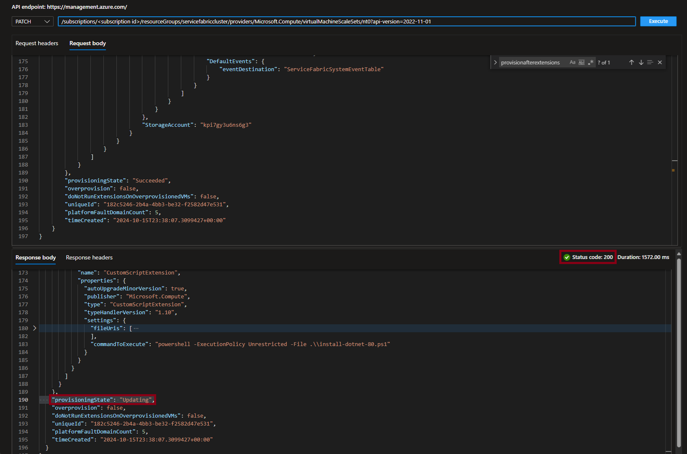

# Azure Resource Explorer Alternatives

With the deprecation of Azure Resource Explorer `https://resources.azure.com/`, there are alternatives to manage and explore their Azure resources. Below are some that can be used instead of Azure Resource Explorer:

1. **Azure Portal**: The Azure Portal is the primary interface for managing Azure resources. It provides a graphical interface to view and manage resources, including resource groups, virtual machines, storage accounts, and more.
    - **Advantages**: User-friendly, comprehensive, and integrated with other Azure services.
    - **Disadvantages**: May not provide the same level of detail as Resource Explorer for certain resources.

2. **Azure CLI**: The Azure Command-Line Interface (CLI) is a cross-platform command-line tool that allows you to manage Azure resources. It provides commands for creating, updating, and deleting resources, as well as querying resource information.
    - **Advantages**: Scriptable, can be used in automation scripts, and provides detailed information about resources.
    - **Disadvantages**: Requires knowledge of command-line syntax and may not be as user-friendly for those unfamiliar with CLI tools.

3. **Azure PowerShell**: Similar to Azure CLI, Azure PowerShell is a set of cmdlets for managing Azure resources from the command line. It is particularly useful for Windows users and integrates well with other PowerShell scripts and modules.
    - **Advantages**: Powerful scripting capabilities, integrates with existing PowerShell scripts, and provides detailed resource information.
    - **Disadvantages**: Requires knowledge of PowerShell syntax and may not be as user-friendly for those unfamiliar with PowerShell.

## Azure Portal

### Using Azure Portal to view resources

The Azure Portal provides an interface for managing and exploring Azure resources. Here are some steps to explore resources using the Azure Portal:

1. Open [Resource Explorer](https://portal.azure.com/#view/HubsExtension/ArmExplorerBlade) in [Azure Portal](https://portal.azure.com/) to view the resource. If intent is to modify resource, copy the resource uri with api version for modification.

2. Select the specific subscription, resource group, and then resource under 'Resources':

    ```text
    Subscriptions
        └───<subscription name>
            └───ResourceGroups
                └───<resource group name>
                    └───Resources
                        └───<resource name>
    ```

    

3. If intent is to modify this resource, triple-click to copy the complete resource uri with api version from the read-only box to the right of `Open Blade` button. Example:

    

### Using Azure Portal to update resources

The Azure Portal can also be used to update resources. Here are steps to update resources using API Playground in the Azure Portal:

To use `API Playground` to modify the configuration of a resource, the resource uri with api version must be provided. Use the [Using Azure Portal to view resources](#using-azure-portal-to-view-resources) steps above to copy the resource uri with api version from Resource Explorer. Another option is to get the resource uri from the `Resource JSON` views that are available on resources in the Azure Portal. The `Resource JSON` view can be accessed by selecting the `JSON View` link on the top right side resource blade. This will open a new window with the JSON representation of the resource, including the resource uri and api version.

The resource uri format is as follows:

```text
/<subscription id>/resourceGroups/<resource group name>/providers/<resource provider>/<resource type>/<resource name>?api-version=<api version>
```

1. Navigate to [API Playground](https://ms.portal.azure.com/#view/Microsoft_Azure_Resources/ArmPlayground) in [Azure Portal](https://portal.azure.com/) and paste the copied resource uri with api version from Resource Explorer into the input box to the right of the HTTP Request Method.

2. Select `Execute` to view the configuration of the specified resource. Example:

    

3. The `Response Body` will display the configuration of the resource similar to the Resource Explorer view. This response body can be copied and pasted into the `Request Body` above to modify the configuration. Example:

    

4. Set the request method to `PUT` or `PATCH` depending on update type, select `Request Body`, and paste the copied response body. Modify the configuration as needed. Example:

    

5. Select `Execute` to modify the configuration. In the `Response Body`, verify the `Status Code` is '200' and the `provisioningState` is 'Updating' or 'Succeeded'. The provisioning status can be monitored in the [Azure Portal](https://portal.azure.com/) or by performing additional `Get` requests from [Resource Explorer](https://portal.azure.com/#view/HubsExtension/ArmExplorerBlade) or [API Playground](https://ms.portal.azure.com/#view/Microsoft_Azure_Resources/ArmPlayground). Example:

    

## PowerShell

> [!NOTE]
> These steps assume you have Azure PowerShell 'Az' modules installed. Specifically `Az.Accounts` and `Az.Resources` are the two modules being used. If these are not installed, you can install by using the following command(s):

Connect to Azure account  with [`Connect-AzAccount`](https://learn.microsoft.com/powershell/module/az.accounts/connect-azaccount) cmdlet. This will prompt for credentials and allow you to select the subscription you want to work with. If you have multiple subscriptions, you can specify the subscription name or ID using the `-Subscription` parameter.

1. Open Azure PowerShell and log in to your Azure account:
  
  ```powershell
  # install all Az modules
  #Install-Module -Name Az -AllowClobber -Force

  # or install specific Az modules
  # Install-Module -Name Az.Accounts -AllowClobber -Force
  # Install-Module -Name Az.Resources -AllowClobber -Force

  Import-Module Az.Accounts
  Import-Module Az.Resources
  Connect-AzAccount
  ```

### Using PowerShell to view resources

Use the following steps to view resources with PowerShell:

1. Use the [`Get-AzResource`](https://learn.microsoft.com/powershell/module/az.resources/get-azresource) cmdlet to list all resources in a specific resource group:

   ```powershell
   $resources = Get-AzResource -ResourceGroupName <resource group name>
   $resources
   ```

1. To view a specific resource, use the [`Get-AzResource`](https://learn.microsoft.com/powershell/module/az.resources/get-azresource) cmdlet with the `-ResourceId` parameter:

   ```powershell
   $resource = Get-AzResource -ResourceId <resource id>
   $resource
   ```

### Using PowerShell to update resources

Use the following steps to update resources with PowerShell:

1. Use the [`Set-AzResource`](https://learn.microsoft.com/powershell/module/az.resources/set-azresource) cmdlet to update the resource. For example, to update a property of a resource:

   ```powershell
    Set-AzResource -ResourceId <resource id> -Properties @{<property name> = <new value>}
    ```

1. To verify the update, use the [`Get-AzResource`](https://learn.microsoft.com/powershell/module/az.resources/get-azresource) cmdlet again:

   ```powershell
   Get-AzResource -ResourceId <resource id>
   ```

### Using PowerShell to export ARM template

Use the [`Export-AzResourceGroup`](https://learn.microsoft.com/powershell/module/az.resources/export-azresourcegroup) cmdlet to export an ARM template for a specific resource or resource group. The exported template can be modified used to modify the resource configuration. The `-SkipAllParameterization` parameter is used to skip parameterization of all properties in the exported template. The `-Force` parameter is used to overwrite the existing file if it already exists.

> [!NOTE]
> Exporting Service Fabric clusters (unmanaged) with a basic load balancer at the resource group level is not supported. There are known issues with load balancer rules being exported. If using `Export-AzResourceGroup` for unmanaged clusters with a basic load balancer, specify the resource Id of the resource to update instead of the resource group. This is not an issue with standard load balancers.

Variables used in the following examples:

  ```powershell
  $resourceGroupName = "<resource group name>"
  $jsonFile = "$pwd\template.json"
  $resourceId = "<resource id>"
  ```

Use the following steps to export ARM template with PowerShell for a specific resource:

  ```powershell
  Export-AzResourceGroup -ResourceGroupName $resourceGroupName `
    -Resource $resourceId `
    -Path $jsonFile `
    -SkipAllParameterization `
    -Force
  ```

Use the following steps to export ARM template with PowerShell for a resource group:

  ```powershell
  Export-AzResourceGroup -ResourceGroupName $resourceGroupName `
    -Path $jsonFile `
    -SkipAllParameterization `
    -Force
  ```

### Using PowerShell to deploy ARM template

Use the [`New-AzResourceGroupDeployment`](https://learn.microsoft.com/powershell/module/az.resources/new-azresourcegroupdeployment) cmdlet to deploy an ARM template. The `-TemplateFile` parameter is used to specify the path to the updated template file.

```powershell
New-AzResourceGroupDeployment -ResourceGroupName $resourceGroupName `
  -TemplateFile $jsonFile `
  -Verbose
```

## Resource ID

### Obtaining Resource ID

The resource ID is a unique identifier for an Azure resource. It can be obtained using the Azure Portal, Azure PowerShell, or Azure CLI. It can also be generated using the resource ID format below.

#### Azure Portal

1. Open the Azure Portal and navigate to the resource group containing the resource you want to obtain the resource ID for.
2. Select the resource and in the resource blade, select `Properties` from the left-hand menu to view the resource ID.
3. The resource ID will be displayed in the `Resource ID` field.

Alternatively, the resource ID and API version can be obtained from the `JSON View` of the resource. The `JSON View` can be accessed by selecting the `JSON View` link on the top right side resource blade. This will open a new window with the JSON representation of the resource, including the resource ID.

- The resource ID will be displayed in the `id` field of the JSON representation.
- The api version can be found in the `apiVersion` field of the JSON representation.

#### Azure PowerShell

#### Azure CLI

### Generating Resource ID

## API Version

### Obtaining API Version

### Listing available API Versions

#### Azure Portal

#### Azure PowerShell

#### Azure CLI

## Frequently Asked Questions

## Reference
