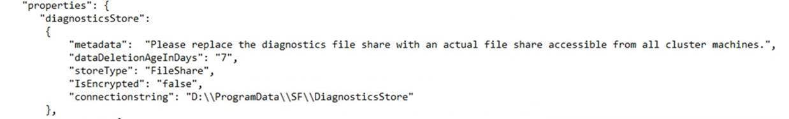
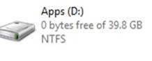
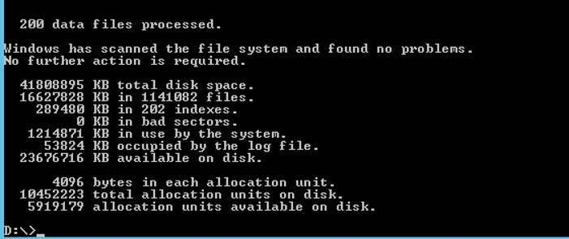
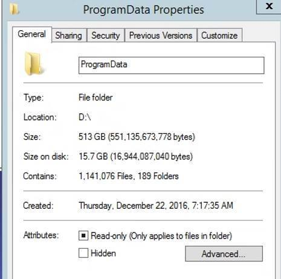
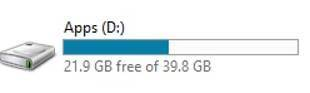
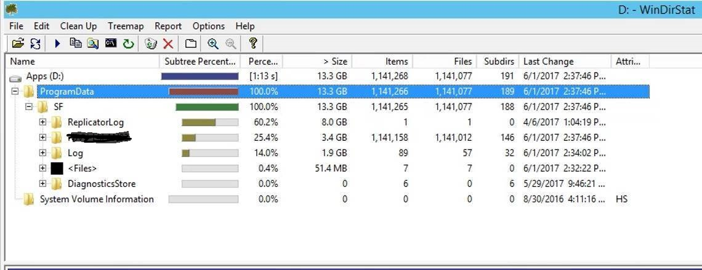
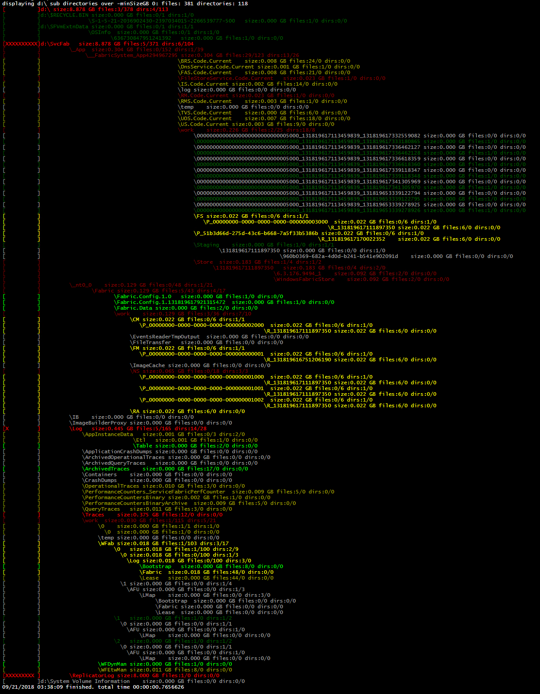

# Service Fabric nodes out of disk space

* There are several possible causes

## Recommended SKU size minimums

   [node type - capacity guidance](https://docs.microsoft.com/en-us/azure/service-fabric/service-fabric-cluster-capacity#primary-node-type---capacity-guidance)

## **Question and Symptom:**

We deployed a 5 nodes SF standalone cluster with following related settings. Note: D: drive is 40 GB hard drive dedicated for SF only and there is nothing put into D: before deployment.




After running the SF cluster for a few days. All 5 nodes has 0 bytes on D: without much application deployment.



There is no space to even allow creating a txt file in D:. But, chkdsk still report 23+ GB available on D: drive.





If you just reboot machine without touching anything, those \~23 GB will be re-claimed back again.



But after 2 or 3 days, all disk gone and all core SF system starts to show error.

We used windirsat.exe utility to looked all disk usage and still cannot see why 23 GB is gone and reclaimed again only after a fresh rebooting.



## **Question**
Where is 23 GB disk space in standalone SF cluster FabricDataRoot drive?

## **Answer**
The scenario is that the volume that holds the service fabric work directory will run out of disk space however if one adds up the sizes of all the files on the disk, the used space is not accounted for. This will only happen on Server 2012 R2 and earlier; Server 2016 does not have this issue. The cause of the issue is a bug in NTFS where NTFS will reserve free disk clusters when an app (typically an Anti-Virus app such as System Center) does memory mapped reads on a file written with non-cached I/O. This happens in Service Fabric as the dedicated logs are sparse file written using non-cached I/O. Below are the relevant details as explained by the NTFS team:

If you are seeing reservation when doing non-cached I/O to sparse files, then the file must also be memory-mapped and somebody must be doing paging reads. It's not your non-cached I/O that is causing reservation directly. It could be that an A/V product is memory mapping the file and reading in portions of the file to scan for malware. In Threshold we decided to tackle some long-standing reservation issues. We spent time experimenting, to discover what some of the issues were, and we fixed many of them As one example, we found that reservation would continue to increase even if the same sparse unit was being read over and over again. Our own A/V product always seems to read in the first few clusters of the file as well as the last few clusters; so every time A/V scanned a particular sparse file, reservation would rise seemingly without limit. Another scenario that led to seemingly unlimited reservation was defrag. There actually was a calculated limit that we wouldn't cross, but that limit was somewhat larger than the file size (and sparse files can have very large file sizes). Sparse reservation scenarios are greatly improved in Threshold. There are still further improvements we could make, especially for compressed files.

To verify that the low or out of disk space issue is because of reserved clusters you can use the following command:

```command
d:\\temp\>Fsutil fsinfo ntfsinfo c:

NTFS Volume Serial Number :        0xda4e131a4e12ef4f
NTFS Version   :                   3.1
LFS Version    :                   2.0
Number Sectors :                   0x000000001d0cafff
Total Clusters :                   0x0000000003a195ff
Free Clusters  :                   0x00000000022aba2a
Total Reserved :                   0x00000000000028e4
Bytes Per Sector  :                512
Bytes Per Physical Sector :        512
Bytes Per Cluster :                4096
Bytes Per FileRecord Segment    :  1024
Clusters Per FileRecord Segment :  0
Mft Valid Data Length :            0x0000000012c80000
Mft Start Lcn  :                   0x00000000000c0000
Mft2 Start Lcn :                   0x0000000000000002
Mft Zone Start :                   0x000000000128b920
Mft Zone End   :                   0x000000000128e840
Max Device Trim Extent Count :     0
Max Device Trim Byte Count :       0x0
Max Volume Trim Extent Count :     62
Max Volume Trim Byte Count :       0x40000000
Resource Manager Identifier :      B071CA62-02C2-11E7-A158-0024811D992E
```

In the above case there are 0x28e4 reserved clusters and each cluster is 4096 bytes for a total of about 42MB.

The mitigation for this would be to dismount the volume and then remount it. In general this would not be practical so an easier mitigation would be to reboot the node. A good way for the customer to resolve the issue is to have them exclude \*.sflog files from their AV real time scanning process or upgrade to Server 2016. Note that other AV products other than System Center might show this issue as well.

Also note that when looking at disk space usage it can be confusing to look at the \*.sflog files as they are sparse files and will typically show a nominal file size of 256GB. To see the actual disk space used you need to look at the compressed file size (this is in the properties in explorer).

## **Question**
We started to see disk space warning on our cluster.  After investigating where the space was being used we found the Logs and Traces folder was the main offender.

* Is it possible to limit how much space a node can use for Logs and Traces?

## **Answer**
Yes, you can configure the Disagnostics setting for MaxDiskQuotaInMB which controls Disk quota in MB for Windows Fabric log files

e.g.
```code
Set-AzureRmServiceFabricSetting -ResourceGroupName clusterResourceGroup -Name clusterName -Section "Diagnostics" -Parameter "MaxDiskQuotaInMB" -Value "25600" 
```

## **Question**
Our D: (azure %temp% drive used for Service Fabric Data Root) drive is full. How can we see what folders at taking up the most space?

## **Answer**
There are multiple tools to report on drive and path usage.
[directory-treesize.ps1](http://aka.ms/directory-treesize.ps1) is a powershell script in technet gallery that will quickly enumerate drive from powershell prompt. Example commands:
```powershell
(new-object net.webclient).downloadfile("http://aka.ms/directory-treesize.ps1","$(get-location)\directory-treesize.ps1");
.\directory-treesize.ps1 d:\ -showPercent -detail -minSizeGB 0
```


## **Question**
How can I summarize the disk usage on Linux systems?

## **Answer**

```Bash
    sudo du -sh /* | sort -nr | head -n 20
```

or limit to /mnt/sfroot/ folder

```Bash
    sudo du -sh /mnt/sfroot/* | sort -nr | head -n 20

    108M    /mnt/sfroot/log
    20K     /mnt/sfroot/
    12K     /mnt/sfroot/FabricHostSettings.xml
    4.0K    /mnt/sfroot/_sf_docker_pid
    3.5G    /mnt/sfroot/_sys_0
    3.0G    /mnt/sfroot/_App
    0       /mnt/sfroot/targetinformationfileaccess.lock

```

## **More Info**
Azure Cluster:  https://docs.microsoft.com/en-us/azure/service-fabric/service-fabric-cluster-fabric-settings#customize-cluster-settings-using-resource-manager-templates

Standalone Cluster:
https://docs.microsoft.com/en-us/azure/service-fabric/service-fabric-cluster-fabric-settings#customize-cluster-settings-for-standalone-clusters

Directory Treesize:
https://gallery.technet.microsoft.com/Windows-PowerShell-067cfed9?redir=0
