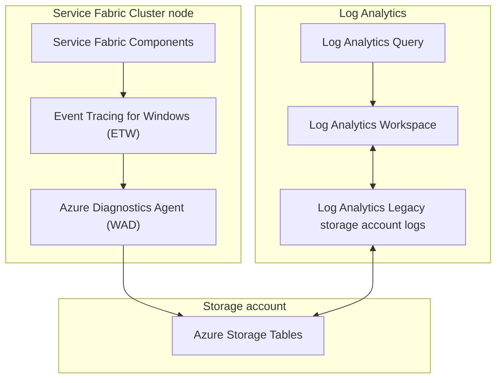

# How to configure Log Analytics for Service Fabric clusters

## Introduction

This article describes how to setup Log Analytics for Service Fabric Cluster. With Log Analytics, you can collect and analyze diagnostic Service Fabric Cluster events, Windows Events, and other optional configurations. This article assumes you have a Service Fabric Cluster running in Azure and a Log Analytics workspace. For more information, see [Create a Log Analytics workspace in the Azure portal](https://docs.microsoft.com/azure/log-analytics/log-analytics-quick-create-workspace).

This information does not apply to Service Fabric Managed clusters. Managed clusters use Azure Monitor instead of Log Analytics.

## Configuration

### Log collection configurations

By default, Service Fabric clusters have WAD configuration enabled with base logging enabled. [Log collection configurations](https://learn.microsoft.com/azure/service-fabric/service-fabric-diagnostics-event-aggregation-wad#log-collection-configurations) has detailed information for each level. The following common configuration values are for the 'scheduledTransferKeywordFilter' property in the WadCfg extension.

- "scheduledTransferKeywordFilter": "4611686018427387904" - Operational Channel - Base: Default.
- "scheduledTransferKeywordFilter": "4611686018427387912" - Operational Channel - Detailed.
- "scheduledTransferKeywordFilter": "4611686018427387928" - Data and Messaging Channel - Base.
- "scheduledTransferKeywordFilter": "4611686018427387944" - Data and Messaging Channel - Detailed.

### Event log collection

In addition to Service Fabric events, you can also collect Windows Event Logs. [WindowsEventLog Element](https://learn.microsoft.com/azure/azure-monitor/agents/diagnostics-extension-schema-windows#windowseventlog-element) defines this parameter and has examples.

Example WindowsEventLog configuration to collect:

- Any Critical or Error events from the System log
- Any Critical events from the Application log
- Application hangs
- Application errors and exceptions
- Microsoft Antimalware

The 'scheduledTransferPeriod' is set to 5 minutes. The 'name' property is a XPath query that is use:

```json
"EtwProviders": {
...
},
"WindowsEventLog": {
  "scheduledTransferPeriod": "PT5M",
  "DataSource": [
    {
      "name": "System!*[System[Provider[@Name='Microsoft Antimalware'] or (Level=1  or Level=2)]]"
    },
    {
      "name": "Application!*[System[Provider[@Name='.NET Runtime' or @Name='Application Error' or @Name='Application Hang' or @Name='Windows Error Reporting'] or (Level=1)]]"
    }
  ]
}
```

## Setup Log Analytics for Service Fabric Cluster

1. Ensure Windows Azure Diagnostics (WAD) extension is configured on the node types / scale sets. The WadCfg has the configuration for collection and storage account where WAD table data is stored. See [Event Aggregation with Windows Azure Diagnostics - Azure Service Fabric](https://learn.microsoft.com/azure/service-fabric/service-fabric-diagnostics-event-aggregation-wad) for more information.

    Default WadCfg Extension ARM template configuration when deploying from Azure portal:

    <details><summary>Click to expand</summary>

    ```json
    {
        "name": "[concat('VMDiagnosticsVmExt','_vmNodeType0Name')]",
        "properties": {
            "type": "IaaSDiagnostics",
            "autoUpgradeMinorVersion": true,
            "protectedSettings": {
                "storageAccountName": "[parameters('applicationDiagnosticsStorageAccountName')]",
                "storageAccountKey": "[listKeys(resourceId('Microsoft.Storage/storageAccounts', parameters('applicationDiagnosticsStorageAccountName')),'2015-05-01-preview').key1]",
                "storageAccountEndPoint": "https://core.windows.net/"
            },
            "publisher": "Microsoft.Azure.Diagnostics",
            "settings": {
                "WadCfg": {
                    "DiagnosticMonitorConfiguration": {
                        "overallQuotaInMB": "50000",
                        "EtwProviders": {
                            "EtwEventSourceProviderConfiguration": [
                                {
                                    "provider": "Microsoft-ServiceFabric-Actors",
                                    "scheduledTransferKeywordFilter": "1",
                                    "scheduledTransferPeriod": "PT5M",
                                    "DefaultEvents": {
                                        "eventDestination": "ServiceFabricReliableActorEventTable"
                                    }
                                },
                                {
                                    "provider": "Microsoft-ServiceFabric-Services",
                                    "scheduledTransferPeriod": "PT5M",
                                    "DefaultEvents": {
                                        "eventDestination": "ServiceFabricReliableServiceEventTable"
                                    }
                                }
                            ],
                            "EtwManifestProviderConfiguration": [
                                {
                                    "provider": "cbd93bc2-71e5-4566-b3a7-595d8eeca6e8",
                                    "scheduledTransferLogLevelFilter": "Information",
                                    "scheduledTransferKeywordFilter": "4611686018427387904", // Operational Channel - Base: Default
                                    "scheduledTransferPeriod": "PT5M",
                                    "DefaultEvents": {
                                        "eventDestination": "ServiceFabricSystemEventTable"
                                    }
                                },
                                {
                                    "provider": "02d06793-efeb-48c8-8f7f-09713309a810",
                                    "scheduledTransferLogLevelFilter": "Information",
                                    "scheduledTransferKeywordFilter": "4611686018427387904", // Operational Channel - Base: Default
                                    "scheduledTransferPeriod": "PT5M",
                                    "DefaultEvents": {
                                        "eventDestination": "ServiceFabricSystemEventTable"
                                    }
                                }
                            ]
                        }
                    }
                },
                "StorageAccount": "[parameters('applicationDiagnosticsStorageAccountName')]"
            },
            "typeHandlerVersion": "1.5"
        }
    }
    ```

    </details>

1. Validate that the WAD extension data is being uploaded to the storage account 'WADServiceFabric\*Table' Tables. Service Fabric clusters with WAD enabled typically deploy with two storage accounts. One is for Service Fabric cluster logging that contains only blob data. The other is for WAD events that are stored in table data only. If unsure which account is being used, the storage account is configured in the WadCfg as shown above in property 'StorageAccount'. You can use [Azure Storage Explorer](https://azure.microsoft.com/features/storage-explorer/) to view the data in the storage account. Azure Portal can be used to see if the tables have been created.

    Example:

    

1. Open the Log Analytics workspace in Azure portal. If a workspace has not been created, see [Create a Log Analytics workspace in the Azure portal](https://docs.microsoft.com/azure/log-analytics/log-analytics-quick-create-workspace).

1. Select 'Legacy storage account logs' and add the Service Fabric WAD storage account to the workspace.

    

1. Select '+ Add' to add the Service Fabric application diagnostics storage account. This account has the 'WADServiceFabric\*EventTable' tables as shown in example above and should **not** start with 'sflogs'. If unsure which account is being used, the storage account is configured in the WadCfg as shown above in property 'StorageAccount' and is also known as the 'applicationDiagnosticsStorageAccountName' parameter.

1. For 'Data Type', select 'Service Fabric Events' from the drop-down menu. The 'Source' will populate automatically with 'WADServiceFabric\*EventTable'.

    

1. Select 'Save' to save the changes.

1. If configuring Log Analytics for Windows Event logs, select '+ Add' to add the Service Fabric application diagnostics storage account.

1. For 'Data Type', select 'Events' from the drop-down menu. The 'Source' will populate automatically with 'WADWindowEventLogsTable'.

    

1. Select 'Save' to save the changes.

## Verification

After configuration, verify Service Fabric events are being collected by Log Analytics by running 'search \*' in Log Analytics 'Logs' view.

> **Note:**
> Data may take 15+ minutes to appear in Log Analytics.

1. Open Log Analytics workspace in Azure portal. [Log Analytics workspaces - Microsoft Azure](https://ms.portal.azure.com/#browse/Microsoft.OperationalInsights%2Fworkspaces)

1. Select 'Logs', enter a generic query, for example 'search \*', and verify 'Time range'. There should be recent events and under 'LogManagement' there should be 'ServiceFabricOperationalEvent', 'ServiceFabricReliableServiceEvent', and 'Event' tables for Windows Events.

    

## Troubleshooting

Service Fabric event tracing to Log Analytics data flow:



1. Verify the WAD extension is configured on the node types / scale sets. See [Event Aggregation with Windows Azure Diagnostics - Azure Service Fabric | Microsoft Learn](https://learn.microsoft.com/azure/service-fabric/service-fabric-diagnostics-event-aggregation-wad) for more information.

1. Verify the WAD extension storage account name. This account name will **not** be prefixed with 'sflogs'.

1. Verify connectivity from the Service Fabric cluster nodes to the storage account. [RDP](https://docs.microsoft.com/azure/service-fabric/service-fabric-cluster-remote-connect-to-azure-cluster-node) to a node and open a PowerShell prompt. Run the following command to verify connectivity to the storage account:

    ```powershell
    Test-NetConnection -ComputerName <storage account name>.table.core.windows.net -Port 443
    ```

    If the connection fails, verify the storage account name is correct and the storage account firewall is configured to allow access from the Service Fabric cluster nodes. See [Configure Azure Storage firewalls and virtual networks | Microsoft Docs](https://docs.microsoft.com/azure/storage/common/storage-network-security) for more information.

1. Verify the storage account is added to the Log Analytics workspace. See [Add Azure Storage data to a Log Analytics workspace | Microsoft Docs](https://docs.microsoft.com/azure/log-analytics/log-analytics-add-storage-account) for more information.

1. Troubleshoot WAD extension. [Azure Diagnostics troubleshooting](https://learn.microsoft.com/azure/azure-monitor/agents/diagnostics-extension-troubleshooting)

1. Troubleshoot Azure Monitoring [Troubleshooting guidance for the Azure Monitor agent on Windows virtual machines and scale sets](https://learn.microsoft.com/azure/azure-monitor/agents/azure-monitor-agent-troubleshoot-windows-vm)

## Reference

[List of Service Fabric events](https://learn.microsoft.com/azure/service-fabric/service-fabric-diagnostics-event-generation-operational) contains a list of Service Fabric events that are generated by the Service Fabric runtime.

Windows Azure Diagnostics Schema (WAD) [Windows diagnostics extension schema](https://learn.microsoft.com/azure/azure-monitor/agents/diagnostics-extension-schema-windows).
