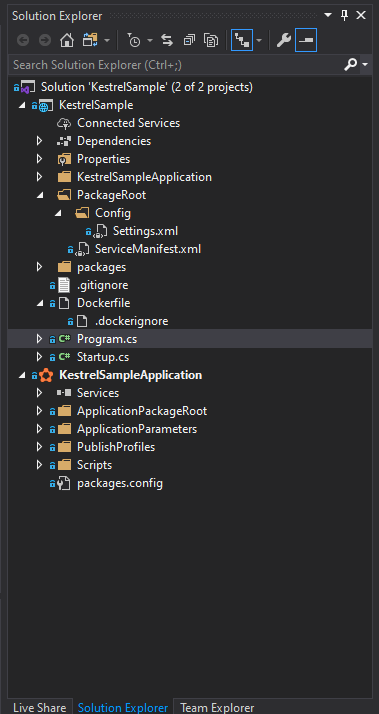

# Example ASP.NET Core Kestrel Https Windows Container

## Outline

>[Requirements](#Requirements)  
>[Steps](#Steps)  
>>[Verification](#Verification)  
>>[Setup repository](#Setup-repository)  
>>[Convert sample ASP.NET Core Kestrel application to Service Fabric container application](#Convert-sample-ASP.NET-Core-Kestrel-application-to-Service-Fabric-container-application)  
>>[Test Service Fabric container application conversion](#Test-Service-Fabric-container-application-conversion)  
>>[Use certificate file in service fabric container](#Use-certificate-file-in-service-fabric-container)  
>
>[Reference](#Reference)

## Overview  

The following provides information on how to create an ASP.NET Core Kestrel Https for a Windows container.
This assumes service fabric cluster, azure container registry, and an application certificate are already configured and available.
For this example a build machine with Windows version 2004 (20H1 / May 2020 update) and nodes with Image Sku 'datacenter-core-2004-with-containers-smalldisk' will be used.

> ### :exclamation:NOTE: If service fabric is being used to stage the application certificate in the container, the certificate has to be installed in the nodes local machine certificate store *and* has to be marked as exportable. There are currently no builtin automated methods to perform this action.  

> ### :exclamation:NOTE: It is critical to have an Azure Windows SKU that supports containers and is compatible with the .NET Core version being deployed. see [Windows Server container OS and Host OS compatibility](#https://docs.microsoft.com/en-us/azure/service-fabric/service-fabric-get-started-containers#windows-server-container-os-and-host-os-compatibility) and [Virtual Machine Images](https://docs.microsoft.com/en-us/rest/api/compute/virtualmachineimages/listskus) to get current SKU list for given location.

## Requirements

- deployed service fabric cluster supporting containers and .net core
- azure container registry
- application certificate that is not the same as the cluster / client certificate and is already imported into the nodes localmachine certificate store
- build machine with docker set to windows, visual studio, and service fabric sdk installed that is compatible with service fabric cluster node OS version
- Example base ASP.NET Core Kestrel code.

## Steps

### **Verification**  

1. Verify Service Fabric version and sdk versions are current
1. Verify Service Fabric cluster node OS version is compatible with ASP.NET core version being deployed  
1. Verify Build machine OS version is compatible with node OS version  

### **Setup repository**  

1. Create new repository folder on build machine. ex: aspNetCoreKestrelHttps
1. Copy source files from [Kestrel Sample Code](https://github.com/dotnet/AspNetCore.Docs/tree/master/aspnetcore/fundamentals/servers/kestrel/samples) into new repository folder on build machine. Both 2.x and 3. are available. For this example. .NET 3.x will be used.  
    - KestrelSample.csproj
    - Program.cs
    - Startup.cs

    

1. Open 'KestrelSample.csproj' in Visual Studio as administrator  
1. Save new solution 'KestrelSample.sln' as it is needed before converting to Service Fabric container  

    

1. Execute the KestrelSample project to verify functionality  

    

1. Optionally initialize github for repository folder
    - git init
    - git add --all
    - git commit -a -m 'init'

### **Convert sample ASP.NET Core Kestrel application to Service Fabric container application**  

1. In Visual Studio, right click the 'KestrelSample' web project, select 'Add', 'Container Orchestrator Support...'

    

1. Select 'Service Fabric' in dropdown

    

1. After Service Fabric Container Orchestration has been added, the solution should look similar to the following:

    

1. Build the KestrelSample project to verify functionality  

1. Optionally commit changes
    - git add --all
    - git commit -a -m 'sf container'

---

### **Test Service Fabric container application conversion**  

With the example project converted to a service fabric container application, deploy the application to cluster

  **NOTE:** It may be necessary to configure the connection parameters and container registry information if this has not been populated previously. See [Prepare your development environment on Windows](https://docs.microsoft.com/en-us/azure/service-fabric/service-fabric-get-started) and [Publish the application to the cluster](https://docs.microsoft.com/en-us/azure/service-fabric/service-fabric-tutorial-deploy-app-to-party-cluster#publish-the-application-to-the-cluster) for additional information.  

1. Right click the new Service Fabric project 'KestrelSampleApplication' to publish container application to cluster.

      

      

1. In Service Fabric Explorer (SFX), verify web server started in 'CONTAINER LOGS'

      

---

### **Use certificate file in service fabric container**  

Detailed information for importing a certificate into a service fabric container is located here: [Import a certificate file into a container running on Service Fabric](https://docs.microsoft.com/en-us/azure/service-fabric/service-fabric-securing-containers)  

**NOTE:** As mentioned above, for this process, **an exportable** certificate located in the nodes 'LocalMachine' certificate store is required before deploying application. See powershell example in [Reference](#Reference) section for an example powershell command from within an RDP session with drive mapping.  
**NOTE:** 'ContainerAdministrator' is required to access certificate in container. By default, 'ContainerUser' credentials are used. Steps below modify 'Dockerfile' to use 'ContainerAdministrator'.

1. Modify http to use port 5000 and add https '\<Endpoint>' to 'ServiceManifest.xml' '\<Endpoints>' element to use port 5001.  

    ```xml
    <Endpoint Protocol="http" Name="KestrelSampleTypeEndpoint" Type="Input" Port="5000" />
    <Endpoint Protocol="https" Name="KestrelSampleHttpsTypeEndpoint" Type="Input" Port="5001" />
    ```

1. Modify http to use port 80 and add '\<Portbinding>' and '\<CertificateRef>' to 'ApplicationManifest.xml' '\<ContainerHostPolices>' element.  

    ```xml
    <PortBinding ContainerPort="80" EndpointRef="KestrelSampleTypeEndpoint" />
    <PortBinding ContainerPort="443" EndpointRef="KestrelSampleHttpsTypeEndpoint" />
    <CertificateRef X509FindValue="[KestrelSample_Certificate_Thumbprint1]" Name="MyCert1" />
    ```

1. Add '\<Parameter>' to 'ApplicationManifest.xml' '\<Parameters>' element for container certificate thumbprint.  

    ```xml
    <Parameter Name="KestrelSample_Certificate_Thumbprint1" DefaultValue="" />
    ```

1. Add '\<Parameter>' to 'ApplicationParameters\Cloud.xml' '\<Parameters>' element for container certificate thumbprint. Replace '{{container certificate thumbprint goes here}}' with the thumbprint of the certificate being imported into container.  

    ```xml
    <Parameter Name="KestrelSample_Certificate_Thumbprint1" Value="{{container certificate thumbprint goes here}}" />
    ```

1. Add 'USER ContainerAdministrator' to 'DockerFile' to allow container to start with 'ContainerAdministrator' credentials. Administrator credentials are needed for certificate management.  

    ```docker
    USER ContainerAdministrator
    ```

1. From 'Program.cs' keep **only** the 'Main' and 'CreateContainerHost' functions from 'TCPSocket' directive.  

    

1. Modify function 'CreateHostBuilder' 'serverOptions.Listen' to listen on 'Any' address for ports 80 and 443. These ports must match the 'ContainerPort' element in 'ApplicationManifest.xml'.  

1. Modify function 'CreateHostBuilder' to read the pfx and password environment variables populated by service fabric with certificate information. Modified 'Program.cs' example code:

    **NOTE:** The environment variables being enumerated in code below **are** project name specific based off of 'Name' in 'ServiceManifest.xml'. For this project example 'Certificates_KestrelSamplePkg_Code_MyCert1_PFX' and 'Certificates_KestrelSamplePkg_Code_MyCert1_PFX' are the variable names.  

    ```c#
    using System;
    using System.Net;
    using Microsoft.AspNetCore.Hosting;
    using Microsoft.Extensions.Hosting;
    using System.IO;
    using System.Text;

    namespace KestrelSample
    {
        public class Program
        {
            public static void Main(string[] args)
            {
                CreateHostBuilder(args).Build().Run();
            }

            public static IHostBuilder CreateHostBuilder(string[] args) =>
                Host.CreateDefaultBuilder(args)
                    .ConfigureWebHostDefaults(webBuilder =>
                    {
                        webBuilder.ConfigureKestrel(serverOptions =>
                        {
                            serverOptions.Listen(IPAddress.Any, 80);
                            serverOptions.Listen(IPAddress.Any, 443,
                                listenOptions =>
                                {
                                    listenOptions.UseHttps(Environment.GetEnvironmentVariable("Certificates_KestrelSamplePkg_Code_MyCert1_PFX"),
                                        File.ReadAllText(Environment.GetEnvironmentVariable("Certificates_KestrelSamplePkg_Code_MyCert1_Password"), Encoding.Unicode));
                                });
                        })
                        .UseStartup<Startup>();
                    });
        }
    }
    ```

1. Build the KestrelSample project to verify functionality  

1. Optionally commit changes
    - git add --all
    - git commit -a -m 'sf container https'

---

### **Test Service Fabric container application with certificate**  

1. Publish the KestrelSampleApplication to cluster to verify functionality of certificate. See powershell commands in [Reference](#Reference) that can be run from node for testing / troubleshooting.

    

---

## Reference

Windows Server container OS and Host OS compatibility: https://docs.microsoft.com/en-us/azure/service-fabric/service-fabric-get-started-containers#windows-server-container-os-and-host-os-compatibility  

ASP.NET Core Kestrel example source code: https://docs.microsoft.com/en-us/aspnet/core/fundamentals/servers/kestrel?view=aspnetcore-3.1  

Kestrel web server implementation in ASP.NET Core
Securing Service Fabric containers: 
https://docs.microsoft.com/en-us/azure/service-fabric/service-fabric-securing-containers  

- Kestrel Sample Code: https://github.com/dotnet/AspNetCore.Docs/tree/master/aspnetcore/fundamentals/servers/kestrel/samples

Deploy a .NET app in a Windows container: https://github.com/dotnet/AspNetCore.Docs/tree/master/aspnetcore/fundamentals/servers/kestrel/samples  

Virtual Machine Images - List Skus: https://docs.microsoft.com/en-us/rest/api/compute/virtualmachineimages/listskus

### **powershell command from node in RDP session to import pfx before deploying container application**  

```text
PS C:\Users\cloudadmin> Import-PfxCertificate -Exportable -CertStoreLocation Cert:\LocalMachine\My -filepath \\tsclient\c\temp\my.pfx


   PSParentPath: Microsoft.PowerShell.Security\Certificate::LocalMachine\My

Thumbprint                                Subject
----------                                -------
xxxxxxxxxxxxxxxxxxxxxxxxxxxxxxxxxxxxxxxx  CN=*.jagilber.com

```

### **powershell container commands from node verifying container web server response:**

```text
PS C:\Users\cloudadmin> docker container ls
CONTAINER ID        IMAGE                                              COMMAND                  CREATED             STATUS              PORTS                                         NAMES
35eeaa973893        sfjagilbercontainer.azurecr.io/kestrelsample:dev   "dotnet KestrelSampl…"   9 minutes ago       Up 9 minutes        0.0.0.0:5000->80/tcp, 0.0.0.0:5001->443/tcp   sf-14-e88711cd-38df-4bd3-9151-5a687d3d79ac_845f418c-fbde-4978-8059-0789ba43afd8

PS C:\Users\cloudadmin> docker logs 35eeaa973893
warn: Microsoft.AspNetCore.Server.Kestrel[0]
      Overriding address(es) 'http://+:80'. Binding to endpoints defined in UseKestrel() instead.
info: Microsoft.Hosting.Lifetime[0]
      Now listening on: http://0.0.0.0:80
info: Microsoft.Hosting.Lifetime[0]
      Now listening on: https://0.0.0.0:443
info: Microsoft.Hosting.Lifetime[0]
      Application started. Press Ctrl+C to shut down.
info: Microsoft.Hosting.Lifetime[0]
      Hosting environment: Production
info: Microsoft.Hosting.Lifetime[0]
      Content root path: C:\app
info: Microsoft.AspNetCore.Hosting.Diagnostics[1]
      Request starting HTTP/1.1 GET http://127.0.0.1:5000/
info: Microsoft.AspNetCore.Hosting.Diagnostics[2]
      Request finished in 18.4307ms 200 text/html
info: Microsoft.AspNetCore.Hosting.Diagnostics[1]
      Request starting HTTP/1.1 GET http://127.0.0.1:5000/
info: Microsoft.AspNetCore.Hosting.Diagnostics[2]
      Request finished in 0.5418ms 200 text/html

PS C:\Users\cloudadmin> iwr http://127.0.0.1:5000 -UseBasicParsing
StatusCode        : 200
StatusDescription : OK
Content           : <!DOCTYPE html><html lang="en"><head><title></title></head><body><p>Hosted by
                    Kestrel</p><p>Listening on the following addresses: http://0.0.0.0:80,
                    https://0.0.0.0:443</p><p>Request URL: http://127.0...
RawContent        : HTTP/1.1 200 OK
                    Transfer-Encoding: chunked
                    Content-Type: text/html
                    Date: Thu, 04 Jun 2020 14:25:36 GMT
                    Server: Kestrel

                    <!DOCTYPE html><html lang="en"><head><title></title></head><body><p>Hosted...
Forms             :
Headers           : {[Transfer-Encoding, chunked], [Content-Type, text/html], [Date, Thu, 04 Jun 2020 14:25:36 GMT],
                    [Server, Kestrel]}
Images            : {}
InputFields       : {}
Links             : {}
ParsedHtml        :
RawContentLength  : 213

PS C:\Users\cloudadmin> [net.webrequest]::Create('https://127.0.0.1:5001').servicepoint.certificate

       Handle Issuer                                                             Subject
       ------ ------                                                             -------
2846684986112 CN=GeoTrust RSA CA 2018, OU=www.digicert.com, O=DigiCert Inc, C=US CN=*.jagilber.com

```  
