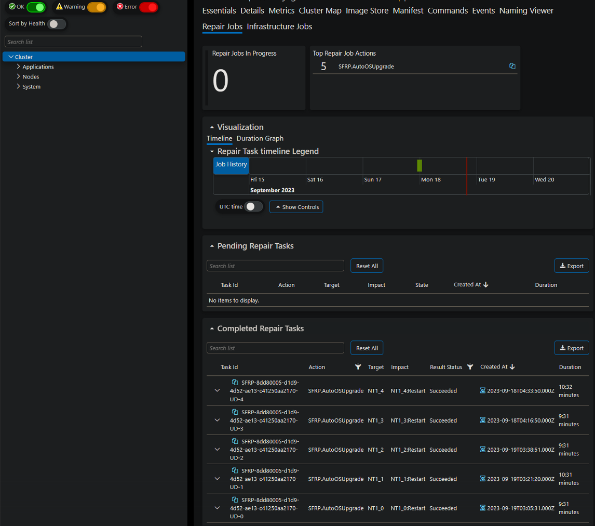

# How to Configure Service Fabric Managed Cluster Automatic OS Image Upgrade

This article describes the best practice of configuring Service Fabric Managed Cluster Automatic OS Image Upgrade for management of Windows OS hotfixes and security updates. [Automatic OS Image Upgrade](https://learn.microsoft.com/azure/service-fabric/how-to-patch-cluster-nodes-windows) has additional information including details about Patch Orchestration Application (POA) if unable to use Automatic OS Image Upgrade, however not all information applies to managed clusters. Failure to configure Automatic OS Image Upgrade or POA can result in Service Fabric cluster downtime due to default OS hotfix patching configuration which will randomly restart nodes without warning or coordination with Service Fabric Resource Provider.

Automatic OS Image Upgrade in Service Fabric Managed Clusters differs from Service Fabric Clusters and default VMSS behavior. Service Fabric Managed Clusters do not use the VMSS properties and PowerShell commands such as Get-AzVmss -OsUpgradeHistory and Get-AzVmssRollingUpgrade. Configuration has to be applied to the managed cluster and node type resources. Changes to the managed cluster resource and node type resource will trigger a repair task to upgrade the OS image. See [Manage OS Image Upgrade](#manage-os-image-upgrade) for additional information on managing OS image upgrade.

For unmanaged Service Fabric Clusters, use [How to Configure Service Fabric Cluster Automatic OS Image Upgrade](./How%20to%20Configure%20Service%20Fabric%20Cluster%20Automatic%20OS%20Image%20Upgrade.md)

## Configuring Automatic OS Image Upgrade for Service Fabric Managed Clusters

Configure the virtual machine scale set resource to use Automatic OS Image Upgrade. The following example shows how to configure Automatic OS Image Upgrade for node type 'nt0' using an ARM template or using Azure PowerShell.

### Configure Automatic OS Image Upgrade using ARM template

To enable automatic OS upgrades in a managed cluster using an ARM template, [Enable automatic OS image upgrades](https://learn.microsoft.com/azure/service-fabric/how-to-managed-cluster-modify-node-type#enable-automatic-os-image-upgrades) section contains detailed information including retry information. In 'managedclusters' resource, set 'enableAutoOSUpgrade' to 'true'. 'vmImageVersion' value is parameterized and defaults to 'latest' if generating a new template from Azure portal. In template parameters section or 'managedclusters/nodetypes' resource, ensure 'vmImageVersion' is set to 'latest'.

```diff
"apiVersion": "[variables('sfApiVersion')]",
"type": "Microsoft.ServiceFabric/managedclusters",
"name": "[parameters('clusterName')]",
"location": "[resourcegroup().location]",
"sku": {
    "name" : "[parameters('clusterSku')]"
},
"properties": {
    "dnsName": "[toLower(parameters('clusterName'))]",
    "adminUserName": "[parameters('adminUserName')]",
    "adminPassword": "[parameters('adminPassword')]",
    "allowRdpAccess": true,
    "clientConnectionPort": 19000,
-   "enableAutoOSUpgrade": false,
+   "enableAutoOSUpgrade": true,
    "httpGatewayConnectionPort": 19080,

```

```diff
"apiVersion": "[variables('sfApiVersion')]",
"type": "Microsoft.ServiceFabric/managedclusters/nodetypes",
"name": "[concat(parameters('clusterName'), '/', parameters('nodeTypeName'))]",
"location": "[resourcegroup().location]",
"dependsOn": [
    "[concat('Microsoft.ServiceFabric/managedclusters/', parameters('clusterName'))]"
],
"properties": {
    "isPrimary": true,
    "vmImagePublisher": "[parameters('vmImagePublisher')]",
    "vmImageOffer": "[parameters('vmImageOffer')]",
    "vmImageSku": "[parameters('vmImageSku')]",
-    "vmImageVersion": "20348.1726.230505",
+    "vmImageVersion": "latest",
```

### Configure Automatic OS Image Upgrade using Azure PowerShell

Use [Set-AzServiceFabricManagedCluster](https://learn.microsoft.com/powershell/module/az.servicefabric/set-azservicefabricmanagedcluster) cmdlet to enable Automatic OS Image Upgrade.

```powershell
$resourceGroupName = '<resource group name>'
$clusterName = '<cluster name>'
Import-Module -Name Az.ServiceFabric

$managedCluster = Get-AzServiceFabricManagedCluster -ResourceGroupName $resourceGroupName -Name $clusterName
$mangedCluster
$managedCluster.EnableAutoOSUpgrade = $true
Set-AzServiceFabricManagedCluster -InputObject $managedCluster -Verbose
```

Use [Set-AzServiceFabricManagedNodeType](https://learn.microsoft.com/powershell/module/az.servicefabric/set-azservicefabricmanagednodetype) cmdlet to configure 'vmImageVersion' to 'latest'.

```powershell
$resourceGroupName = '<resource group name>'
$clusterName = '<cluster name>'
Import-Module -Name Az.ServiceFabric

$managedCluster = Get-AzServiceFabricManagedNodeType -ResourceGroupName $resourceGroupName -ClusterName $clusterName
$mangedCluster
$managedCluster.VmImageVersion = 'latest'
Set-AzServiceFabricManagedNodeType -InputObject $managedCluster -Verbose
```

## Manage OS Image Upgrade

There is no management necessary for Automatic OS Image Upgrade for most configurations. For specific settings or troubleshooting, [Azure Virtual Machine Scale Set Automatic OS Image Upgrades](https://learn.microsoft.com/azure/virtual-machine-scale-sets/virtual-machine-scale-sets-automatic-upgrade) contains configuration details and management of Automatic OS Image Upgrade that is summarized below.

If more control is required for image releases than what is available through these configuration settings, Automatic OS Image Upgrade supports the use of custom images. Using custom images from a shared compute gallery provides additional configuration such as image expiration dates and 'latest' version. See [Tutorial: Create and use a custom image for Virtual Machine Scale Sets with Azure PowerShell](https://learn.microsoft.com/azure/virtual-machine-scale-sets/tutorial-use-custom-image-powershell) for this process.

### Automatic OS Upgrade Process

From [Azure Virtual Machine Scale Set Automatic OS Image Upgrades](https://learn.microsoft.com/azure/virtual-machine-scale-sets/virtual-machine-scale-sets-automatic-upgrade), below is the default process Automatic OS Image Upgrade uses for scale sets.

The region of a scale set becomes eligible to get image upgrades either through the availability-first process for platform images or replicating new custom image versions for Share Image Gallery. The image upgrade is then applied to an individual scale set in a batched manner as follows:

1. Before you begin the upgrade process, the orchestrator will ensure that no more than 20% of instances in the entire scale set are unhealthy (for any reason).
1. The upgrade orchestrator identifies the batch of VM instances to upgrade, with any one batch having a maximum of 20% of the total instance count, subject to a minimum batch size of one virtual machine. There is no minimum scale set size requirement and scale sets with 5 or fewer instances will have 1 VM per upgrade batch (minimum batch size).
1. The OS disk of every VM in the selected upgrade batch is replaced with a new OS disk created from the latest image. All specified extensions and configurations in the scale set model are applied to the upgraded instance.
1. The upgrade orchestrator also tracks the percentage of instances that become unhealthy post an upgrade. The upgrade will stop if more than 20% of upgraded instances become unhealthy during the upgrade process.
1. The above process continues until all instances in the scale set have been upgraded.

### Scheduling OS Image Upgrade with Maintenance Control

For Azure Service Fabric Managed Clusters support for Maintenance Control, see [MaintenanceControl](https://learn.microsoft.com/azure/service-fabric/how-to-managed-cluster-maintenance-control) for configuration and known issues.

> **Note**
> Maintenance Control requires a schedule with minimum settings of daily schedule with at least a 5 hour window. Updates not completed in the provided window will resume during next window.

### Enumerate current OS image SKU's available in Azure

New images are applied based on policy settings. [enumerate-vmss-image-sku.ps1](../Scripts/enumerate-vmss-image-sku.ps1) enumerates current OS image SKU's available in Azure to verify if node type is running the latest OS image version. Below example has expected output.

```powershell
>.\enumerate-vmss-image-sku.ps1 -resourceGroupName $resourceGroupName
vmssHistory not found
current running image on node type: 

Publisher               : MicrosoftWindowsServer
Offer                   : WindowsServer
Sku                     : 2022-Datacenter
Version                 : latest
ExactVersion            : 
SharedGalleryImageId    : 
CommunityGalleryImageId : 
Id                      : 

running version is 'latest'
Get-AzVmImage -Location eastus -PublisherName MicrosoftWindowsServer -offer WindowsServer -sku 2022-Datacenter
available versions: 
20348.825.220704
20348.887.220806
20348.1006.220908
20348.1129.221007
20348.1131.221014
20348.1249.221105
20348.1366.221207
20348.1487.230106
20348.1547.230207
20348.1607.230310
20348.1668.230404
20348.1726.230505
20348.1787.230607
20348.1787.230621
20348.1850.230707
20348.1906.230803
20348.1970.230905
published latest version: 20348.1970.230905 running version: 'latest'
```

### Review OS image upgrade status

Use [Get-AzVmssRollingUpgrade](https://learn.microsoft.com/powershell/module/az.compute/get-azvmssrollingupgrade) cmdlet to enumerate current OS image upgrade status. [Example Get-AzVmssRollingUpgrade](#example-Get-AzVmssRollingUpgrade--resourcegroupname-resourcegroupname--name-nodetypename--verbose) below has expected output.

```powershell
$resourceGroupName = '<resource group name>'
$nodeTypeName = '<node type name>'
Import-Module -Name Az.Compute

Get-AzVmssRollingUpgrade -ResourceGroupName $resourceGroupName `
    -Name $nodeTypeName `
    -Verbose
```

### Review OS image upgrade history

Use [Get-AzVmss](https://learn.microsoft.com/powershell/module/az.compute/get-azvmss) cmdlet to enumerate OS image upgrade history. [Example Get-AzVmss](#example-get-azvmss--resourcegroupname-resourcegroupname--name-nodetypename--osupgradehistory) below has expected output.

```powershell
$resourceGroupName = '<resource group name>'
$nodeTypeName = '<node type name>'
Import-Module -Name Az.Compute

Get-AzVmss -ResourceGroupName $resourceGroupName `
    -Name $nodeTypeName `
    -OSUpgradeHistory `
    -Verbose
```

### Configure Rolling Upgrade Policy

Additional configuration for Automatic OS Upgrade can be configured using [Set-AzVmssRollingUpgradePolicy](https://learn.microsoft.com/powershell/module/az.compute/set-azvmssrollingupgradepolicy?view=azps-10.1.0) cmdlet. The following example shows how to configure rolling upgrade policy for node type 'nt0' using an ARM template or using Azure PowerShell.

```diff
"properties": {
    "singlePlacementGroup": true,
    "upgradePolicy": {
        "mode": "Automatic",
+       "rollingUpgradePolicy": {
+           "maxBatchInstancePercent": 20,
+           "maxUnhealthyInstancePercent": 20,
+           "maxUnhealthyUpgradedInstancePercent": 20,
+           "pauseTimeBetweenBatches": "PT0S"
+     },
      "automaticOSUpgradePolicy": {
        "enableAutomaticOSUpgrade": true,
-       "useRollingUpgradePolicy": false
+       "useRollingUpgradePolicy": true
      }
    },
```

```powershell
$resourceGroupName = '<resource group name>'
$nodeTypeName = '<node type name>'
$pauseTimeSeconds = 'PT0S' # ISO 8601 duration format
$createNewInstancesInsteadOfUpgrading = $false
Import-Module -Name Az.Compute

$vmss = Get-AzVmss -ResourceGroupName $resourceGroupName -Name $nodeTypeName

Set-AzVmssRollingUpgradePolicy -VirtualMachineScaleSet $vmss `
    -MaxBatchInstancePercent 20 `
    -MaxUnhealthyInstancePercent 20 `
    -MaxUnhealthyUpgradedInstancePercent 20 `
    -PauseTimeBetweenBatches $pauseTimeSeconds `
    -PrioritizeUnhealthyInstances $true `
    -EnableCrossZoneUpgrade $true `
    -MaxSurge $createNewInstancesInsteadOfUpgrading `
    -Verbose
```

### Manual Upgrade OS image

Use [Start-AzVmssRollingOSUpgrade](https://learn.microsoft.com/powershell/module/az.compute/start-azvmssrollingosupgrade) cmdlet to start OS image upgrade if one is available. Refer to [Enumerate current OS image SKU's available in Azure](#enumerate-current-os-image-skus-available-in-azure) to see if there is a newer OS image version available.

```powershell
$resourceGroupName = '<resource group name>'
$nodeTypeName = '<node type name>'
Import-Module -Name Az.Compute

Start-AzVmssRollingOSUpgrade -ResourceGroupName $resourceGroupName `
    -VMScaleSetName $nodeTypeName `
    -Verbose
```

### Stop OS image upgrade

Use [Stop-AzVmssRollingUpgrade](https://learn.microsoft.com/powershell/module/az.compute/stop-azvmssrollingupgrade) cmdlet to stop OS image upgrade if one is in progress.

```powershell
$resourceGroupName = '<resource group name>'
$nodeTypeName = '<node type name>'
Import-Module -Name Az.Compute

Stop-AzVmssRollingUpgrade -ResourceGroupName $resourceGroupName `
    -VMScaleSetName $nodeTypeName `
    -Force
```

### Disable OS image upgrade

Use [Set-AzServiceFabricManagedCluster](https://learn.microsoft.com/powershell/module/az.servicefabric/set-azservicefabricmanagedcluster) cmdlet to disable Automatic OS Image Upgrade.

```powershell
$resourceGroupName = '<resource group name>'
$clusterName = '<cluster name>'
Import-Module -Name Az.ServiceFabric

$managedCluster = Get-AzServiceFabricManagedCluster -ResourceGroupName $resourceGroupName -Name $clusterName
$mangedCluster
$managedCluster.EnableAutoOSUpgrade = $false
Set-AzServiceFabricManagedCluster -InputObject $managedCluster -Verbose
```

### Rollback OS image upgrade

Use [Set-AzServiceFabricManagedNodeType](https://learn.microsoft.com/powershell/module/az.servicefabric/set-azservicefabricmanagednodetype) cmdlet to configure 'vmImageVersion' to an available version to rollback to from Azure gallery. As soon as the PowerShell commands are executed, the rollback will start.

```powershell
$resourceGroupName = '<resource group name>'
$clusterName = '<cluster name>'
$imageVersion = '<image version>'
Import-Module -Name Az.ServiceFabric

$managedCluster = Get-AzServiceFabricManagedNodeType -ResourceGroupName $resourceGroupName -ClusterName $clusterName
$mangedCluster
$managedCluster.VmImageVersion = $imageVersion
Set-AzServiceFabricManagedNodeType -InputObject $managedCluster -Verbose
```

### Monitoring OS image upgrade

#### Using Service Fabric Explorer (SFX) to monitor OS image upgrade

Service Fabric Managed Cluster OS upgrades are managed by Service Fabric Resource Provider (SFRP) and applied as repair jobs/tasks, with an 'Action' of 'SFRP.AutoOsUpgrade'. The tasks are viewable from 'Cluster' view 'Repair Jobs' tab in Service Fabric Explorer (SFX).

Repair Jobs



Repair Task

```json
{
    "Scope": {
        "Kind": "Cluster"
    },
    "TaskId": "SFRP-cae60004-a106-47d8-8889-b0c9bc06c194-UD-0",
    "Version": "133395258565988821",
    "Description": "",
    "State": "Completed",
    "Flags": 0,
    "Action": "SFRP.AutoOSUpgrade",
    "Target": {
        "Kind": "Node",
        "NodeNames": [
            "nt1_0"
        ]
    },
    "Executor": "SFRP",
    "ExecutorData": "",
    "Impact": {
        "Kind": "Node",
        "NodeImpactList": [
            {
                "NodeName": "nt1_0",
                "ImpactLevel": "Restart"
            }
        ]
    },
    "ResultStatus": "Succeeded",
    "ResultCode": 0,
    "ResultDetails": "",
    "History": {
        "CreatedUtcTimestamp": "2023-09-18T15:50:56.598Z",
        "ClaimedUtcTimestamp": "2023-09-18T15:50:56.598Z",
        "PreparingUtcTimestamp": "2023-09-18T15:50:56.598Z",
        "ApprovedUtcTimestamp": "2023-09-18T15:51:41.941Z",
        "ExecutingUtcTimestamp": "2023-09-18T15:51:56.692Z",
        "RestoringUtcTimestamp": "2023-09-18T16:01:28.218Z",
        "CompletedUtcTimestamp": "2023-09-18T16:01:28.468Z",
        "PreparingHealthCheckStartUtcTimestamp": "2023-09-18T15:50:56.693Z",
        "PreparingHealthCheckEndUtcTimestamp": "2023-09-18T15:50:56.740Z",
        "RestoringHealthCheckStartUtcTimestamp": "2023-09-18T16:01:28.343Z",
        "RestoringHealthCheckEndUtcTimestamp": "2023-09-18T16:01:28.406Z"
    },
    "PreparingHealthCheckState": "Skipped",
    "RestoringHealthCheckState": "Skipped",
    "PerformPreparingHealthCheck": false,
    "PerformRestoringHealthCheck": false
}
```

#### Using PowerShell with Service Fabric SDK to monitor OS image upgrade

PowerShell can also be used to view repair tasks. From a machine that has Service Fabric SDK installed or from a Service Fabric node, use [Get-ServiceFabricRepairTask](https://learn.microsoft.com/powershell/module/servicefabric/get-servicefabricrepairtask) cmdlet to view repair tasks. There may be many tasks returned. Using -State or -TaskId can be used to filter results.

```powershell
Import-Module servicefabric
Connect-ServiceFabricCluster -ConnectionEndpoint localhost:19000
Get-ServiceFabricRepairTask
```

Example:

```json
>Get-ServiceFabricRepairTask | ConvertTo-Json
  {
    "Scope": "Cluster",
    "TaskId": "SFRP-cae60004-a106-47d8-8889-b0c9bc06c194-UD-0",
    "Version": 133395258565988821,
    "Description": "",
    "State": "Completed",
    "Flags": "None",
    "Action": "SFRP.AutoOSUpgrade",
    "Target": "",
    "Executor": "SFRP",
    "ExecutorData": "",
    "Impact": "",
    "ResultStatus": "Succeeded",
    "ResultCode": 0,
    "ResultDetails": "Job step completed with status Executed",
    "CreatedTimestamp": "2023-09-18T15:50:56.598Z",
    "ClaimedTimestamp": "2023-09-18T15:50:56.598Z",
    "PreparingTimestamp": "2023-09-18T15:50:56.598Z",
    "ApprovedTimestamp": "2023-09-18T15:51:41.941Z",
    "ExecutingTimestamp": "2023-09-18T15:51:56.692Z",
    "RestoringTimestamp": "2023-09-18T16:01:28.218Z",
    "CompletedTimestamp": "2023-09-18T16:01:28.468Z",
    "PreparingHealthCheckStartUtcTimestamp": "2023-09-18T15:50:56.693Z",
    "PreparingHealthCheckEndUtcTimestamp": "2023-09-18T15:50:56.740Z",
    "RestoringHealthCheckStartUtcTimestamp": "2023-09-18T16:01:28.343Z",
    "RestoringHealthCheckEndUtcTimestamp": "2023-09-18T16:01:28.406Z",
    "PreparingHealthCheckState": "Skipped",
    "RestoringHealthCheckState": "Skipped",
    "PerformPreparingHealthCheck": false,
    "PerformRestoringHealthCheck": false
  }
```

## Examples

### Example Get-AzVmssRollingUpgrade -ResourceGroupName $resourceGroupName -Name $nodeTypeName -Verbose

> **Note**
> RunningStatus information is last time a rolling upgrade was started but not necessarily last time an image was upgraded. Use [Example Get-AzVmss](#example-get-azvmss--resourcegroupname-resourcegroupname--name-nodetypename--osupgradehistory) to get last time an image was upgraded.

```powershell
Get-AzVmssRollingUpgrade -ResourceGroupName $resourceGroupName -Name $nodeTypeName | ConvertTo-Json
{
  "Policy": {
    "MaxBatchInstancePercent": 20,
    "MaxUnhealthyInstancePercent": 20,
    "MaxUnhealthyUpgradedInstancePercent": 20,
    "PauseTimeBetweenBatches": "PT0S",
    "EnableCrossZoneUpgrade": null,
    "PrioritizeUnhealthyInstances": null,
    "RollbackFailedInstancesOnPolicyBreach": false,
    "MaxSurge": false
  },
  "RunningStatus": {
    "Code": "Completed",
    "StartTime": "2023-06-30T19:46:17.2677469Z",
    "LastAction": "Start",
    "LastActionTime": "2023-06-30T19:46:17.2208724Z"
  },
  "Progress": {
    "SuccessfulInstanceCount": 0,
    "FailedInstanceCount": 0,
    "InProgressInstanceCount": 0,
    "PendingInstanceCount": 0
  },
  "Error": null,
  "Id": null,
  "Name": null,
  "Type": "Microsoft.Compute/virtualMachineScaleSets/rollingUpgrades",
  "Location": "eastus",
  "Tags": {}
}
```

### Example Get-AzVmss -ResourceGroupName $resourceGroupName -Name $nodeTypeName -OSUpgradeHistory

> **Note**
> An empty result can indicate that node type is not configured for Automatic OS Image Upgrade or an upgrade has not taken place yet.

```powershell
Get-AzVmss -ResourceGroupName $resourceGroupName -Name $nodeTypeName -OSUpgradeHistory | ConvertTo-Json
{
  "Properties": {
    "RunningStatus": {
      "Code": "Completed",
      "StartTime": "2023-06-30T19:46:17.2677469Z",
      "EndTime": null
    },
    "Progress": {
      "SuccessfulInstanceCount": 0,
      "FailedInstanceCount": 0,
      "InProgressInstanceCount": 0,
      "PendingInstanceCount": 0
    },
    "Error": null,
    "StartedBy": "Platform",
    "TargetImageReference": {
      "Publisher": "MicrosoftWindowsServer",
      "Offer": "WindowsServer",
      "Sku": "2022-Datacenter",
      "Version": "20348.1787.230621",
      "ExactVersion": null,
      "SharedGalleryImageId": null,
      "CommunityGalleryImageId": null,
      "Id": null
    },
    "RollbackInfo": {
      "SuccessfullyRolledbackInstanceCount": 0,
      "FailedRolledbackInstanceCount": 0,
      "RollbackError": null
    }
  },
  "Type": "Microsoft.Compute/virtualMachineScaleSets/rollingUpgrades",
  "Location": "eastus"
}
```

### Example Start-AzVmssRollingOSUpgrade -ResourceGroupName $resourceGroupName -VMScaleSetName $nodeTypeName -Verbose

> **Note**
> A result similar to below will always be returned regardless of whether there is a newer OS image version available or not.

```powershell
Start-AzVmssRollingOsUpgrade -ResourceGroupName $resourceGroupName -VMScaleSetName $nodeTypeName | ConvertTo-Json
{
  "Name": "6dd0212d-ff35-4dce-b77e-999a57c1534e",
  "StartTime": "2023-07-11T19:34:57.7803755-04:00",
  "EndTime": "2023-07-11T19:35:28.2994743-04:00",
  "Status": "Succeeded",
  "Error": null
}
```
