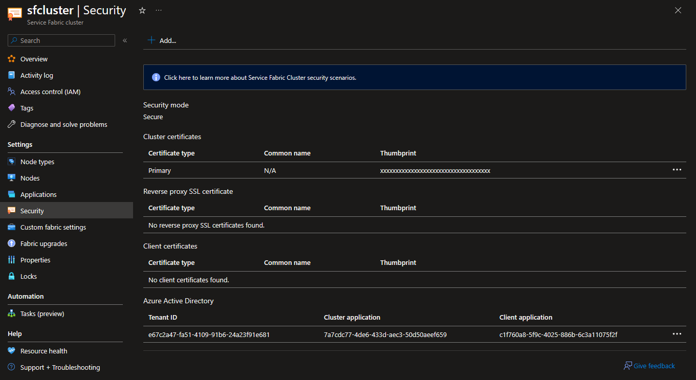
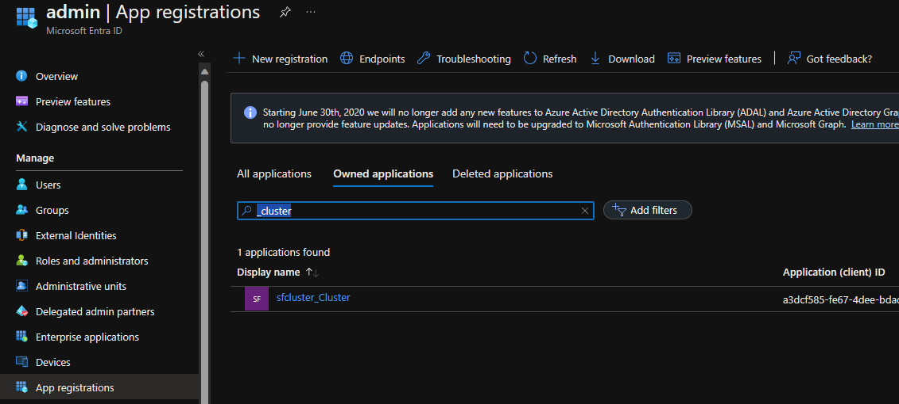
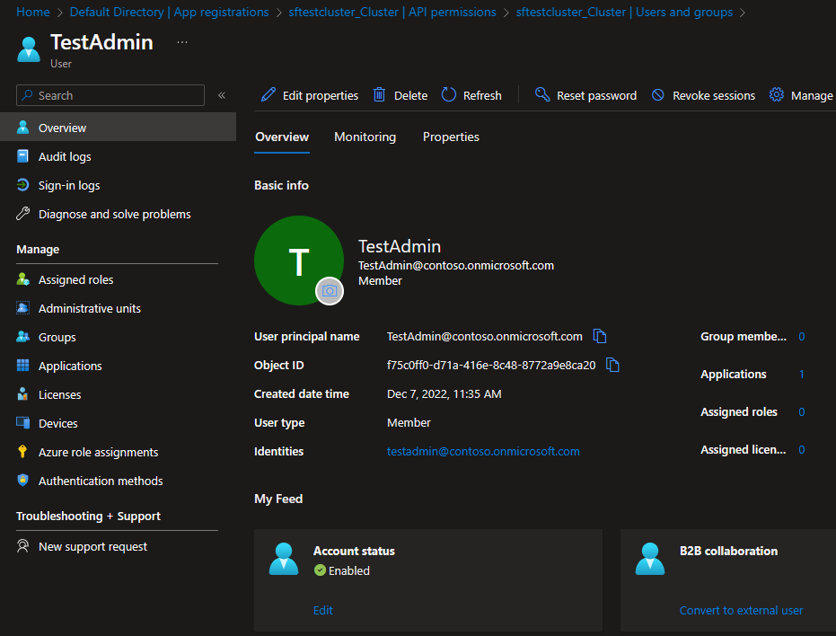
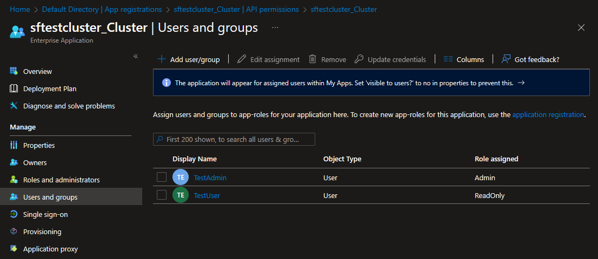
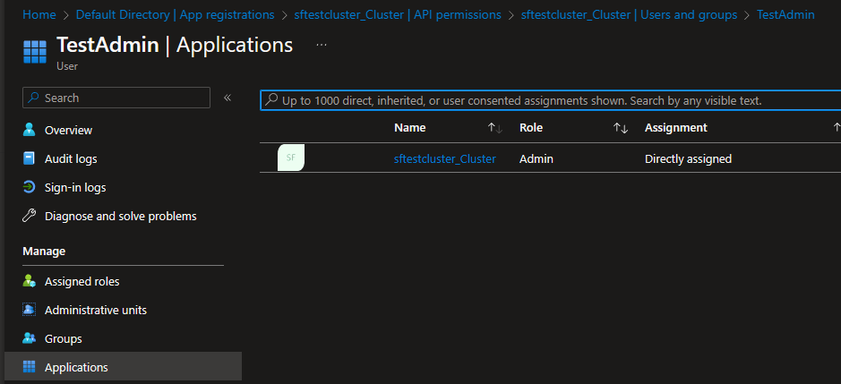
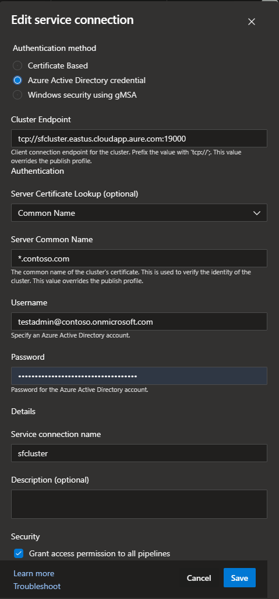
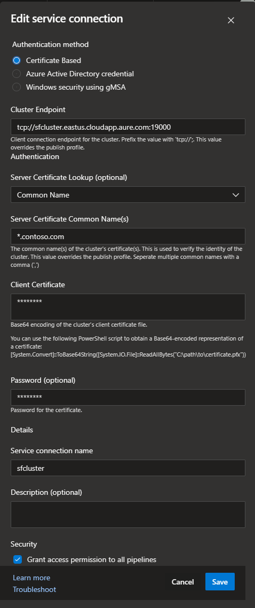
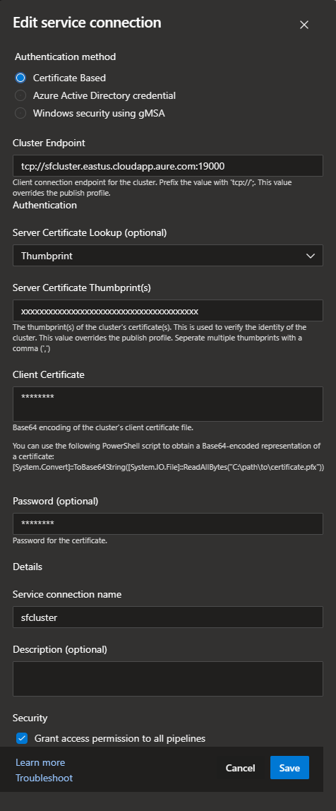

# How to configure Azure Devops for a Service Fabric Cluster

The steps below describe how to configure and Azure Devops (ADO) for Service Fabric clusters. For Service Fabric Managed clusters, refer to this article [How to configure Azure Devops Service Fabric Managed Cluster connection](./How%20to%20configure%20Azure%20Devops%20for%20Service%20Fabric%20Managed%20Cluster.md).  

There are multiple ways to configure Azure Devops for connectivity to Service Fabric clusters. This article will cover the recommended approach when using a Service Fabric service connection. Service Fabric cluster and application deployment best practice is to use ARM templates. For ARM template deployments in ADO, see [How to configure Azure Devops for Service Fabric ARM deployments](./How%20to%20configure%20Azure%20Devops%20for%20Service%20Fabric%20ARM%20deployments.md).

## Azure Devops Service Connection Options

For Service Fabric service connection configurations, the recommended approach is to use Azure Active Directory (AAD) for authentication and certificate common name for server certificate lookup. This approach is maintenance free and provides the best security. This is the only configuration that supports parallel deployments per agent host. See [Agent limitations](#agent-limitations).

## Agent limitations

Any Service Fabric service connection configuration that requires the 'Client Certificate' in base64 encoded format is not supported for parallel deployments per agent host. For security reasons, at start of deployment, the certificate is installed onto the agent host. At end of deployment, the certificate is removed. Any other deployments that are running on the same agent host using this certificate may fail.

Mitigation options:

- Use a Service Fabric service connection with AAD as described [above](#azure-devops-service-connection-with-azure-active-directory-aad--entra).

- Use one agent host per parallel deployment.

- Use ARM templates for cluster or application deployments.

<!-- todo insert base64 pic -->

<!-- todo review all below -->

## Requirements

- Secure Service Fabric Cluster with AAD enabled. See [Service Fabric cluster security scenarios](https://docs.microsoft.com/azure/service-fabric/service-fabric-cluster-security#client-to-node-azure-active-directory-security-on-azure).

- AAD enabled for Service Fabric Cluster. [Set up Azure Active Directory for client authentication in the Azure portal](https://learn.microsoft.com/azure/service-fabric/service-fabric-cluster-creation-setup-azure-ad-via-portal) for detailed steps on how to enable AAD for cluster or [Set up Azure Active Directory for client authentication](https://learn.microsoft.com/azure/service-fabric/service-fabric-cluster-creation-setup-aad) for an automated process.

  

- AAD user and password configured to use the AAD 'Cluster' App Registration 'Admin' Role for administrative access to cluster. The 'Cluster' App Registration 'Admin' Role allows read and write access to cluster which is necessary for deployments. See [AAD User Configuration](#aad-user-configuration) for detailed steps.

- ADO agent configured with the latest version of the [Service Fabric SDK](https://learn.microsoft.com/azure/service-fabric/service-fabric-get-started#install-the-sdk-and-tools). This is required for the Service Fabric tasks to work correctly.

## Recommended

- Certificate Authority (CA) certificate for cluster. This is a best practice and is required for any certificate based authentication using common name.

## AAD User Configuration

The AAD user must be added to the 'Cluster' App Registration in the 'Admin' role. This is required for deployments to cluster. The 'Cluster' App Registration is created when AAD is enabled for the cluster. See [Set up Azure Active Directory for client authentication in the Azure portal](https://learn.microsoft.com/azure/service-fabric/service-fabric-cluster-creation-setup-azure-ad-via-portal) for detailed steps on how to enable AAD for cluster or [Set up Azure Active Directory for client authentication](https://learn.microsoft.com/azure/service-fabric/service-fabric-cluster-creation-setup-aad) for an automated process.

### AAD User Configuration Role configuration

- In Azure portal, navigate to the 'Cluster' [App Registrations](https://portal.azure.com/?feature.msaljs=true#view/Microsoft_AAD_IAM/ActiveDirectoryMenuBlade/~/RegisteredApps).
  
- Select 'Api Permissions' from the left menu, then 'Enterprise Applications' link.
  
  
- Select 'Users and groups' from the left menu.
  
  

- Select 'Add user' from the top menu.
- Select 'Users and groups in my organization' from the 'Assign access to' dropdown.
- Enter the AAD user in the 'Select' field.
- Select 'Cluster' from the 'Select role' dropdown.
- Select 'Admin' from the 'Select role' dropdown.
- Select 'Assign' from the bottom menu.

  
  


### AAD User Configuration Multi-Factor Authentication (MFA)

If MFA is enabled for the AAD user, it must be disabled for deployments to cluster. This can be done by creating a new AAD user with MFA disabled or by disabling MFA for the existing AAD user.

### AAD User Configuration Password

If the AAD user account is new, ensure the account is not prompting for a password change. This can be tested by connecting to Service Fabric Explorer (SFX) as the AAD user. When the password expires, the account will need to be updated in ADO.

### Service Fabric Service Connection

Create / Modify the Service Fabric Service Connection to provide connectivity to Service Fabric managed cluster from ADO pipelines.
For maintenance free configuration, only 'Azure Active Directory credential' authentication  and 'Common Name' server certificate lookup is supported.

### Service Fabric Service Connection Common Properties

These properties are common to all Service Fabric service connection configurations.

- **Cluster Endpoint:** Enter connection endpoint for cluster. This is in the format of tcp://{{cluster name}}.{{azure region}}.cloudapp.azure.com:{{cluster endpoint port}}.
  - Example: tcp://sfcluster.eastus.cloudapp.azure.com:19000
- **Service connection name:** Enter a descriptive name of connection.
- **Description:** Optionally enter a descriptive name of connection.

### Azure Devops Service Connection with Azure Active Directory (AAD / Entra)

Using AAD for the Service Fabric service connection is considered a best practice for security and maintenance. This is the recommended approach for Service Fabric clusters or applications that are not deployed and maintained via ARM templates.

- **Authentication method:** Select 'Azure Active Directory credential'.
- **Server Certificate Lookup (optional):** Select 'Common Name'.
- **Server Common Name** Enter the managed cluster server certificate common name. The common name format is {{cluster guid id with no dashes}}.sfmc.azclient.ms. This name can also be found in the cluster manifest in Service Fabric Explorer (SFX).
  - Example: sfcluster.contoso.com
- **Username:** Enter an Azure AD user that has been added to the clusters 'Cluster' App Registration in UPN format. This can be tested by connecting to SFX as the Azure AD user.
- **Password:** Enter Azure AD users password. If this is a new user, ensure account is not prompting for a password change. This can be tested by connecting to SFX as the Azure AD user.

  

### Azure Devops Service Connection with Certificate Common Name

If AAD is not an option, the next best approach is to use the certificate common name for server certificate lookup. This approach is maintenance free, but does not provide the same level of security as AAD. This configuration is not supported for parallel deployments per agent host.

- **Authentication method:** Select 'Certificate Based'.
- **Server Certificate Lookup (optional):** Select 'Common Name'.
- **Server Common Name** Enter the cluster server certificate common name. This name can also be found in the cluster manifest in Service Fabric Explorer (SFX).
  - Example: sfcluster.contoso.com
- **Username:** Enter an Azure AD user that has been added to the clusters 'Cluster' App Registration in UPN format. This can be tested by connecting to SFX as the Azure AD user.
- **Password:** Enter Azure AD users password. If this is a new user, ensure account is not prompting for a password change. This can be tested by connecting to SFX as the Azure AD user.

  

### Azure Devops Service Connection with Certificate Thumbprint

This configuration should only be used if above configuration is not possible. This configuration requires the certificate to be in base64 encoded format. This configuration is not supported for parallel deployments per agent host. When certificate expires, it must be updated in ADO.

- **Authentication method:** Select 'Certificate Based'.
- **Server Certificate Lookup (optional):** Select 'Thumbprint'.
- **Server Certificate Thumbprint(s)** Enter the cluster or server certificate thumbprint. This name can also be found in the cluster manifest in Service Fabric Explorer (SFX).
  - Example: sfcluster.contoso.com
- **Client Certificate:** Enter the 'base64' string of the cluster or client certificate being used for connection to cluster. Use Powershell to convert certificate to base64 string as shown below.
  - Example:

  ```powershell
  [Convert]::ToBase64String([IO.File]::ReadAllBytes("C:\path\to\certificate.pfx"))
  ```

  > **Warning**
  > Client certificate 'base64' has to be re-entered every time the service connection is updated. This is a security feature of ADO.

- **Password (optional):** Enter client certificate password if there is one.

  

## Process

- Verify [Requirements](#requirements).
- In Azure Devops, create / modify the 'Service Fabric' service connection to be used with the build / release pipelines for the managed cluster.
- [Test](#test) connection.

## Test

Use builtin task 'Service Fabric PowerShell' in pipeline to test connection.

```yaml
trigger:
  - main

pool:
  vmImage: "windows-latest"

variables:
  System.Debug: true
  sfServiceConnectionName: serviceFabricConnection

steps:
  - task: ServiceFabricPowerShell@1
    inputs:
      clusterConnection: $(sfServiceConnectionName)
      ScriptType: "InlineScript"
      Inline: |
        $psVersionTable
        $env:connection
        [environment]::getEnvironmentVariables().getEnumerator()|sort Name
```

## Troubleshooting

- Error: ##[debug]System.AggregateException: One or more errors occurred. ---> System.Fabric.FabricTransientException: Could not ping any of the provided Service Fabric gateway endpoints. ---> System.Runtime.InteropServices.COMException: Exception from HRESULT: 0x80071C49
- Test network connectivity. Add a powershell task to pipeline to run 'test-netconnection' command to cluster endpoint, providing tcp port. Default port is 19000.
  - Example:
  
  ```yaml
  - powershell: |
      $psVersionTable
      [environment]::getEnvironmentVariables().getEnumerator()|sort Name
      $publicIp = (Invoke-RestMethod https://ipinfo.io/json).ip
      write-host "---`r`ncurrent public ip:$publicIp" -ForegroundColor Green
      write-host "test-netConnection $env:clusterEndpoint -p $env:clusterPort"
      $result = test-netConnection $env:clusterEndpoint -p $env:clusterPort
      write-host "test net connection result: $($result | fl * | out-string)"
      if(!($result.TcpTestSucceeded)) { throw }
    errorActionPreference: stop
    displayName: "PowerShell Troubleshooting Script"
    failOnStderr: true
    ignoreLASTEXITCODE: false
    env:  
      clusterPort: 19000
      clusterEndpoint: xxxxxx.xxxxx.cloudapp.azure.com
  ```

- Verify configured Azure AD user is able to logon successfully to cluster using SFX or powershell. The 'servicefabric' module is installed as part of Service Fabric SDK.

  ```powershell
  import-module servicefabric
  import-module az.resources

  $clusterEndpoint = 'sfcluster.eastus.cloudapp.azure.com:19000'
  $clusterName = 'sfcluster'
  $serverCertThumbprint = '<server cert thumbprint>'

  Connect-ServiceFabricCluster -ConnectionEndpoint $clusterEndpoint `
    -AzureActiveDirectory `
    -ServerCertThumbprint $serverCertThumbprint `
    -Verbose
  ```

- Use logging from task to assist with issues.
- Enabling System.Debug in build yaml or in release variables will provide additional output.

