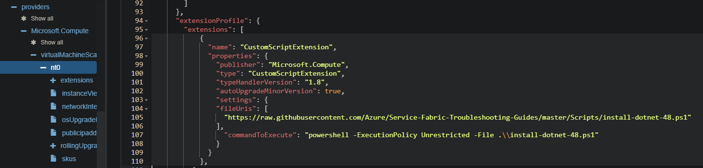
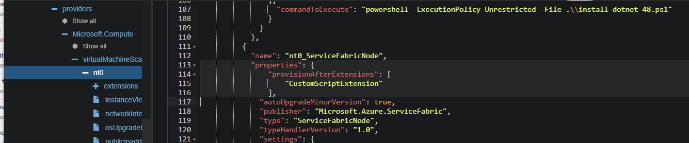

# Installing dependencies on virtual machine scaleset nodes during or after deployment  

[Installing dependencies during cluster deployment](#Installing-dependencies-during-cluster-deployment)  
[Installing dependencies after cluster deployment](#Installing-dependencies-after-cluster-deployment)  
[Modify ARM Template to Add Custom Script Extension](#Modify-ARM-Template-to-Add-Custom-Script-Extension)  
[Modify ARM Template to Add extension sequencing on Service Fabric Extension](#Modify-ARM-Template-to-Add-extension-sequencing-on-Service-Fabric-Extension)  
[Installing .Net Framework](#Installing-Net-Framework)  

## Overview  

There are multiple methods to deploy application dependencies. Desired State Configuration DSC, custom image, chef, cloud-init, Custom Script Extension CSE are some examples. With the introduction of Extension Sequencing on VM and VMSS extensions, greater control of dependency installation can be performed. This may not work in all environments, configurations, or applications. Always test in non-production with same configuration, reliability, and durability first. See [virtual-machine-scale-sets-deploy-app](https://docs.microsoft.com/en-us/azure/virtual-machine-scale-sets/virtual-machine-scale-sets-deploy-app) for different installation options.

## Installing dependencies during cluster deployment

Using an ARM Template with CSE and extension sequencing, a dependency can be installed with a node restart if required, before installation of Service Fabric. This functionality is not directly available in the azure portal so, powershell, visual studio, devops, or other method should be used.

## Installing dependencies after cluster deployment

> ### NOTE: It is not recommended to perform these actions on a deployed cluster. Before making changes to a deployed cluster, ensure cluster is completely healthy. There should not be any applications or nodes in warning state or any active / pending upgrades. Even with a healthy cluster, there is a possibility that making this type of change could cause an outage. Having Silver or greater durability will help ensure cluster stays healthy. [durability characteristics](https://docs.microsoft.com/en-us/azure/service-fabric/service-fabric-cluster-capacity#the-durability-characteristics-of-the-cluster)

> ### :exclamation:NOTE: It is critical to use 'PATCH' instead of 'PUT' if modifying a deployed cluster! Failure to do so will cause a cluster outage.

### Example steps for resources.azure.com

#### Navigate to nodetype under 'providers' 'virtualMachineScaleSets'


#### Select 'Edit' at top of page to start editing






#### When finished editing template, select 'PATCH'


### Modify ARM Template to Add Custom Script Extension

Add new 'CustomScriptExtension' extension to 'Microsoft.Compute/virtualMachineScaleSets' 'extensions' array. In the following example, dotnet framework 4.8 is installed and node is restarted before installation of the Service Fabric extension. See [custom-script-windows](https://docs.microsoft.com/en-us/azure/virtual-machines/extensions/custom-script-windows) for additional information.

```json
{
  "name": "CustomScriptExtension",
  "properties": {
    "publisher": "Microsoft.Compute",
    "type": "CustomScriptExtension",
    "typeHandlerVersion": "1.8",
    "autoUpgradeMinorVersion": true,
    "settings": {
    "fileUris": [
      "[parameters('customScriptExtensionFileUri')]"
    ],
      "commandToExecute": "[concat('powershell -ExecutionPolicy Unrestricted -File .\\', parameters('customScriptExtensionFile'))]"
    }
  }
},
```

### Modify ARM Template to add extension sequencing on Service Fabric Extension

Add 'provisionAfterExtensions' array with 'CustomScriptExtension' in 'properties' section of 'ServiceFabric' extension. See [virtual-machine-scale-sets-extension-sequencing](https://docs.microsoft.com/en-us/azure/virtual-machine-scale-sets/virtual-machine-scale-sets-extension-sequencing) for additional information.

```json
"provisionAfterExtensions": [
    "CustomScriptExtension"
],
```

## Installing .Net Framework

Below are diffs from changes using template.json generated from portal after adding CustomScriptExecution and extension sequencing.
Powershell scripts [../Scripts/install-dotnet-48.ps1](../Scripts/install-dotnet-48.ps1) and [../Scripts/install-dotnet-60.ps1](../Scripts/install-dotnet-60.ps1) are example scripts that installs specific dotnet framework versions.

### template.json

```diff
diff --git a/internal/template/template.json b/internal/template/template.json
index f362926..ff080f0 100644
--- a/internal/template/template.json
+++ b/internal/template/template.json
@@ -2,6 +2,18 @@
     "$schema": "http://schema.management.azure.com/schemas/2015-01-01/deploymentTemplate.json",
     "contentVersion": "1.0.0.0",
     "parameters": {
+        "customScriptExtensionFile":{
+            "type": "string",
+            "metadata": {
+                "description": "powershell script file name and arguments for custom script extension to execute"
+            }
+        },
+        "customScriptExtensionFileUri":{
+            "type": "string",
+            "metadata": {
+                "description": "uri of the script file for custom script extension to execute"
+            }
+        },
         "clusterLocation": {
             "type": "string",
             "defaultValue": "westus",
@@ -457,9 +469,27 @@
                 "virtualMachineProfile": {
                     "extensionProfile": {
                         "extensions": [
+                            {
+                                "name": "CustomScriptExtension",
+                                "properties": {
+                                    "publisher": "Microsoft.Compute",
+                                    "type": "CustomScriptExtension",
+                                    "typeHandlerVersion": "1.8",
+                                    "autoUpgradeMinorVersion": true,
+                                    "settings": {
+                                        "fileUris": [
+                                            "[parameters('customScriptExtensionFileUri')]"
+                                        ],
+                                        "commandToExecute": "[concat('powershell -ExecutionPolicy Unrestricted -File .\\', parameters('customScriptExtensionFile'))]"
+                                    }
+                                }
+                            },
                             {
                                 "name": "[concat(parameters('vmNodeType0Name'),'_ServiceFabricNode')]",
                                 "properties": {
+                                    "provisionAfterExtensions": [
+                                               "CustomScriptExtension"
+                                    ],
                                     "type": "ServiceFabricNode",
                                     "autoUpgradeMinorVersion": true,
                                     "protectedSettings": {
```

### .Net 4.8 parameters.json

```diff
diff --git a/internal/template/parameters.json b/internal/template/parameters.json
index 289e771..e598691 100644
--- a/internal/template/parameters.json
+++ b/internal/template/parameters.json
@@ -2,6 +2,12 @@
     "$schema": "https://schema.management.azure.com/schemas/2015-01-01/deploymentParameters.json#",
     "contentVersion": "1.0.0.0",
     "parameters": {
+        "customScriptExtensionFile":{
+            "value": "install-dotnet-48.ps1 -restart"
+        },
+        "customScriptExtensionFileUri":{
+            "value": "https://{{ %script storage uri% }}/install-dotnet-48.ps1"
+        },
         "clusterName": {
             "value": "sf-1nt-5n-cse"
         },
```

### .Net 6.0 parameters.json

```diff
diff --git a/internal/template/parameters.json b/internal/template/parameters.json
index 289e771..e598691 100644
--- a/internal/template/parameters.json
+++ b/internal/template/parameters.json
@@ -2,6 +2,12 @@
     "$schema": "https://schema.management.azure.com/schemas/2015-01-01/deploymentParameters.json#",
     "contentVersion": "1.0.0.0",
     "parameters": {
+        "customScriptExtensionFile":{
+            "value": "install-dotnet-60.ps1"
+        },
+        "customScriptExtensionFileUri":{
+            "value": "https://{{ %script storage uri% }}/install-dotnet-60.ps1"
+        },
         "clusterName": {
             "value": "sf-1nt-5n-cse"
         },
```
