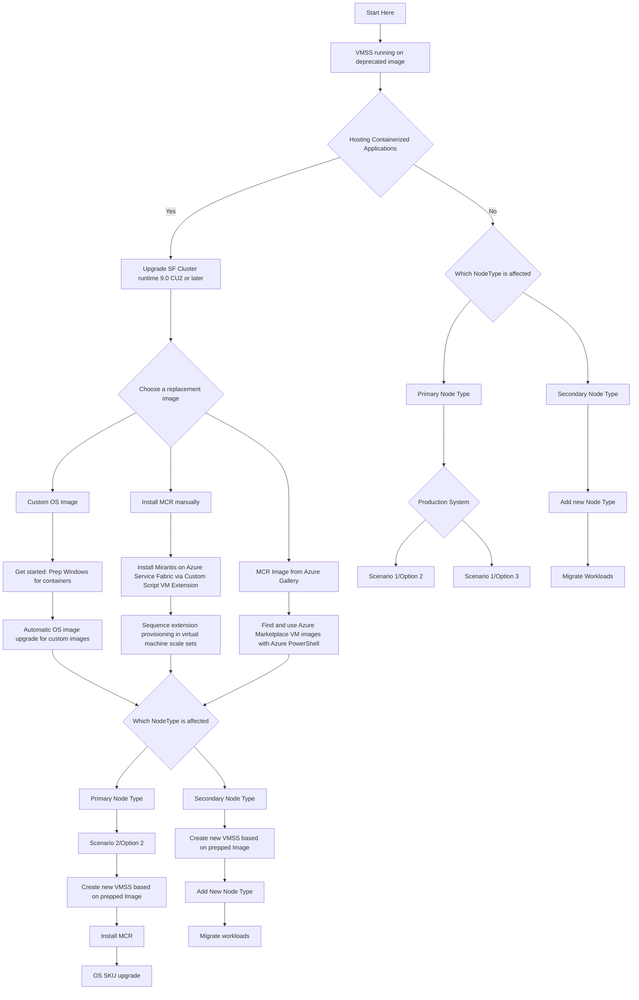

#  Decision Graph companion to Mirantis Container Guidance

[Mirantis Container Guidance](https://github.com/Azure/Service-Fabric-Troubleshooting-Guides/blob/master/Deployment/Mirantis-Guidance.md)

