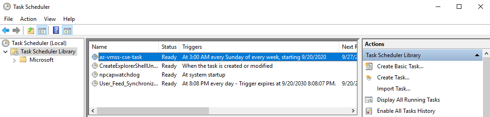
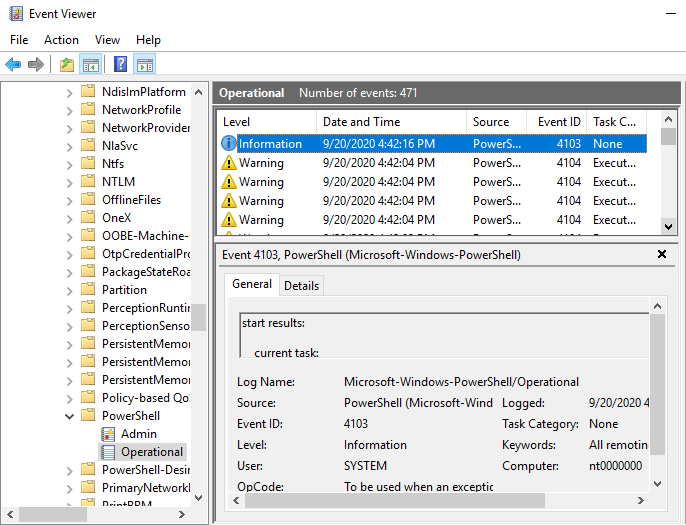

# Schedule task on virtual machine scale set  

>[Overview](#overview)  
>>[Modify ARM Template to Add Custom Script Extension](#modify-arm-template-to-add-custom-script-extension)  
>>[Modify using powershell az module](#modify-using-powershell-az-module)  
>  
>[Example](#Example)  
>>[template.json](#templatejson)  
>>[parameters.json](#parametersjson)  
>  
>[Script Information](#script-information)  
>[Troubleshooting](#troubleshooting)  
>>[ARM template deployment results](#arm-template-deployment-results)  
>>[Troubleshooting on node](#troubleshooting-on-node)  

## Overview  

There are multiple methods to configure scheduled tasks on windows scale sets. Desired State Configuration DSC and Custom Script Extension CSE are two common examples. Before determining method to use, verify task will always be configured regardless if scale set is scaled out, nodes are re-imaged, or cluster is redeployed. Using an ARM Template with CSE will ensure task is always configured at the appropriate time. This example may not work in all environments or configurations. Always test in non-production with same configuration first.  

## Modify ARM Template to Add Custom Script Extension

Add new 'CustomScriptExtension' extension to 'Microsoft.Compute/virtualMachinescalesets' 'extensions' array in ARM template. See [custom script extension](https://docs.microsoft.com/azure/virtual-machines/extensions/custom-script-windows) for additional information on custom script extensions.  

### parameters section  

```json
"customScriptExtensionFileCommand":{
    "type": "string",
    "defaultValue": "",
    "metadata": {
        "description": "powershell script file name and arguments for custom script extension to execute"
    }
},
"customScriptExtensionFileUri":{
    "type": "string",
    "defaultValue": "",
    "metadata": {
        "description": "uri of the script file for custom script extension to execute"
    }
},
```

### resources section  

```json
{
  "name": "CustomScriptExtension",
  "properties": {
    "publisher": "Microsoft.Compute",
    "type": "CustomScriptExtension",
    "typeHandlerVersion": "1.10",
    "autoUpgradeMinorVersion": true,
    "settings": {
      "fileUris": [
        "[parameters('customScriptExtensionFileUri')]"
      ],
      "commandToExecute": "[concat('powershell -ExecutionPolicy Bypass -File .\\', parameters('customScriptExtensionFileCommand'))]",
      "timestamp": 0
    }
  }
},
```

## Modify using powershell az module

An alternate method if ARM template is not available is to use powershell with az module.

```powershell
$vmssName = '{{scale set name}}'
$rgName = '{{resource group name}}'
$fileUris = @('https://raw.githubusercontent.com/{{owner}}/{{repo}}/master/schedule-task.ps1')
$commandToExecute = 'powershell -ExecutionPolicy Bypass -File .\schedule-task.ps1 -start -scriptFile https://raw.githubusercontent.com/{{owner}}/{{repo}}/master/temp/task.ps1'
$extensionName = 'CustomScriptExtension'
$extensionType = 'CustomScriptExtension'
$publisher = 'Microsoft.Compute'
$typeHandlerVersion = 1.10
$timestamp = 1 # increment to force update

$settings = @{
  fileUris = $fileUris
  commandToExecute = $commandToExecute
  timestamp = $timestamp
}

$vmss = Get-AzVmss -ResourceGroupName $rgName -VMScaleSetName $vmssName
$vmss.VirtualMachineProfile.ExtensionProfile.Extensions


# to remove extension
$vmssWithoutExtension = Remove-AzVmssExtension -VirtualMachineScaleSet $vmss -Name $extensionName
<#
Update-AzVmss -ResourceGroupName $rgName -VMScaleSetName $vmssName -VirtualMachineScaleSet $vmssWithOutExtension
#>

$vmssWithExtension = Add-AzVmssExtension -VirtualMachineScaleSet $vmssWithoutExtension `
  -Name $extensionName `
  -Publisher $publisher `
  -Type $extensionType `
  -TypeHandlerVersion $typeHandlerVersion `
  -AutoUpgradeMinorVersion $true `
  -Setting $settings `
  -Verbose

$vmssWithExtension | convertto-json -Depth 6

Update-AzVmss -ResourceGroupName $rgName -VMScaleSetName $vmssName -VirtualMachineScaleSet $vmssWithExtension
```

## Example

In the following example, a scheduled task is created for the execution of configured script.'%Script storage uri%' is the uri location of the script and can be any uri that is accessible from scale set during deployment such as a github repository or blob storage.

Below are diffs from changes using template.json generated from portal after adding CustomScriptExtension.
The powershell script [../Scripts/schedule-task.ps1](../Scripts/schedule-task.ps1) is an example script that will configure scheduled task to execute configured script 'task.ps1'. To use schedule-task.ps1, copy script to '%script storage uri%'. In powershell, type 'help .\schedule-task.ps1 -full' for script argument information. RDP to node and use 'Task Scheduler' gui to verify / troubleshoot tasks.  

### template.json

```diff
diff --git a/internal/template/template.json b/internal/template/template.json
index f362926..ff080f0 100644
--- a/internal/template/template.json
+++ b/internal/template/template.json
@@ -2,6 +2,18 @@
     "$schema": "http://schema.management.azure.com/schemas/2015-01-01/deploymentTemplate.json",
     "contentVersion": "1.0.0.0",
     "parameters": {
+        "customScriptExtensionFileCommand":{
+            "type": "string",
+            "defaultValue": "",
+            "metadata": {
+                "description": "powershell script file name and arguments for custom script extension to execute"
+            }
+        },
+        "customScriptExtensionFileUri":{
+            "type": "string",
+            "defaultValue": "",
+            "metadata": {
+                "description": "uri of the script file for custom script extension to execute"
+            }
+        },
         "clusterLocation": {
             "type": "string",
             "defaultValue": "westus",
@@ -457,9 +469,27 @@
                 "virtualMachineProfile": {
                     "extensionProfile": {
                         "extensions": [
+                            {
+                                "name": "CustomScriptExtension",
+                                "properties": {
+                                    "publisher": "Microsoft.Compute",
+                                    "type": "CustomScriptExtension",
+                                    "typeHandlerVersion": "1.8",
+                                    "autoUpgradeMinorVersion": true,
+                                    "settings": {
+                                        "fileUris": [
+                                            "[parameters('customScriptExtensionFileUri')]"
+                                        ],
+                                        "commandToExecute": "[concat('powershell -ExecutionPolicy Bypass -File .\\', parameters('customScriptExtensionFileCommand'))]",
+                                        "timestamp": 0
+                                    }
+                                }
+                            },
```

### parameters.json

```diff
diff --git a/internal/template/parameters.json b/internal/template/parameters.json
index 289e771..e598691 100644
--- a/internal/template/parameters.json
+++ b/internal/template/parameters.json
@@ -2,6 +2,12 @@
     "$schema": "https://schema.management.azure.com/schemas/2015-01-01/deploymentParameters.json#",
     "contentVersion": "1.0.0.0",
     "parameters": {
+        "customScriptExtensionFileCommand":{
+            "value": "schedule-task.ps1 -triggerFrequency weekly -start -overwrite -scriptFile https://{{ %script storage uri% }}/task.ps1"
+        },
+        "customScriptExtensionFileUri":{
+            "value": "https://{{ %script storage uri% }}/schedule-task.ps1"
+        },
         "clusterName": {
             "value": "sf-1nt-5n-cse"
         },
```

## Script Information

Detailed information for schedule-task.ps1 script can be found by executing 'help .\schedule-task.ps1 -full' in a powershell prompt.

```text
 help .\schedule-task.ps1 -full

NAME
    C:\github\jagilber\Service-Fabric-Troubleshooting-Guides\Scripts\schedule-task.ps1

SYNOPSIS
    # script to schedule task
    # schedule-task.ps1
    # writes event 4103 to Microsoft-Windows-Powershell on completion in Operational event log

SYNTAX
    C:\github\jagilber\Service-Fabric-Troubleshooting-Guides\Scripts\schedule-task.ps1 [[-scriptFileStoragePath] <String>] [[-scriptFile] <String>] [[-taskName] <String>] [[-action] <String>] [[-actionParameter] <String>] [[-triggerTime] <String>]   
    [[-triggerFrequency] <String>] [[-principal] <String>] [[-principalLogonType] <String>] [-start] [[-runLevel] <String>] [[-daysOfweek] <String[]>] [[-daysInterval] <Int32>] [-remove] [[-taskSettingsParameters] <Hashtable>] [<CommonParameters>]   

DESCRIPTION

PARAMETERS
    -scriptFileStoragePath <String>
        [string] storage location for script file on machine referenced by scheduled task.
        Default value                c:\task-scripts

    -scriptFile <String>
        [string] optional script file to be used in scheduled task. can be drive letter, unc, or url.
        $scriptFile will be downloaded to $scriptFileStoragePath.
        schedule-task.ps1 script $action and $actionParameter are by default confitured to run powershell scripts.
        $scriptFile if provided will be appended to $actionParameter in format $scriptFileStoragePath\$scriptFile.
        Default value

    -taskName <String>
        [string] name of scheduled task.
        Default value                az-vmss-cse-task

    -action <String>
        [string] action for scheduled task to perform.
        Default value                powershell.exe

    -actionParameter <String>
        [string] action parameter(s) for $action.
        $scriptFile if provided will be appended to $actionParameter in format $scriptFileStoragePath\$scriptFile.
        Default value                -ExecutionPolicy Bypass -WindowStyle Hidden -NonInteractive -NoLogo -NoProfile

    -triggerTime <String>
        [datetime]/[string] time to start trigger execution.
        see https://docs.microsoft.com/powershell/module/scheduledtasks/new-scheduledtasktrigger
        Default value                3am

    -triggerFrequency <String>
        [string] scheduled task trigger frequency, one of: 'startup', 'once', 'daily', 'weekly'
        Default value                startup

    -principal <String>
        [string] scheduled task authentication principal
        Default value                BUILTIN\ADMINISTRATORS

    -principalLogonType <String>
        [string] principal logon type.
        one of: 'none', 'password', 's4u', 'interactive', 'serviceaccount', 'interactiveorpassword', 'group'
        Default value                group

    -start [<SwitchParameter>]
        [switch] start scheduled task
        Default value                False

    -runLevel <String>
        [string] scheduled task execution level.
        one of: 'highest', 'limited'
        Default value                limited

    -daysOfweek <String[]>
        [string[]] days of week if $triggerFrequency equals 'weekly'.
        one or more of: 'sunday', 'monday', 'tuesday', 'wednesday', 'thursday', 'friday', 'saturday'
        Default value                @('sunday')

    -daysInterval <Int32>
        [int] time interval in days between scheduled task if $triggerFrequency equals 'daily'.
        Default value                1

    -remove [<SwitchParameter>]
        [switch] remove existing scheduled task and returns.
        Default value                False

    -taskSettingsParameters <Hashtable>
        [hashtable] optional additional task settings paramaters to be passed to new-taskschedulesettingsset command.
        example: .\schedule-task.ps1 -triggerFrequency weekly -taskSettingsParameters @{restartCount=3;runOnlyIfNetworkAvailable=$true}
        see https://docs.microsoft.com/powershell/module/scheduledtasks/new-scheduledtasksettingsset.
        Default value                @{}

    <CommonParameters>
        This cmdlet supports the common parameters: Verbose, Debug,
        ErrorAction, ErrorVariable, WarningAction, WarningVariable,
        OutBuffer, PipelineVariable, and OutVariable. For more information, see
        about_CommonParameters (https://go.microsoft.com/fwlink/?LinkID=113216).

INPUTS

OUTPUTS

    -------------------------- EXAMPLE 1 --------------------------
    PS > download script file task.ps1, schedule task at startup and execute task immediately.
    .\schedule-task.ps1 -start -scriptFile https://raw.githubusercontent.com/{{owner}}/{{repo}}/master/temp/task.ps1

    -------------------------- EXAMPLE 2 --------------------------
    PS > download script file task.ps1, schedule task for weekly execute on sunday at 3am and task immediately.
    .\schedule-task.ps1 -triggerFrequency weekly -start -scriptFile https://raw.githubusercontent.com/{{owner}}/{{repo}}/master/temp/task.ps1

    -------------------------- EXAMPLE 3 --------------------------
    PS > schedule task for daily execute of inline powerhsell command get-winevent.
    .\schedule-task.ps1 -triggerFrequency daily -action powershell -actionParameter '-Command {get-winevent -LogName Application | ? LevelDisplayName -notmatch 'information'}'

RELATED LINKS
    invoke-webRequest "https://raw.githubusercontent.com/Azure/Service-Fabric-Troubleshooting-Guides/master/scripts/schedule-task.ps1" -outFile "$pwd\schedule-task.ps1";
```

## Troubleshooting

### ARM template deployment results

Script schedule-task.ps1 will throw exceptions if unable to find 'scriptFile' or if unable to create scheduled task. Exceptions are used in custom script extensions to fail the extension and report error back to ARM to fail deployment.

### Troubleshooting on node

Validation and troubleshooting of task can be performed by connecting to node with RDP. View the task in 'Task Scheduler' and event log entry in 'Event Viewer' powershell event 4103. Troubleshooting of the Custom Script Extension and schedule-task.ps1 can be performed from the 'Packages' directory.

#### **Packages directory**

Azure extensions are installed to the 'C:\Packages' directory on the nodes. Custom Script Extension location 'C:\Packages\Plugins\Microsoft.Compute.CustomScriptExtension\{{typeHandlerVersion}}'. 'customScriptExtensionFileUri' will be downloaded to the '{{revision}}\Downloads' sub-folder. A powershell transcript will be generated in the working directory of schedule-task.ps1 that contains output from script during deployment.

#### **Task Scheduler gui**

Task Scheduler gui will show the current task configuration and execution history if enabled. Select 'Enable All Tasks History' in right pane to enable.



#### **Microsoft-Windows-PowerShell/Operational event log entry**

Script schedule-task.ps1 will write event log entry in Microsoft-Windows-PowerShell/Operational event log at end of script which can be used for troubleshooting. Example event entry below:



```json
Log Name:      Microsoft-Windows-PowerShell/Operational
Source:        Microsoft-Windows-PowerShell
Date:          9/20/2020 4:42:16 PM
Event ID:      4103
Task Category: None
Level:         Information
Keywords:      All remoting cmdlets
User:          SYSTEM
Computer:      nt0000000
Description:
start results:

current task:
{
    "CimClass":  {
                     "CimSuperClassName":  null,
                     "CimSuperClass":  null,
                     "CimClassProperties":  "Actions Author Date Description Documentation Principal SecurityDescriptor Settings Source State TaskName TaskPath Triggers URI Version",
                     "CimClassQualifiers":  "dynamic = True provider = \"ScheduledTaskProv\"",
                     "CimClassMethods":  "",
                     "CimSystemProperties":  "Microsoft.Management.Infrastructure.CimSystemProperties"
                 },
    "CimInstanceProperties":  [
                                  "Actions = "...",
                                  "Author",
                                  "Date",
                                  "Description",
                                  "Documentation",
                                  "Principal = "...",
                                  "SecurityDescriptor = \"\"",
                                  "Settings = "...",
                                  "Source",
                                  "State = 3",
                                  "TaskName = \"az-vmss-cse-task\"",
                                  "TaskPath = \"\\\"",
                                  "Triggers = "...",
                                  "URI = \"\\az-vmss-cse-task\"",
                                  "Version"
                              ],
    "CimSystemProperties":  {
                                "Namespace":  "Root/Microsoft/Windows/TaskScheduler",
                                "ServerName":  "nt0000000",
                                "ClassName":  "MSFT_ScheduledTask",
                                "Path":  null
                            },
    "State":  3,
    "Actions":  [
                    "MSFT_TaskExecAction"
                ],
    "Author":  null,
    "Date":  null,
    "Description":  null,
    "Documentation":  null,
    "Principal":  {
                      "CimClass":  "Root/Microsoft/Windows/TaskScheduler:MSFT_TaskPrincipal2",
                      "CimInstanceProperties":  "DisplayName GroupId = \"Administrators\" Id = \"Author\" LogonType = 4 RunLevel = 0 UserId ProcessTokenSidType = 2 RequiredPrivilege",
                      "CimSystemProperties":  "Microsoft.Management.Infrastructure.CimSystemProperties"
                  },
    "SecurityDescriptor":  "",
    "Settings":  {
                     "CimClass":  "Root/Microsoft/Windows/TaskScheduler:MSFT_TaskSettings3",
                     "CimInstanceProperties":  "AllowDemandStart = True AllowHardTerminate = True Compatibility = 3 DeleteExpiredTaskAfter DisallowStartIfOnBatteries = True Enabled = True ExecutionTimeLimit = \"PT72H\" Hidden = False IdleSettings = ... MultipleInstances = 2 NetworkSettings = ... Priority = 7 RestartCount = 0 RestartInterval RunOnlyIfIdle = False RunOnlyIfNetworkAvailable = False StartWhenAvailable = False StopIfGoingOnBatteries = True WakeToRun = False DisallowStartOnRemoteAppSession = False UseUnifiedSchedulingEngine = True MaintenanceSettings volatile = False",
                     "CimSystemProperties":  "Microsoft.Management.Infrastructure.CimSystemProperties"
                 },
    "Source":  null,
    "TaskName":  "az-vmss-cse-task",
    "TaskPath":  "\\",
    "Triggers":  [
                     "MSFT_TaskWeeklyTrigger"
                 ],
    "URI":  "\\az-vmss-cse-task",
    "Version":  null,
    "PSComputerName":  null
}
error:

Context:
context:
success:True
failures:0
log:file://C:\Packages\Plugins\Microsoft.Compute.CustomScriptExtension\1.10.9\Downloads\1\transcript.log
{
    "MyCommand":  {
                      "Path":  "C:\\Packages\\Plugins\\Microsoft.Compute.CustomScriptExtension\\1.10.9\\Downloads\\1\\schedule-task.ps1",
                      "Definition":  "C:\\Packages\\Plugins\\Microsoft.Compute.CustomScriptExtension\\1.10.9\\Downloads\\1\\schedule-task.ps1",
                      "Source":  "C:\\Packages\\Plugins\\Microsoft.Compute.CustomScriptExtension\\1.10.9\\Downloads\\1\\schedule-task.ps1",
                      "Visibility":  0,
                      "ScriptBlock":  "...",
                      "OutputType":  "",
                      "ScriptContents":  "...",
                      "OriginalEncoding":  "System.Text.SBCSCodePageEncoding",
                      "Name":  "schedule-task.ps1",
                      "CommandType":  16,
                      "Version":  null,
                      "ModuleName":  "",
                      "Module":  null,
                      "RemotingCapability":  1,
                      "Parameters":  "System.Collections.Generic.Dictionary`2[System.String,System.Management.Automation.ParameterMetadata]",
                      "ParameterSets":  "[[-scriptFileStoragePath] \u003cstring\u003e] [[-scriptFile] \u003cstring\u003e] [[-taskName] \u003cstring\u003e] [[-action] \u003cstring\u003e] [[-actionParameter] \u003cstring\u003e] [[-triggerTime] \u003cstring\u003e] [[-triggerFrequency] \u003cstring\u003e] [[-principal] \u003cstring\u003e] [[-principalLogonType] \u003cstring\u003e] [[-runLevel] \u003cstring\u003e] [[-daysOfweek] \u003cstring[]\u003e] [[-daysInterval] \u003cint\u003e] [[-taskSettingsParameters] \u003chashtable\u003e] [-overwrite] [-start] [-remove]"
                  },
    "BoundParameters":  {
                            "triggerFrequency":  "weekly",
                            "start":  "True",
                            "overwrite":  "True",
                            "scriptFile":  "https://raw.githubusercontent.com/jagilber/powershellScripts/master/temp/task.ps1"
                        },
    "UnboundArguments":  [

                         ],
    "ScriptLineNumber":  0,
    "OffsetInLine":  0,
    "HistoryId":  1,
    "ScriptName":  "",
    "Line":  "",
    "PositionMessage":  "",
    "PSScriptRoot":  "",
    "PSCommandPath":  null,
    "InvocationName":  "C:\\Packages\\Plugins\\Microsoft.Compute.CustomScriptExtension\\1.10.9\\Downloads\\1\\schedule-task.ps1",
    "PipelineLength":  2,
    "PipelinePosition":  1,
    "ExpectingInput":  false,
    "CommandOrigin":  0,
    "DisplayScriptPosition":  null
}

User Data:
user data:
{
    "COMPUTERNAME":  "nt0000000",
    "USERPROFILE":  "C:\\windows\\system32\\config\\systemprofile",
    "PUBLIC":  "C:\\Users\\Public",
    "LOCALAPPDATA":  "C:\\windows\\system32\\config\\systemprofile\\AppData\\Local",
    "PSModulePath":  "WindowsPowerShell\\Modules;C:\\Program Files\\WindowsPowerShell\\Modules;C:\\windows\\system32\\WindowsPowerShell\\v1.0\\Modules;C:\\Program Files\\Microsoft Monitoring Agent\\Agent\\AzureAutomation\\7.3.837.0;C:\\Program Files\\Microsoft Monitoring Agent\\Agent\\PowerShell\\",
    "PROCESSOR_ARCHITECTURE":  "AMD64",
    "Path":  "C:\\windows\\system32;C:\\windows;C:\\windows\\System32\\Wbem;C:\\windows\\System32\\WindowsPowerShell\\v1.0\\;C:\\windows\\System32\\OpenSSH\\;C:\\Program Files\\Docker;C:\\Users\\cloudadmin\\AppData\\Local\\Microsoft\\WindowsApps;c:\\program files\\git\\bin;c:\\program files\\hub\\bin;C:\\Program Files\\Microsoft\\Web Platform Installer\\;C:\\Program Files\\Microsoft SDKs\\Service Fabric\\Tools\\ServiceFabricLocalClusterManager;C:\\Program Files\\Microsoft Service Fabric\\bin\\Fabric\\Fabric.Code;C:\\windows\\system32\\config\\systemprofile\\AppData\\Local\\Microsoft\\WindowsApps",
    "AZURE_GUEST_AGENT_UNINSTALL_CMD_EXIT_CODE":  "NOT_RUN",
    "ProgramFiles(x86)":  "C:\\Program Files (x86)",
    "ConfigSequenceNumber":  "23",
    "ProgramFiles":  "C:\\Program Files",
    "PSExecutionPolicyPreference":  "Bypass",
    "SystemRoot":  "C:\\windows",
    "OS":  "Windows_NT",
    "ALLUSERSPROFILE":  "C:\\ProgramData",
    "DriverData":  "C:\\Windows\\System32\\Drivers\\DriverData",
    "APPDATA":  "C:\\windows\\system32\\config\\systemprofile\\AppData\\Roaming",
    "PROCESSOR_REVISION":  "3f02",
    "USERNAME":  "nt0000000$",
    "CommonProgramW6432":  "C:\\Program Files\\Common Files",
    "CommonProgramFiles":  "C:\\Program Files\\Common Files",
    "PATHEXT":  ".COM;.EXE;.BAT;.CMD;.VBS;.VBE;.JS;.JSE;.WSF;.WSH;.MSC;.CPL",
    "AZURE_GUEST_AGENT_EXTENSION_PATH":  "C:\\Packages\\Plugins\\Microsoft.Compute.CustomScriptExtension\\1.10.9",
    "PROCESSOR_IDENTIFIER":  "Intel64 Family 6 Model 63 Stepping 2, GenuineIntel",
    "PROCESSOR_LEVEL":  "6",
    "ComSpec":  "C:\\windows\\system32\\cmd.exe",
    "PROMPT":  "$P$G",
    "SystemDrive":  "C:",
    "TEMP":  "C:\\windows\\TEMP",
    "NUMBER_OF_PROCESSORS":  "2",
    "AZURE_GUEST_AGENT_EXTENSION_VERSION":  "1.10.9",
    "TMP":  "C:\\windows\\TEMP",
    "ProgramData":  "C:\\ProgramData",
    "ProgramW6432":  "C:\\Program Files",
    "CommonProgramFiles(x86)":  "C:\\Program Files (x86)\\Common Files",
    "USERDOMAIN":  "WORKGROUP",
    "windir":  "C:\\windows"
}
```
