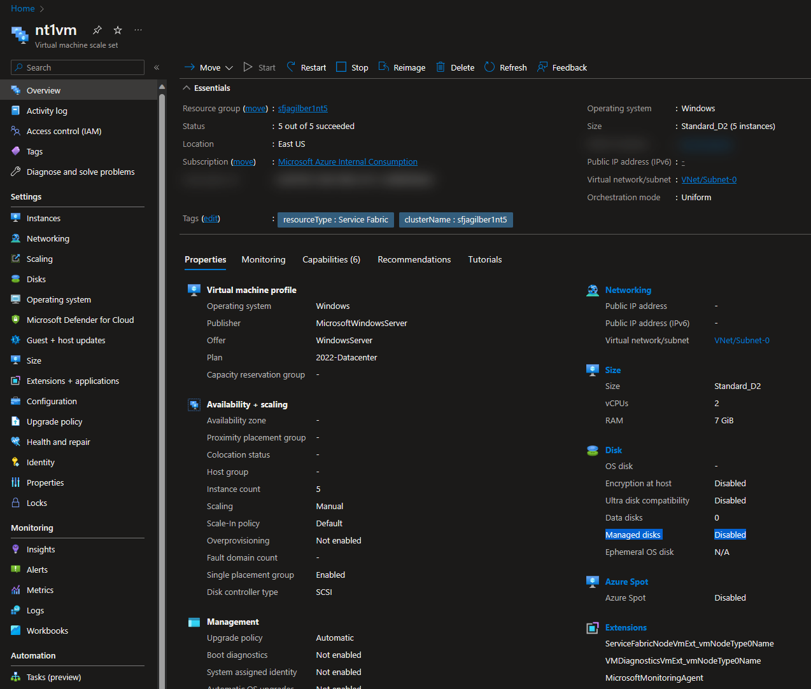

# Deprecation of Azure unmanaged disks guidance for Service Fabric clusters

## Abstract 

Azure unmanaged disks deprecation announced September 2022, will be full retired September 2025. All Service Fabric clusters using nodetypes / virtual machine scale sets (VMSS) will need to have new nodetypes with managed disk configuration added to the cluster before this date. See [Migrate your Azure unmanaged disks by September 30, 2025](https://learn.microsoft.com/azure/virtual-machines/unmanaged-disks-deprecation) for detailed information about unmanaged disk deprecation.

## Determining Impact

This deprecation does not affect [Service Fabric Managed clusters](https://learn.microsoft.com/azure/service-fabric/overview-managed-cluster) as all managed clusters are built with managed disk configuration for provisioned nodetypes. This should also not impact any recently built Service Fabric clusters built from Azure Portal since unmanaged disks have not been used for many years in the Service Fabric portal templates.

To conclusively verify whether there are any scale sets using unmanaged disks, each scale set can be viewed in Azure portal, in ARM template, or using powershell commands as shown in example below:

### ARM Template

#### **Example ARM Template VMSS resource using managed disks:**

```json
"storageProfile": {
  "imageReference": {
    "publisher": "[parameters('vmImagePublisher')]",
    "offer": "[parameters('vmImageOffer')]",
    "sku": "[parameters('vmImageSku')]",
    "version": "[parameters('vmImageVersion')]"
  },
  "osDisk": {
    "caching": "ReadOnly",
    "createOption": "FromImage",
    "diskSizeGb": 128,
    "managedDisk": {
      "storageAccountType": "[parameters('storageAccountType')]"
    }
  }
}
```

#### **Example ARM Template VMSS resource using unmanaged disks:**

```json
"storageProfile": {
  "imageReference": {
    "publisher": "[parameters('vmImagePublisher')]",
    "offer": "[parameters('vmImageOffer')]",
    "sku": "[parameters('vmImageSku')]",
    "version": "[parameters('vmImageVersion')]"
  },
  "osDisk": {
    "vhdContainers": [
      "[concat(reference(concat('Microsoft.Storage/storageAccounts/', variables('uniqueStringArray0')[0]), variables('storageApiVersion')).primaryEndpoints.blob, variables('vmStorageAccountContainerName'))]",
      "[concat(reference(concat('Microsoft.Storage/storageAccounts/', variables('uniqueStringArray0')[1]), variables('storageApiVersion')).primaryEndpoints.blob, variables('vmStorageAccountContainerName'))]",
      "[concat(reference(concat('Microsoft.Storage/storageAccounts/', variables('uniqueStringArray0')[2]), variables('storageApiVersion')).primaryEndpoints.blob, variables('vmStorageAccountContainerName'))]",
      "[concat(reference(concat('Microsoft.Storage/storageAccounts/', variables('uniqueStringArray0')[3]), variables('storageApiVersion')).primaryEndpoints.blob, variables('vmStorageAccountContainerName'))]",
      "[concat(reference(concat('Microsoft.Storage/storageAccounts/', variables('uniqueStringArray0')[4]), variables('storageApiVersion')).primaryEndpoints.blob, variables('vmStorageAccountContainerName'))]"
    ],
    "name": "vmssosdisk",
    "caching": "ReadOnly",
    "createOption": "FromImage"
  }
}
```

### Azure Portal

In [Azure portal](https://ms.portal.azure.com/#view/HubsExtension/BrowseResource/resourceType/Microsoft.Compute%2FvirtualMachineScaleSets), navigate to each scale sets 'Overview' page. In right pane under 'Disk' section, 'Managed disks' will be set to either 'Enabled' or 'Disabled'.



### PowerShell

```powershell
import-module az.resources
import-module az.compute

if (!(get-azResourceGroup)) { connect-azAccount }

$scalesets = get-azResource -ResourceType 'Microsoft.Compute/virtualMachineScaleSets'
if (!$scalesets) {
    write-error "no scale sets enumerated. if this is in error, try from https://shell.azure.com"
}

foreach ($scaleset in $scalesets) {
    $vmss = get-azVmss -ResourceGroupName $scaleset.ResourceGroupName -VMScaleSetName $scaleset.Name
    $extensionTypes = $vmss.VirtualMachineProfile.ExtensionProfile.Extensions.type
    $storageProfile = $vmss.VirtualMachineProfile.StorageProfile
    $scalesetName = $scaleset.Name

    write-host "checking scale set:$($vmss.Id)" -ForegroundColor Cyan
    write-verbose "checking scale set:$($vmss | convertTo-json -Depth 99)"

    if ($extensionTypes -contains 'ServiceFabricNode' -or $extensionTypes -contains 'ServiceFabricLinuxNode') {
        write-host "`t$scalesetName is part of a service fabric cluster" -ForegroundColor Yellow
    }
    elseif ($extensionTypes -contains 'ServiceFabricMCNode') {
        write-host "`t$scalesetName is part of a service fabric managed cluster"
    }
    else {
        write-host "`t$scalesetName is not part of a service fabric cluster"
    }

    if ($storageProfile.OsDisk -and !$storageProfile.OsDisk.ManagedDisk) {
        write-host "`tUNMANAGED DISK: $scalesetName is not using managed disk for os disk" -ForegroundColor Red
    }
    elseif ($storageProfile.OsDisk -and $storageProfile.OsDisk.ManagedDisk) {
        write-host "`t$scalesetName is using managed disk for os disk" -ForegroundColor Green
    }
    else {
        write-error "$scalesetName unable to enumerate os disk:$($vmss | convertTo-json -Depth 99)"
    }

    if ($storageProfile.DataDisks -and !$storageProfile.DataDisks.ManagedDisk) {
        write-host "`tUNMANAGED DISK: $scalesetName is not using managed disks for data disks" -ForegroundColor Red
    }
    elseif ($storageProfile.DataDisks -and $storageProfile.DataDisks.ManagedDisk) {
        write-host "`t$scalesetName is using managed disks for data disks" -ForegroundColor Green
    }
    else {
        write-host "`t$scalesetName unable to enumerate / no data disk"
    }
}
```

## Scenario 1: Customer is hosting Azure Service Fabric Node Type using deprecated Windows Server images with-Containers, but does NOT host containers in Docker as part of their overall applications

### Scenario 1/Option 1: Full rebuild the cluster

This scenario fits where availability loss is acceptable, and effort is less through automation.

Steps

1.	Full rebuild of Service Fabric cluster on a supported OS SKU without container support.
a.	Example for the OS SKU name: Windows Server 2022 Datacenter
2.	Re-deploy applications

> :exclamation:
> Please consider the option to recreate the cluster by only removing the Azure Virtual Machine Scale Sets (VMSS) and the Azure Service Fabric cluster resource. Creating just these two instances works well when you don’t automate the whole deployment.

Documentation:

- [Quickstart: Create a Service Fabric cluster using ARM template](https://docs.microsoft.com/en-us/azure/service-fabric/quickstart-cluster-template)
- [How To: Rebuild Azure Service Fabric cluster (minimal version)](https://github.com/Azure/Service-Fabric-Troubleshooting-Guides/blob/master/Deployment/Minimal-Cluster-Rebuild.md)

### Scenario 1/Option 2: Mitigate via OS SKU upgrade

The mitigation by adding a new Service Fabric Node Type and migrating the workload has the best cost benefit and the lowest risk in production.

#### Primary Node Type on deprecated OS SKU

Upgrade primary SKU to supported OS SKU without container support by following the linked documentation.

Documentation:

- [Scale up a Service Fabric cluster primary node type](https://docs.microsoft.com/en-us/azure/service-fabric/service-fabric-scale-up-primary-node-type)

#### Secondary Node Type on deprecated OS SKU

Add new secondary Node Types with supported OS SKU without container support by following the linked documentation.

Documentation:

- [Scale a Service Fabric cluster out by adding a virtual machine scale set](https://docs.microsoft.com/en-us/azure/service-fabric/virtual-machine-scale-set-scale-node-type-scale-out)
- [Scale up a Service Fabric cluster secondary node type](https://learn.microsoft.com/en-us/azure/service-fabric/service-fabric-scale-up-non-primary-node-type)

### Scenario 1/Option 3: Mitigate via OS SKU in-place upgrade

Azure Service Fabric Service allows an in-place upgrade by changing only the OS SKU and version parameter on the VMSS configuration. This upgrade explicitly excludes changes to publisher or offer, and also excludes any other change like the Azure VM SKU.

Requirements:

- The Durability must be Silver or higher. Durability Bronze does not allow in-place upgrade.
- Disaster Recovery Plan must be tested and executable beforehand.
  [Disaster recovery in Azure Service Fabric](https://docs.microsoft.com/en-us/azure/service-fabric/service-fabric-disaster-recovery)
- Backup all data of stateful services must exist.
  [Periodic backup and restore in an Azure Service Fabric cluster](https://docs.microsoft.com/en-us/azure/service-fabric/service-fabric-backuprestoreservice-quickstart-azurecluster)

Please take care of this pre-requisites before you start the process.

1. The cluster is healthy.
2. All other deployments are stopped during the time of the upgrade. 
3. Please make sure that no other configuration change is triggered. For example, do not change any parameters in the ARM template other than described below. 
4. There will still be sufficient capacity during the time nodes in one UD are going down, eg. number of nodes to place required replica count.
5. All stateful services need to follow the guidance to have sufficient replica count in place. Minimum TargetReplicaSetSize = 5, MinReplicaSetSize = 3.
  [Stateful service replica set size configuration](https://docs.microsoft.com/en-us/azure/service-fabric/service-fabric-best-practices-replica-set-size-configuration)

> :warning:
> The rare but potential risk with the in-place upgrade is that in case of something gets stuck during the upgrade then there is no rollback option. In this case Microsoft cannot support in unblocking this scenario. Please do not use this scenario if the rebuild of the cluster is not acceptable.

#### What should be changed during the upgrade?

Only two parameters (sku, version) are allowed to be changed during the upgrade.
```json
"storageProfile": {
 "imageReference": {
  "publisher": "[parameters('vmImagePublisher')]",
  "offer": "[parameters('vmImageOffer')]",
  "sku": "[parameters('vmImageSku')]",
  "version": "[parameters('vmImageVersion')]"
 },
},
```

#### Example for the configuration change

Old parameter values:
```json
"sku": "2019-Datacenter-with-Containers",
"version": "latest"
```

New parameter values:
```json
"sku": "2019-Datacenter",
"version": "latest"
```

#### Migrate workloads

For each option, running workloads need to be moved by changing placement constraints or application upgrades.

Documentation:
- [Configuring placement constraints for Service Fabric services](https://docs.microsoft.com/en-us/azure/service-fabric/service-fabric-cluster-resource-manager-configure-services#placement-constraints)
- [Service Fabric application upgrade](https://docs.microsoft.com/en-us/azure/service-fabric/service-fabric-application-upgrade)
- [Stateful service replica set size configuration](https://docs.microsoft.com/en-us/azure/service-fabric/service-fabric-best-practices-replica-set-size-configuration)

## Scenario 2: Customer is hosting Azure Service Fabric Node Type using deprecated Windows Server images with-Containers, and does host containers in Docker as part of their applications

In general, the steps are as follows:
1. Choose container runtime. 
2. Install container runtime on new node type. There are three options to install the container runtime:
   1. Custom Script VM Extension on a new node type with standard Azure OS image without container support. 
   Please find the guidance to install container runtime via Custom Script VM Extension in the respective scenario.
   The container runtime installer needs a machine restart to work during the post-deployment. This can potentially delay other operational processes, as scaling, node repair, reimage can take longer. The installer also checks if the latest version is installed, this can be disabled in the provided script.
   2. Create a new node type with the Azure Marketplace OS image provided by with pre-installed container runtime. 
   3. Create a custom OS image to pre-install container runtime. Please find guidance below in the documentation. VMSS also allows to use automatic OS image upgrade to install Windows patches on custom images.
3. Move workloads to new node type.

> :exclamation:
> The above steps to provision container runtime runtime were performed on Windows Server 2022 running Service Fabric 9.0 CU2   

### Scenario 2/Option 1: Full rebuild of Azure Service Fabric cluster (9.0 CU2 or later) on a supported Windows 2022 OS SKU 

This scenario fits where availability loss is acceptable, and effort is less through automation.

Steps
1. Full rebuild of Service Fabric cluster on a supported OS SKU without container support.
   Example for the OS SKU name: Windows Server 2022 Datacenter
2. Re-deploy applications

:exclamation: Please consider the option to recreate the cluster by only removing the Azure Virtual Machine Scale Sets (VMSS) and the Azure Service Fabric cluster resource. Creating just these two instances works well when you don’t automate the whole deployment.

Documentation:
- [Quickstart: Create a Service Fabric cluster using ARM template](https://docs.microsoft.com/en-us/azure/service-fabric/quickstart-cluster-template)
- [How To: Rebuild Azure Service Fabric cluster (minimal version)](https://github.com/Azure/Service-Fabric-Troubleshooting-Guides/blob/master/Deployment/Minimal-Cluster-Rebuild.md)
- [Install Mirantis on Azure Service Fabric via Custom Script VM Extension](https://github.com/Azure/Service-Fabric-Troubleshooting-Guides/blob/master/Deployment/Mirantis-Installation.md)

### Scenario 2/Option 2: Mitigate Node Types via OS SKU upgrade

Depending on the configuration of the Node Type you must follow different processes for primary or non-primary Node Types, documentation is linked below.

Upgrade Azure Service Fabric runtime version.

- [Upgrade the Service Fabric version that runs on your cluster](https://docs.microsoft.com/en-us/azure/service-fabric/service-fabric-cluster-upgrade-windows-server)
- [Service Fabric supported versions](https://docs.microsoft.com/en-us/azure/service-fabric/service-fabric-versions)

Adding a new node type safely in Azure Service Fabric cluster.

- [Scale up a Service Fabric cluster primary node type](https://docs.microsoft.com/en-us/azure/service-fabric/service-fabric-scale-up-primary-node-type)
- [Scale a Service Fabric cluster out by adding a virtual machine scale set](https://docs.microsoft.com/en-us/azure/service-fabric/virtual-machine-scale-set-scale-node-type-scale-out)

Install container runtime during post-deployment with Custom Script VM Extension on VMSS.

- [Install Mirantis on Azure Service Fabric via Custom Script VM Extension](https://github.com/Azure/Service-Fabric-Troubleshooting-Guides/blob/master/Deployment/Mirantis-Installation.md)
- [Install MCR on Windows Servers](https://docs.mirantis.com/mcr/20.10/install/mcr-windows.html)
- [Install Docker CE/Moby on Windows Server](https://learn.microsoft.com/en-us/virtualization/windowscontainers/quick-start/set-up-environment?tabs=dockerce#windows-server-1)
- [Sequence extension provisioning in virtual machine scale sets](https://docs.microsoft.com/en-us/azure/virtual-machine-scale-sets/virtual-machine-scale-sets-extension-sequencing)
- [Custom Script Extension for Windows](https://docs.microsoft.com/en-us/azure/virtual-machines/extensions/custom-script-windows)

Find OS image with pre-installed container runtime provided in Azure Marketplace (September 2022).

- [Find and use Azure Marketplace VM images with Azure PowerShell](https://docs.microsoft.com/en-us/azure/virtual-machines/windows/cli-ps-findimage)
- [Azure Marketplace - Windows Server 2019 Datacenter with Containers (Mirantis Container Runtime)](https://azuremarketplace.microsoft.com/en-us/marketplace/apps/mirantis.windows_with_mirantis_container_runtime_2019)

Create a custom OS image to build a new node type with it.

- [Get started: Prep Windows for containers](https://docs.microsoft.com/en-us/virtualization/windowscontainers/quick-start/set-up-environment)
- [Automatic OS image upgrade for custom images](https://docs.microsoft.com/en-us/azure/virtual-machine-scale-sets/virtual-machine-scale-sets-automatic-upgrade#automatic-os-image-upgrade-for-custom-images)

Running workloads need to be moved by changing placement constraints or application upgrades.

- [Configuring placement constraints for Service Fabric services](https://docs.microsoft.com/en-us/azure/service-fabric/service-fabric-cluster-resource-manager-configure-services#placement-constraints)
- [Service Fabric application upgrade](https://docs.microsoft.com/en-us/azure/service-fabric/service-fabric-application-upgrade)

After successful migration, the unused Node Type should be removed.
- [How to remove a Service Fabric node type](https://docs.microsoft.com/en-us/azure/service-fabric/service-fabric-how-to-remove-node-type)
- [Remove the original node type and cleanup its resources](https://docs.microsoft.com/en-us/azure/service-fabric/service-fabric-scale-up-primary-node-type#remove-the-original-node-type-and-cleanup-its-resources)

Additional guidance related to container runtimes
- Modifications to the Docker data root (C:\ProgramData\docker) must be tested before doing the migration.
- Other container runtimes like for example containerd or DockerEE should not be installed side-by-side with other container runtimes.
- Container images must recreated when changing the Windows Server major version. This is not relevant for Windows containers using the [Hyper-V isolation mode](https://learn.microsoft.com/en-us/azure/service-fabric/service-fabric-containers-overview#service-fabric-support-for-containers).

## Scenario 3: Customer has Azure Service Fabric Managed Cluster using deprecated Windows Server images with-Containers, and does NOT host containers in Docker as part of their applications

Customers in this scenario can simply use the in-place upgrade to switch to another OS SKU without container support and moving the workloads.
Documentation:
- [Modify the OS SKU for a node type](https://docs.microsoft.com/en-us/azure/service-fabric/how-to-managed-cluster-modify-node-type#modify-the-os-sku-for-a-node-type)
- [Configuring placement constraints for Service Fabric services](https://docs.microsoft.com/en-us/azure/service-fabric/service-fabric-cluster-resource-manager-configure-services#placement-constraints)
- [Service Fabric application upgrade](https://docs.microsoft.com/en-us/azure/service-fabric/service-fabric-application-upgrade)

## Scenario 4: Customer has Azure Service Fabric Managed Cluster using deprecated Windows Server images with-Containers, and does host containers in Docker as part of their applications

Service Fabric Managed Cluster release support for custom OS images in beginning of September 2022. Please stay tuned for the official announcement.
Documentation:
- [Get started: Prep Windows for containers](https://docs.microsoft.com/en-us/virtualization/windowscontainers/quick-start/set-up-environment)
- [Automatic OS image upgrade for custom images](https://docs.microsoft.com/en-us/azure/virtual-machine-scale-sets/virtual-machine-scale-sets-automatic-upgrade#automatic-os-image-upgrade-for-custom-images)


## Frequently Asked Questions

## Updating ARM template

Below is a diff of ARM template changes needed to change provisioning from unmanaged to managed disks for the OS disk. 

> ### :exclamation:NOTE: Additional changes may be necessary for different environments and for additional disk types, for example, 'Data Disks'.

```diff
diff --git a/sf-1nt-5n-1lb-managed-disks.json b/sf-1nt-5n-1lb-managed-disks.json
index 3967309..ffd2d1e 100644
--- a/sf-1nt-5n-1lb-managed-disks.json
+++ b/sf-1nt-5n-1lb-managed-disks.json
@@ -159,7 +159,6 @@
   "variables": {
     "computeLocation": "[parameters('clusterLocation')]",
     "dnsName": "[parameters('clusterName')]",
-    "vmStorageAccountName": "[toLower(concat(uniqueString(resourceGroup().id), '1' ))]",
     "vmName": "vm",
     "publicIPAddressName": "PublicIP-VM",
     "publicIPAddressType": "Dynamic",
@@ -196,15 +195,7 @@
     "lbHttpProbeID0": "[concat(variables('lbID0'),'/probes/FabricHttpGatewayProbe')]",
     "lbNatPoolID0": "[concat(variables('lbID0'),'/inboundNatPools/LoadBalancerBEAddressNatPool')]",
     "vmNodeType0Name": "[toLower(concat('NT1', variables('vmName')))]",
-    "vmNodeType0Size": "Standard_D2",
-    "vmStorageAccountName0": "[toLower(concat(uniqueString(resourceGroup().id), '1', '0' ))]",
-    "uniqueStringArray0": [
-      "[concat(variables('vmStorageAccountName0'), '0')]",
-      "[concat(variables('vmStorageAccountName0'), '1')]",
-      "[concat(variables('vmStorageAccountName0'), '2')]",
-      "[concat(variables('vmStorageAccountName0'), '3')]",
-      "[concat(variables('vmStorageAccountName0'), '4')]"
-    ]
+    "vmNodeType0Size": "Standard_D2"
   },
   "resources": [
     {
@@ -482,11 +473,6 @@
       "location": "[variables('computeLocation')]",
       "dependsOn": [
         "[concat('Microsoft.Network/virtualNetworks/', variables('virtualNetworkName'))]",
-        "[concat('Microsoft.Storage/storageAccounts/', variables('uniqueStringArray0')[0])]",
-        "[concat('Microsoft.Storage/storageAccounts/', variables('uniqueStringArray0')[1])]",
-        "[concat('Microsoft.Storage/storageAccounts/', variables('uniqueStringArray0')[2])]",
-        "[concat('Microsoft.Storage/storageAccounts/', variables('uniqueStringArray0')[3])]",
-        "[concat('Microsoft.Storage/storageAccounts/', variables('uniqueStringArray0')[4])]",
         "[concat('Microsoft.Network/loadBalancers/', concat('LB','-', parameters('clusterName'),'-',variables('vmNodeType0Name')))]",
         "[concat('Microsoft.Storage/storageAccounts/', variables('supportLogStorageAccountName'))]",
         "[concat('Microsoft.Storage/storageAccounts/', variables('applicationDiagnosticsStorageAccountName'))]"
@@ -633,16 +619,12 @@
               "version": "[parameters('vmImageVersion')]"
             },
             "osDisk": {
-              "vhdContainers": [
-                "[concat(reference(concat('Microsoft.Storage/storageAccounts/', variables('uniqueStringArray0')[0]), variables('storageApiVersion')).primaryEndpoints.blob, variables('vmStorageAccountContainerName'))]",
-                "[concat(reference(concat('Microsoft.Storage/storageAccounts/', variables('uniqueStringArray0')[1]), variables('storageApiVersion')).primaryEndpoints.blob, variables('vmStorageAccountContainerName'))]",
-                "[concat(reference(concat('Microsoft.Storage/storageAccounts/', variables('uniqueStringArray0')[2]), variables('storageApiVersion')).primaryEndpoints.blob, variables('vmStorageAccountContainerName'))]",
-                "[concat(reference(concat('Microsoft.Storage/storageAccounts/', variables('uniqueStringArray0')[3]), variables('storageApiVersion')).primaryEndpoints.blob, variables('vmStorageAccountContainerName'))]",
-                "[concat(reference(concat('Microsoft.Storage/storageAccounts/', variables('uniqueStringArray0')[4]), variables('storageApiVersion')).primaryEndpoints.blob, variables('vmStorageAccountContainerName'))]"
-              ],
-              "name": "vmssosdisk",
               "caching": "ReadOnly",
-              "createOption": "FromImage"
+              "createOption": "FromImage",
+              "diskSizeGb": 128,
+              "managedDisk": {
+                "storageAccountType": "[parameters('storageAccountType')]"
+              }
             }
           }
         }
```

## Reference

[Introduction to Azure managed disks](https://learn.microsoft.com/azure/virtual-machines/managed-disks-overview)

