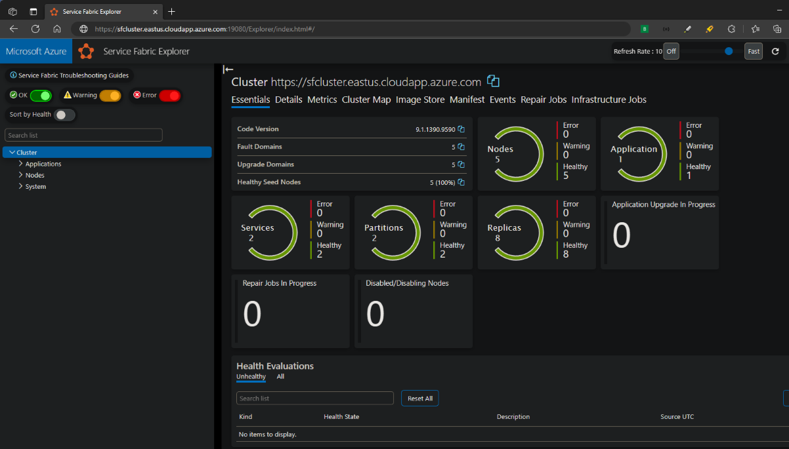

## Automated upgrade process with down time

This document outlines the automated process to upgrade from Basic to Standard SKU with down time, as part of the Load Balancer Deprecation Migration guide detailed [here](./Upgrade%20Service%20Fabric%20cluster%20basic%20load%20balancer.md).

> [!IMPORTANT]
> While the following process executes, connectivity to the cluster will be unavailable.

[Upgrade a Azure Load Balancer on Basic SKU used with Virtual Machine Scale Sets](https://learn.microsoft.com/azure/load-balancer/upgrade-basic-standard-virtual-machine-scale-sets) documents the commands used and detailed information about upgrading the SKU of the load balancer. Upgrading a scale set and node type for a Azure Service Fabric cluster will take longer to complete than documented in the link above due to cluster characteristics and requirements. Anticipate a minimum of one hour of downtime for a 'Silver' or 'Gold' on ASF Durability Level and 30 minutes for 'Bronze'.

### Process overview

- Updates front-end public IP addresses to Standard SKU and static assignment.
- Upgrades the Basic Load Balancer configuration to a new LB on Standard SKU ensuring configuration and feature parity.
- Adds outbound rule to LB for VMMS.
- Upgrades backend pool of VMMS to use the LB on Standard SKU.
- Creates and associates a new Network Security Group (NSG) for connectivity to the VMMS if one is not configured in the scale set network configuration. LB on Standard SKU requires this due to the default deny policy. Name will be 'NSG-\<scale set name\>'

### Pre-requisites for migration

Perform the following before starting the migration to a LB on Standard SKU.

- Verify that ASF cluster configuration is documented. If deploying cluster via ARM template verify template is latest version. If the ARM template is not available, a non-deployable template with the imperfect configuration can be exported from the Azure portal in the clusters resource group view by selecting 'Export template' to start with.
- Verify application configuration deployed on cluster is documented. If deploying cluster applications via ARM template verify template is current. Application port settings are configured in the application's manifest file.
- In Service Fabric Explorer (SFX), verify cluster is in a green state and currently healthy.
- Perform the migration process on a non-production cluster to catch any challenges with the process and downtime.
- Install latest version of [PowerShell on Windows](https://learn.microsoft.com/powershell/scripting/install/installing-powershell-on-windows).
- Install latest version of [Azure PowerShell Az module](https://docs.microsoft.com/powershell/azure/install-az-ps).

### Upgrade PowerShell commands

Below are PowerShell commands assuming Azure PowerShell Az module are already installed. See the link above for additional configurations are that are available.

A warning will be displayed for VMMS that have Service Fabric VM extension installed

```text
WARNING: 2023-05-08T11:25:49-04 [Warning]:[Test-SupportedMigrationScenario] VMSS appears to be a Service Fabric cluster based on extension profile. SF Clusters experienced potentially significant downtime during migration using this PowerShell module. In testing, a 5-node Bronze cluster was unavailable for about 30 minutes and a 5-node Silver cluster was unavailable for about 45 minutes. Shutting down the cluster VMSS prior to initiating migration will result in a more consistent experience of about 5 minutes to complete the LB migration. For Service Fabric clusters that require minimal / no connectivity downtime, adding a new node type with standard load balancer and IP resources is a better solution.
Do you want to proceed with the migration of your Service Fabric Cluster's Load Balancer?
Do you want to continue? (y/n)
```

```powershell
$resourceGroupName = '<resource group name>'
$loadBalancerName = '<load balancer name>'
if(!(Get-AzContext)) { Connect-AzAccount }
if(!(Get-Module -listAvailable -Name AzureBasicLoadBalancerUpgrade)) {
    Install-Module -Name AzureBasicLoadBalancerUpgrade -Repository PSGallery -Force
}
Start-AzBasicLoadBalancerUpgrade -ResourceGroupName $resourceGroupName `
    -BasicLoadBalancerName $loadBalancerName `
    -FollowLog
```

## Updating ARM template with changes

Best practice for ASF is to deploy, maintain, and recover clusters using ARM templates. After the upgrade completes, update the ARM template used for cluster deployment. The following base template was created from the Azure portal using a 5 node single node type cluster on Durability Level Silver. There are some resources in below diff, for example NSG rules, that may or may not apply or may need the TCP ports modified.

```diff
diff --git a/c:/configs/arm/sf-1nt-5n-1lb.json b/c:/configs/arm/sf-1nt-5n-1slb.json
index 0cd7316..8a54ba2 100644
--- a/c:/configs/arm/sf-1nt-5n-1lb.json
+++ b/c:/configs/arm/sf-1nt-5n-1slb.json
@@ -92,10 +92,17 @@
         },
         "lbIPName": {
             "type": "string",
             "defaultValue": "PublicIP-LB-FE"
         },
+        "networkSecurityGroupName": {
+            "type": "string",
+            "defaultValue": "NSG"
+        },
         "nicName": {
             "type": "string",
             "defaultValue": "NIC"
         },
         "nt0applicationEndPort": {
@@ -261,22 +268,27 @@
         {
             "apiVersion": "[variables('vNetApiVersion')]",
             "type": "Microsoft.Network/virtualNetworks",
             "name": "[parameters('virtualNetworkName')]",
             "location": "[parameters('computeLocation')]",
-            "dependsOn": [],
+            "dependsOn": [
+                "[concat('Microsoft.Network/networkSecurityGroups/',parameters('networkSecurityGroupName'))]"
+            ],
             "properties": {
                 "addressSpace": {
                     "addressPrefixes": [
                         "[parameters('addressPrefix')]"
                     ]
                 },
                 "subnets": [
                     {
                         "name": "[parameters('subnet0Name')]",
                         "properties": {
-                            "addressPrefix": "[parameters('subnet0Prefix')]"
+                            "addressPrefix": "[parameters('subnet0Prefix')]",
+                            "networkSecurityGroup": {
+                                "id": "[resourceId('Microsoft.Network/networkSecurityGroups',parameters('networkSecurityGroupName'))]"
+                            }
                         }
                     }
                 ]
             },
             "tags": {
@@ -287,26 +299,147 @@
         {
             "apiVersion": "[variables('publicIPApiVersion')]",
             "type": "Microsoft.Network/publicIPAddresses",
             "name": "[concat(parameters('lbIPName'),'-','0')]",
             "location": "[parameters('computeLocation')]",
+            "sku": {
+                "name": "Standard"
+            },
             "properties": {
                 "dnsSettings": {
                     "domainNameLabel": "[parameters('dnsName')]"
                 },
-                "publicIPAllocationMethod": "Dynamic"
+                "publicIPAllocationMethod": "Static"
             },
             "tags": {
                 "resourceType": "Service Fabric",
                 "clusterName": "[parameters('clusterName')]"
             }
         },
+        {
+            "name": "[parameters('networkSecurityGroupName')]",
+            "type": "Microsoft.Network/networkSecurityGroups",
+            "apiVersion": "2019-02-01",
+            "location": "[parameters('computelocation')]",
+            "properties": {
+                "securityRules": [
+                    {
+                        "name": "SF_AllowServiceFabricGatewayToSFRP",
+                        "type": "Microsoft.Network/networkSecurityGroups/securityRules",
+                        "properties": {
+                            "provisioningState": "Succeeded",
+                            "description": "This is required rule to allow SFRP to connect to the cluster. This rule cannot be overridden.",
+                            "protocol": "TCP",
+                            "sourcePortRange": "*",
+                            "sourceAddressPrefix": "ServiceFabric",
+                            "destinationAddressPrefix": "VirtualNetwork",
+                            "access": "Allow",
+                            "priority": 500,
+                            "direction": "Inbound",
+                            "sourcePortRanges": [],
+                            "destinationPortRanges": [
+                                "19000",
+                                "19080"
+                            ],
+                            "sourceAddressPrefixes": [],
+                            "destinationAddressPrefixes": []
+                        }
+                    },
+                    {
+                        "name": "SF_AllowServiceFabricGatewayToLB",
+                        "type": "Microsoft.Network/networkSecurityGroups/securityRules",
+                        "properties": {
+                            "provisioningState": "Succeeded",
+                            "description": "This is required rule to allow SFRP to connect to the cluster. This rule cannot be overridden.",
+                            "protocol": "*",
+                            "sourcePortRange": "*",
+                            "destinationPortRange": "*",
+                            "sourceAddressPrefix": "AzureLoadBalancer",
+                            "destinationAddressPrefix": "VirtualNetwork",
+                            "access": "Allow",
+                            "priority": 501,
+                            "direction": "Inbound",
+                            "sourcePortRanges": [],
+                            "destinationPortRanges": [],
+                            "sourceAddressPrefixes": [],
+                            "destinationAddressPrefixes": []
+                        }
+                    },
+                    {
+                        "name": "SF_AllowServiceFabricGatewayPorts",
+                        "type": "Microsoft.Network/networkSecurityGroups/securityRules",
+                        "properties": {
+                            "provisioningState": "Succeeded",
+                            "description": "Optional rule to open SF cluster gateway ports.",
+                            "protocol": "tcp",
+                            "sourcePortRange": "*",
+                            "sourceAddressPrefix": "*",
+                            "destinationAddressPrefix": "VirtualNetwork",
+                            "access": "Allow",
+                            "priority": 3001,
+                            "direction": "Inbound",
+                            "sourcePortRanges": [],
+                            "destinationPortRanges": [
+                                "19000",
+                                "19080"
+                            ],
+                            "sourceAddressPrefixes": [],
+                            "destinationAddressPrefixes": []
+                        }
+                    },
// For RDP connectivity if enabled START
+                    {
+                        "name": "SF_AllowRdpPort",
+                        "type": "Microsoft.Network/networkSecurityGroups/securityRules",
+                        "properties": {
+                            "provisioningState": "Succeeded",
+                            "description": "Optional rule to open RDP ports.",
+                            "protocol": "tcp",
+                            "sourcePortRange": "*",
+                            "destinationPortRange": "3389",
+                            "sourceAddressPrefix": "*",
+                            "destinationAddressPrefix": "VirtualNetwork",
+                            "access": "Allow",
+                            "priority": 3002,
+                            "direction": "Inbound",
+                            "sourcePortRanges": [],
+                            "destinationPortRanges": [],
+                            "sourceAddressPrefixes": [],
+                            "destinationAddressPrefixes": []
+                        }
+                    },
// For RDP connectivity if enabled END
// For Reverse Proxy connectivity if enabled START
+                    {
+                        "name": "SF_AllowReverseProxyPort",
+                        "type": "Microsoft.Network/networkSecurityGroups/securityRules",
+                        "properties": {
+                            "provisioningState": "Succeeded",
+                            "description": "Optional rule to open SF Reverse Proxy ports.",
+                            "protocol": "tcp",
+                            "sourcePortRange": "*",
+                            "destinationPortRange": "19081",
+                            "sourceAddressPrefix": "*",
+                            "destinationAddressPrefix": "VirtualNetwork",
+                            "access": "Allow",
+                            "priority": 503,
+                            "direction": "Inbound",
+                            "sourcePortRanges": [],
+                            "destinationPortRanges": [],
+                            "sourceAddressPrefixes": [],
+                            "destinationAddressPrefixes": []
+                        }
+                    },
// For Reverse Proxy connectivity if enabled END
+                    {
+                        "name": "SF_AllowSFExtensionToDLC",
+                        "type": "Microsoft.Network/networkSecurityGroups/securityRules",
+                        "properties": {
+                            "provisioningState": "Succeeded",
+                            "description": "This is required rule to allow SF Extension to connect to download center to download the cab. This rule cannot be overridden.",
+                            "protocol": "*",
+                            "sourcePortRange": "*",
+                            "destinationPortRange": "*",
+                            "sourceAddressPrefix": "*",
+                            "destinationAddressPrefix": "AzureFrontDoor.FirstParty",
+                            "access": "Allow",
+                            "priority": 502,
+                            "direction": "Outbound",
+                            "sourcePortRanges": [],
+                            "destinationPortRanges": [],
+                            "sourceAddressPrefixes": [],
+                            "destinationAddressPrefixes": []
+                        }
+                    }
+                ]
+            }
+        },
         {
             "apiVersion": "[variables('lbApiVersion')]",
             "type": "Microsoft.Network/loadBalancers",
             "name": "[concat('LB','-', parameters('clusterName'),'-',parameters('vmNodeType0Name'))]",
             "location": "[parameters('computeLocation')]",
+            "sku": {
+                "name": "Standard"
+            },
             "dependsOn": [
                 "[concat('Microsoft.Network/publicIPAddresses/',concat(parameters('lbIPName'),'-','0'))]"
             ],
             "properties": {
                 "frontendIPConfigurations": [
@@ -327,10 +460,11 @@
                 ],
                 "loadBalancingRules": [
                     {
                         "name": "LBRule",
                         "properties": {
+                            "disableOutboundSnat": true,
                             "backendAddressPool": {
                                 "id": "[variables('lbPoolID0')]"
                             },
                             "backendPort": "[parameters('nt0fabricTcpGatewayPort')]",
                             "enableFloatingIP": "false",
@@ -346,10 +480,11 @@
                         }
                     },
                     {
                         "name": "LBHttpRule",
                         "properties": {
+                            "disableOutboundSnat": true,
                             "backendAddressPool": {
                                 "id": "[variables('lbPoolID0')]"
                             },
                             "backendPort": "[parameters('nt0fabricHttpGatewayPort')]",
                             "enableFloatingIP": "false",
@@ -383,10 +518,29 @@
                             "port": "[parameters('nt0fabricHttpGatewayPort')]",
                             "protocol": "tcp"
                         }
                     }
                 ],
+                "outboundRules": [
+                    {
+                        "name": "DefaultIPv4",
+                        "properties": {
+                            "allocatedOutboundPorts": 0,
+                            "protocol": "All",
+                            "enableTcpReset": true,
+                            "idleTimeoutInMinutes": 4,
+                            "backendAddressPool": {
+                                "id": "[variables('lbPoolID0')]"
+                            },
+                            "frontendIPConfigurations": [
+                                {
+                                    "id": "[variables('lbIPConfig0')]"
+                                }
+                            ]
+                        }
+                    }
+                ],
                 "inboundNatPools": [
                     {
                         "name": "LoadBalancerBEAddressNatPool",
                         "properties": {
                             "backendPort": "3389",
```

## Verification

After migration to the LB on Standard SKU is complete, verify functionality and connectivity.

### Check connectivity

For Public LB, from an external device or admin machine, open PowerShell and run the following commands to verify port connectivity. If there are connectivity issues, review the NSG security rules. Depending on the configuration, there may be multiple NSGs configured for the cluster if the migration script does not detect an existing NSG.

>[!IMPORTANT]
> The newly created NSG will not have rules to access the Remote Desktop Protocol (RDP) port. For RDP, after the migration to LB on Standard SKU, add a new rule for RDP in new NSG.

```powershell
$managementEndpoint = 'sfcluster.eastus.cloudapp.azure.com'
$networkPorts = @(
  19000, # default gateway address
  19080, # default https address
  19081, # default reverse proxy address if enabled
  3389   # default RDP port for node 0 if enabled
)
foreach($port in $networkPorts) {
  test-netConnection -ComputerName $managementEndpoint -Port $port
}
```

### Check functionality

Check all application ports configured for cluster.

```powershell
$managementEndpoint = 'sfcluster.eastus.cloudapp.azure.com'
$networkPorts = @(443,20000) # add application ports that are publicly accessible
foreach($port in $networkPorts) {
  test-netConnection -ComputerName $managementEndpoint -Port $port
}
```

### Check cluster health

Open SFX and verify that the cluster health is green without any warnings or errors.

Example URL for SFX: https://sfcluster.eastus.cloudapp.azure.com:19080/Explorer



## Troubleshooting

- Use -Verbose and -Debug arguments for additional logging

    ```powershell
    $resourceGroupName = '<resource group name>'
    $loadBalancerName = '<load balancer name>'
    Start-AzBasicLoadBalancerUpgrade -ResourceGroupName $resourceGroupName `
        -BasicLoadBalancerName $loadBalancerName `
        -FollowLog `
        -Verbose `
        -Debug

    DEBUG: AzureQoSEvent:  Module: Az.Network:5.3.0; CommandName: Get-AzLoadBalancer; PSVersion: 7.3.1; IsSuccess: True; Duration: 00:00:02.4149601
    DEBUG: 1:16:48 PM - [ConfigManager] Got [True] from [EnableDataCollection], Module = [], Cmdlet = [].
    DEBUG: 1:16:48 PM - GetAzureRmLoadBalancer end processing.
    WARNING: [Warning]:[PublicIPToStatic] 'PublicIP-LB-FE-0' ('xxx.xxx.xxx.xxx') was using Dynamic IP, changing to Static IP allocation method.
    WARNING: [Warning]:[PublicFEMigration] 'PublicIP-LB-FE-0' ('xxx.xxx.xxx.xxx') is using Basic SKU, changing Standard SKU.
    WARNING: [Warning]:[NatRulesMigration] NAT Rule 'LoadBalancerBEAddressNatPool.0' appears to have been dynamically created for Inbound NAT Pool 'LoadBalancerBEAddressNatPool'. This rule will not be migrated!
    WARNING: [Warning]:[NatRulesMigration] NAT Rule 'LoadBalancerBEAddressNatPool.1' appears to have been dynamically created for Inbound NAT Pool 'LoadBalancerBEAddressNatPool'. This rule will not be migrated!
    WARNING: [Warning]:[NatRulesMigration] NAT Rule 'LoadBalancerBEAddressNatPool.2' appears to have been dynamically created for Inbound NAT Pool 'LoadBalancerBEAddressNatPool'. This rule will not be migrated!
    WARNING: [Warning]:[NatRulesMigration] NAT Rule 'LoadBalancerBEAddressNatPool.3' appears to have been dynamically created for Inbound NAT Pool 'LoadBalancerBEAddressNatPool'. This rule will not be migrated!
    WARNING: [Warning]:[NatRulesMigration] NAT Rule 'LoadBalancerBEAddressNatPool.4' appears to have been dynamically created for Inbound NAT Pool 'LoadBalancerBEAddressNatPool'. This rule will not be migrated!
    ```

- Use the latest version of 'AzureBasicLoadBalancerUpgrade'.

    ```powershell
    # clean and install latest AzureBasicLoadBalancerUpgrade module
    Remove-Module AzureBasicLoadBalancerUpgrade
    while(Get-Module AzureBasicLoadBalancerUpgrade -listAvailable) {
        Uninstall-Module AzureBasicLoadBalancerUpgrade -force
    }

    Install-Module -Name AzureBasicLoadBalancerUpgrade -Repository PSGallery -Force
    ```

- Use the latest version of PowerShell (pwsh). Using Windows PowerShell 5.1 may cause issues like the following:

    ```text
    2024-02-27T10:28:01-05 [Information]:[LBMigrationPrep] Failed backup preparation step for 'LB-villar1-n2' 
    log : 2024-02-27T10:28:01-05 [Error]:[BackupVmss] Exporting the VMSS 'n2' for backup purposes failed. 
    This is likely due to the VMSS having an extension with a complex object type in the settings. 
    **Please try again in PowerShell Core** 
    Error: Exception calling "Serialize" with "3" argument(s): 
    "The collection type 'System.Object' on 'Microsoft.Azure.Commands.Compute.Automation.Models.PSVirtualMachineScaleSetExtension.Settings' is not supported."
    At C:\Program Files\WindowsPowerShell\Modules\AzureBasicLoadBalancerUpgrade\2.4.5\modules\BackupResources\BackupResources.psm1:126 char:17
    + ...               log -Severity Error -Message $message -terminateOnError
    +                   ~~~~~~~~~~~~~~~~~~~~~~~~~~~~~~~~~~~~~~~~~~~~~~~~~~~~~~~
        + CategoryInfo          : NotSpecified: (:) [Write-Error], WriteErrorException
        + FullyQualifiedErrorId : Microsoft.PowerShell.Commands.WriteErrorException,log
    ```

- Use the latest version of Azure PowerShell 'Az' modules.

    ```powershell
    # clean and install latest Az module
    Remove-Module Az
    Uninstall-Module Az -Force
    while(Get-Module Az.* -listAvailable) {
        Get-Module Az.* -listAvailable | Uninstall-Module -force
    }

    Install-Module Az -force
    ```

- Use [Azure Cloud Shell](https://shell.azure.com) which has a tested clean configuration with latest version of Az modules.

- Check the 'Events' tab in SFX for warnings or errors.

  Example of event view in SFX: https://sfcluster.eastus.cloudapp.azure.com:19080/Explorer/index.html#/events

  
