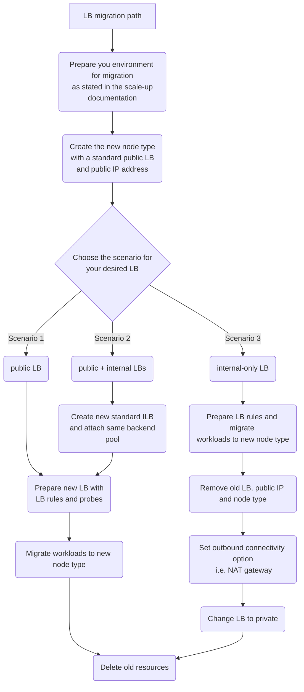
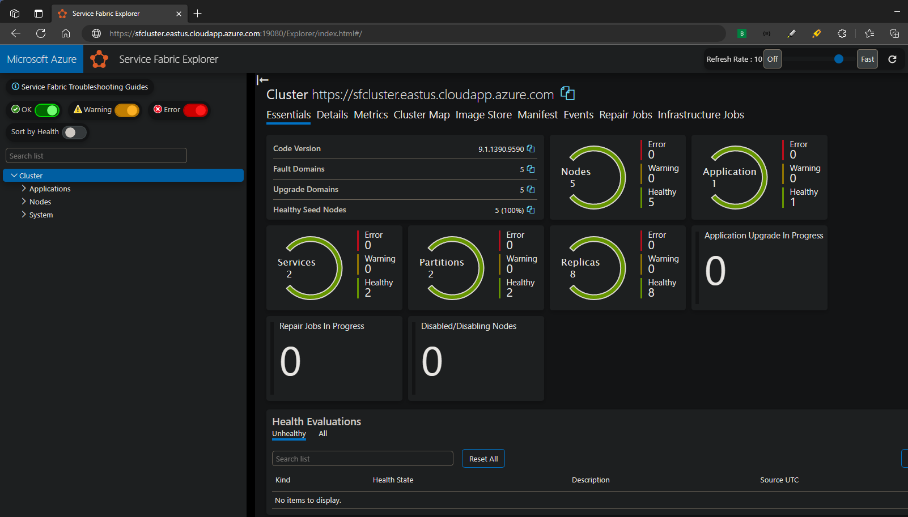
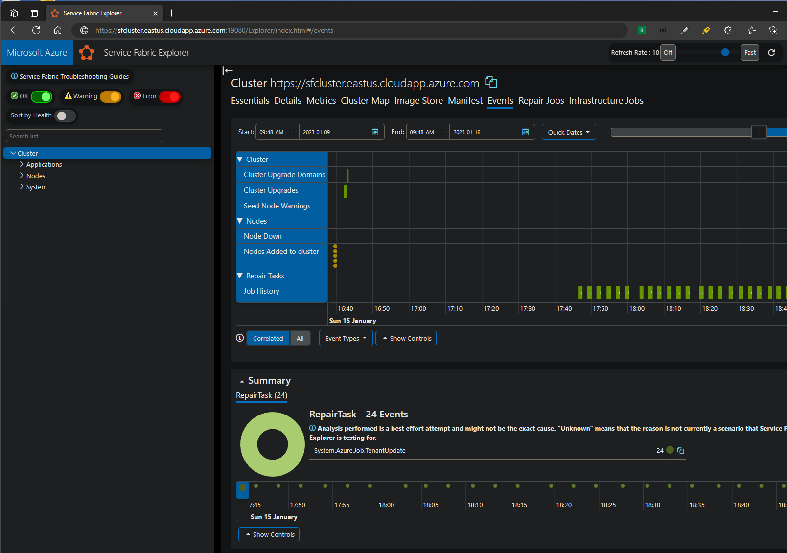

# Upgrade Service Fabric cluster from Basic load balancer to Standard load balancer SKU

## Abstract 
Azure Basic Load Balancers will be retired on September 30th, 2025. To avoid any disruptions you need to migrate to Standard Load Balancer before the deprecation date. Starting March 31st 2025, you won't be able to create any new basic sku Load Balancers. Read more in the [official announcement](https://azure.microsoft.com/en-us/updates/azure-basic-load-balancer-will-be-retired-on-30-september-2025-upgrade-to-standard-load-balancer/). If you have an Azure Basic Load Balancer associated with a Service Fabric cluster, please follow this guide to migrate to keep your cluster safe. Plan accordingly the migration path you will take based on your current load balancer configuration, number of node types, and workloads in your cluster. 

To check the sku of your existing load balancers, please navigate to the Load Balancer resource in the Azure Portal. In the overview page, you will find the sku size. 

## Overview

This documents the options available to upgrade a basic load balancer sku to a standard ip and load balancer sku for a Service Fabric cluster. Choose one of the options below based on availability requirements.

> [!NOTE]
> This does not apply to [Service Fabric managed clusters](https://learn.microsoft.com/azure/service-fabric/overview-managed-cluster). Service Fabric managed clusters with 'Basic' SKU are provisioned with a 'Basic' load balancer but cannot be upgraded and must be redeployed . Service Fabric managed clusters with 'Standard' SKU have are provisioned with a 'Standard' load balancer and are not impacted.

## Manual Upgrade Process with no down time

To upgrade basic load balancers in a Service Fabric cluster with no downtime requires the creation of a new scale set (node type), standard load balancer, and standard IP address.  After the new node type is added to the cluster, you need to configure your load balancer depending on your specific scenario as shown in the decision diagram below. Lastly, applications/services are migrated to new node type, old node type with associated basic load balancer and IP address are deactivated and removed. This process takes multiple hours to complete and is documented in [Scale up a Service Fabric cluster primary node type](https://learn.microsoft.com/azure/service-fabric/service-fabric-scale-up-primary-node-type) and [Scale up a Service Fabric cluster non-primary node type](https://learn.microsoft.com/azure/service-fabric/service-fabric-scale-up-non-primary-node-type).

### Things to consider:
- Standard LB restricts traffic by default so you need to allow traffic through NSG. If you do not have an NSG make sure you add one to your subnet before the migration with the necessary rules. Read more [here](https://learn.microsoft.com/en-us/azure/service-fabric/service-fabric-best-practices-networking#network-security-rules). 
- Standard LB requires a Standard Sku public IP address. Take into account that your public IP address will need to get upgraded as well. With the manual process with no downtime, the public IP address will change, since we need to create a new resource. 
- Read more about Basic to standard LB comparison [here](https://learn.microsoft.com/en-us/azure/load-balancer/skus#skus). 
- Standard Internal Load Balancers don't have outbound connectivity by design. If you are using an internal-only configuration, make sure you plan ahead to have outbound configuration when you migrate to standard ILB (i.e. using internal + public LB or NAT gateway). Read more about outbound connectivity [here](https://learn.microsoft.com/en-us/azure/load-balancer/outbound-rules#outbound-rules-scenarios). 
- If you use the Add-AzServiceFabricNodeType PowerShell module the new LB will always get created with basic Sku. You would need to use the Start-AzBasicLoadBalancerUpgrade module to upgrade the new LB to standard and make the necessary configurations to your new load balancer as stated in this guide.  
- Changing the DNS name to the new Load Balancer will cause a few seconds of connection loss to SFX.



### Basic migration
When you have a basic Load Balancer you only need to make sure that you have the necessary rules and probes set up in your new Load Balancer before migrating. Make sure that you migrate any additional network configuration to the new IP address as needed. 

### Internal and external migration
When you have a combination between internal and external Load Balancer you should use the public LB for the management endpoint and outbound connectivity of the cluster. The private LB should be used for any internal traffic. You can read more about this scenario [here](https://learn.microsoft.com/en-us/azure/service-fabric/service-fabric-patterns-networking#internal-and-external-load-balancer). 


### Internal-only migration
For internal-only migration you need to consider an outbound connectivity solution. We recommend using a combination between internal and external load balancers as mentioned above, or using a NAT gateway for outbound connectivity. This document specifies the process you should take when adding a NAT gateway. You can follow [these steps](https://learn.microsoft.com/en-us/azure/nat-gateway/tutorial-nat-gateway-load-balancer-internal-portal) for setting up the NAT gateway with a standard ILB. 

You need to have a public load balancer for the migration of the workload to the new node type. If not, the new nodes will not be able to get added to the cluster since it requires outbound connectivity, and the NAT gateway cannot be added to the subnet if there are any basic-sku resources. Take into account that this means you will have a public IP exposed temporarily during the migration. After this has been completed, change the load balancer from public to private following these steps:
1. Go to resources.azure.com, navigate to your load balancer and select Edit at the top of the page. 
2. Remove the publicIPAddress parameter in the frontendIpConfiguration section and replace it with the following:
```
      "privateIPAddress": "10.0.0.250",
      "subnet": {
            "id": "<subnet resource id>"
          },
```
Private IP 10.0.0.250 was used as an example but you can set this value as needed. Make sure the privateIPAllocationMethod is set to Static. 
3. Click PUT at the top of the page and wait for the update to complete. 
After this you can remove the public IP resource if it's not being used. 


### Additional considerations
- This documentation takes into account the scenarios specified [in this document](https://learn.microsoft.com/en-us/azure/service-fabric/service-fabric-patterns-networking). If you have a different configuration for your load balancers or if you encounter any issue when following this process, please engage Service Fabric support team for further assistance. 

## Automated Upgrade Process with down time

> [!IMPORTANT]
> While the following process executes, connectivity to the cluster will be unavailable.

[Upgrade a basic load balancer used with Virtual Machine Scale Sets](https://learn.microsoft.com/azure/load-balancer/upgrade-basic-standard-virtual-machine-scale-sets) documents the commands used and detailed information about upgrading the load balancer sku. Upgrading a scale set / node type for a Service Fabric cluster will take longer to complete than documented in link above due to cluster characteristics and requirements. Anticipate a minimum of one hour of downtime for a silver or greater cluster durability and 30 minutes for bronze.

### Process

- Updates front end public IP addresses to standard sku and static assignment.
- Upgrades the basic load balancer configuration to a new standard load balancer ensuring configuration and feature parity.
- Adds load balancer outbound rule for virtual machine scale set.
- Upgrades virtual machine scale set backend pool members to use the standard load balancer.
- Creates and associates a new network security group (NSG) for connectivity to virtual machine scale set if one is not configured in the scale set network configuration. Standard load balancers require this due to default deny policy. Name will be 'NSG-\<scale set name\>'

### Before migration

Perform the following before starting migration to standard load balancer.

- Verify current cluster configuration is documented. If deploying / recovering cluster via ARM template verify template is current. If ARM template is not available, a non-deployable template with current configuration can be exported from Azure portal in the clusters resource group view by selecting 'Export template'.

- Verify current cluster application configuration is documented. If deploying cluster applications via ARM template verify template is current. Application port settings are normally configured in the applications' manifest file.

- In Service Fabric Explorer (SFX), verify cluster is in a green state and currently healthy.

- If possible, perform migration process on a non-production cluster to familiarize the process and downtime.

### Upgrade Powershell commands

Below are basic powershell commands assuming Azure 'Az' modules are already installed. See link above for additional configurations are that are available.

A Warning will be displayed for scale sets that have Service Fabric extension installed

```text
WARNING: 2023-05-08T11:25:49-04 [Warning]:[Test-SupportedMigrationScenario] VMSS appears to be a Service Fabric cluster based on extension profile. SF Clusters experienced potentially significant downtime during migration using this PowerShell module. In testing, a 5-node Bronze cluster was unavailable for about 30 minutes and a 5-node Silver cluster was unavailable for about 45 minutes. Shutting down the cluster VMSS prior to initiating migration will result in a more consistent experience of about 5 minutes to complete the LB migration. For Service Fabric clusters that require minimal / no connectivity downtime, adding a new node type with standard load balancer and IP resources is a better solution.
Do you want to proceed with the migration of your Service Fabric Cluster's Load Balancer?
Do you want to continue? (y/n)
```

```powershell
$resourceGroupName = '<resource group name>'
$loadBalancerName = '<load balancer name>'
if(!(Get-AzContext)) { Connect-AzAccount }
if(!(Get-Module -listAvailable -Name AzureBasicLoadBalancerUpgrade)) {
    Install-Module -Name AzureBasicLoadBalancerUpgrade -Repository PSGallery -Force
}
Start-AzBasicLoadBalancerUpgrade -ResourceGroupName $resourceGroupName `
    -BasicLoadBalancerName $loadBalancerName `
    -FollowLog
```

## Updating ARM template with changes

Best practice for Service fabric is to deploy, maintain, and recover clusters using ARM templates. After upgrade completes, update ARM template used for cluster deployment. The following base template was created from the Azure portal using a 'silver' 5 node single node type cluster. There are some resources in below diff, for example NSG rules, that may or may not apply or may need the tcp ports modified.

```diff
diff --git a/c:/configs/arm/sf-1nt-5n-1lb.json b/c:/configs/arm/sf-1nt-5n-1slb.json
index 0cd7316..8a54ba2 100644
--- a/c:/configs/arm/sf-1nt-5n-1lb.json
+++ b/c:/configs/arm/sf-1nt-5n-1slb.json
@@ -92,10 +92,17 @@
         },
         "lbIPName": {
             "type": "string",
             "defaultValue": "PublicIP-LB-FE"
         },
+        "networkSecurityGroupName": {
+            "type": "string",
+            "defaultValue": "NSG"
+        },
         "nicName": {
             "type": "string",
             "defaultValue": "NIC"
         },
         "nt0applicationEndPort": {
@@ -261,22 +268,27 @@
         {
             "apiVersion": "[variables('vNetApiVersion')]",
             "type": "Microsoft.Network/virtualNetworks",
             "name": "[parameters('virtualNetworkName')]",
             "location": "[parameters('computeLocation')]",
-            "dependsOn": [],
+            "dependsOn": [
+                "[concat('Microsoft.Network/networkSecurityGroups/',parameters('networkSecurityGroupName'))]"
+            ],
             "properties": {
                 "addressSpace": {
                     "addressPrefixes": [
                         "[parameters('addressPrefix')]"
                     ]
                 },
                 "subnets": [
                     {
                         "name": "[parameters('subnet0Name')]",
                         "properties": {
-                            "addressPrefix": "[parameters('subnet0Prefix')]"
+                            "addressPrefix": "[parameters('subnet0Prefix')]",
+                            "networkSecurityGroup": {
+                                "id": "[resourceId('Microsoft.Network/networkSecurityGroups',parameters('networkSecurityGroupName'))]"
+                            }
                         }
                     }
                 ]
             },
             "tags": {
@@ -287,26 +299,147 @@
         {
             "apiVersion": "[variables('publicIPApiVersion')]",
             "type": "Microsoft.Network/publicIPAddresses",
             "name": "[concat(parameters('lbIPName'),'-','0')]",
             "location": "[parameters('computeLocation')]",
+            "sku": {
+                "name": "Standard"
+            },
             "properties": {
                 "dnsSettings": {
                     "domainNameLabel": "[parameters('dnsName')]"
                 },
-                "publicIPAllocationMethod": "Dynamic"
+                "publicIPAllocationMethod": "Static"
             },
             "tags": {
                 "resourceType": "Service Fabric",
                 "clusterName": "[parameters('clusterName')]"
             }
         },
+        {
+            "name": "[parameters('networkSecurityGroupName')]",
+            "type": "Microsoft.Network/networkSecurityGroups",
+            "apiVersion": "2019-02-01",
+            "location": "[parameters('computelocation')]",
+            "properties": {
+                "securityRules": [
+                    {
+                        "name": "SF_AllowServiceFabricGatewayToSFRP",
+                        "type": "Microsoft.Network/networkSecurityGroups/securityRules",
+                        "properties": {
+                            "provisioningState": "Succeeded",
+                            "description": "This is required rule to allow SFRP to connect to the cluster. This rule cannot be overridden.",
+                            "protocol": "TCP",
+                            "sourcePortRange": "*",
+                            "sourceAddressPrefix": "ServiceFabric",
+                            "destinationAddressPrefix": "VirtualNetwork",
+                            "access": "Allow",
+                            "priority": 500,
+                            "direction": "Inbound",
+                            "sourcePortRanges": [],
+                            "destinationPortRanges": [
+                                "19000",
+                                "19080"
+                            ],
+                            "sourceAddressPrefixes": [],
+                            "destinationAddressPrefixes": []
+                        }
+                    },
+                    {
+                        "name": "SF_AllowServiceFabricGatewayToLB",
+                        "type": "Microsoft.Network/networkSecurityGroups/securityRules",
+                        "properties": {
+                            "provisioningState": "Succeeded",
+                            "description": "This is required rule to allow SFRP to connect to the cluster. This rule cannot be overridden.",
+                            "protocol": "*",
+                            "sourcePortRange": "*",
+                            "destinationPortRange": "*",
+                            "sourceAddressPrefix": "AzureLoadBalancer",
+                            "destinationAddressPrefix": "VirtualNetwork",
+                            "access": "Allow",
+                            "priority": 501,
+                            "direction": "Inbound",
+                            "sourcePortRanges": [],
+                            "destinationPortRanges": [],
+                            "sourceAddressPrefixes": [],
+                            "destinationAddressPrefixes": []
+                        }
+                    },
+                    {
+                        "name": "SF_AllowServiceFabricGatewayPorts",
+                        "type": "Microsoft.Network/networkSecurityGroups/securityRules",
+                        "properties": {
+                            "provisioningState": "Succeeded",
+                            "description": "Optional rule to open SF cluster gateway ports.",
+                            "protocol": "tcp",
+                            "sourcePortRange": "*",
+                            "sourceAddressPrefix": "*",
+                            "destinationAddressPrefix": "VirtualNetwork",
+                            "access": "Allow",
+                            "priority": 3001,
+                            "direction": "Inbound",
+                            "sourcePortRanges": [],
+                            "destinationPortRanges": [
+                                "19000",
+                                "19080"
+                            ],
+                            "sourceAddressPrefixes": [],
+                            "destinationAddressPrefixes": []
+                        }
+                    },
// For RDP connectivity if enabled START
+                    {
+                        "name": "SF_AllowRdpPort",
+                        "type": "Microsoft.Network/networkSecurityGroups/securityRules",
+                        "properties": {
+                            "provisioningState": "Succeeded",
+                            "description": "Optional rule to open RDP ports.",
+                            "protocol": "tcp",
+                            "sourcePortRange": "*",
+                            "destinationPortRange": "3389",
+                            "sourceAddressPrefix": "*",
+                            "destinationAddressPrefix": "VirtualNetwork",
+                            "access": "Allow",
+                            "priority": 3002,
+                            "direction": "Inbound",
+                            "sourcePortRanges": [],
+                            "destinationPortRanges": [],
+                            "sourceAddressPrefixes": [],
+                            "destinationAddressPrefixes": []
+                        }
+                    },
// For RDP connectivity if enabled END
// For Reverse Proxy connectivity if enabled START
+                    {
+                        "name": "SF_AllowReverseProxyPort",
+                        "type": "Microsoft.Network/networkSecurityGroups/securityRules",
+                        "properties": {
+                            "provisioningState": "Succeeded",
+                            "description": "Optional rule to open SF Reverse Proxy ports.",
+                            "protocol": "tcp",
+                            "sourcePortRange": "*",
+                            "destinationPortRange": "19081",
+                            "sourceAddressPrefix": "*",
+                            "destinationAddressPrefix": "VirtualNetwork",
+                            "access": "Allow",
+                            "priority": 503,
+                            "direction": "Inbound",
+                            "sourcePortRanges": [],
+                            "destinationPortRanges": [],
+                            "sourceAddressPrefixes": [],
+                            "destinationAddressPrefixes": []
+                        }
+                    },
// For Reverse Proxy connectivity if enabled END
+                    {
+                        "name": "SF_AllowSFExtensionToDLC",
+                        "type": "Microsoft.Network/networkSecurityGroups/securityRules",
+                        "properties": {
+                            "provisioningState": "Succeeded",
+                            "description": "This is required rule to allow SF Extension to connect to download center to download the cab. This rule cannot be overridden.",
+                            "protocol": "*",
+                            "sourcePortRange": "*",
+                            "destinationPortRange": "*",
+                            "sourceAddressPrefix": "*",
+                            "destinationAddressPrefix": "AzureFrontDoor.FirstParty",
+                            "access": "Allow",
+                            "priority": 502,
+                            "direction": "Outbound",
+                            "sourcePortRanges": [],
+                            "destinationPortRanges": [],
+                            "sourceAddressPrefixes": [],
+                            "destinationAddressPrefixes": []
+                        }
+                    }
+                ]
+            }
+        },
         {
             "apiVersion": "[variables('lbApiVersion')]",
             "type": "Microsoft.Network/loadBalancers",
             "name": "[concat('LB','-', parameters('clusterName'),'-',parameters('vmNodeType0Name'))]",
             "location": "[parameters('computeLocation')]",
+            "sku": {
+                "name": "Standard"
+            },
             "dependsOn": [
                 "[concat('Microsoft.Network/publicIPAddresses/',concat(parameters('lbIPName'),'-','0'))]"
             ],
             "properties": {
                 "frontendIPConfigurations": [
@@ -327,10 +460,11 @@
                 ],
                 "loadBalancingRules": [
                     {
                         "name": "LBRule",
                         "properties": {
+                            "disableOutboundSnat": true,
                             "backendAddressPool": {
                                 "id": "[variables('lbPoolID0')]"
                             },
                             "backendPort": "[parameters('nt0fabricTcpGatewayPort')]",
                             "enableFloatingIP": "false",
@@ -346,10 +480,11 @@
                         }
                     },
                     {
                         "name": "LBHttpRule",
                         "properties": {
+                            "disableOutboundSnat": true,
                             "backendAddressPool": {
                                 "id": "[variables('lbPoolID0')]"
                             },
                             "backendPort": "[parameters('nt0fabricHttpGatewayPort')]",
                             "enableFloatingIP": "false",
@@ -383,10 +518,29 @@
                             "port": "[parameters('nt0fabricHttpGatewayPort')]",
                             "protocol": "tcp"
                         }
                     }
                 ],
+                "outboundRules": [
+                    {
+                        "name": "DefaultIPv4",
+                        "properties": {
+                            "allocatedOutboundPorts": 0,
+                            "protocol": "All",
+                            "enableTcpReset": true,
+                            "idleTimeoutInMinutes": 4,
+                            "backendAddressPool": {
+                                "id": "[variables('lbPoolID0')]"
+                            },
+                            "frontendIPConfigurations": [
+                                {
+                                    "id": "[variables('lbIPConfig0')]"
+                                }
+                            ]
+                        }
+                    }
+                ],
                 "inboundNatPools": [
                     {
                         "name": "LoadBalancerBEAddressNatPool",
                         "properties": {
                             "backendPort": "3389",
```

## Verification

After migration to standard load balancer is complete, verify functionality and connectivity.

### Check connectivity

For public load balancers, from an external device / admin machine, open powershell and run the following commands to Service Fabric port connectivity. If there are connectivity issues, verify the NSG security rules. Depending on configuration, there may be multiple NSG's configured for cluster if migration script does not detect an existing NSG.

> ### :exclamation:NOTE: The newly created NSG will not have rules for RDP port access. For RDP access after migration to standard load balancer, add a new rule for RDP in new NSG.

```powershell
$managementEndpoint = 'sfcluster.eastus.cloudapp.azure.com'
$networkPorts = @(
  19000, # default gateway address
  19080, # default https address
  19081, # default reverse proxy address if enabled
  3389   # default RDP port for node 0 if enabled
)
foreach($port in $networkPorts) {
  test-netConnection -ComputerName $managementEndpoint -Port $port
}
```

### Check functionality

Check all application / service type ports configured for cluster.

```powershell
$managementEndpoint = 'sfcluster.eastus.cloudapp.azure.com'
$networkPorts = @(443,20000) # add application ports that are publicly accessible
foreach($port in $networkPorts) {
  test-netConnection -ComputerName $managementEndpoint -Port $port
}
```

### Check cluster

Open Service Fabric Explorer (SFX) and verify cluster is 'green' with no warnings or errors.

Example: https://sfcluster.eastus.cloudapp.azure.com:19080/Explorer



## Troubleshooting

- Use -Verbose and -Debug arguments for additional logging

    ```powershell
    $resourceGroupName = '<resource group name>'
    $loadBalancerName = '<load balancer name>'
    Start-AzBasicLoadBalancerUpgrade -ResourceGroupName $resourceGroupName `
        -BasicLoadBalancerName $loadBalancerName `
        -FollowLog `
        -Verbose `
        -Debug

    DEBUG: AzureQoSEvent:  Module: Az.Network:5.3.0; CommandName: Get-AzLoadBalancer; PSVersion: 7.3.1; IsSuccess: True; Duration: 00:00:02.4149601
    DEBUG: 1:16:48 PM - [ConfigManager] Got [True] from [EnableDataCollection], Module = [], Cmdlet = [].
    DEBUG: 1:16:48 PM - GetAzureRmLoadBalancer end processing.
    WARNING: [Warning]:[PublicIPToStatic] 'PublicIP-LB-FE-0' ('xxx.xxx.xxx.xxx') was using Dynamic IP, changing to Static IP allocation method.
    WARNING: [Warning]:[PublicFEMigration] 'PublicIP-LB-FE-0' ('xxx.xxx.xxx.xxx') is using Basic SKU, changing Standard SKU.
    WARNING: [Warning]:[NatRulesMigration] NAT Rule 'LoadBalancerBEAddressNatPool.0' appears to have been dynamically created for Inbound NAT Pool 'LoadBalancerBEAddressNatPool'. This rule will not be migrated!
    WARNING: [Warning]:[NatRulesMigration] NAT Rule 'LoadBalancerBEAddressNatPool.1' appears to have been dynamically created for Inbound NAT Pool 'LoadBalancerBEAddressNatPool'. This rule will not be migrated!
    WARNING: [Warning]:[NatRulesMigration] NAT Rule 'LoadBalancerBEAddressNatPool.2' appears to have been dynamically created for Inbound NAT Pool 'LoadBalancerBEAddressNatPool'. This rule will not be migrated!
    WARNING: [Warning]:[NatRulesMigration] NAT Rule 'LoadBalancerBEAddressNatPool.3' appears to have been dynamically created for Inbound NAT Pool 'LoadBalancerBEAddressNatPool'. This rule will not be migrated!
    WARNING: [Warning]:[NatRulesMigration] NAT Rule 'LoadBalancerBEAddressNatPool.4' appears to have been dynamically created for Inbound NAT Pool 'LoadBalancerBEAddressNatPool'. This rule will not be migrated!
    ```

- Use the latest version of 'AzureBasicLoadBalancerUpgrade'.

    ```powershell
    # clean and install latest AzureBasicLoadBalancerUpgrade module
    Remove-Module AzureBasicLoadBalancerUpgrade
    while(Get-Module AzureBasicLoadBalancerUpgrade -listAvailable) {
        Uninstall-Module AzureBasicLoadBalancerUpgrade -force
    }

    Install-Module -Name AzureBasicLoadBalancerUpgrade -Repository PSGallery -Force
    ```

- Use the latest version of Azure 'Az' modules.

    ```powershell
    # clean and install latest Az module
    Remove-Module Az
    Uninstall-Module Az -Force
    while(Get-Module Az.* -listAvailable) {
        Get-Module Az.* -listAvailable | Uninstall-Module -force
    }

    Install-Module Az -force
    ```

- Use [cloud shell](https://shell.azure.com) which has a tested clean configuration with latest version of Az modules.

- Check SFX Events for any warnings or errors.

  Example: https://sfcluster.eastus.cloudapp.azure.com:19080/Explorer/index.html#/events

  

</details>
