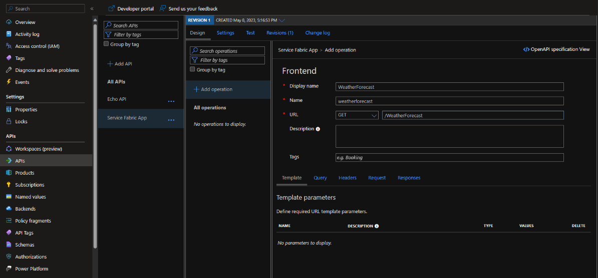
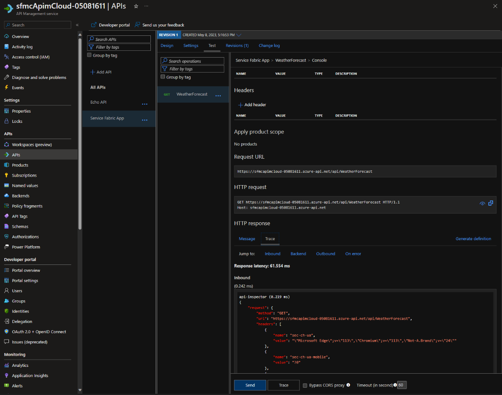
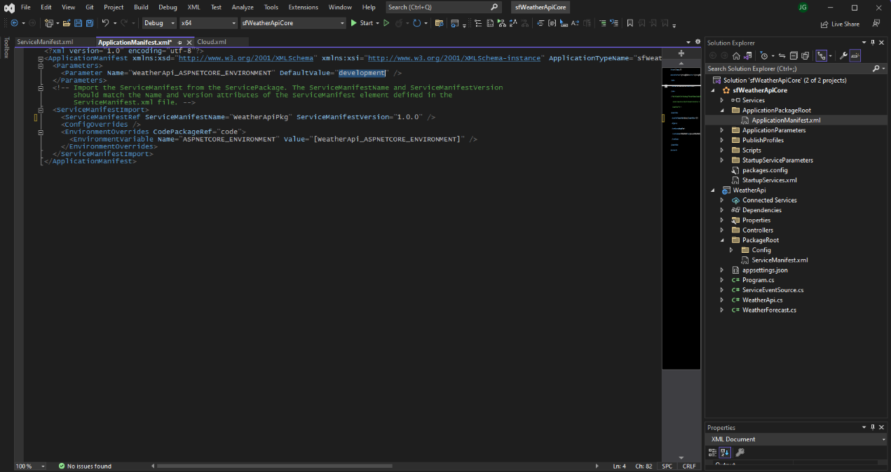
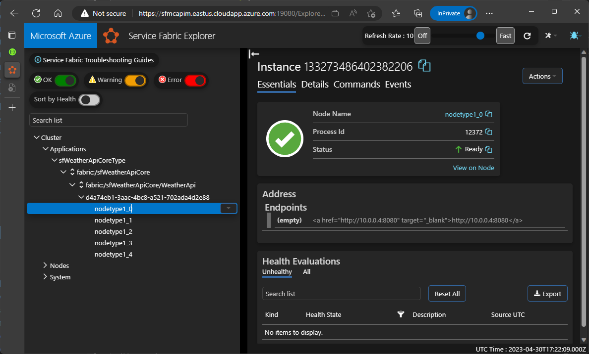
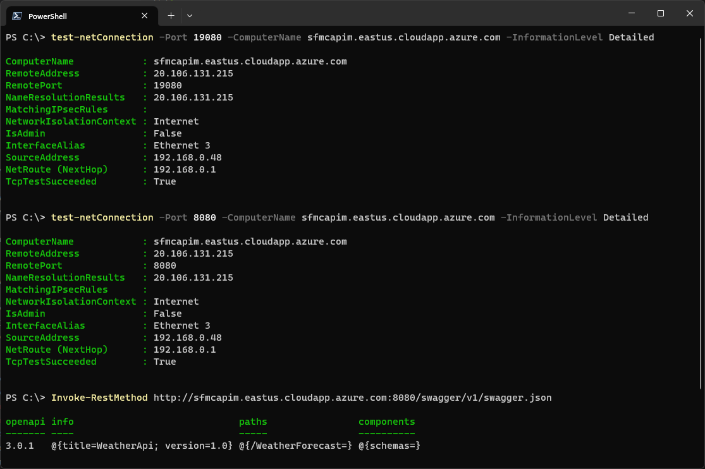

# How to configure APIM for a Service Fabric managed cluster Service Connection

This document describes the steps to configure [Azure API Management](https://learn.microsoft.com/azure/api-management/) (APIM) to route traffic to a back-end service in a Service Fabric managed cluster (SFMC) using PowerShell. For unmanaged clusters, refer to [Integrate API Management with Service Fabric in Azure](https://learn.microsoft.com/azure/service-fabric/service-fabric-tutorial-deploy-api-management).

> [!IMPORTANT]
> Service Fabric managed clusters now have the capability that allows the use of a static cluster / server certificate configuration. The new FQDN format for the cluster is: **`<cluster-name>.<generated string>.<region>.sfmc.io`**. Prior to this option, connecting to a managed cluster required knowing the current cluster certificate thumbprint. By default, this certificate is auto-generated and rotated periodically. For APIM and managed clusters, it is highly recommended to use this new configuration to prevent connectivity issues from APIM when the cluster certificate is rotated. This update requires:

> - **ARM Template**: Minimum `api-version` of `2024-06-01-preview` (tested with `2024-09-01-preview`)
> - **PowerShell**: Az.ServiceFabric module

```diff
--- a/sfmc-template.json
+++ b/sfmc-template.json
@@ -81,7 +81,7 @@
     },
     "resources": [
         {
-            "apiVersion": "2022-06-01-preview",
+            "apiVersion": "2024-09-01-preview",
             "type": "Microsoft.ServiceFabric/managedclusters",
             "name": "[parameters('clusterName')]",
             "location": "[resourcegroup().location]",
@@ -89,6 +89,7 @@
                 "name": "[parameters('clusterSku')]"
             },
             "properties": {
+                "autoGeneratedDomainNameLabelScope": "ResourceGroupReuse",
                 "subnetId": "[parameters('subnetId')]",
                 "dnsName": "[toLower(parameters('clusterName'))]",
                 "adminUserName": "[parameters('adminUserName')]",
@@ -126,7 +127,7 @@
             }
         },
         {
-            "apiVersion": "2022-06-01-preview",
+            "apiVersion": "2024-09-01-preview",
             "type": "Microsoft.ServiceFabric/managedclusters/nodetypes",
             "name": "[concat(parameters('clusterName'), '/', parameters('nodeType1Name'))]",
             "location": "[resourcegroup().location]",
```

## SFMC Architecture Note

> [!NOTE]
> Service Fabric managed clusters create infrastructure resources in a **separate auto-managed resource group** named `SFC_<cluster-id>`. This resource group contains the actual infrastructure components (VMSS, storage accounts, load balancers, network security groups, virtual networks, etc.), while the primary resource group contains only the cluster resource itself and optionally a managed identity. When troubleshooting or monitoring deployments, check both resource groups.

## Requirements

- **Service Fabric managed cluster with static FQDN** (`autoGeneratedDomainNameLabelScope` set to `ResourceGroupReuse`). This provides a persistent FQDN that survives cluster certificate rotation (auto-rotates every 90 days). See [How to Configure Service Fabric Managed Cluster with Static FQDN](./how-to-configure-service-fabric-managed-cluster-static-fqdn.md) for detailed configuration instructions.
- Service Fabric managed cluster deployed using an existing external virtual network.
     This configuration is required for management of network settings that is not available with a default managed cluster deployment. See [Bring your own virtual network](https://learn.microsoft.com/azure/service-fabric/how-to-managed-cluster-networking#bring-your-own-virtual-network) in [Configure network settings for Service Fabric managed clusters](https://learn.microsoft.com/azure/service-fabric/how-to-managed-cluster-networking) for additional information and requirements.

- **Service Fabric managed cluster with a client certificate** (for admin access and APIM authentication). Certificate **MUST include Client Authentication EKU** (1.3.6.1.5.5.7.3.2). See [Client Certificate Configuration](#client-certificate-configuration) section below.
- Azure API Management service. See [Azure API Management](https://learn.microsoft.com/azure/api-management/) for additional information.
- Azure Key vault with certificate (optional - only if using Key Vault approach).

> [!NOTE]
> **Static FQDN Configuration**: The `autoGeneratedDomainNameLabelScope` property can be configured during cluster creation or added to existing clusters. For complete setup instructions, troubleshooting, and timing considerations, see [How to Configure Service Fabric Managed Cluster with Static FQDN](./how-to-configure-service-fabric-managed-cluster-static-fqdn.md).

## Validated Configuration

Testing has confirmed the following configuration successfully deploys a Service Fabric managed cluster with the static FQDN format:

**FQDN Format Generated**: `<cluster-name>.<generated-hash>.<region>.sfmc.io`

**Example**: `sfmctest1nt31.duhcd6fxcrbbffb0.centralus.sfmc.io`

**Key Benefits**:

- ✅ Static FQDN that persists across certificate rotations and resource group redeployments
- ✅ Automatic certificate rotation (every 90 days) without FQDN change
- ✅ No dependency on cluster certificate thumbprint for connectivity
- ✅ Compatible with Azure API Management backend configuration

For complete configuration details, ARM template examples, and troubleshooting guidance, see [How to Configure Service Fabric Managed Cluster with Static FQDN](./how-to-configure-service-fabric-managed-cluster-static-fqdn.md).

## Client Certificate Configuration

### Overview

Service Fabric managed clusters require a client certificate for authentication. This certificate is **separate from the cluster certificate** (which auto-rotates). For APIM integration, the client certificate serves two purposes:

1. **Admin access** for PowerShell management connections
2. **APIM authentication** to the Service Fabric cluster

> [!NOTE]
> **Client certificates are NOT installed on the cluster**. They are only needed on client machines (such as workstations, build servers, or APIM instances) that connect to the cluster. The cluster only stores the client certificate thumbprint or common name for validation.

### CRITICAL: Extended Key Usage (EKU) Requirement

**Client certificates MUST include the Client Authentication EKU** (OID: 1.3.6.1.5.5.7.3.2) or Service Fabric will reject the connection. This is the most common cause of authentication failures.

### Configuration Options

Service Fabric supports **two validation methods** for client certificates:

#### Option 1: Thumbprint-Based (RECOMMENDED for Most Organizations)

**Best for**: Organizations without private CA infrastructure, dev/test environments, or when using self-signed certificates.

**Advantages**:

- ✅ Works with self-signed certificates
- ✅ Simple setup (no CA required)
- ✅ Full control over rotation schedule
- ✅ Certificates valid for 1 year per current best practices

**Configuration**:

```json
{
  "clients": [
    {
      "isAdmin": true,
      "thumbprint": "0123456789ABCDEF0123456789ABCDEF01234567"
    }
  ]
}
```

**Generate self-signed certificate** (PowerShell):

```powershell
$cert = New-SelfSignedCertificate `
    -Subject "CN=apim-sf-client" `
    -CertStoreLocation "Cert:\CurrentUser\My" `
    -KeyUsage DigitalSignature, KeyEncipherment `
    -Type Custom `
    -KeySpec Signature `
    -KeyLength 2048 `
    -KeyExportPolicy Exportable `
    -NotAfter (Get-Date).AddYears(5) `
    -TextExtension @("2.5.29.37={text}1.3.6.1.5.5.7.3.2,1.3.6.1.5.5.7.3.1")
    #                             Client Auth EKU ^^^ (REQUIRED) Server Auth EKU ^^^ (optional)

# Verify EKUs (CRITICAL)
$cert.EnhancedKeyUsageList | Format-Table
# Must show: Client Authentication (1.3.6.1.5.5.7.3.2)

# Export for APIM
$pw = ConvertTo-SecureString -String "YourPassword" -Force -AsPlainText
Export-PfxCertificate -Cert $cert -FilePath "apim-client.pfx" -Password $pw
```

**Alternative: Generate via Azure Key Vault**

Azure Key Vault can generate self-signed certificates with the required Client Authentication EKU:

1. Navigate to Azure Key Vault → Certificates → Generate/Import
2. Select "Generate" method
3. Configure:
   - Certificate Name: `apim-sf-client`
   - Type: Self-signed certificate
   - Subject: `CN=apim-sf-client`
   - Validity Period: 12 months
   - **Advanced Policy Configuration**:
     - Extended Key Usages (EKUs): Add `1.3.6.1.5.5.7.3.2` (Client Authentication)
     - Key Usage Flags: Digital Signature, Key Encipherment
4. Download certificate as PFX for distribution to client machines

> [!NOTE]
> Key Vault serves as **centralized storage and distribution** for client certificates. Certificates must still be downloaded and installed on client machines (workstations, APIM instances, etc.) that need to connect to the cluster.

**Trade-off**: Requires manual APIM backend update when certificate expires.

#### Option 2: Common Name-Based (ONLY for Enterprises with Private CA)

**Best for**: Enterprises with private CA infrastructure (ADCS, OpenSSL CA, etc.) that can issue Client Authentication EKU certificates.

> [!IMPORTANT]
> **Common name-based authentication REQUIRES CA-issued certificates** - self-signed certificates are NOT supported. Service Fabric validates the certificate against the `issuerThumbprint` of the CA that issued it. Public CAs typically REFUSE to issue Client Authentication EKU due to CA/Browser Forum baseline requirements, so this approach realistically requires a private/enterprise CA infrastructure.

**Advantages**:

- ✅ Fully automated rotation (new certificate from same CA issuer automatically trusted)
- ✅ Zero manual updates when certificate rotates
- ✅ Aligned with cluster certificate rotation approach

**Prerequisites**:

- Private CA infrastructure (ADCS, OpenSSL CA, etc.)
- CA configured to issue certificates with Client Authentication EKU

**Configuration**:

```json
{
  "clients": [
    {
      "isAdmin": true,
      "commonName": "apim-client.yourcompany.com",
      "issuerThumbprint": "5F3660C715EBBDA31DB1FFDCF508302348DE8E7A"
    }
  ]
}
```

> [!NOTE]
> **Common Name Format**: The `commonName` value must be the certificate's SubjectName **without the 'CN=' prefix**. For example, if the certificate subject is `CN=apim-client.yourcompany.com`, use `apim-client.yourcompany.com` as the commonName value.

**PowerShell**:

```powershell
Add-AzServiceFabricManagedClusterClientCertificate `
    -ResourceGroupName "rg" `
    -ClusterName "cluster" `
    -CommonName "apim-client.yourcompany.com" `
    -IssuerThumbprint "5F3660C715EBBDA31DB1FFDCF508302348DE8E7A" `
    -Admin
```

**Trade-off**: Requires private CA infrastructure (not available to most organizations).

### Recommendation Summary

| Scenario | Recommended Approach |
|----------|---------------------|
| **Most organizations** | **Thumbprint-based with long-lived self-signed** |
| Production without private CA | Thumbprint-based (1 year validity) |
| Enterprises with private CA | Common name-based (fully automated rotation) |
| Dev/Test | Thumbprint-based (simplest setup) |

## Process

1. Create an Azure Resource Group to host the virtual network.

    ```powershell
    $resourceGroupName = 'TestRG'
    $location = 'EastUS'
    New-AzResourceGroup -Name $resourceGroupName -location $location
    ```

2. Create an Azure Network Security Group (NSG) for APIM.

    ```powershell
    $networkSecurityGroupName = 'vnet-apim-nsg'
    $networkSecurityGroup = New-AzNetworkSecurityGroup -Name $networkSecurityGroupName `
        -ResourceGroupName $resourceGroupName `
        -Location $location
    ```

3. Configure NSG rules for APIM using PowerShell or in the [Azure portal](https://portal.azure.com).

    ```powershell
    Add-AzNetworkSecurityRuleConfig -Name 'AllowManagementEndpoint' `
      -NetworkSecurityGroup $networkSecurityGroup `
      -Description 'Management endpoint for Azure portal and PowerShell' `
      -Access Allow `
      -Protocol Tcp `
      -Direction Inbound `
      -Priority 300 `
      -SourceAddressPrefix ApiManagement `
      -SourcePortRange * `
      -DestinationAddressPrefix VirtualNetwork `
      -DestinationPortRange 3443

    # Update the network security group
    Set-AzNetworkSecurityGroup -NetworkSecurityGroup $networkSecurityGroup
    ```

  > [!NOTE]
  > Create additional rules as needed according to [Virtual network configuration requirements](https://learn.microsoft.com/azure/api-management/virtual-network-reference?tabs=stv2#required-ports).

4. Create an Azure Virtual Network (VNET) named VNet with IP address prefix 10.0.0.0/16.

    ```powershell
    $vnet = @{
        Name = 'VNet'
        ResourceGroupName = $resourceGroupName
        Location = $location
        AddressPrefix = '10.0.0.0/16'
    }

    $virtualNetwork = New-AzVirtualNetwork @vnet
    ```

5. Create subnet configurations for the Service Fabric managed cluster and APIM.

    ```powershell
    $sfmcSubnet = @{
        Name = 'sfmc'
        VirtualNetwork = $virtualNetwork
        AddressPrefix = '10.0.0.0/24'
    }

    $apimSubnet = @{
        Name = 'apim'
        VirtualNetwork = $virtualNetwork
        AddressPrefix = '10.0.1.0/24'
        NetworkSecurityGroup = $networkSecurityGroup
    }

    Add-AzVirtualNetworkSubnetConfig @sfmcSubnet
    Add-AzVirtualNetworkSubnetConfig @apimSubnet
    ```

6. Associate the subnet configurations to the virtual network.

    ```powershell
    $virtualNetwork | Set-AzVirtualNetwork
    ```

7. Configure the Service Fabric Resource Provider permissions for Bring Your Own Virtual Network (BYOVNET). Refer to [Requirements](#requirements) for additional information.

    - Enumerate the Service Fabric Resource Provider (SFRP) principals from the current subscription:

        ```powershell
        $sfrpPrincipal = @(Get-AzADServicePrincipal -DisplayName 'Azure Service Fabric Resource Provider')
        ```

    - Obtain the subnet resource ID from the existing VNet for the managed cluster:

        ```powershell
        $virtualNetwork = Get-AzVirtualNetwork -Name $vnet.name -ResourceGroupName $resourceGroupName
        $sfmcSubnetID = $virtualNetwork.Subnets | Where-Object Name -eq $sfmcSubnet.Name | Select-Object -ExpandProperty Id
        ```

    - Assign Network Contributor role to the Service Fabric Resource Provider principals:

        ```powershell
        foreach($sfrpPrincipal in $sfrpPrincipal) {
          New-AzRoleAssignment -PrincipalId $sfrpPrincipal.Id -RoleDefinitionName 'Network Contributor' -Scope $sfmcSubnetId
        }
        ```

8. Create a Public IP Address for APIM.

    ```powershell
    $domainNameLabel = 'apimip'
    $ip = @{
        Name = 'apimip'
        ResourceGroupName = $resourceGroupName
        Location = $location
        Sku = 'Standard'
        AllocationMethod = 'Static'
        IpAddressVersion = 'IPv4'
        DomainNameLabel = $domainNameLabel
    }

    New-AzPublicIpAddress @ip
    ```

9. Create the API Management Service with external VNET integration. This operation can take approximately 1 hour to complete.

    ```powershell
    $virtualNetwork = Get-AzVirtualNetwork -Name $vnet.name -ResourceGroupName $resourceGroupName
    $apimSubnetId = $virtualNetwork.Subnets | Where-Object Name -eq $apimSubnet.Name | Select-Object -ExpandProperty Id
    $apimNetwork = New-AzApiManagementVirtualNetwork -SubnetResourceId $apimSubnetId
    $publicIpAddressId = Get-AzPublicIpAddress -Name $ip.name -ResourceGroupName $resourceGroupName | Select-Object -ExpandProperty Id
    $apimName = 'myApimCloud'
    $adminEmail = 'admin@contoso.com'
    $organization = 'contoso'

    New-AzApiManagement -ResourceGroupName $resourceGroupName `
      -Location $location `
      -Name $apimName `
      -Organization $organization `
      -AdminEmail $adminEmail `
      -VirtualNetwork $apimNetwork `
      -VpnType 'External' `
      -Sku 'Developer' `
      -PublicIpAddressId $publicIpAddressId
    ```

10. Create the Service Fabric managed cluster within the existing VNET.

    > [!NOTE]
    > An example Service Fabric Managed Cluster ARM template is provided in the [SFMC ARM deployment template](#sfmc-arm-deployment-template) section.
    <!-- todo: update link to master branch when available -->
    > Additional Service Fabric managed cluster ARM templates with domainNameLabel configuration are available:
    > - [SF-Managed-Standard-SKU-1-NT-DomainNameLabel](https://github.com/Azure-Samples/service-fabric-cluster-templates/tree/master/SF-Managed-Standard-SKU-1-NT-DomainNameLabel)
    > - [SF-Managed-Standard-SKU-1-NT-DomainNameLabel-KVVM-MI](https://github.com/Azure-Samples/service-fabric-cluster-templates/tree/master/SF-Managed-Standard-SKU-1-NT-DomainNameLabel-KVVM-MI)
    > - [Standard SKU Service Fabric managed cluster, 2 node types, deployed in to existing subnet](https://github.com/Azure-Samples/service-fabric-cluster-templates/tree/master/SF-Managed-Standard-SKU-2-NT-BYOVNET)

    ```powershell
    $templateFile = "$pwd\sfmc-template.json"
    $adminPassword = '<enter a password>'
    $clientCertificateThumbprint = '<enter a thumbprint>'

    $sfmc = @{
      clusterName = 'sfmcapim'
      clusterSku = 'Standard'
      adminUserName = 'cloudadmin'
      adminPassword = $adminPassword
      clientCertificateThumbprint = $clientCertificateThumbprint
      nodeType1name = 'nodetype1'
      nodeType1vmSize = 'Standard_D2s_v3'
      nodeType1vmInstanceCount = 5
      nodeType1dataDiskSizeGB = 256
      nodeType1vmImagePublisher = 'MicrosoftWindowsServer'
      nodeType1vmImageOffer = 'WindowsServer'
      nodeType1vmImageSku = '2022-Datacenter'
      nodeType1vmImageVersion = 'latest'
      subnetId = $sfmcSubnetId
    }

    New-AzResourceGroupDeployment -Name 'sfmcDeployment' `
      -ResourceGroupName $resourceGroupName `
      -TemplateFile $templateFile `
      -TemplateParameterObject $sfmc
    ```

11. Deploy an ASP.NET Web API service to Service Fabric. Refer to the [WeatherForecast Service Fabric API Example](#weatherforecast-service-fabric-api-example) section for guidance.

12. Upload the client certificate to APIM.

    **Option A: Direct Upload (RECOMMENDED - Simpler)**

    Upload the PFX file directly to APIM (no Key Vault or managed identity required):

    ```powershell
    $apiMgmtContext = New-AzApiManagementContext -ResourceGroupName $resourceGroupName -ServiceName $apimName
    $certPath = "C:\path\to\apim-client.pfx"
    $certPassword = "YourPassword"
    
    New-AzApiManagementCertificate -Context $apiMgmtContext `
        -CertificateId "sf-client-cert" `
        -PfxFilePath $certPath `
        -PfxPassword $certPassword
    
    $certificate = Get-AzApiManagementCertificate -Context $apiMgmtContext -CertificateId "sf-client-cert"
    $clientCertThumbprint = $certificate.Thumbprint
    ```

    Or upload via Azure Portal: **APIM → Certificates → Add → Upload PFX**

    **Option B: Key Vault Integration (Optional - More Complex)**

    Use this approach only if you have existing Key Vault infrastructure or require centralized certificate management.

    a. Create a system-assigned managed identity for APIM:

    ```powershell
    $apimService = Get-AzApiManagement -ResourceGroupName $resourceGroupName -Name $apimName
    Set-AzApiManagement -InputObject $apimService -SystemAssignedIdentity
    ```

    b. Configure Key Vault access policy:

    For Key Vaults using **Access policies**:

    ```powershell
    $keyVaultName = 'apimKV'
    $managedIdentityId = (Get-AzADServicePrincipal -SearchString $apimName).Id
    
    Set-AzKeyVaultAccessPolicy -VaultName $keyVaultName `
        -ObjectId $managedIdentityId `
        -PermissionsToSecrets get,list `
        -PermissionsToCertificates get,list `
        -PermissionsToKeys get,list
    ```
    
    For Key Vaults using **RBAC**:
    
    ```powershell
    $keyVaultName = 'apimKV'
    $managedIdentityId = (Get-AzADServicePrincipal -SearchString $apimName).Id
    $keyVaultId = (Get-AzKeyVault -VaultName $keyVaultName).Id
    
    New-AzRoleAssignment -ObjectId $managedIdentityId `
        -RoleDefinitionName 'Key Vault Secrets User' `
        -Scope $keyVaultId
    New-AzRoleAssignment -ObjectId $managedIdentityId `
        -RoleDefinitionName 'Key Vault Reader' `
        -Scope $keyVaultId
    ```
    
    c. Create Key Vault certificate reference in APIM:
    
    ```powershell
    $kvcertId = 'apimcloud-com'
    $secretIdentifier = 'https://apimKV.vault.azure.net/secrets/apimcloud-com/xxxxxxxxxxxxxxxxxxxxxxxxxxxxxxxx'
    $apiMgmtContext = New-AzApiManagementContext -ResourceGroupName $resourceGroupName -ServiceName $apimName
    
    $keyvault = New-AzApiManagementKeyVaultObject -SecretIdentifier $secretIdentifier
    $certificate = New-AzApiManagementCertificate -Context $apiMgmtContext `
        -CertificateId $kvcertId `
        -KeyVault $keyvault
    
    $clientCertThumbprint = $certificate.Thumbprint
    ```

13. Create a Service Fabric backend in APIM.

    **Key Configuration Points**:
    - **clientCertificateThumbprint**: The client certificate thumbprint from step 12 (authenticates APIM to cluster)
    - **serverX509Names**: The cluster FQDN (validates cluster certificate by common name)
    - **validateCertificateChain/Name**: Set to `false` (cluster uses auto-generated certificate)
    
    The cluster certificate is **separate** from the client certificate:
    - **Cluster cert**: Authenticates cluster to APIM (auto-rotates every 90 days, validated by common name)
    - **Client cert**: Authenticates APIM to cluster (your control, validated by thumbprint or common name)

    > [!NOTE]
    > The APIM ARM deployment template is provided in the [APIM ARM deployment template](#apim-arm-deployment-template) section.

    ```powershell
    $serviceFabricAppUrl = 'fabric:/sfWeatherApiCore/WeatherApi' # Format: 'fabric:/<Application>/<Service>'
    $clusterName = 'sfmcapim'
    $clusterResource = Get-AzResource -Name $clusterName -ResourceType 'Microsoft.ServiceFabric/managedclusters'
    $cluster = Get-AzServiceFabricManagedCluster -Name $clustername -ResourceGroupName $clusterResource.ResourceGroupName

    $backend = @{
      apimName = $apimName
      backendName = 'ServiceFabricBackend'
      description = 'Service Fabric backend'
      clientCertificateThumbprint = $clientCertThumbprint
      managementEndpoints = @("https://$($cluster.Fqdn):$($cluster.HttpGatewayConnectionPort)")
      maxPartitionResolutionRetries = 5
      serviceFabricManagedClusterFqdn = $cluster.Fqdn
      protocol = 'http'
      url = $serviceFabricAppUrl
      validateCertificateChain = $false
      validateCertificateName = $false
    }

    $backend | ConvertTo-Json

    New-AzResourceGroupDeployment -Name 'apimBackendDeployment' `
      -ResourceGroupName $resourceGroupName `
      -TemplateFile "$pwd\apim-backend.json" `
      -TemplateParameterObject $backend
    ```

14. Create an API in APIM.

    ```powershell
    $apiId = 'service-fabric-weatherforecast-app'
    $apiName = 'Service Fabric WeatherForecast App'
    $serviceUrl = 'http://servicefabric' # This value is not used for Service Fabric and can be any value

    New-AzApiManagementApi -Context $apiMgmtContext `
      -ApiId $apiId `
      -Name $apiName `
      -ServiceUrl $serviceUrl `
      -Protocols @('http', 'https') `
      -Path 'api'
    ```

15. Create an Operation.

    ```powershell
    $operationId = 'service-fabric-weatherforecast-app-operation'
    $operationName = 'Service Fabric WeatherForecast App Operation'

    New-AzApiManagementOperation -Context $apiMgmtContext `
      -ApiId $apiId `
      -OperationId $operationId `
      -Name $operationName `
      -Method 'GET' `
      -UrlTemplate '' `
      -Description ''
    ```

16. Create a Policy.

    ```powershell
    $sfResolveCondition = '@((int)context.Response.StatusCode != 200)'
    $policyString = "
    <policies>
        <inbound>
            <base />
            <set-backend-service backend-id=`"$($backend.backendName)`" sf-resolve-condition=`"$sfResolveCondition`" sf-service-instance-name=`"$serviceFabricAppUrl`" />
        </inbound>
        <backend>
            <base />
        </backend>
        <outbound>
            <base />
        </outbound>
        <on-error>
            <base />
        </on-error>
    </policies>"

    Set-AzApiManagementPolicy -Context $apiMgmtContext `
      -ApiId $apiId `
      -Policy $policyString `
      -Format 'application/vnd.ms-azure-apim.policy.raw+xml'
    ```

## Testing

Test the APIM connection by navigating to the APIM service API in the [Azure Portal](https://ms.portal.azure.com/#view/HubsExtension/BrowseResource/resourceType/Microsoft.ApiManagement%2Fservice).

1. Create a new API Operation. In this example, the only available API is 'WeatherForecast'.

    

2. Test the operation.

    

3. If needed, trace the operation for debugging purposes.

    

## Troubleshooting

### Client Certificate Authentication Issues

**Symptom**: "Certificate authentication failed" or "Access denied" errors when connecting to cluster

**Most Common Cause**: Certificate missing Client Authentication EKU

**Verification**:

```powershell
# Check certificate EKUs
$thumbprint = "0123456789ABCDEF0123456789ABCDEF01234567"
$cert = Get-ChildItem Cert:\CurrentUser\My\$thumbprint

Write-Host "Certificate Subject: $($cert.Subject)" -ForegroundColor Yellow
Write-Host "Certificate EKUs:" -ForegroundColor Yellow
$cert.EnhancedKeyUsageList | Format-Table FriendlyName, ObjectId

# Verify Client Authentication EKU is present
if ($cert.EnhancedKeyUsageList.ObjectId -contains "1.3.6.1.5.5.7.3.2") {
    Write-Host "✅ Certificate has Client Authentication EKU" -ForegroundColor Green
} else {
    Write-Host "❌ Certificate MISSING Client Authentication EKU - will not work!" -ForegroundColor Red
    Write-Host "You must regenerate the certificate with correct EKU" -ForegroundColor Yellow
}

# Check validity period
Write-Host "`nValidity:" -ForegroundColor Yellow
Write-Host "  Valid From: $($cert.NotBefore)"
Write-Host "  Valid To:   $($cert.NotAfter)"
Write-Host "  Current:    $(Get-Date)"

if ((Get-Date) -lt $cert.NotBefore -or (Get-Date) -gt $cert.NotAfter) {
    Write-Host "❌ Certificate is expired or not yet valid" -ForegroundColor Red
}
```

**Solution**: If EKU is missing, regenerate certificate with correct EKU (see [Client Certificate Configuration](#client-certificate-configuration) section).

### Verify cluster connectivity

Verify the ability to connect successfully to the cluster using PowerShell. The 'servicefabric' module is required and is installed as part of the Service Fabric SDK.

```powershell
import-module servicefabric
import-module az.resources

$location = 'EastUS'
$clusterName = 'sfmcapim'
$clusterResource = Get-AzResource -ResourceGroupName $resourceGroupName `
  -Name $clusterName `
  -ResourceType 'Microsoft.ServiceFabric/managedclusters' `
  -ExpandProperties
$serverCertThumbprint = $clusterResource.Properties.clusterCertificateThumbprints
$clusterFqdn = $clusterResource.Properties.fqdn
$clusterEndpoint = "$($clusterFqdn):19000"

# Connect using client certificate thumbprint
Connect-ServiceFabricCluster -ConnectionEndpoint $clusterEndpoint `
        -ServerCommonName $clusterFqdn `
        -StoreLocation CurrentUser `
        -StoreName My `
        -X509Credential `
        -FindType FindByThumbprint `
        -FindValue '<client certificate thumbprint>' `
        -Verbose

# Connect using client certificate common name
Connect-ServiceFabricCluster -ConnectionEndpoint $clusterEndpoint `
    -ServerCommonName $clusterFqdn `
    -StoreLocation CurrentUser `
    -StoreName My `
    -X509Credential `
    -FindType FindBySubjectName `
    -FindValue '<client certificate subject name>' `
    -Verbose

# Connect using Entra ID authentication
Connect-ServiceFabricCluster -ConnectionEndpoint $clusterEndpoint `
  -AzureActiveDirectory `
  -ServerCertThumbprint $serverCertThumbprint `
  -Verbose

# If above methods fail but below works, the issue might be with domain name label scope configuration
Connect-ServiceFabricCluster -ConnectionEndpoint $clusterEndpoint `
        -ServerThumbprint $serverCertThumbprint `
        -StoreLocation 'CurrentUser' `
        -StoreName 'My' `
        -X509Credential `
        -FindType FindByThumbprint `
        -FindValue '<client certificate thumbprint>' `
        -Verbose

# Connect using server thumbprint and client common name
Connect-ServiceFabricCluster -ConnectionEndpoint $clusterEndpoint `
        -ServerThumbprint $serverCertThumbprint `
        -StoreLocation 'CurrentUser' `
        -StoreName 'My' `
        -X509Credential `
        -FindType FindBySubjectName `
        -FindValue '<client certificate subject name>' `
        -Verbose
```

#### Alternative: sfmc-connect Script (Recommended for SFMC)

For Service Fabric Managed Clusters, the `sfmc-connect` helper script provides a simpler connection method that automatically queries Azure for cluster server certificate thumbprints, eliminating the need to have the server certificate in your local store.

**Requirements**:

- PowerShell with Az module authenticated
- Client certificate with Client Authentication EKU in CurrentUser\My
- Script from [Azure/Service-Fabric-Troubleshooting-Guides](https://github.com/Azure/Service-Fabric-Troubleshooting-Guides/blob/master/Scripts/sfmc-connect.ps1)

**Download and Usage**:

```powershell
# Download script if not present
$scriptUrl = "https://raw.githubusercontent.com/Azure/Service-Fabric-Troubleshooting-Guides/master/Scripts/sfmc-connect.ps1"
$scriptPath = "$env:TEMP\sfmc-connect.ps1"
Invoke-WebRequest -Uri $scriptUrl -OutFile $scriptPath

# Connect with thumbprint (always use named parameters for reliability)
& $scriptPath `
    -clusterEndpoint "sfmcapim.centralus.cloudapp.azure.com" `
    -thumbprint "0123456789ABCDEF0123456789ABCDEF01234567"

# OR connect with common name
& $scriptPath `
    -clusterEndpoint "sfmcapim.centralus.cloudapp.azure.com" `
    -commonName "apim-client.yourcompany.com"

# Connect with domainNameLabelScope switch (RECOMMENDED for clusters with static FQDN)
# Use this for clusters configured with autoGeneratedDomainNameLabelScope property
& $scriptPath `
    -clusterEndpoint "sfmcapim.duhcd6fxcrbbffb0.centralus.sfmc.io" `
    -thumbprint "0123456789ABCDEF0123456789ABCDEF01234567" `
    -domainNameLabelScope

# OR with common name and domainNameLabelScope
& $scriptPath `
    -clusterEndpoint "sfmcapim.duhcd6fxcrbbffb0.centralus.sfmc.io" `
    -commonName "apim-client.yourcompany.com" `
    -domainNameLabelScope
```

**Key Features**:

- Automatically queries Azure for cluster certificate thumbprints via `Get-AzServiceFabricManagedCluster`
- Uses `-ServerCertThumbprint` parameter (no need for cluster cert in local certificate store)
- Supports both client certificate thumbprint and common name authentication
- **`-domainNameLabelScope` switch** for clusters with static FQDN configuration
  - When specified, validates server certificate by common name (FQDN) instead of thumbprint
  - **Recommended for clusters with `autoGeneratedDomainNameLabelScope` configured**
  - Aligns with the static FQDN format (`<cluster-name>.<hash>.<region>.sfmc.io`)
  - Automatically handles certificate rotation without connection updates
- Works from any machine with Azure PowerShell access

**Verification After Connection**:

```powershell
# Verify connection
Get-ServiceFabricNode | Format-Table NodeName, NodeStatus, HealthState

# Check cluster health
Get-ServiceFabricClusterHealth

# View cluster configuration
Get-ServiceFabricClusterConfiguration | ConvertFrom-Json | Format-List
```

### Test network connectivity

Test network connectivity to the cluster management port using PowerShell.

```powershell
$clusterEndpoint = 'sfmcapim.eastus.cloudapp.azure.com'
$clusterHttpPort = 19080
Test-NetConnection -ComputerName $clusterEndpoint -Port $clusterHttpPort
```

### Test API response directly from cluster

Test the API response directly from the cluster to verify service functionality.

```powershell
$clusterEndpoint = 'sfmcapim.eastus.cloudapp.azure.com'
$apiPort = 8080
Test-NetConnection -ComputerName $clusterEndpoint -Port $apiPort
Invoke-RestMethod "http://$($clusterEndpoint):$($apiPort)/WeatherForecast"

# Expected output format:
# date                  temperatureC temperatureF summary
# ----                ------------ ------------ -------
# 5/11/2023 10:11:03 AM           54          129 Mild
# 5/12/2023 10:11:03 AM            9           48 Sweltering
# 5/13/2023 10:11:03 AM           21           69 Sweltering
# 5/14/2023 10:11:03 AM           54          129 Scorching
# 5/15/2023 10:11:03 AM           42          107 Scorching
```

### Test APIM connectivity

Test connectivity to APIM to verify end-to-end functionality.

```powershell
$apimEndpoint = 'sfmcapimcloud.azure-api.net'
$apimPort = 443
Test-NetConnection -ComputerName $apimEndpoint -Port $apimPort
Invoke-RestMethod "https://$($apimEndpoint)/api/WeatherForecast"
```

## Certificate Rotation

### Understanding Certificate Rotation

Service Fabric managed clusters use **two independent certificates** for APIM integration:

#### Cluster Certificate

- **Purpose**: Authenticates cluster to APIM
- **Managed by**: Service Fabric Resource Provider (automatic)
- **Rotation frequency**: Every 90 days (automatic)
- **APIM validation**: By common name (`serverX509Names`) - NOT thumbprint
- **Impact on APIM**: **Zero manual intervention** when using `autoGeneratedDomainNameLabelScope`
- **Installation**: Auto-installed on cluster nodes only (NOT on client machines)

With `autoGeneratedDomainNameLabelScope: "ResourceGroupReuse"`, the cluster FQDN remains stable (e.g., `clustername.hash.region.sfmc.io`), and the server certificate continues to match this common name through rotation cycles.

#### Client Certificate (APIM Authentication Certificate)

- **Purpose**: Authenticates APIM to cluster
- **Managed by**: You (manual or via private CA)
- **Rotation frequency**: Your choice (recommend yearly for thumbprint-based)
- **Cluster validation**: By thumbprint OR common name + issuer
- **Impact on APIM**: Depends on validation method

**Thumbprint-based** (most common):

- Manual update required when certificate expires
- Update process:
  1. Generate new certificate with Client Auth EKU
  2. Add new certificate to cluster `clients` array (keep old one during transition)
  3. Upload new certificate to APIM
  4. Update APIM backend with new thumbprint
  5. Remove old certificate from cluster after validation
- Frequency: Yearly (manageable operational overhead)

**Common name-based** (requires private CA):

- Automatic rotation when new certificate issued from same CA
- No APIM backend updates required
- Requires private CA infrastructure

### Best Practice

**For most organizations**: Use thumbprint-based client certificate with 1 year validity. The annual manual rotation is an acceptable trade-off for simpler infrastructure requirements compared to maintaining private CA infrastructure.

**For enterprises with private CA**: Use common name-based client certificate for fully automated rotation aligned with cluster certificate rotation.

## Reference

### Service Fabric managed cluster templates

- Service Fabric managed cluster with DomainNameLabel configuration: [SF-Managed-Standard-SKU-1-NT-DomainNameLabel](https://github.com/Azure-Samples/service-fabric-cluster-templates/tree/master/SF-Managed-Standard-SKU-1-NT-DomainNameLabel)
- Service Fabric managed cluster with DomainNameLabel configuration, Key Vault VM manager, and user-assigned Managed Identity: [SF-Managed-Standard-SKU-1-NT-DomainNameLabel-KVVM-MI](https://github.com/Azure-Samples/service-fabric-cluster-templates/tree/master/SF-Managed-Standard-SKU-1-NT-DomainNameLabel-KVVM-MI)

### SFMC ARM deployment template

sfmc-template.json

```json
{
    "$schema": "https://schema.management.azure.com/schemas/2019-04-01/deploymentTemplate.json#",
    "contentVersion": "1.0.0.0",
    "parameters": {
        "clusterName": {
            "type": "string",
            "minLength": 4,
            "maxLength": 23,
            "metadata": {
                "description": "Name of your cluster - Between 3 and 23 characters. Letters and numbers only"
            }
        },
        "clusterSku": {
            "type": "string",
            "allowedValues": ["Basic", "Standard"],
            "defaultValue": "Standard"
        },
        "adminUserName": {
            "type": "string",
            "defaultValue": "vmadmin"
        },
        "adminPassword": {
            "type": "securestring"
        },
        "clientCertificateThumbprint": {
            "type": "string"
        },
        "nodeType1Name": {
            "type": "string",
            "maxLength": 9,
            "defaultValue": "NT1"
        },
        "nodeType1VmSize": {
            "type": "string",
            "defaultValue": "Standard_D2s_v3"
        },
        "nodeType1VmInstanceCount": {
            "type": "int",
            "defaultValue": 5
        },
        "nodeType1DataDiskSizeGB": {
            "type": "int",
            "defaultValue": 256
        },
        "nodeType1managedDataDiskType": {
            "type": "string",
            "allowedValues": ["Standard_LRS", "StandardSSD_LRS", "Premium_LRS"],
            "defaultValue": "StandardSSD_LRS"
        },
        "nodeType1vmImagePublisher": {
            "type": "string",
            "defaultValue": "MicrosoftWindowsServer"
        },
        "nodeType1vmImageOffer": {
            "type": "string",
            "defaultValue": "WindowsServer"
        },
        "nodeType1vmImageSku": {
            "type": "string",
            "defaultValue": "2022-Datacenter"
        },
        "nodeType1vmImageVersion": {
            "type": "string",
            "defaultValue": "latest"
        },
        "subnetId": {
            "type": "string",
            "metadata": {
                "description": "/subscriptions/<subscription id>/resourceGroups/<resource group name>/providers/Microsoft.Network/virtualNetworks/<vnet name>/subnets/<subnet name>"
            }
        }
    },
    "variables": {},
    "resources": [
        {
            "apiVersion": "2024-09-01-preview",
            "type": "Microsoft.ServiceFabric/managedclusters",
            "name": "[parameters('clusterName')]",
            "location": "[resourcegroup().location]",
            "sku": {
                "name": "[parameters('clusterSku')]"
            },
            "properties": {
                "autoGeneratedDomainNameLabelScope": "ResourceGroupReuse",
                "subnetId": "[parameters('subnetId')]",
                "dnsName": "[toLower(parameters('clusterName'))]",
                "adminUserName": "[parameters('adminUserName')]",
                "adminPassword": "[parameters('adminPassword')]",
                "clientConnectionPort": 19000,
                "httpGatewayConnectionPort": 19080,
                "allowRdpAccess": false,
                "enableIpv6": false,
                "addonFeatures": ["DnsService"],
                "clients": [
                    {
                        "isAdmin": true,
                        "thumbprint": "[parameters('clientCertificateThumbprint')]"
                    }
                ],
                "loadBalancingRules": [
                    {
                        "frontendPort": 443,
                        "backendPort": 443,
                        "protocol": "tcp",
                        "probeProtocol": "tcp"
                    },
                    {
                        "frontendPort": 8080,
                        "backendPort": 8080,
                        "protocol": "tcp",
                        "probeProtocol": "tcp"
                    }
                ]
            },
            "tags": {
                "Environment": "APIM-SF"
            }
        },
        {
            "apiVersion": "2024-09-01-preview",
            "type": "Microsoft.ServiceFabric/managedclusters/nodetypes",
            "name": "[concat(parameters('clusterName'), '/', parameters('nodeType1Name'))]",
            "location": "[resourcegroup().location]",
            "dependsOn": [
                "[concat('Microsoft.ServiceFabric/managedclusters/', parameters('clusterName'))]"
            ],
            "properties": {
                "isPrimary": true,
                "vmImagePublisher": "[parameters('nodeType1vmImagePublisher')]",
                "vmImageOffer": "[parameters('nodeType1vmImageOffer')]",
                "vmImageSku": "[parameters('nodeType1vmImageSku')]",
                "vmImageVersion": "[parameters('nodeType1vmImageVersion')]",
                "vmSize": "[parameters('nodeType1VmSize')]",
                "vmInstanceCount": "[parameters('nodeType1VmInstanceCount')]",
                "dataDiskSizeGB": "[parameters('nodeType1DataDiskSizeGB')]",
                "dataDiskType": "[parameters('nodeType1managedDataDiskType')]",
                "applicationPorts": {
                    "startPort": 20000,
                    "endPort": 30000
                },
                "ephemeralPorts": {
                    "startPort": 49152,
                    "endPort": 65534
                }
            }
        }
    ],
    "outputs": {
        "serviceFabricExplorer": {
            "value": "[concat('https://', reference(parameters('clusterName')).fqdn, ':', reference(parameters('clusterName')).httpGatewayConnectionPort)]",
            "type": "string"
        },
        "clientConnectionEndpoint": {
            "value": "[concat(reference(parameters('clusterName')).fqdn, ':', reference(parameters('clusterName')).clientConnectionPort)]",
            "type": "string"
        },
        "clusterProperties": {
            "value": "[reference(parameters('clusterName'))]",
            "type": "object"
        }
    }
}
```

### APIM ARM deployment template

apim-backend.json

```json
{
    "$schema": "https://schema.management.azure.com/schemas/2019-04-01/deploymentTemplate.json#",
    "contentVersion": "1.0.0.0",
    "parameters": {
        "apimName": {
            "type": "string"
        },
        "backendName": {
            "type": "string"
        },
        "description": {
            "type": "string"
        },
        "clientCertificatethumbprint": {
            "type": "string"
        },
        "managementEndpoints": {
            "type": "array"
        },
        "maxPartitionResolutionRetries": {
            "type": "int"
        },
        "serviceFabricManagedClusterFqdn": {
            "type": "string"
        },
        "protocol": {
            "type": "string"
        },
        "url": {
            "type": "string"
        },
        "validateCertificateChain": {
            "type": "bool"
        },
        "validateCertificateName": {
            "type": "bool"
        }
    },
    "variables": {},
    "resources": [
        {
            "type": "Microsoft.ApiManagement/service/backends",
            "apiVersion": "2022-08-01",
            "name": "[concat(parameters('apimName'), '/', parameters('backendName'))]",
            "properties": {
                "description": "[parameters('description')]",
                "properties": {
                    "serviceFabricCluster": {
                        "clientCertificatethumbprint": "[parameters('clientCertificatethumbprint')]",
                        "managementEndpoints": "[parameters('managementEndpoints')]",
                        "maxPartitionResolutionRetries": "[parameters('maxPartitionResolutionRetries')]",
                        "serverX509Names": [
                            {
                                "name": "[parameters('serviceFabricManagedClusterFqdn')]"
                            }
                        ]
                    }
                },
                "protocol": "[parameters('protocol')]",
                "tls": {
                    "validateCertificateChain": "[parameters('validateCertificateChain')]",
                    "validateCertificateName": "[parameters('validateCertificateName')]"
                },
                "url": "[parameters('url')]"
            }
        }
    ]
}
```

### WeatherForecast Service Fabric Api Example

To create an example .NET Core API Service Fabric application project to test the APIM connection setup, the built-in .NET Core Stateless Web API template can be used as shown in the figures below:

#### **Create Service Fabric Application Project**


#### **Configure project**


#### **Create a new service**


#### **Create a new ASP.NET Core web application**


#### **Modify ApplicationManifest.xml**

To use the Swagger functionality configured in the template, set the ASPNETCORE_ENVIRONMENT variable to 'Development' in 'ApplicationManifest.xml'.



#### **Modify ServiceManifest.xml**

To configure the web application TCP listening port, modify the 'ServiceManifest.xml' file and set 'Port' to '8080'. This step is not required but can help with testing and troubleshooting.


#### **Publish application and verify**

After completing the modifications above, publish the application to the Service Fabric cluster.

To verify deployment, use Service Fabric Explorer (SFX) to check application configuration and status.



To verify API functionality, use PowerShell, Postman, or a browser.

> [!NOTE]
> NSG and Load Balancer rules must be configured for APIM port 443 and API test port 8080 before a connection can be established.




### Additional Resources

- [Add a managed identity to a Service Fabric managed cluster node type](https://learn.microsoft.com/azure/service-fabric/how-to-managed-identity-managed-cluster-virtual-machine-scale-sets)

- [Azure built-in roles](https://learn.microsoft.com/azure/role-based-access-control/built-in-roles)
