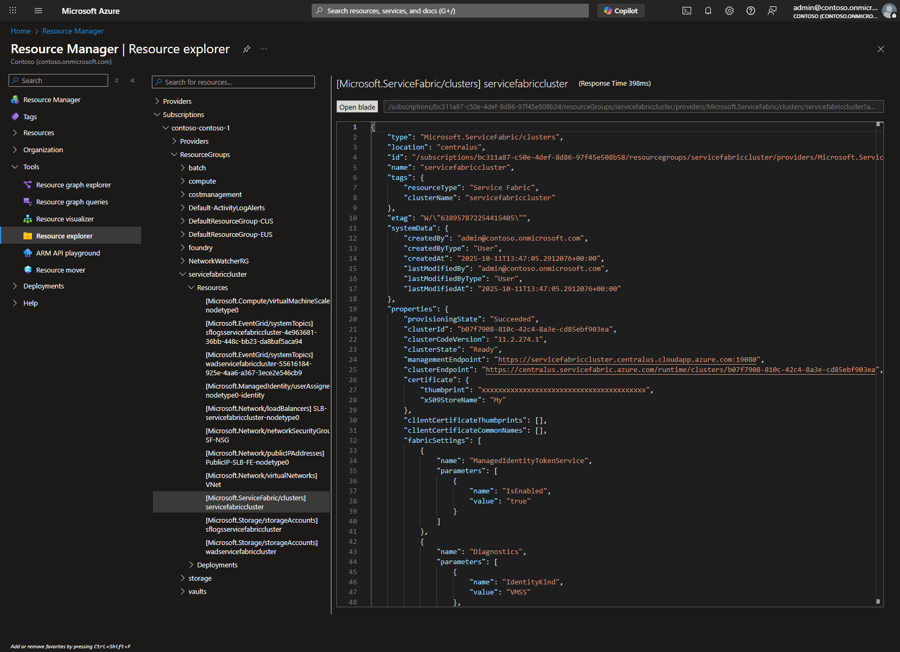
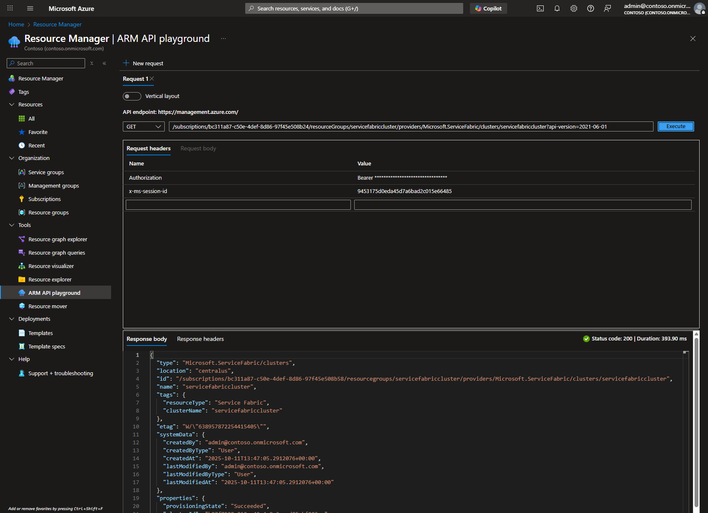
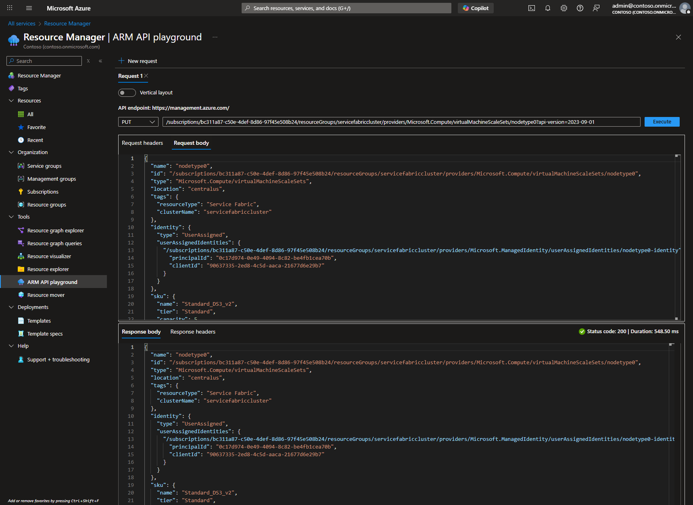

# Managing Azure Resources

Multiple methods are available to manage Azure resources. The [Resource Manager](https://portal.azure.com/#view/Microsoft_Azure_Resources/ResourceManagerBlade/~/overview) in Azure Portal provides a unified interface with [Resource Explorer](https://portal.azure.com/#view/Microsoft_Azure_Resources/ResourceManagerBlade/~/resourceexplorer) as the primary tool for browsing and modifying resources. The alternatives listed below provide comprehensive ways to view and modify Azure resources programmatically or through a graphical interface:

1. **Azure Portal**: Azure Portal is the primary interface for managing Azure resources. The [Resource Manager](https://portal.azure.com/#view/Microsoft_Azure_Resources/ResourceManagerBlade/~/overview) blade provides integrated access to:

   - **Resource Explorer**: Browse resources in a hierarchical tree structure and execute GET, PUT, and PATCH operations directly using interactive buttons
   - **ARM API Playground**: Alternative tool for executing ARM API operations with support for multiple tabs and flexible API version management
   - **Advantages**: User-friendly, comprehensive, integrated interface for both browsing and modifying resources with immediate feedback.
   - **Disadvantages**: Requires a browser. May be cumbersome for large-scale operations or automation tasks.
2. **Azure PowerShell**: Azure PowerShell is a set of cmdlets for managing Azure resources from the command line. It is particularly useful for Windows environments and integrates seamlessly with other PowerShell scripts and modules.

   - **Advantages**: Powerful scripting capabilities commonly used in Azure automation with the ability to access detailed resource information.
   - **Disadvantages**: Requires knowledge of PowerShell syntax and may not be as user-friendly for those unfamiliar with PowerShell.
3. **Azure CLI**: Similar to Azure PowerShell, the Azure Command-Line Interface (CLI) is a cross-platform command-line tool that allows you to manage Azure resources. It provides commands for creating, updating, and deleting resources, as well as querying resource information.

   - **Advantages**: Scriptable, can be used in automation scripts, and provides detailed information about resources.
   - **Disadvantages**: Requires knowledge of command-line syntax and may not be as user-friendly for those unfamiliar with CLI tools.

## Azure Portal

The Azure Portal provides a unified [Resource Manager](https://portal.azure.com/#view/Microsoft_Azure_Resources/ResourceManagerBlade/~/overview) blade for managing and viewing Azure resources. This blade contains two main tools:

- **[Resource Explorer](https://portal.azure.com/#view/Microsoft_Azure_Resources/ResourceManagerBlade/~/resourceexplorer)**: Primary tool for navigating resources and performing GET, PUT, and PATCH operations using interactive buttons
- **[ARM API Playground](https://portal.azure.com/#view/Microsoft_Azure_Resources/ResourceManagerBlade/~/armapiplayground)**: Alternative tool with support for multiple tabs and flexible API version management

The following steps demonstrate how to view and modify resources using Resource Explorer as the primary method:

### Using Resource Explorer to view and modify resources

Resource Explorer now provides interactive GET, EDIT, PUT, and PATCH buttons, making it the primary tool for managing Azure resources. This replaces the need to use resources.azure.com for most scenarios.

#### Viewing Resources

1. Open [Resource Manager](https://portal.azure.com/#view/Microsoft_Azure_Resources/ResourceManagerBlade/~/overview) in [Azure Portal](https://portal.azure.com/). The Resource Manager blade provides an overview with quick access to both Resource Explorer and ARM API Playground.

   
2. Click on **Resource Explorer** in the left navigation or use the direct link to [Resource Explorer](https://portal.azure.com/#view/Microsoft_Azure_Resources/ResourceManagerBlade/~/resourceexplorer) to browse resources.
3. Select the specific subscription, resource group, and then resource under 'Resources':

   ```text
   Subscriptions
       └───<subscription name>
           └───ResourceGroups
               └───<resource group name>
                   └───Resources
                       └───<resource name>
   ```
4. Click the **GET** button to retrieve the current resource configuration. The response will be displayed in JSON format below the buttons.

   
5. Expand the resource tree to view its properties and configuration. For example, expanding a Virtual Machine Scale Set resource shows details about the VMSS configuration.

#### Modifying Resources with PATCH

PATCH operations allow you to update specific properties without sending the entire resource configuration. This is the recommended method for most modifications.

1. After performing a GET request in Resource Explorer, click the **EDIT** button to enable editing mode.
2. Modify the JSON configuration in the editor. For example, to add a certificate to a VMSS:

   
3. Click the **PATCH** button to submit your changes.
4. **On success**: A notification will appear indicating the operation succeeded, and the response body will be displayed.

   

   
5. **If the template is malformed**: An error message will be displayed with details about what went wrong.

#### Modifying Resources with PUT

PUT operations replace the entire resource configuration. Use this method when making comprehensive changes to a resource.

1. After performing a GET request in Resource Explorer, copy the response body.
2. Click the **EDIT** button to enable editing mode.
3. Make your desired modifications to the complete JSON configuration. For example, updating Service Fabric cluster certificate:

   
4. Click the **PUT** button to submit the updated configuration.
5. **On success**: A notification will appear indicating the operation succeeded, same as in the PATCH operation above.
6. **To confirm status**: Perform another GET request and scroll through the response to check the `provisioningState` property:

   - `Updating`: The operation is in progress
   - `Succeeded`: The operation completed successfully
   - `Failed`: The operation encountered an error

   
7. **If the template is malformed**: An error message will be displayed with details about the validation failure.

#### Monitoring Provisioning Status

After making changes, you can monitor the provisioning status:

1. Click the **GET** button to retrieve the latest resource state.
2. Locate the `provisioningState` property in the response:

   ```json
   {
     "properties": {
       "provisioningState": "Updating"
     }
   }
   ```
3. If the state is `Updating`, wait a few moments and perform another GET request to check progress.

   
4. Continue checking until the `provisioningState` shows `Succeeded` or `Failed`.

   

### Using ARM API Playground (Alternative Method)

ARM API Playground provides additional features that may be useful in specific scenarios:

- **Multiple tabs**: Work with multiple resources simultaneously
- **Full request control**: Customize headers, request parameters, api-versions
- **Flexible API version management**: Easily change API versions in the URL

#### Workflow for modifying resources in API Playground

To use [ARM API Playground](https://portal.azure.com/#view/Microsoft_Azure_Resources/ResourceManagerBlade/~/armapiplayground) to modify resource configuration, the resource URI with API version must be provided. You can obtain this from [Resource Explorer](#using-resource-explorer-to-view-and-modify-resources) or from the `Resource JSON` view available on most resource blades in Azure Portal. The `Resource JSON` view can be accessed by selecting the `JSON View` link on the top right side of the resource blade.

The resource URI format is as follows:

```text
/<subscription id>/resourceGroups/<resource group name>/providers/<resource provider>/<resource type>/<resource name>?api-version=<api version>
```

1. From the [Resource Manager](https://portal.azure.com/#view/Microsoft_Azure_Resources/ResourceManagerBlade/~/overview) blade, click on **ARM API Playground** in the left navigation or use the direct link to [ARM API Playground](https://portal.azure.com/#view/Microsoft_Azure_Resources/ResourceManagerBlade/~/armapiplayground).

   
2. Enter the resource URI with API version in the request URL field. Select **GET** as the HTTP method and click **Execute** to retrieve the current configuration. Example showing a Service Fabric cluster resource:

   
3. The **Response** section will display the current configuration of the resource in JSON format. Copy this response body to use as the basis for your modifications.
4. Switch to the **Request body** tab, paste the copied JSON, and make your desired modifications to the configuration.
5. Change the HTTP method to **PUT** and click **Execute** to submit the updated configuration. Example showing a VMSS update:

   
6. The **Response** section will show the result of the operation. Verify the status code is `200 OK` and the `provisioningState` is `Updating` or `Succeeded`. You can monitor the provisioning status in the [Azure Portal](https://portal.azure.com/) or by performing additional GET requests from [ARM API Playground](https://portal.azure.com/#view/Microsoft_Azure_Resources/ResourceManagerBlade/~/armapiplayground).

## Azure PowerShell

> [!NOTE]
> These steps require Azure PowerShell 'Az' modules. Specifically, `Az.Accounts` and `Az.Resources` are the two modules being used. If these are not installed, they can be installed using the following commands.

Connect to an Azure account with the [`Connect-AzAccount`](https://learn.microsoft.com/powershell/module/az.accounts/connect-azaccount) cmdlet. This will prompt for credentials and allow selection of the subscription to work with. If multiple subscriptions are available, the subscription name or ID can be specified using the `-Subscription` parameter.

1. Open Azure PowerShell and authenticate to the Azure account:

```powershell
  # install all Az modules
  #Install-Module -Name Az -AllowClobber -Force

  # or install specific Az modules
  # Install-Module -Name Az.Accounts -AllowClobber -Force
  # Install-Module -Name Az.Resources -AllowClobber -Force

  Import-Module Az.Accounts
  Import-Module Az.Resources
  Connect-AzAccount
```

### Using PowerShell to view resources

The following steps demonstrate how to view resources with PowerShell:

1. Use the [`Get-AzResource`](https://learn.microsoft.com/powershell/module/az.resources/get-azresource) cmdlet to list all resources in a specific resource group:

   ```powershell
   $resources = Get-AzResource -ResourceGroupName <resource group name>
   $resources
   ```
2. To view a specific resource, use the [`Get-AzResource`](https://learn.microsoft.com/powershell/module/az.resources/get-azresource) cmdlet with the `-ResourceId` parameter:

   ```powershell
   $resource = Get-AzResource -ResourceId <resource id>
   $resource
   ```

### Using PowerShell to update resources

The following steps demonstrate how to update resources with PowerShell:

1. Use the [`Set-AzResource`](https://learn.microsoft.com/powershell/module/az.resources/set-azresource) cmdlet to update the resource. For example, to update a property of a resource:

   ```powershell
    Set-AzResource -ResourceId <resource id> -Properties @{<property name> = <new value>}
   ```
2. To verify the update, use the [`Get-AzResource`](https://learn.microsoft.com/powershell/module/az.resources/get-azresource) cmdlet again:

   ```powershell
   Get-AzResource -ResourceId <resource id>
   ```

### Using PowerShell to export ARM template

Use the [`Export-AzResourceGroup`](https://learn.microsoft.com/powershell/module/az.resources/export-azresourcegroup) cmdlet to export an ARM template for a specific resource or resource group. The exported template can be modified and then used to update the resource configuration. The `-SkipAllParameterization` parameter is used to skip parameterization of all properties in the exported template. The `-Force` parameter is used to overwrite the existing file if it already exists.

> [!NOTE]
> Exporting Service Fabric clusters (unmanaged) with a basic load balancer at the resource group level is not supported. There are known issues with exporting load balancer rules for a basic load balancer. If using `Export-AzResourceGroup` for unmanaged clusters with a basic load balancer, specify the resource ID of the resource to update instead of the resource group. This is not an issue with standard load balancers.

Variables used in the following examples:

```powershell
  $resourceGroupName = "<resource group name>"
  $jsonFile = "$pwd\template.json"
  $resourceId = "<resource id>"
```

To export an ARM template with PowerShell for a specific resource:

```powershell
  Export-AzResourceGroup -ResourceGroupName $resourceGroupName `
    -Resource $resourceId `
    -Path $jsonFile `
    -SkipAllParameterization `
    -Force
```

To export an ARM template with PowerShell for an entire resource group:

```powershell
  Export-AzResourceGroup -ResourceGroupName $resourceGroupName `
    -Path $jsonFile `
    -SkipAllParameterization `
    -Force
```

### Using PowerShell to deploy ARM template

Use the [`New-AzResourceGroupDeployment`](https://learn.microsoft.com/powershell/module/az.resources/new-azresourcegroupdeployment) cmdlet to deploy the modified ARM template. The `-TemplateFile` parameter is used to specify the path to the updated template file.

```powershell
New-AzResourceGroupDeployment -ResourceGroupName $resourceGroupName `
  -TemplateFile $jsonFile `
  -Verbose
```

## Azure CLI

> [!NOTE]
> These steps require Azure CLI. If Azure CLI is not installed, it can be installed by following the instructions in the [Azure CLI installation guide](https://learn.microsoft.com/cli/azure/install-azure-cli).

Connect to an Azure account with the [`az login`](https://learn.microsoft.com/cli/azure/authenticate-azure-cli) command. This will prompt for credentials and allow selection of the subscription to work with. If multiple subscriptions are available, the subscription name or ID can be specified using the `--subscription` parameter.

1. Open the command line interface and authenticate to the Azure account:

   ```bash
   az login
   ```

### Using Azure CLI to view resources

The following steps demonstrate how to view resources with Azure CLI:

1. Use the [`az resource list`](https://learn.microsoft.com/cli/azure/resource#az_resource_list) command to list all resources in a specific resource group:

   ```bash
   az resource list --resource-group <resource group name>
   ```

### Using Azure CLI to update resources

The following steps demonstrate how to update resources with Azure CLI:

1. Use the [`az resource update`](https://learn.microsoft.com/cli/azure/resource#az_resource_update) command to update the resource. For example, to update a property of a resource:

   ```bash
   az resource update --ids <resource id> --set <property name>=<new value>
   ```

## Additional Information

### Microsoft Learn

Resource schema and API version for a specific resource can be found in the Microsoft Learn documentation. Each resource type has its own documentation page that includes the API version information. Search for the resource type in the Microsoft Learn documentation and select the API version dropdown at the top of the page.

[Azure Templates](https://learn.microsoft.com/azure/templates/) contains comprehensive information for all Azure Resources.

### Obtaining Resource ID

The resource ID is a unique identifier for an Azure resource. It can be obtained from different blades in Azure Portal, Azure PowerShell, or Azure CLI. It can also be generated using the resource ID format below.

#### Obtaining Resource ID via Azure Portal

The resource ID can be obtained from multiple locations in Azure Portal:

1. **Using [Resource Manager - Resource Explorer](https://portal.azure.com/#view/Microsoft_Azure_Resources/ResourceManagerBlade/~/resourceexplorer)**: Navigate to your resource in the hierarchical tree view. The resource path is displayed in Resource Explorer and can be combined with the subscription ID to form the complete resource ID.
2. **Using the resource blade**: Open Azure Portal and navigate to the resource. Select the `JSON View` link on the top right side of the resource blade. This will open a panel with the JSON representation of the resource, including the resource ID and available API versions.

   

- The resource ID will be displayed in the `Resource ID` field of the JSON representation.
- The API version can be found in the `API Versions` field of the JSON representation.

  

#### Obtaining Resource ID via Azure PowerShell

There are multiple commands that can obtain the resource ID using Azure PowerShell. As noted above, the [`Get-AzResource`](https://learn.microsoft.com/powershell/module/az.resources/get-azresource) cmdlet can be used. This cmdlet retrieves resources in a specified resource group or subscription using different parameters.

Examples:

```powershell
  Get-AzResource -ResourceGroupName <resource group name> [-Name <resource name>] [-ResourceType <resource type>]
```

#### Obtaining Resource ID via Azure CLI

```bash
az resource show --resource-group <resource group name> --name <resource name> --resource-type <resource type> --query "id"
```

### Generating Resource ID

The resource ID can be generated using the following format, where `<subscription id>`, `<resource group name>`, `<resource provider>`, `<resource type>`, `<resource name>`, and `<api version>` are replaced with the appropriate values for the resource:

```text
/<subscription id>/resourceGroups/<resource group name>/providers/<resource provider>/<resource type>/<resource name>?api-version=<api version>
```

### Obtaining API Version

All Azure resources have a specific API version that is used to interact with the resource. The API version can be obtained from Azure Portal, Azure PowerShell, or Azure CLI. It can also be found in the Microsoft Learn documentation for the specific resource.

#### Obtaining API Version via Azure Portal

The API version can be found in multiple locations:

1. **Resource Manager - Resource Explorer**: When viewing a resource in [Resource Explorer](https://portal.azure.com/#view/Microsoft_Azure_Resources/ResourceManagerBlade/~/resourceexplorer), the API version is displayed alongside the resource information.
2. **JSON View**: As noted above, the API version can be found in the `JSON View` of the resource in Azure Portal. The API version is displayed in the `API Versions` field of the JSON representation of the resource.


#### Obtaining API Version via Azure PowerShell

Use the `Get-AzResourceProvider` cmdlet to get the available API versions for a specific resource type. The API versions are listed under the `ApiVersions` property of the resource type.

```powershell
$resourceProvider = Get-AzResourceProvider -ProviderNamespace "<resource provider name>" # Microsoft.ServiceFabric, Microsoft.Compute, etc.
$resourceTypeInfo = $resourceProvider.ResourceTypes | Where-Object ResourceTypeName -ieq "<resource type>" # clusters, managedClusters, etc.
$apiVersions = $resourceTypeInfo.ApiVersions
$apiVersions
```

#### Obtaining API Version via Azure CLI

```bash
az provider show --namespace <resource provider name> --query "resourceTypes[?resourceType=='<resource type>'].apiVersions" -o json
```

#### API Version via Microsoft Learn

Example for Service Fabric clusters:

[Service Fabric Cluster Resource](https://learn.microsoft.com/azure/templates/microsoft.servicefabric/clusters)


