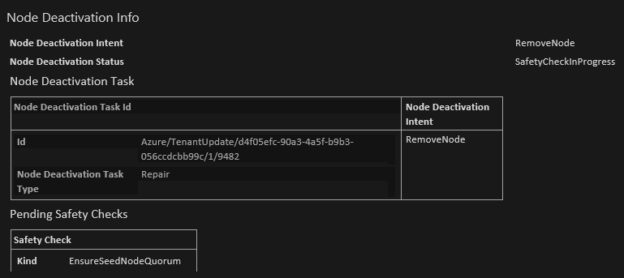

# VMMS operations are blocked node gets stuck in deletion and creation after deleting a VMSS

## Problem
- All VMSS operations are blocked on Silver or higher durability Scaleset after trying to delete a node from a VMMS 
- The node being deleted (seed node) is stuck in Disabling state

## Symptoms
- One of the seed nodes is stuck disabling with Safety Check - **EnsureSeedNodeQuorum**
- All operation started after the delete operation will be blocked until the deletion completes, including adding new VMs

    

## Cause ##

**Service Fabric is blocking deletion of VM to prevent violating configured ReliabilityLevel**

- The current delete operation, initiated by the customer through VMSS, is trying to reduce the number of allocated nodes below the minimum number nodes required for the cluster reliability level for Primary node type.
  
  - See [Reliability Charactaristics of the Cluster](https://docs.microsoft.com/en-us/azure/service-fabric/service-fabric-cluster-capacity#the-reliability-characteristics-of-the-cluster) for number of nodes required for each reliability level

**Customer has to determine the root cause of why the VM is being deleted**

- The VMSS operation that resulted in the specific instance is being deleted / deallocated - Audit logs for VMSS in Portal should have the information  
- Most common reasons  
  - Customer initiated delete / deallocation from portal or CLI
    - normally to address some other issue and as a result put the cluster into worse state
  - Auto scale settings where min is < number of nodes required for reliability level
  - Some automation run by customer that is initiating the delete

**NOTE:** Deallocate operations on instances in scaleset associated with SF is not supported.

## Example ##

 . | .
----------|----------
Current Reliability Level | Silver
Seed nodes required for current reliability level | 5
Current number of nodes of Primary node type | 5
Does removing a node violate reliability level | Yes

## Mitigation ##

**The following is the only safe mitigation**

**NOTE:** Mitigation time will take at a minimum 60-90 minutes. Depending on the configuration of SF cluster upgrade settings it can take significantly longer.  Please open a support ticket through the Azure Portal for assistance.

To unblock Node deletion operation initiated through VMSS and get the cluster back to the desired reliability level, following are the high level steps

1. Temporarily reduce reliability level to match number of remaining seed nodes after removal of VM
2. Scale out VMSS
3. Set reliability level to the desired level for the cluster

## Prerequisites ##

- Ensure that the applications are healthy (other than any issues related to the blocked operation)
- Get ARM template for the cluster. (If you created the cluster using portal, go to resource.azure.com and find the resource, select Read/Write mode and click on edit. It is recommended to use ARM templates that are checked in to source control for production environment)
 
## Detailed Mitigation Steps ##

1. Temporarily reduce reliability level to match number of remaining seed nodes after removal of VM
 
    a. Find the following line in the ARM template

        "reliabilityLevel": "Silver",
 
    modify it to
 
        "reliabilityLevel": "Bronze",
 
2. Redeploy the ARM template, if in [resources.azure.com](https://resources.azure.com), PUT the changes
 
    **Observed / Expected behaviors while the change is being applied**

   - The change will be applied to the cluster and take a while to complete. You can follow progress by opening SFX for the cluster and going to details tab at the cluster level
   - Two cluster upgrades will be required.
   - After everything is completed, the cluster will have the required number of Seed Nodes for Bronze
   - Once the reliability level is changed on the cluster, the VMSS operations initiated should complete. It will take a while to complete.
 
    **Optional Step:** To speed up VMSS operation
   - Select one of the VMs in failed state and run Update from the menu. Update menu should also be on the Overview page

3. Scale out VMSS

    **Prerequisite: When the seed node count matches the requirement for Bronze and all of them are healthy, then it is time to proceed**

   - Scale up the VMSS to 5 and wait for nodes to join the SF cluster
   - If this operation was already tried when deletion was stuck, VMSS will initiate the scaleout and another scaleout is not required
   - It may take a while before VMSS starts the operation
 
4. Set reliability level to the desired level for the cluster.

    **Prerequisite: Primary node type has at least the minimum number of VMs for the desired reliability level**

   - Change the reliabilityLevel to Silver and redeploy the ARM template.

    **Observed / Expected behaviors while the change is being applied**

   - The change will be applied to the cluster and take a while to complete. You can follow progress by opening SFX for the cluster and going to details tab at the cluster level
   - Two cluster upgrades will be required.
   - After everything is completed, the cluster will have the required number of Seed Nodes for the Silver
