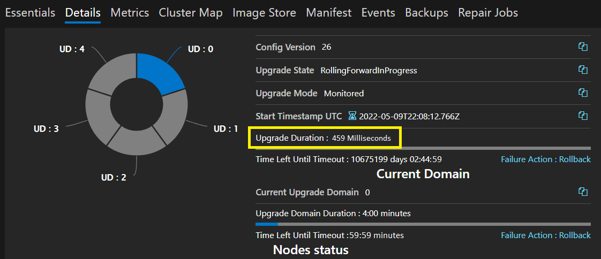

# Ongoing cluster upgrade get stuck and UD upgrade duration has stopped updating

## Problem

- Ongoing cluster upgrade get stuck in a random UD and will not progress

## Symptoms

- Ongoing cluster upgrade get stuck in a random UD and will not progress
- The **Upgrade Domain Duration** timer is a very small value and/or has stopped updating.  This value should update approximately once per minute

    

## Cause

- A race condition after CM is moved, and the new CM primary recovered pending contexts, it starts the pending cluster/fabric upgrade--which fails and aborts.

## Mitigation

- To unblock cluster upgrade the primary replica for CM (ClusterManagerService) needs to be restarted or moved

[Move-ServiceFabricPrimaryReplica](https://docs.microsoft.com/en-us/powershell/module/servicefabric/move-servicefabricprimaryreplica?msclkid=47ef7b40cfa711ec9442ebda21d7a8f2&view=azureservicefabricps)

```powershell
Move-ServiceFabricPrimaryReplica -ServiceName fabric:/System/ClusterManagerService -PartitionId 00000000-0000-0000-0000-000000002000
```

## Additional information

The Service Fabric team is planning to fix this in an upcoming 9.0 Cummulative Update.
