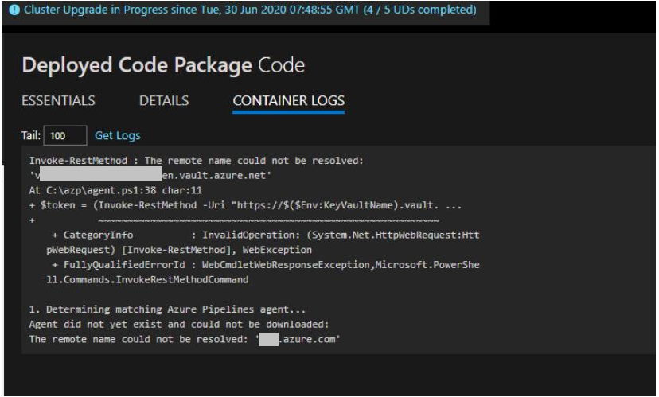

# Application with dependency  on wastorage.dll crashes on Service Fabric runtime 6.4.617.9590

After upgrading to Service Fabric 7.1.417 (cu1), containerized applications start failing with DNS related errors.  "The remote name could not be resolved"

## Symptoms
- SFC cluster was running version 7.1.409 and an application running on top of it, a container app in hyper-v isolation mode, was working fine.  After upgrading SF cluster to 7.1.417 (cu1) the application wouldn't start and failed with DNS related errors.
- App works fine again after downgrading to 7.1.409.  Upgrading again to 7.1.417, and app starts failing again.
- Application logs show DNS network related errors, possibly visible in the containter log from Service Fabric Explorer
- DNS resolution works from command prompt directly on Service Fabric node (DNS is working as expected)

## Root Cause Analysis
- Starting in 7.1.417 the optional DNS Service needs to be enabled so containerized application can resolve DNS queries 

## Possible Mitigations
- Simply enable DNS Service before upgrading to 7.1 CU1 should mitigate the issue.

## Additional information

