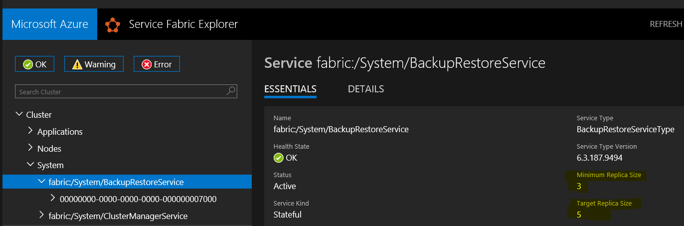

# 6.4 Upgrade fails for 6.3 Clusters with fabric:/System/BackupRestoreService enabled

An issue has been identified which is known to cause the Fabric 6.4 runtime upgrade to fail for clusters with the fabric:/System/BackupRestoreService enabled.

## Symptoms
During the upgrade you may see some warning/error messages in Service Fabric explorer similar to the following:

- Assert or Coding error with message 00000000-0000-0000-0000-000000007000@131873117199500233@fabric:/StateManager: Below type used in Reliable Collection urn:RetentionStore/dataStore could not be loaded. This commonly indicates that the user application is not backwards/forwards compatible. Common compatibility bugs that lead to this error are adding a new type or changing an assembly name without two phase upgrade, or removing a type. If this was caused by user's backwards/forwards compatibility bug, one way to mitigate the issue is to force the upgrade through without safety checks.

## Mitigation

- Change the fabric:/System/BackupRestoreService replica count to 1 and then upgrade cluster. 
- Post upgrade change replica count back to original.

### Steps: 
1. Record the existing values for Minimum Replica Size and Target Replica Size on the **fabric:/System/BackupRestoreService**.  In this example you can see the target is 5 the minimum is 3.


2. Connect to the cluster using PowerShell with Admin credentials.  [Connecting to secure clusters](../Cluster/Connecting%20to%20secure%20clusters%20with%20PowerShell.md)

3. Invoke Update-ServiceFabricService cmdlet using following parameters.
```PowerShell
    Update-ServiceFabricService -ServiceName fabric:/System/BackupRestoreService -Stateful -Confirm -MinReplicaSetSize 1 -TargetReplicaSetSize 1
```
4. Retry cluster upgrade, if Standalone or configured for Manual upgrade in Azure.  If cluster is configured for Automatic upgrade in Azure it will automatically retry.

5. Restore the original configuration for fabric:/System/BackupRestoreService
```PowerShell
    Update-ServiceFabricService -ServiceName fabric:/System/BackupRestoreService -Stateful -Confirm -MinReplicaSetSize 3 -TargetReplicaSetSize 5
```
## Reference
https://docs.microsoft.com/en-us/azure/service-fabric/service-fabric-backuprestoreservice-quickstart-azurecluster
https://docs.microsoft.com/en-us/azure/service-fabric/service-fabric-backuprestoreservice-quickstart-standalonecluster

