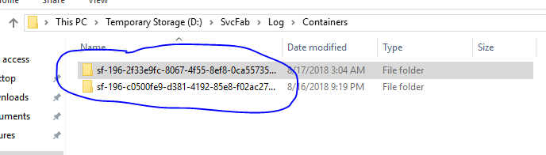

# FabricDCA.exe Process High Memory and CPU usage

## Background information:

With the introduction of containers in Service fabric a feature was added to collect logs from these containers through FabricDCA (Data Collection Agent).

The initial feature was found to be leaking handles and other objects related to the containers on the DCA side.   This has been fixed with release of 6.3 CU2 (6.3.187.9494). 

## Symptoms
- Nodes performance degration due to high memory and CPU usage

## Diagnosing the problem:
1. Look for FabricDCA.exe process memory usage. The normal memory usage would depend on the number of applications in the cluster, but usually is around 100 to 200MB.
	
2. If memory usage mentioned above is abnormally high look at:
		D:\SvcFab\Log\Containers
			
    
		
3. The **Containers** folder should only have a few folders related to the active containers in the node.  If there are hundreds or thousands of folders the bug was probably hit, so move to the Mitigation steps.

## Mitigation

1. Select all folders in D:\SvcFab\Log\Containers and delete. **Note:** that some may not get deleted because they are in use by an active container. That is okay, leave it there.
	
2. Kill FabricDCA.exe process. The process should automatically be restarted and the issue mitigated **.

** Note: If the cluster has containers repeatedly failing, the problem will resurface quickly.  This is because every container failure creates a new folder and FabricDCA.exe will start to bloat again. If this is the case try to fix the errors with the application causing the container failures.
