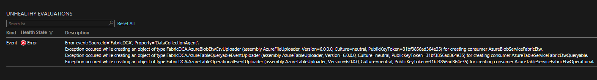
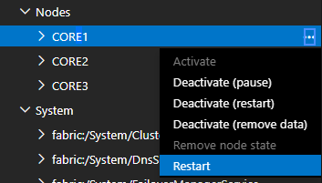

# Node(s) unhealthy due to FabricDCA exception in SourceId='FabricDCA', Property='DataCollectionAgent'

A known issue with the Data Collection Agent has been idetentified which can potentially degrade Node health in a Service Fabric cluster.  During initialization of the Service Fabric agents, DCA may fail to create the agents for some legitimate reasons.  If this happens DCA raises the health warning that you see and goes on with rest of the processing. The Service Fabric team is working to improve this experience in a future version, however currently the only workaround is to restart the Fabric services on these nodes manually. 

## Symptoms
- Unhealthy Nodes
- Can cause upgrades to fail

	Error event: SourceId='FabricDCA', Property='DataCollectionAgent'.
	Exception occured while creating an object of type FabricDCA.AzureBlobEtwCsvUploader (assembly AzureFileUploader, Version=6.0.0.0, Culture=neutral, PublicKeyToken=31bf3856ad364e35) for creating consumer AzureBlobServiceFabricEtw.
	Exception occured while creating an object of type FabricDCA.AzureTableQueryableEventUploader (assembly AzureTableUploader, Version=6.0.0.0, Culture=neutral, PublicKeyToken=31bf3856ad364e35) for creating consumer AzureTableServiceFabricEtwQueryable.
    Exception occured while creating an object of type FabricDCA.AzureTableOperationalEventUploader (assembly AzureTableUploader, Version=6.0.0.0, Culture=neutral, PublicKeyToken=31bf3856ad364e35) for creating consumer AzureTableServiceFabricEtwOperational. 

## Mitigation

- Issue rolling restart for each affected node (in SFX) 

    