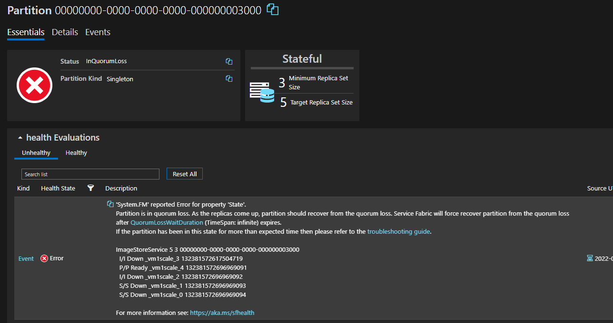
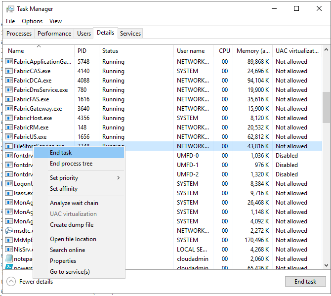
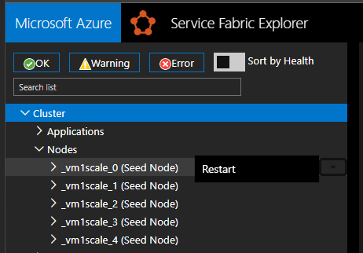

# Service Fabric 8.2, Cluster certificate changes or Certificate Rollover May Fail due to ImageStoreService Error

## Applies to 
- Clusters on [8.2 CU2](https://github.com/microsoft/service-fabric/blob/master/release_notes/Service_Fabric_ReleaseNotes_82CU2.md) (version 8.2.1486.9590)

## Symptoms

- Cluster security - Adding new secondary certificate or modify existing cluster certificate configuration may cause Upgrade to get stuck on Upgrade Domain (UD) 0.
- Connection authentication failures with error: FABRIC_E_SERVER_AUTHENTICATION_FAILED: CertificateNotMatched
- 'fabric:/System/ImageStoreService' is in a 'Warning' or 'Error' state.
- Some or all secondary replicas in ImageStoreService are down.
- Service Fabric Explorer (SFX) Warning Event: 00000000-0000-0000-0000-000000003000 SafetyCheck: EnsurePartitionQuorum
- SFX Error Event: 00000000-0000-0000-0000-000000003000 Partition is in quorum loss  

  

## Root Cause Analysis

- Service Fabric Product Group is currently investigating issue.

## Possible Mitigations

One of the following mitigation can be applied

- Option 1 - more complexity less impactful - [RDP](https://docs.microsoft.com/azure/service-fabric/service-fabric-cluster-remote-connect-to-azure-cluster-node) to nodes with 'Down' ImageStoreService partitions. Open TaskManager and right-click on FileStoreService.exe to terminate process.  

    
- Option 2 - less complexity more impactful - From SFX, restart each node with a down partition *one at a time* ensuring prior node restart is complete.  

    

## Resolution

- Issue to be resolved in future Service Fabric release.
