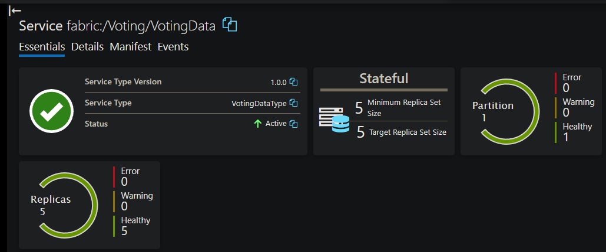
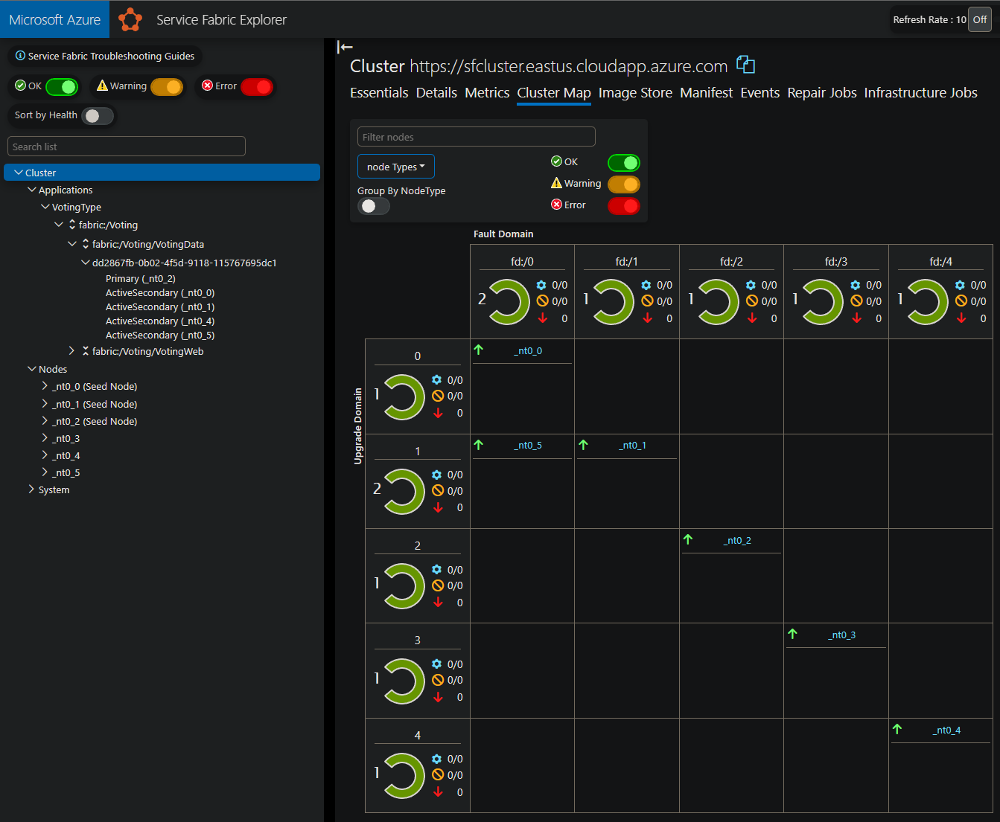

# Service Fabric 9.x, Cluster Repair Job Stuck EnsurePartitionQuorum

## Applies to

- Clusters on 9.x multiple versions

## Symptoms

- The Application in Warning is a Stateful application with Minimum and Target Replica Set values that are equal. Example Minimum 5 / Target 5.
- There are two Service replica hosts in the same UpgradeDomain(UD).
- There is a partition in Warning with Kind EnsurePartitionQuorum.
- There is a long running RepairJob that is not progressing.
- The RepairJob is completing Health Checks.
- There is a Replica Role set to IdleSecondary.
- There may be an unhealthy node in the cluster.

## Possible Mitigations

Select one of the following Mitigation options to allow Repair job to resume progress:

### Option 1

- Set the Service replica configuration Minimum Replica Set Size to a value that is less than Target Replica Set Size. Example: from 5/5 to 3/5.

    #### **Normally Deployed Application**

    Use Service Fabric SDK PowerShell command to update Minimum and Target Counts. [Update-ServiceFabricApplication](https://learn.microsoft.com/powershell/module/servicefabric/update-servicefabricapplication)

    Example:

    ```powershell
    Update-ServiceFabricApplication `
        -ApplicationName 'fabric:/...' `
        -MaximumNodes 5 `
        -MinimumNodes 3
    ```

    #### **ARM Deployed Application**

    Modify current deployment template that contains application information or export current configuration using [Export-AzResourceGroup](https://learn.microsoft.com/powershell/module/az.resources/export-azresourcegroup). Set 'MinReplicaSetSize' to value lower than 'targetReplicaSetSize' and deploy modified template with [New-AzResourceGroupDeployment](https://learn.microsoft.com/powershell/module/az.resources/new-azresourcegroupdeployment). See [Option 1 Mitigation Example](#arm-deployed-application-1)

### Option 2

- Use the following PowerShell command to move one of the secondary partitions that are in the same UD. [Move-ServiceFabricSecondaryReplica](https://learn.microsoft.com/powershell/module/servicefabric/move-servicefabricsecondaryreplica?view=azureservicefabricps).

    Example:

    ```powershell
    Move-ServiceFabricSecondaryReplica `
        -CurrentSecondaryNodeName '<current node name>' `
        -NewSecondaryNodeName '<new node name>' `
        -IgnoreConstraints $true `
        -ServiceName 'fabric:/...'
    ```

## Resolution

- Resolution will be in a future version release of Service Fabric. Product Group is actively working on fix.

## Service Fabric Explorer Symptoms

### 'Minimum Replica Set Size' equals 'Target Replica Set Size'



### There are multiple replicas in the same UD



## Option 1 Mitigation Example

Determine the original method used for application deployment. ARM deployed applications configuration is stored in ARM and should be updated via ARM either with an updated template or by using https://resources.azure.com. 

### Normally Deployed Application

Example if not using ARM for application deployment.

```powershell
Connect-ServiceFabricCluster
Update-ServiceFabricApplication `
    -ApplicationName 'fabric:/Voting' `
    -MaximumNodes 5 `
    -MinimumNodes 3 `
    -TimeoutSec 1200
```

### ARM Deployed Application

Example if application is deployed using ARM. Modify existing deployment template or using the following PowerShell commands, export the current configuration.

```powershell
$resourceGroupName = 'sfcluster'
$json = "$pwd\clusterTemplate.json"
$cluster = Get-AzResource `
    -ResourceGroupName $resourceGroupName `
    -ResourceType 'Microsoft.ServiceFabric/clusters'
Export-AzResourceGroup `
    -SkipAllParameterization `
    -ResourceGroupName $resourceGroupName `
    -Path $json `
    -Resource $cluster.ResourceId
```

Set 'MinReplicaSetSize' to value lower than 'targetReplicaSetSize' and save.

```diff
diff --git a/clusterTemplate.json b/clusterTemplate.json
index 82f4ef1..41c8fd0 100644
--- a/clusterTemplate.json
+++ b/clusterTemplate.json
@@ -122,37 +122,37 @@
     {
       "type": "Microsoft.ServiceFabric/clusters/applications/services",
       "apiVersion": "2021-06-01",
       "name": "sfcluster/Voting/Voting~VotingData",
       "location": "eastus",
       "dependsOn": [
         "[resourceId('Microsoft.ServiceFabric/clusters/applications', 'sfcluster', 'Voting')]",
         "[resourceId('Microsoft.ServiceFabric/clusters', 'sfcluster')]"
       ],
       "properties": {
         "serviceKind": "Stateful",
         "serviceTypeName": "VotingDataType",
         "partitionDescription": {
           "partitionScheme": "UniformInt64Range"
         },
         "defaultMoveCost": "Low",
         "hasPersistedState": true,
         "targetReplicaSetSize": 5,
-        "minReplicaSetSize": 5,
+        "minReplicaSetSize": 3,
         "replicaRestartWaitDuration": "00:01:00",
         "quorumLossWaitDuration": "00:02:00",
         "standByReplicaKeepDuration": "00:00:30"
       }
     },
```

Deploy modified template with [New-AzResourceGroupDeployment](https://learn.microsoft.com/powershell/module/az.resources/new-azresourcegroupdeployment)

```powershell
$resourceGroupName = 'sfcluster'
$json = "$pwd\clusterTemplate.json"
New-AzResourceGroupDeployment `
    -ResourceGroupName $resourceGroupName `
    -Mode Incremental `
    -TemplateFile $json `
```

## Option 2 Mitigation Example

After verifying there are two replicas in same UD, from a machine with Service Fabric SDK installed or from a Service Fabric node, run the following commands.

```powershell
Connect-ServiceFabricCluster
Move-ServiceFabricSecondaryReplica `
    -CurrentSecondaryNodeName _nt0_5 `
    -NewSecondaryNodeName _nt0_3 `
    -IgnoreConstraints $true `
    -ServiceName fabric:/Voting/VotingData `
    -TimeoutSec 1200
```
