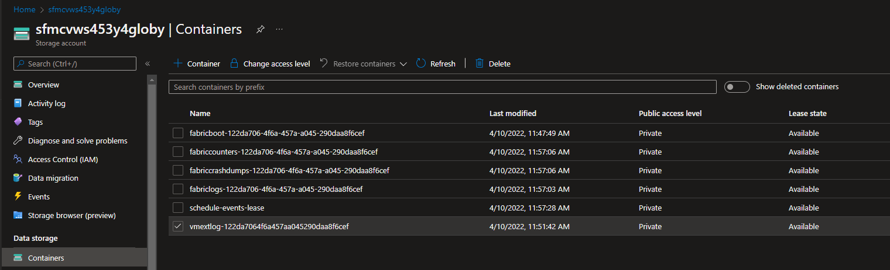
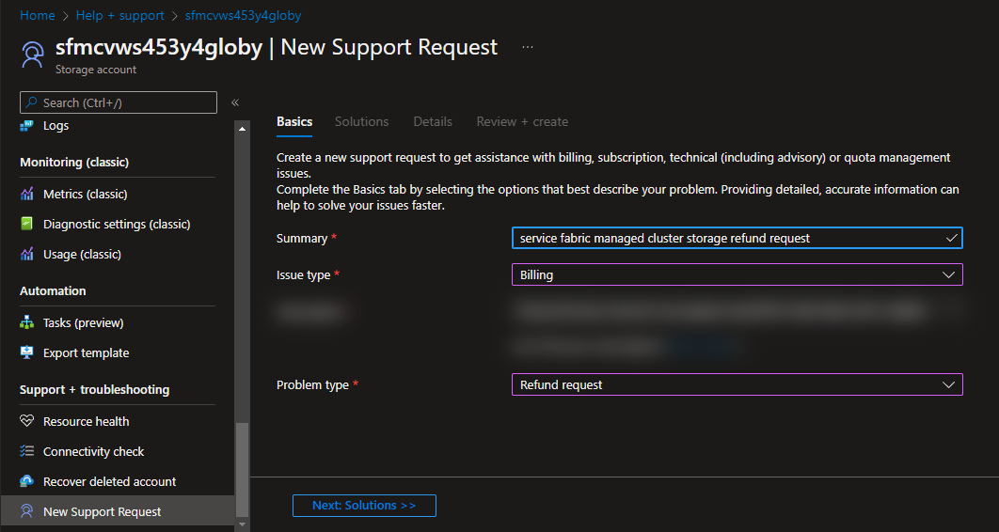

# Service Fabric Managed Cluster 8.2.1571, High storage cost and transaction count

## Issue

Service Fabric Managed Cluster storage accounts can incur unexplained high storage costs starting with version 8.2.1571. This issue does not affect unmanaged or standalone Service Fabric clusters.

## Applies to 
- Service Fabric Managed Clusters on [8.2 CU21](https://github.com/microsoft/service-fabric/blob/master/release_notes/Service_Fabric_ReleaseNotes_82CU21.md) (version 8.2.1571.9590)

## Symptoms

- Abnormally large storage costs for Service Fabric Managed Cluster storage account located in 'SFC_{{cluster id}}' resource group. For example, costs could be $100.00+ / day.
- Costs related to large amount of 'LRS List and Create Container Operations'. Example counts.
- High number of transactions from one or more nodes from cluster to storage blob.
- One or more nodes have more than 998 logs in extension container 'vmext-{{cluster id}}' in Azure storage.

## Root Cause Analysis

- The cleanup policy for Service Fabric Managed Cluster Virtual Machine Scaleset extension logs (SfmcVMExtensionNodeAgent.exe) uploaded to the storage account is not working properly and is contacting the storage account with CreateContainer call constantly causing the price increase.

## Mitigation

Manually remove logs from 'vmext-{{cluster id}}' container in storage account that reach version *-998.csv. Removing all logs is safe as they are no longer needed. This issue is intermittent but for a node that is continually experiencing this schedule events issue, this mitigation will work for 6 days until one of the options below need to be performed again. 6 days is timeframe for agent to log 999 files when schedule events is failing.

One of the following options can be used to temporarily resolve issue until fix is released:

- Option 1 - Remove files manually: 
  - Use Azure Portal and navigate to the associated 'SFC_{{cluster id}}' resource group and select the storage account.
  - In 'Containers' view, select the 'vmext-{{cluster id}}' container.

    

  - Highlight the 'sfextlog-*.csv' log files and select 'Delete'.

- Option 2 - Remove files with powershell: Use powershell commands given below. Providing 'subscriptionId' will set context. Setting 'clusterName' are supplied, then script will only clean storage account of specified cluster. If clusterName is not supplied, all managed clusters will be enumerated. Use '-whatIf' to test script. Save the following into a script file 'sfmc-clean-extension-logs.ps1' and execute '.\sfmc-clean-extension-logs.ps1 -whatif' to test. Script should be run from machine with Azure 'Az' powershell module installed.

  ```powershell
  <#
  .SYNOPSIS 
      powershell script to clean service fabric managed cluster vm extension SfmcVMExtensionNodeAgent log files from azure storage
  .NOTES 
      save as sfmc-clean-extension-logs.ps1
      requires Azure powershell module 'Az'
  .EXAMPLE 
      .\sfmc-clean-extension-logs.ps1 -whatIf
  .PARAMETER subscriptionId
      optional. if populated, azure context will be set to subscription.
      if not populated, current subscription will be used
  .PARAMETER clusterName
      optional. if populated, only populated cluster name will be checked.
      if not populated, all managed clusters in subscription will be checked
  .PARAMETER whatIf
      optional. if specified will enumerated blobs from extension container but will not delete.
  #>

  param(
      [string]$subscriptionId = '',
      [string]$clusterName = '',
      [switch]$whatif
  )

  if (!(get-azresource)) {
      Login-AzAccount
  }

  if ($subscription) {
      Select-AzSubscription -SubscriptionId $subscriptionId
  }

  write-host "using subscription: $((get-azcontext).Subscription)" -ForegroundColor Green

  if ($clusterName) {
      $managedClusterResources = @(get-azresource | where-object { $_.ResourceType -imatch 'managedCluster' -and $_.Name -ieq $clusterName })
  }
  else {
      $managedClusterResources = @(get-azresource | where-object ResourceType -imatch 'managedCluster')
  }

  foreach ($managedClusterResource in $managedClusterResources) {
      write-host "checking cluster:$($managedClusterResource.Name)" -ForegroundColor Magenta
      $clusterId = (get-azresource -expandproperties -ResourceId $managedClusterResource.ResourceId).properties.clusterId
      $storageAccount = Get-AzStorageAccount -ResourceGroupName "SFC_$clusterId"

      write-host "`tchecking storage account:$($storageAccount.StorageAccountName)" -ForegroundColor Magenta
      $context = $storageAccount.Context

      $vmExtLogsContainer = Get-AzStorageContainer -Context $context -Container "vmextlog*"
      write-host "`t`tchecking container:$($vmExtLogsContainer.Name)" -ForegroundColor Magenta

      $blobsToDelete = "sfextlog-*.csv"
      $blobs = Get-AzStorageBlob -Container $vmExtLogsContainer.Name -Blob $blobsToDelete -Context $context

      foreach ($blob in $blobs) {
          if (!$whatIf) {
              write-host "Remove-AzStorageBlob -blob $($blob.name) -container $($vmExtLogsContainer.Name)" -ForegroundColor Yellow
              Remove-AzStorageBlob -blob $blob.name -container $vmExtLogsContainer.Name -Context $context
          }
          else {
              write-host "Remove-AzStorageBlob -blob $($blob.name) -container $($vmExtLogsContainer.Name) -whatIf" -ForegroundColor Green
          }
      }

      if(!$blobs){
          write-warning "no blobs/files found"
      }
      write-host "finished"
  }
  ```

  Example -whatIf:

    ```text
    c:\>.\sfmc-clean-extension-logs.ps1 -whatif
    using subscription: 52c161f2-fce3-4041-8305-2841c49aa2f6
    checking cluster:sfmanagedcluster
        checking storage account:sfmcvws453y4globy
                checking container:vmextlog-122da7064f6a457aa045290daa8f6cef  
    Remove-AzStorageBlob -blob sfextlog-nodetype1000000.csv -container vmextlog-122da7064f6a457aa045290daa8f6cef -whatIf
    Remove-AzStorageBlob -blob sfextlog-nodetype1000001.csv -container vmextlog-122da7064f6a457aa045290daa8f6cef -whatIf
    Remove-AzStorageBlob -blob sfextlog-nodetype1000002.csv -container vmextlog-122da7064f6a457aa045290daa8f6cef -whatIf
    Remove-AzStorageBlob -blob sfextlog-nodetype1000003.csv -container vmextlog-122da7064f6a457aa045290daa8f6cef -whatIf
    Remove-AzStorageBlob -blob sfextlog-nodetype1000004.csv -container vmextlog-122da7064f6a457aa045290daa8f6cef -whatIf
    Remove-AzStorageBlob -blob sfextlog-nodetype1000005.csv -container vmextlog-122da7064f6a457aa045290daa8f6cef -whatIf
    ```

  Example:

    ```text
    c:\>.\sfmc-clean-extension-logs.ps1
    using subscription: 52c161f2-fce3-4041-8305-2841c49aa2f6
    checking cluster:sfmanagedcluster
        checking storage account:sfmcvws453y4globy
                checking container:vmextlog-122da7064f6a457aa045290daa8f6cef  
    Remove-AzStorageBlob -blob sfextlog-nodetype1000000.csv -container vmextlog-122da7064f6a457aa045290daa8f6cef
    Remove-AzStorageBlob -blob sfextlog-nodetype1000001.csv -container vmextlog-122da7064f6a457aa045290daa8f6cef
    Remove-AzStorageBlob -blob sfextlog-nodetype1000002.csv -container vmextlog-122da7064f6a457aa045290daa8f6cef
    Remove-AzStorageBlob -blob sfextlog-nodetype1000003.csv -container vmextlog-122da7064f6a457aa045290daa8f6cef
    Remove-AzStorageBlob -blob sfextlog-nodetype1000004.csv -container vmextlog-122da7064f6a457aa045290daa8f6cef
    Remove-AzStorageBlob -blob sfextlog-nodetype1000005.csv -container vmextlog-122da7064f6a457aa045290daa8f6cef
    ```

## Resolution

- Service Fabric Product Group has identified issue schedule events for upload of extension logging and is currently testing fix.
- Issue to be resolved in next Service Fabric Managed Cluster release.

## Refund for storage costs

To get a refund for this storage cost, in [Azure portal](https://portal.azure.com), navigate to the storage account in the 'SFC_{{cluster id}}' resource group and select 'New Support Request'. For the 'Issue type' select 'Billing' and for 'Problem type' select 'Refund Request'.

