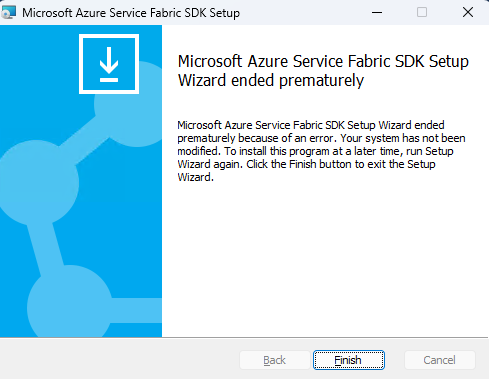

# Installation of Service Fabric 10.0 SDK (7.0.1816) fails with error code 0x8013141A

## Problem

- Installation of [Service Fabric 10.0 SDK (7.0.1816)](https://learn.microsoft.com/azure/service-fabric/service-fabric-get-started#install-the-sdk-and-tools) fails with error code 0x8013141A

## Symptoms

- Installation Error is shown

    
- In MSI installation log file, the following error will be logged:
    -  to capture: msiexec /package $pwd\MicrosoftServiceFabricSDK.7.0.1816.msi /log $pwd\install.log

    ```powershell
    Error: could not load custom action class Microsoft.ServiceFabric.SdkRuntimeCompatibilityCheck.CompatibilityCheckCA from assembly: SdkRuntimeCompatibilityCheck
    System.IO.FileLoadException: Could not load file or assembly 'SdkRuntimeCompatibilityCheck, Version=10.0.0.0, Culture=neutral, PublicKeyToken=31bf3856ad364e35' or one of its dependencies. Strong name validation failed. (Exception from HRESULT: 0x8013141A)
    File name: 'SdkRuntimeCompatibilityCheck, Version=10.0.0.0, Culture=neutral, PublicKeyToken=31bf3856ad364e35' 
    ---> System.Security.SecurityException: Strong name validation failed. (Exception from HRESULT: 0x8013141A)
    The Zone of the assembly that failed was:
    MyComputer
    at System.Reflection.RuntimeAssembly._nLoad(AssemblyName fileName, String codeBase, Evidence assemblySecurity, RuntimeAssembly locationHint, StackCrawlMark& stackMark, IntPtr pPrivHostBinder, Boolean throwOnFileNotFound, Boolean forIntrospection, Boolean suppressSecurityChecks)
    at System.Reflection.RuntimeAssembly.InternalLoadAssemblyName(AssemblyName assemblyRef, Evidence assemblySecurity, RuntimeAssembly reqAssembly, StackCrawlMark& stackMark, IntPtr pPrivHostBinder, Boolean throwOnFileNotFound, Boolean forIntrospection, Boolean suppressSecurityChecks)
    at System.Reflection.RuntimeAssembly.InternalLoad(String assemblyString, Evidence assemblySecurity, StackCrawlMark& stackMark, IntPtr pPrivHostBinder, Boolean forIntrospection)
    at System.Reflection.RuntimeAssembly.InternalLoad(String assemblyString, Evidence assemblySecurity, StackCrawlMark& stackMark, Boolean forIntrospection)
    at System.AppDomain.Load(String assemblyString)
    at Microsoft.Deployment.WindowsInstaller.CustomActionProxy.GetCustomActionMethod(Session session, String assemblyName, String className, String methodName)
    ```
- In Windows Event Viewer Application Logs, the following error will be logged:
    ```
    Log Name:      Application
    Source:        MsiInstaller
    Date:          10/11/2023 7:01:44 PM
    Event ID:      1033
    Task Category: None
    Level:         Information
    Keywords:      Classic
    Description:
    Windows Installer installed the product. Product Name: Microsoft Azure Service Fabric SDK. Product Version: 7.0.1816.9590. Product Language: 1033. Manufacturer: Microsoft Corporation. Installation success or error status: 1603.
    Event Xml:
    <Event xmlns="http://schemas.microsoft.com/win/2004/08/events/event">
    <System>
        <Provider Name="MsiInstaller" />
        <EventID Qualifiers="0">1033</EventID>
        <Version>0</Version>
        <Level>4</Level>
        <Task>0</Task>
        <Opcode>0</Opcode>
        <Keywords>0x80000000000000</Keywords>
        <TimeCreated SystemTime="2023-10-11T23:01:44.3206723Z" />
        <EventRecordID>275</EventRecordID>
        <Correlation />
        <Execution ProcessID="4112" ThreadID="0" />
        <Channel>Application</Channel>
        <Computer>7ca889e3-3095-4631-8a5d-84887a2522e1</Computer>
        <Security UserID="S-1-5-21-2047949552-857980807-821054962-504" />
    </System>
    <EventData>
        <Data>Microsoft Azure Service Fabric SDK</Data>
        <Data>7.0.1816.9590</Data>
        <Data>1033</Data>
        <Data>1603</Data>
        <Data>Microsoft Corporation</Data>
        <Data>(NULL)</Data>
        <Data>
        </Data>
        <Binary>7B30443546313538382D443333372D343536422D394333352D3945444641444446353632377D3030303030393432373165663838626163623237326139643861613931323461316264393030303030393034</Binary>
    </EventData>
    </Event>
    ```

## Cause

- Strong name validation failed. (Exception from HRESULT: 0x8013141A) when loading SdkRuntimeCompatibilityCheck.dll.

## Mitigation

- Install Service Fabric 9.1 CU6 SDK
    - [release notes](https://github.com/microsoft/service-fabric/blob/master/release_notes/Service_Fabric_ReleaseNotes_91CU6.md)
    - [runtime download](https://download.microsoft.com/download/b/8/a/b8a2fb98-0ec1-41e5-be98-9d8b5abf7856/MicrosoftServiceFabric.9.1.1851.9590.exe)
    - [sdk download](https://download.microsoft.com/download/b/8/a/b8a2fb98-0ec1-41e5-be98-9d8b5abf7856/MicrosoftServiceFabricSDK.6.1.1851.msi)

## Resolution

The Service Fabric team is planning to fix this in next 10.x Cumulative Update.
