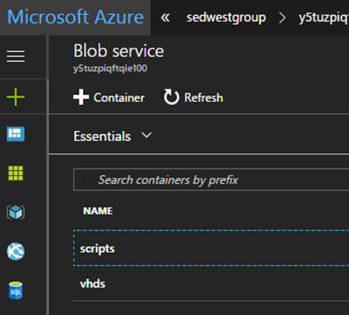

## DSC Example - ACL a certificate using Desired State Configuration

1.  Create a new Self Signed cert -[CreateKeyVaultAndCertificateForServiceFabric.ps1](../Scripts/CreateKeyVaultAndCertificateForServiceFabric.ps1)  -- or get one from CA

2.  Add the cert to the VMSS - [Add new cert to VMSS](../Scripts/Add_New_Cert_To_VMSS.ps1)

3.  Edit the attached DSC script, **change the Thumbprint** you want to ACL

4.  Archive the file into a .ZIP format

5.  Create a storage account or use an existing storage account to upload the DSC script, I used one of the storage accounts containing the VHD for the primary nodetype

    a.  create a new container called 'scripts'




6.  Upload the .zip file to the container

> 


7. [https://resources.azure.com ](https://resources.azure.com)

    a.  Edit your VMSS and add a new VM Extension, update URL to your container and DSC script

```json
{
  "properties": {
    "publisher": "Microsoft.Powershell",
    "type": "DSC",
    "typeHandlerVersion": "2.9",
    "autoUpgradeMinorVersion": true,
    "settings": {
        "configuration": {
            "url": "<https://y5tuzpiqftqie100.blob.core.windows.net/scripts/SetCertificateACL_DSC.zip>",
            "script": "SetCertificateACL_DSC.ps1",
            "function": "SetCertificatePermissions"
        }
    }
 },
 "name": "Microsoft.Powershell.DSC"
}
```

8.  Click PUT, and it should apply the NETWORK\_SERVICE ACL to the certs on all the nodes in the VMSS

    a.  RDP to a node and review logs @ C:\\WindowsAzure\\Logs\\Plugins\\Microsoft.Powershell.DSC\\2.25.0.0

    b.  Verify private-key permissions in certmgr for LocalMachine

> 
