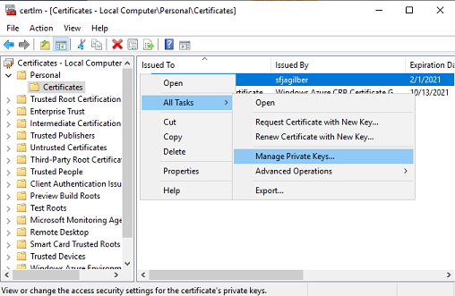
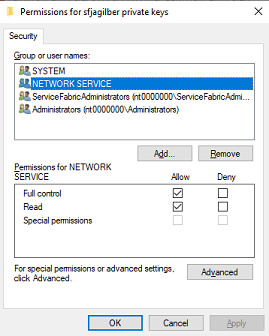
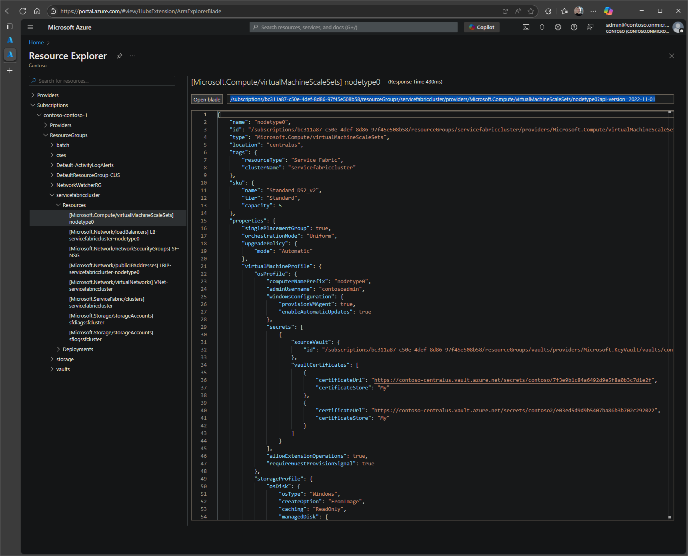

# How to recover from an Expired CA signed Cluster Certificate

This article provides steps to recover from an expired Certificate Authority (CA) signed cluster certificate.  If the cluster is secured with a self-signed certificate declared by thumbprint, you can follow the simpler process outlined in [Fix Expired Cluster self-signed Certificate](../Security/How%20to%20recover%20from%20an%20Expired%20Cluster%20Certificate.md).  For CA issued certificates, continue with the steps outlined below. 

To prevent this issue in the future, consider using the CA signed certificate with cluster common name/issuer name configuration in combination with key vault virtual machine extension (kvvm). For more information, see [Manage certificates in Service Fabric clusters](https://learn.microsoft.com/azure/service-fabric/cluster-security-certificate-management) and [Convert cluster certificates from thumbprint-based declarations to common names](https://learn.microsoft.com/azure/service-fabric/service-fabric-cluster-change-cert-thumbprint-to-cn).

## [Symptom]  

* Cluster will show 'Upgrade Service not reachable' warning message
* Unable to see the SF Nodes in the Portal or SFX
* Error message related to Certificate in  '%SystemRoot%\System32\Winevt\Logs\Microsoft-ServiceFabric%4Admin.evtx'  event log from 'transport' resource

## [Verify Certificate Expired Status on Node]

1. [RDP](https://docs.microsoft.com/azure/service-fabric/service-fabric-cluster-remote-connect-to-azure-cluster-node) to any node
1. Open the Certificate Manager for 'Local Computer' (certlm.msc) and check below details
1. Make sure certificate is ACL'd to network service
1. Verify the Certificate Expiry, if it is expired, follow below steps  

      

      

## [Fix Expired Cert steps]

1. Create new certificate to replace the expired certificate (choose one) if not already done:

   > a. Create with any reputable CA  
   > b. Generate self-signed certs using Azure Portal -> Key Vault.  
   > c. Create and upload using PowerShell - [CreateKeyVaultAndCertificateForServiceFabric.ps1](../Scripts/CreateKeyVaultAndCertificateForServiceFabric.ps1)

1. Go to [Resource Explorer](https://portal.azure.com/#view/HubsExtension/ArmExplorerBlade) in [Azure Portal](https://portal.azure.com/) and navigate to the virtual machine scale set configured for the cluster:

    ```text
        subscriptions
        └───%subscription name%
            └───resourceGroups
                └───%resource group name%
                    └───providers
                        └───Microsoft.Compute
                            └───virtualMachineScaleSets
                                └───%virtual machine scale set name%
    ```

1. To modify this resource, triple-click to copy the complete resource URI with API version from the read-only box to the right of the `Open Blade` button for modification using [`API Playground`](https://portal.azure.com/#view/Microsoft_Azure_Resources/ArmPlayground) as described below. Example:

    

1. Navigate to [API Playground](https://ms.portal.azure.com/#view/Microsoft_Azure_Resources/ArmPlayground) in [Azure Portal](https://portal.azure.com/) and paste the copied resource URI with API version from Resource Explorer into the input box to the right of the HTTP Request Method.

1. Select `Execute` to view the configuration of the specified resource.

1. The `Response Body` will display the configuration of the resource similar to the Resource Explorer view. This response body can be copied and pasted into `Request Body` field above to modify the configuration. Example:

    

1. Set the request method to `PUT`, select `Request Body`, and paste the copied response body.

1. Modify **"virtualMachineProfile / osProfile / secrets"**, to add (deploy) the new certificate to each of the nodes in the nodetype. Choose one of the options below:

    a. If the new certificate is in the **same Key Vault** as the Primary, add **"certificateUrl"** and **"certificateStore"** to existing array of **"vaultCertificates"** as shown below:

    ```json
      "virtualMachineProfile": {
        "osProfile": {
        …
          "secrets": [
            {
              "sourceVault": {
                "id": "/subscriptions/xxxxxxxx-xxxx-xxxx-xxxx-xxxxxxxxxxxx/resourceGroups/sampleVaultGroup/providers/Microsoft.KeyVault/vaults/samplevault"
            },
            "vaultCertificates": [
              {
                "certificateUrl": "https://samplevault.vault.azure.net/secrets/clustercert001/d5eeaf025c7d435f81e7420393b442a9",
                "certificateStore": "My"
              },
              {
                "certificateUrl": "https://samplevault.vault.azure.net/secrets/clustercert002/77ff7688258a41f7b0afdd890eb4aa8c",
                "certificateStore": "My"
              }
            ]
          }
        ]
    ```

    b. If the new certificate is in a **different Key Vault** as the Primary, add an additional secret to the array of **"secrets"** with **"sourceVault"** and **"vaultCertificates"** configuration as shown below:

    ```json
      "virtualMachineProfile": {
        "osProfile": {
        …
        "secrets": [
          {
            "sourceVault": {
              "id": "/subscriptions/xxxxxxxx-xxxx-xxxx-xxxx-xxxxxxxxxxxx/resourceGroups/sampleVaultGroup/providers/Microsoft.KeyVault/vaults/samplevault"
            },
            "vaultCertificates": [
              {
                "certificateUrl": "https://samplevault.vault.azure.net/secrets/clustercert001/d5eeaf025c7d435f81e7420393b442a9",
                "certificateStore": "My"
              }
            ]
          },
          {
            "sourceVault": {
              "id": "/subscriptions/xxxxxxxx-xxxx-xxxx-xxxx-xxxxxxxxxxxx/resourceGroups/sampleVaultGroup/providers/Microsoft.KeyVault/vaults/samplevault2"
            },
            "vaultCertificates": [
              {
                "certificateUrl": "https://samplevault2.vault.azure.net/secrets/clustercert002/77ff7688258a41f7b0afdd890eb4aa8c",
                "certificateStore": "My"
              }
            ]
          }
        ]
    ```

1. Select `Execute` to modify the configuration. In the `Response Body`, verify that `Status Code` is '200' and `provisioningState` is 'Updating' or 'Succeeded'. Example:

    

1. **Wait** for the virtual machine scale set `ProvisioningStatus` value "Succeeded" for the certificate update as shown above. The provisioning status can be monitored in the [Azure Portal](https://portal.azure.com/) or by performing additional `Get` requests from [API Playground](https://ms.portal.azure.com/#view/Microsoft_Azure_Resources/ArmPlayground). If "provisioningState" equals "Updating", continue to periodically click GET at top of page to requery scale set.  If the cluster is configured with Silver or higher Durability it's possible a repair task may block this operation.  If the status does not move into a "Succeeded" state in a timely manner please contact Support for assistance to confirm and unblock.

    

## [Execute FixExpiredCert.ps1 script on all nodes]

> ![IMPORTANT]
> The following needs to be performed on all nodes in all nodetypes by using [RDP](https://docs.microsoft.com/azure/service-fabric/service-fabric-cluster-remote-connect-to-azure-cluster-node) to connect to each node in the cluster.

1. [On each node] Open Administrative powershell.exe

1. [On each node] Download [FixExpiredCert.ps1](../Scripts/FixExpiredCert.ps1) either to admin machine and copy to each node through RDP clipboard or download directly from within RDP session on node.

   Example of downloading from within RDP
  
    ```powershell
    [net.servicePointManager]::Expect100Continue = $true;
    [net.servicePointManager]::SecurityProtocol = [net.SecurityProtocolType]::Tls12;
    $url = "https://raw.githubusercontent.com/Azure/Service-Fabric-Troubleshooting-Guides/master/Scripts/FixExpiredCert.ps1"
    $output = "$pwd\FixExpiredCert.ps1"
    Invoke-WebRequest -Uri $url -OutFile $output
    ```

1. [On each node] Run the FixExpiredCert.ps1 script with the following cmd line passing both the expired certificate thumbprint and new active certificate thumbprint as shown in example below.

    ```powershell
    $oldThumbprint = "<replace with expired thumbprint>"
    $newThumbprint = "<replace with new thumbprint>"
    .\FixExpiredCert.ps1 -localOnly -oldThumbprint $oldThumbprint -newThumbprint $newThumbprint
    ```

    Note: If there are any errors or issues when running the script you can attempt to fix\correct these and just rerun the script, changes made by the script are idempotent.  In some cases if there are many nodes and you know the mitigation was already successful on some nodes before the script failed then you can remove those from the nodeIpArray to speed things up, but there is no harm if the mitigation is run multiple times on the same node.

1. Services should be restarting and when ready you should able to reconnect to the cluster over SFX and PowerShell from a node in the cluster or your development computer. *(Make sure you have installed the new Cert to `CurrentUser\My`)*

    ```PowerShell
    $clusterName= "<cluster name>.<cluster region>.cloudapp.azure.com:19000"
    $certThumbprint = "<cluster certificate thumbprint>"
    Import-Module servicefabric
    Connect-ServiceFabricCluster -ConnectionEndpoint $clusterName -KeepAliveIntervalInSec 10 `
        -X509Credential `
        -ServerCertThumbprint $certThumbprint  `
        -FindType FindByThumbprint `
        -FindValue $certThumbprint
    ```

    **Note**: Please give the cluster 5-10 minutes to reconfigure.  Generally speaking you will see Fabric.exe startup in the Task Manager and a few minutes later FabricGateway.exe will start when the nodes have finished reconfiguration.  At this point the cluster should be running using the new certificate and SFX endpoint and PowerShell endpoints should be accessible.

## [Contact Microsoft Support]

 **Contact Microsoft Support to request the updating thumbprint in Service Fabric Resource Provider (SFRP)**. The cluster will not display Nodes or Applications or reflect the new Thumbprint yet because the SFRP record for this cluster has to be updated with the new thumbprint by Microsoft Support.

## [Verify VMSS resource models]

Verify the VMSS resource model to ensure the new certificate is correctly configured. This can be done using the Azure Resource Explorer or API Playground as described below.

1. Go to [Resource Explorer](https://portal.azure.com/#view/HubsExtension/ArmExplorerBlade) in [Azure Portal](https://portal.azure.com/) and navigate to the virtual machine scale set configured for the cluster:

    ```text
    subscriptions
    └───%subscription name%
        └───resourceGroups
            └───%resource group name%
                └───providers
                    └───Microsoft.Compute
                        └───virtualMachineScaleSets
                            └───%virtual machine scale set name%
    ```

1. Ensure the correct KeyVault for the new cert is listed. If needed, update the "sourceVault" and "certificateUrl" properties using API Playground as described using same steps as above.

    ```json
    "virtualMachineProfile": {
      "osProfile": {
        "secrets": [
          {
            "sourceVault": {
              "id": "/subscriptions/xxxxxxxx-xxxx-xxxx-xxxx-xxxxxxxxxxxx/resourcegroups/xxxxxx/providers/Microsoft.KeyVault/vaults/xxxxxxxx"
            },
            "vaultCertificates": [
              {
                "certificateUrl": "https://xxxxxx.vault.azure.net/secrets/xxxxxx/xxxxxxxxxxxxxxxxxxxxxxxxxxxxxxxx",
                "certificateStore": "My"
              }
            ]
          }
        ],
    ```

1. Ensure the "thumbprint" (or "thumbprintSecondary" if exists) properties are correct. Update with the new certificate thumbprint if needed using API Playground as described using same steps as above.

    ```json
    "virtualMachineProfile": {
      "extensionProfile": {
        "extensions": [
          {
            "name": "nodetype0_ServiceFabricNode",
            "properties": {
              "autoUpgradeMinorVersion": true,
              "publisher": "Microsoft.Azure.ServiceFabric",
              "type": "ServiceFabricNode",
              "typeHandlerVersion": "1.1",
              "settings": {
                "clusterEndpoint": "https://xxxxx.servicefabric.azure.com/runtime/clusters/xxxxxxxx-xxxx-xxxx-xxxx-xxxxxxxxxxxx",
                "nodeTypeRef": "nodetype0",
                "dataPath": "D:\\SvcFab",
                "durabilityLevel": "Silver",
                "enableParallelJobs": true,
                "nicPrefixOverride": "10.0.0.0/24",
                "certificate": {
                  "thumbprint": "XXXXXXXXXXXXXXXXXXXXXXXXXXXXX",
                  "thumbprintSecondary": "YYYYYYYYYYYYYYYYYYYYYYYYYYYYYYYYYYYYYY",
                  "x509StoreName": "My"
                }
              }
            }
          },
    ```

## [Verify Cluster resource model]

Verify the cluster resource model to ensure the new certificate is correctly configured. This can be done using Resource Explorer or API Playground as described below.

1. Go to [Resource Explorer](https://portal.azure.com/#view/HubsExtension/ArmExplorerBlade) in [Azure Portal](https://portal.azure.com/) and navigate to the cluster resource:

    ```text
    subscriptions
    └───%subscription name%
        └───resourceGroups
            └───%resource group name%
                └───providers
                    └───Microsoft.ServiceFabric
                        └───clusters
                            └───%cluster name%
    ```

1. Ensure the correct KeyVault for the new cert is listed. If needed, update the "certificate" property using API Playground as described using same steps as above.

    ```json
    "certificate": {
      "thumbprint": "XXXXXXXXXXXXXXXXXXXXXXXXXXXXX",
      "thumbprintSecondary": "YYYYYYYYYYYYYYYYYYYYYYYYYYYYYYYYYYYYYY",
      "x509StoreName": "My"
    }
    ```

1. Search for any other references to the old certificate thumbprint in the cluster resource model. For example, reverse proxy, and client certificates. If found, update them with the new certificate thumbprint using API Playground as described using same steps as above.

## Verify Cluster Applications

Verify applications on the cluster are functioning correctly. If not, investigate potential issues related to the new certificate. An application may be configured to use the cluster certificate for secure communication. If the application is not functioning, ensure the application configuration is using the new certificate thumbprint.

## Reference

[Manage certificates in Service Fabric clusters](https://learn.microsoft.com/azure/service-fabric/cluster-security-certificate-management)

[X.509 Certificate-based authentication in Service Fabric clusters](https://learn.microsoft.com/azure/service-fabric/cluster-security-certificates)

[Azure Resource Explorer Alternatives](../cluster/azure-resource-explorer-alternatives.md)
