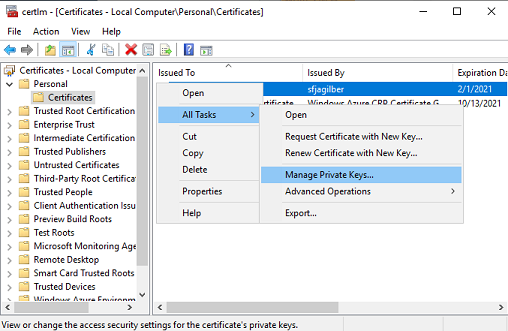
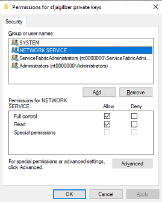
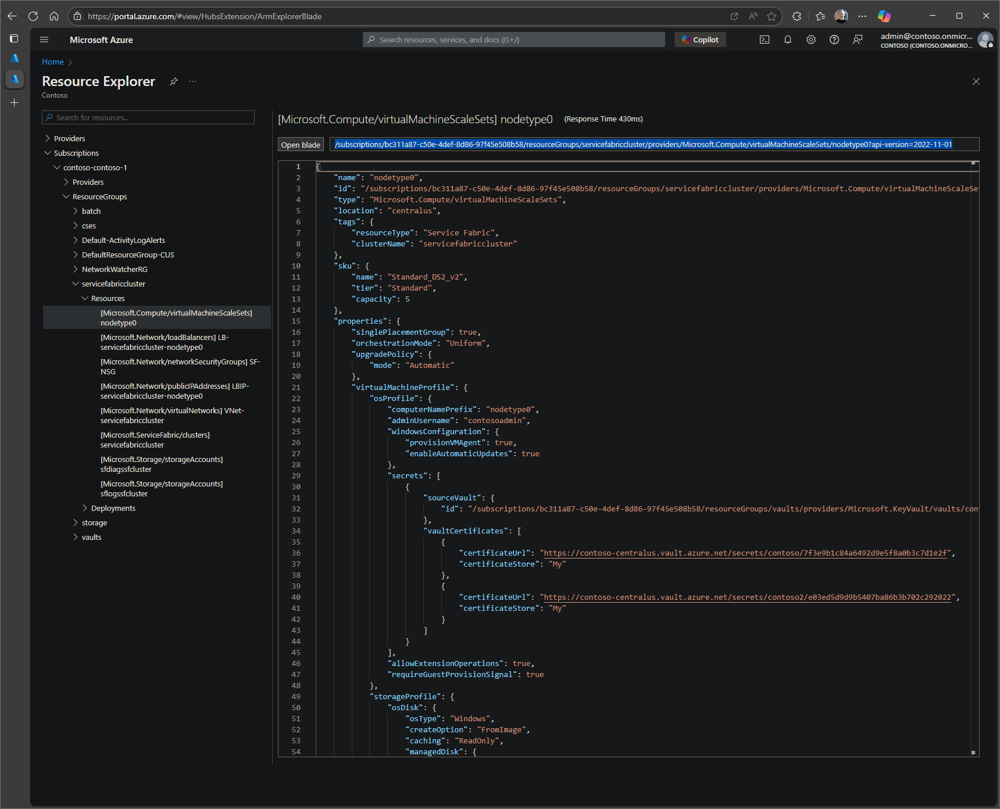
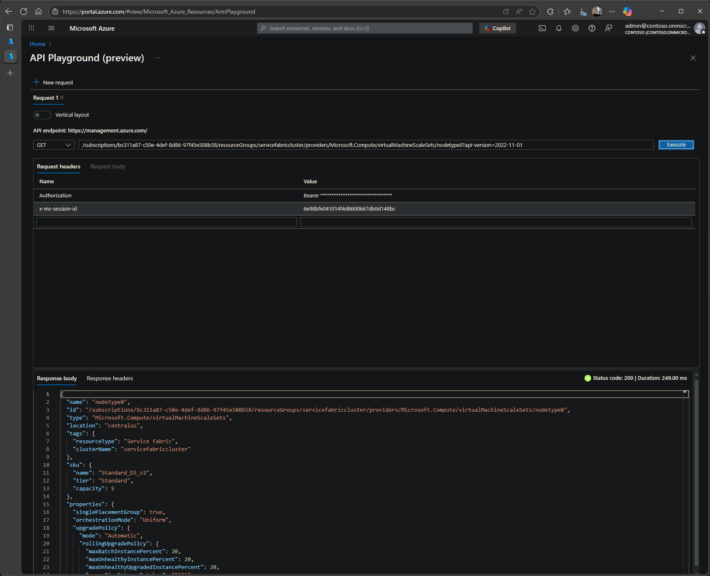
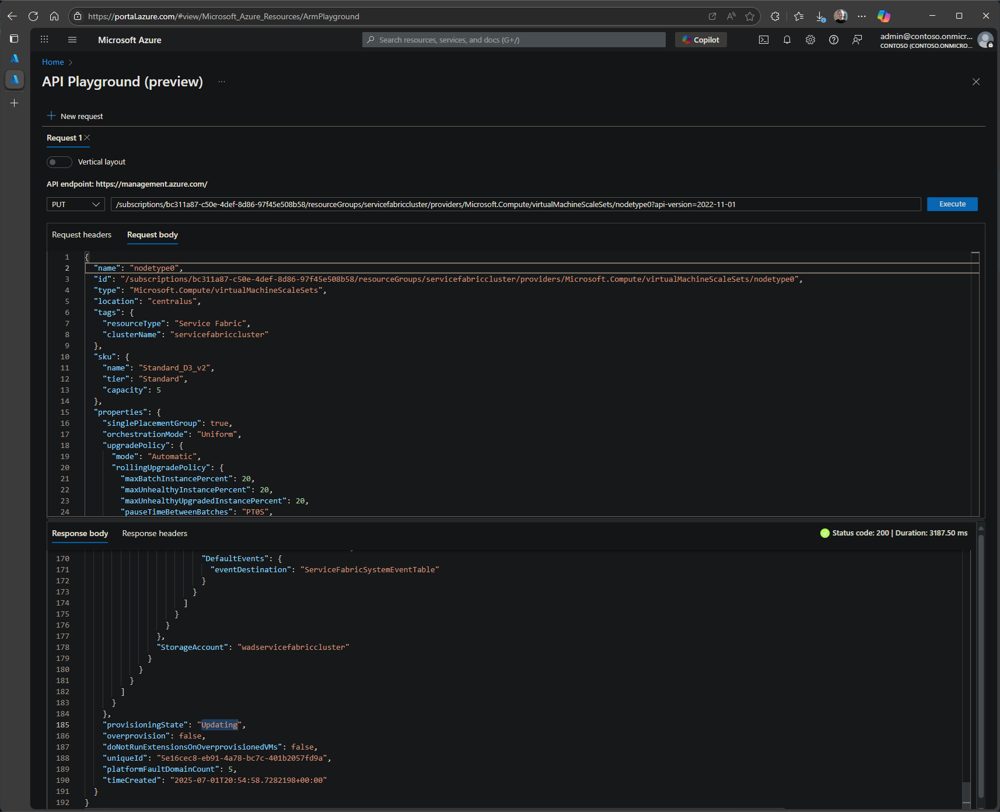

# [UPDATE 10/05/2019] 
Service Fabric clusters running 6.5 CU3 or later (version 6.5.658.9590 or higher), secured with self-signed certificates declared by thumbprint can now follow this much simpler process.

* [Fix Expired Cluster Certificate](../Security/How%20to%20recover%20from%20an%20Expired%20Cluster%20Certificate.md)


## [Symptom] 
   * Cluster will show 'Upgrade Service not reachable' warning message 
   * Unable to see the SF Nodes in the Portal or SFX 
   * Error message related to Certificate in  '%SystemRoot%\System32\Winevt\Logs\Microsoft-ServiceFabric%4Admin.evtx'  event log from 'transport' resource  

## [Verify Certificate Expired Status on Node]

1. [RDP](https://docs.microsoft.com/azure/service-fabric/service-fabric-cluster-remote-connect-to-azure-cluster-node) to any node
2. Open the Certificate Manager for 'Local Computer' (certlm.msc) and check the following details
3. Make sure certificate is ACL'd to network service
4. Verify the Certificate Expiry, if it is expired, follow the steps below  

   

     

## [Fix Expired Cert steps] 

1. Create new certificate to replace the expired certificate (choose one)

  > a. Create with any reputable CA  
  > b. Generate self-signed certs using Azure Portal -> Key Vault.  
  > c. Create and upload using PowerShell - [CreateKeyVaultAndCertificateForServiceFabric.ps1](../Scripts/CreateKeyVaultAndCertificateForServiceFabric.ps1)

2. Go to [Resource Explorer](https://portal.azure.com/#view/HubsExtension/ArmExplorerBlade) in [Azure Portal](https://portal.azure.com/) and navigate to the virtual machine scale set configured for the cluster:

   ```text
       subscriptions
       └───%subscription name%
           └───resourceGroups
               └───%resource group name%
                   └───providers
                       └───Microsoft.Compute
                           └───virtualMachineScaleSets
                               └───%virtual machine scale set name%
   ```

3. To modify this resource, triple-click to copy the complete resource URI with API version from the read-only box to the right of the `Open Blade` button for modification using [`API Playground`](https://portal.azure.com/#view/Microsoft_Azure_Resources/ArmPlayground) as described below. Example:

   

4. Navigate to [API Playground](https://ms.portal.azure.com/#view/Microsoft_Azure_Resources/ArmPlayground) in [Azure Portal](https://portal.azure.com/) and paste the copied resource URI with API version from Resource Explorer into the input box to the right of the HTTP Request Method.

5. Select `Execute` to view the configuration of the specified resource.

6. The `Response Body` will display the configuration of the resource similar to the Resource Explorer view. This response body can be copied and pasted into `Request Body` field above to modify the configuration. Example:

   

7. Set the request method to `PUT`, select `Request Body`, and paste the copied response body.

8. Modify **"virtualMachineProfile / osProfile / secrets"** to add (deploy) the new certificate to each of the nodes in the node type. Choose one of the options below:

> a. If the new certificate is in the **same Key Vault** as the Primary, add **"certificateUrl"** and **"certificateStore"** to existing array of **"vaultCertificates"** as shown below:

```json
  "virtualMachineProfile": {
    "osProfile": {
    …
      "secrets": [
        {
          "sourceVault": {
            "id": "/subscriptions/xxxxxxxx-xxxx-xxxx-xxxx-xxxxxxxxxxxx/resourceGroups/sampleVaultGroup/providers/Microsoft.KeyVault/vaults/samplevault"
        },
        "vaultCertificates": [
          {
            "certificateUrl": "https://samplevault.vault.azure.net/secrets/clustercert001/d5eeaf025c7d435f81e7420393b442a9",
            "certificateStore": "My"
          },
          {
            "certificateUrl": "https://samplevault.vault.azure.net/secrets/clustercert002/77ff7688258a41f7b0afdd890eb4aa8c",
            "certificateStore": "My"
          }
        ]
      }
    ]
```

> b. If the new certificate is in a **different Key Vault** as the Primary, add an additional secret to the array of **"secrets"** with **"sourceVault"** and **"vaultCertificates"** configuration as shown below:

```json
  "virtualMachineProfile": {
    "osProfile": {
    …
    "secrets": [
      {
        "sourceVault": {
          "id": "/subscriptions/xxxxxxxx-xxxx-xxxx-xxxx-xxxxxxxxxxxx/resourceGroups/sampleVaultGroup/providers/Microsoft.KeyVault/vaults/samplevault"
        },
        "vaultCertificates": [
          {
            "certificateUrl": "https://samplevault.vault.azure.net/secrets/clustercert001/d5eeaf025c7d435f81e7420393b442a9",
            "certificateStore": "My"
          }
        ]
      },
      {
        "sourceVault": {
          "id": "/subscriptions/xxxxxxxx-xxxx-xxxx-xxxx-xxxxxxxxxxxx/resourceGroups/sampleVaultGroup/providers/Microsoft.KeyVault/vaults/samplevault2"
        },
        "vaultCertificates": [
          {
            "certificateUrl": "https://samplevault2.vault.azure.net/secrets/clustercert002/77ff7688258a41f7b0afdd890eb4aa8c",
            "certificateStore": "My"
          }
        ]
      }
    ]
```

9. Select `Execute` to modify the configuration. In the `Response Body`, verify that `Status Code` is '200' and `provisioningState` is 'Updating' or 'Succeeded'. Example:

   

10. **Wait** for the virtual machine scale set `ProvisioningStatus` value "Succeeded" for the certificate update as shown above. The provisioning status can be monitored in the [Azure Portal](https://portal.azure.com/) or by performing additional `Get` requests from [API Playground](https://ms.portal.azure.com/#view/Microsoft_Azure_Resources/ArmPlayground). If "provisioningState" equals "Updating", continue to periodically click GET at top of page to requery scale set.

> [!NOTE]
> If the cluster is configured with Silver or higher Durability, the repair task will be blocked. Contact Microsoft Support for assistance with unblocking tenantupdate job.

## For each node { 

7. [RDP](https://docs.microsoft.com/azure/service-fabric/service-fabric-cluster-remote-connect-to-azure-cluster-node) into **each** VM and make sure the certificate is present and the private key is already ACL'd to 'Network Service'  

    * Run certlm.msc 

    * Find the new certificate 

    * Right click cert, Manage Private Keys, ensure NETWORK SERVICE has full permissions 

    * If RDP to each node is not feasible, alternatively you can automate through [Desired State Configuration](https://docs.microsoft.com/en-us/powershell/dsc/azuredsc "https://docs.microsoft.com/en-us/powershell/dsc/azuredsc")


8. Stop both "Azure Service Fabric Node Bootstrap Agent" and "Microsoft Service Fabric Host Service" service (run in this exact order) 

    * net stop ServiceFabricNodeBootstrapAgent

    * net stop FabricHostSvc

There is a race condition where sometimes `FabricInstallerService.exe` is stuck in a crashing loop. If this is the case first launch `Services.msc` and identify 3 Services:

- FabricInstallerService
- FabricHostService
- ServiceFabricNodeBootstrapAgent

Then, set all services to startup type `Disabled`, and reboot the machine. On reboot `FabricInstallerService.exe` should never run. Continue along with the TSG.


9. Locate ClusterManifest.current in the SvcFab folder like "D:\SvcFab\\_sys_0\Fabric\ClusterManifest.current.xml" according to actual datapath deployed, and copy to somewhere like D:\Temp\clusterManifest.xml 

    * Modify the D:\Temp\clusterManifest.xml and update with new thumbprint. 

    * Replace all occurrences of old cert with the new thumbprint 

        Note: Any deployed applications using old cert for application encryption\ssl\etc will need to be redeployed with the updated thumbprint *after* the cluster is restored 

10. Locate InfrastructureManifest.xml in the SvcFab folder like "D:\SvcFab\_sys_0\Fabric\Fabric.Data\InfrastructureManifest.xml" 

    * Replace all occurrences of old cert with the new thumbprint

11. Run following cmdlet to update the Service Fabric cluster, replace the SvcFab path according to the actual path.  Verify the Node version, use latest 

    ```PowerShell
    New-ServiceFabricNodeConfiguration -FabricDataRoot "D:\SvcFab" -FabricLogRoot "D:\SvcFab\Log" -ClusterManifestPath "D:\Temp\clusterManifest.xml" -InfrastructureManifestPath "D:\SvcFab\_sys_0\Fabric\Fabric.Data\InfrastructureManifest.xml"  
    ```
 

12. Edit  "D:\SvcFab\\_sys_0\Fabric\Fabric.Package.current.xml" 

    * Note down the value for "ManifestVersion" attribute on line 2

    * Cd into the corresponding folder 

        ```batch
        cd D:\SvcFab\_sys_0\Fabric\Fabric.Config.4.131473098266979018
        ```

    * Edit "D:\SvcFab\_sys_0\Fabric\Fabric.Config.4.131473098266979018\Settings.xml" 

    * Replace all occurrences of old cert with the new thumbprint 


13. Start both services "Microsoft Service Fabric Host Service" and "Azure Service Fabric Node Bootstrap Agent" again **(run in this exact order)**

    ```PowerShell
    net start FabricHostSvc 
    net start ServiceFabricNodeBootstrapAgent 
    ```

If you previously encountered a race condition where `FabricInstallerService.exe` was crashing you can use `Services.msc` to reset the following services to these startup types. Be sure to set:

- FabricInstallerService -> Manual
- FabricHostService -> Automatic
- ServiceFabricNodeBootstrapAgent -> Automatic


14. Open Task Manager and wait for a couple minutes to verify that **FabricGateway.exe** is running. It’s important to note that it is okay if FabricGateway.exe is not immediately visible after applying the changes on a single node. The process will appear once you have completed all necessary steps on all seed nodes and at least three or more non-primary nodes. This is expected behavior and does not indicate an issue.

## } 

 

15. After all the nodes have been updated (or at least all the seed nodes), services should be restarting and when ready you see FabricGateway.exe running you can try to reconnect to the cluster over SFX and PowerShell from your development computer.  *(Make sure you have installed the new Cert to `CurrentUser\My`)*

```PowerShell
        $ClusterName= "clustername.cluster_region.cloudapp.azure.com:19000"
        $Certthumprint = "{replace_with_ClusterThumprint}"

        Connect-ServiceFabricCluster -ConnectionEndpoint $ClusterName -KeepAliveIntervalInSec 10 `
            -X509Credential `
            -ServerCertThumbprint $Certthumprint  `
            -FindType FindByThumbprint `
            -FindValue $Certthumprint `
            -StoreLocation CurrentUser `
            -StoreName My 
```

**Note 1**: Please give the cluster 5-10 minutes to reconfigure.  Generally speaking you will see Fabric.exe startup in the Task Manager and a few minutes later FabricGateway.exe will start when the nodes have finished reconfiguration.  At this point the cluster should be running using the new certificate and SFX endpoint and PowerShell endpoints should be accessible. 

**Note 2**: The cluster will not display Nodes/applications/or reflect the new Thumbprint yet because the Service Fabric Resource Provider (SFRP) record for this cluster has not been updated with the new thumbprint.  To correct this Contact Azure support to **create a support ticket from the Azure Portal for this cluster** to request the final update to the SFRP record with the new thumbprint.


16. The last step will be to update the cluster ARM template to reflect the location of the new Cert / Key Vault

## [Verify VMSS resource models]

Verify the VMSS resource model to ensure the new certificate is correctly configured. This can be done using the Azure Resource Explorer or API Playground as described below.

1. Go to [Resource Explorer](https://portal.azure.com/#view/HubsExtension/ArmExplorerBlade) in [Azure Portal](https://portal.azure.com/) and navigate to the virtual machine scale set configured for the cluster:

   ```text
   subscriptions
   └───%subscription name%
       └───resourceGroups
           └───%resource group name%
               └───providers
                   └───Microsoft.Compute
                       └───virtualMachineScaleSets
                           └───%virtual machine scale set name%
   ```

2. Ensure the correct Key Vault for the new cert is listed. If needed, update the "sourceVault" and "certificateUrl" properties using API Playground as described using the same steps as above.

   ```json
   "virtualMachineProfile": {
     "osProfile": {
       "secrets": [
         {
           "sourceVault": {
             "id": "/subscriptions/xxxxxxxx-xxxx-xxxx-xxxx-xxxxxxxxxxxx/resourcegroups/xxxxxx/providers/Microsoft.KeyVault/vaults/xxxxxxxx"
           },
           "vaultCertificates": [
             {
               "certificateUrl": "https://xxxxxx.vault.azure.net/secrets/xxxxxx/xxxxxxxxxxxxxxxxxxxxxxxxxxxxxxxx",
               "certificateStore": "My"
             }
           ]
         }
       ],
   ```

3. Ensure the "thumbprint" (and "thumbprintSecondary" if it exists) properties are correct. Update with the new certificate thumbprint if needed using API Playground as described using the same steps as above.

   ```json
   "virtualMachineProfile": {
     "extensionProfile": {
       "extensions": [
         {
           "name": "nodetype0_ServiceFabricNode",
           "properties": {
             "autoUpgradeMinorVersion": true,
             "publisher": "Microsoft.Azure.ServiceFabric",
             "type": "ServiceFabricNode",
             "typeHandlerVersion": "1.1",
             "settings": {
               "clusterEndpoint": "https://xxxxx.servicefabric.azure.com/runtime/clusters/xxxxxxxx-xxxx-xxxx-xxxx-xxxxxxxxxxxx",
               "nodeTypeRef": "nodetype0",
               "dataPath": "D:\\SvcFab",
               "durabilityLevel": "Silver",
               "enableParallelJobs": true,
               "nicPrefixOverride": "10.0.0.0/24",
               "certificate": {
                 "thumbprint": "XXXXXXXXXXXXXXXXXXXXXXXXXXXXXXXXXXXXXX",
                 "thumbprintSecondary": "YYYYYYYYYYYYYYYYYYYYYYYYYYYYYYYYYYYYYY",
                 "x509StoreName": "My"
               }
             }
           }
         },
   ```

## Reference

[Manage certificates in Service Fabric clusters](https://learn.microsoft.com/azure/service-fabric/cluster-security-certificate-management)

[X.509 Certificate-based authentication in Service Fabric clusters](https://learn.microsoft.com/azure/service-fabric/cluster-security-certificates)

[Azure Resource Explorer Alternatives](../cluster/azure-resource-explorer-alternatives.md)
