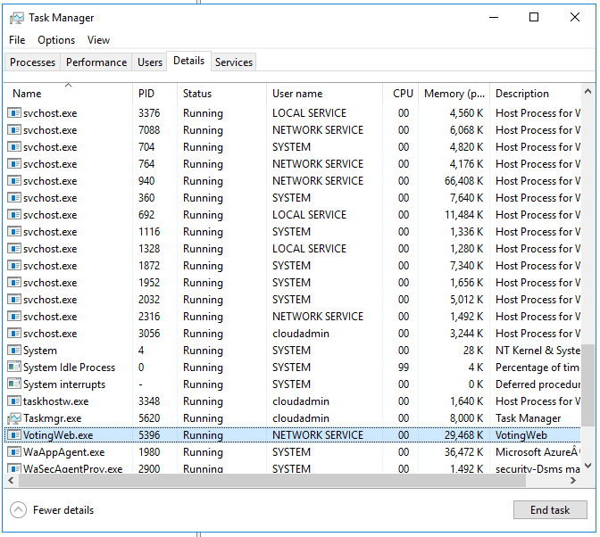
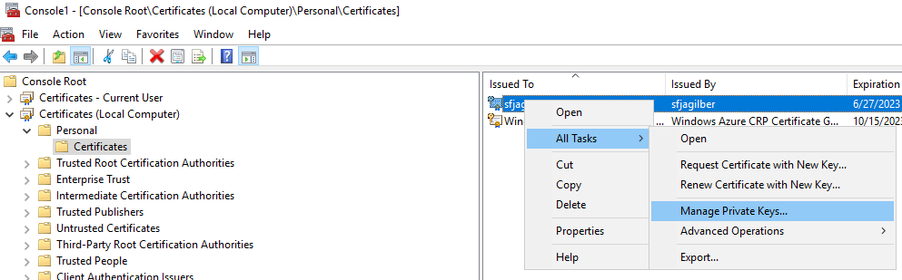
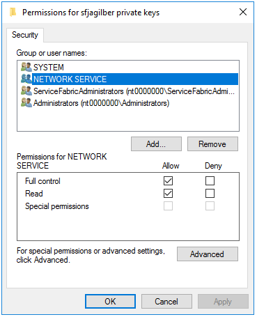
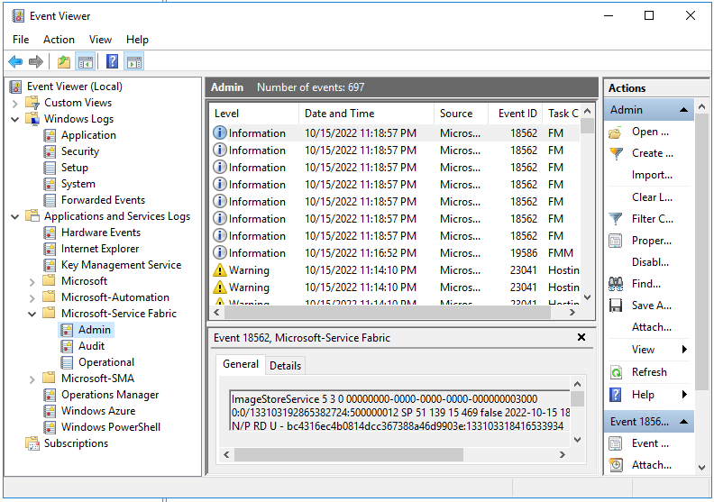

# How to ACL application certificate private key using ApplicationManifest.xml

Applications using a certificate for secure communication over https need to have the Access Control List (ACL) configured with Full permissions for the user context being used for the application process. Service Fabric will automatically attempt to ACL the application certificate only if the certificate information is configured in ApplicationManifest.xml as shown below. Other options are available as well for example running a setup script as documented in [Tutorial: Add an HTTPS endpoint to an ASP.NET Core Web API front-end service using Kestrel](https://learn.microsoft.com/en-us/azure/service-fabric/service-fabric-tutorial-dotnet-app-enable-https-endpoint).

By default, Service Fabric fabrichost.exe starts applications using the 'NT Authority/Network Service' account based on the user account fabric.exe is configured for. The certificates private key has to be ACL'd to allow this account access to the key. If the application is using a non-default credential, for example with the '&lt;RunAsPolicy&gt;' element, Service Fabric will ACL the certificate private key automatically as well. 

If a certificate is deployed to a Service Fabric cluster, and the application cannot access the private key, the application will fail to listen on the tcp port. In this scenario there are multiple causes, however, it is possible the private key is not ACL'd correctly or not configured in ApplicationManifest.xml. See [Example SCHANNEL Error](#example-schannel-error).

The following example configures the Principal and sets the private key ACL using '&lt;Principals&gt;' and '&lt;Certificates&gt;' elements in ApplicationManifest.xml. See [Assign a security access policy for HTTP and HTTPS endpoints](https://learn.microsoft.com/azure/service-fabric/service-fabric-assign-policy-to-endpoint) and [Manage encrypted secrets in Service Fabric applications](https://docs.microsoft.com/azure/service-fabric/service-fabric-application-secret-management)
 for additional configuration information.

## ApplicationManifest.xml Configuration

- **'&lt;Principals&gt;&lt;Users&gt;'** section - Add **'&lt;User&gt;'** element for the user account executing application. For 'AccountType', enter 'NetworkService' for user 'Network Service'. See [AccountType](https://learn.microsoft.com/azure/service-fabric/service-fabric-service-model-schema-elements#accounttype) for list of all account types.
- **'&lt;Certificates&gt;'** section - Add **'&lt;EndpointCertificate&gt;'** element for the endpoint certificate.

## Example ApplicationManifest.xml

```xml
<ApplicationManifest>
	<Parameters>
		<Parameter Name="ApplicationClientThumbprint" DefaultValue="012345678901234567890123456789" />
		<!-- <Parameter Name="ApplicationClientCommonName" DefaultValue="*.contoso.com" /> -->
	</Parameters>
	…
	<Principals>
		<Users>
			<User Name="Service1" AccountType="NetworkService" />
		</Users>
	</Principals>
	<Certificates>
		<EndpointCertificate X509FindValue="[ApplicationClientThumbprint]" Name="WebAdminCert" />
		<!-- <EndpointCertificate X509FindType="FindBySubjectName" X509FindValue="[ApplicationClientCommonName]" Name="WebAdminCert" /> -->
	</Certificates>
</ApplicationManifest>
```

## Troubleshooting

- To verify which user context is being used, [RDP](https://docs.microsoft.com/azure/service-fabric/service-fabric-cluster-remote-connect-to-azure-cluster-node) to any node running application and view the process in Task Manager 'Details' tab. If application process is not available, find 'fabric.exe' to identify the user context that will be used.

  

- To verify ACL permissions on a certificate, [RDP](https://docs.microsoft.com/azure/service-fabric/service-fabric-cluster-remote-connect-to-azure-cluster-node) to any node running application and view certificate in Microsoft Management Console (mmc.exe). Open certlm.msc (mmc local machine certificates shortcut), right click on certificate being used, and select 'Manage private keys...'. The 'User name' for the process in 'Task Manager' needs to have 'Full control' ACL permissions on certificate private key being used.

  

  

- If unable to determing issue, [RDP](https://docs.microsoft.com/azure/service-fabric/service-fabric-cluster-remote-connect-to-azure-cluster-node) to any node running application, open 'Event Viewer' (eventvwr.exe) and review 'System', 'Application', and 'Microsoft-Service Fabric/Admin' logs for errors.

  

### Example SCHANNEL Error

```xml
Log Name:      System
Source:        Schannel
Date:          10/16/2022 8:27:36 PM
Event ID:      36870
Task Category: None
Level:         Error
Keywords:      
User:          SYSTEM
Computer:      nt0000000
Description:
A fatal error occurred when attempting to access the TLS server credential private key. The error code returned from the cryptographic module is 0x8009030D. The internal error state is 10001.
Event Xml:
<Event xmlns="http://schemas.microsoft.com/win/2004/08/events/event">
  <System>
    <Provider Name="Schannel" Guid="{1F678132-5938-4686-9FDC-C8FF68F15C85}" />
    <EventID>36870</EventID>
    <Version>0</Version>
    <Level>2</Level>
    <Task>0</Task>
    <Opcode>0</Opcode>
    <Keywords>0x8000000000000000</Keywords>
    <TimeCreated SystemTime="2022-10-16T20:27:36.222854900Z" />
    <EventRecordID>2213</EventRecordID>
    <Correlation ActivityID="{B1E3A429-AE1E-0001-CF50-D24FA6E0D801}" />
    <Execution ProcessID="616" ThreadID="3936" />
    <Channel>System</Channel>
    <Computer>nt0000000</Computer>
    <Security UserID="S-1-5-18" />
  </System>
  <EventData>
    <Data Name="Type">server</Data>
    <Data Name="ErrorCode">0x8009030d</Data>
    <Data Name="ErrorStatus">10001</Data>
  </EventData>
</Event>
```

## Reference

- [Service Fabric application and service manifests](https://learn.microsoft.com/azure/service-fabric/service-fabric-application-and-service-manifests)
- [SecurityAccessPolicy element](https://learn.microsoft.com/azure/service-fabric/service-fabric-service-model-schema-elements#securityaccesspolicy-element)
- [User element](https://learn.microsoft.com/azure/service-fabric/service-fabric-service-model-schema-elements#user-element)
- [Run a service startup script as a local user or system account](https://learn.microsoft.com/azure/service-fabric/service-fabric-run-script-at-service-startup)

- [Service Fabric application and service security](https://learn.microsoft.com/azure/service-fabric/service-fabric-application-and-service-security)
- [Manage certificates in Service Fabric clusters](https://learn.microsoft.com/azure/service-fabric/cluster-security-certificate-management)
- [Grant NETWORK SERVICE access to the certificate's private key](https://learn.microsoft.com/azure/service-fabric/service-fabric-tutorial-dotnet-app-enable-https-endpoint#grant-network-service-access-to-the-certificates-private-key)
- [Specify resources in a service manifest](https://learn.microsoft.com/azure/service-fabric/service-fabric-service-manifest-resources)
