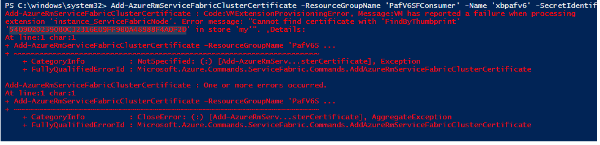

# Intermediate Certificate

## **Symptom** 

During the Certificate Swap, customer noticed that intermediate certificate thumbprint is populating as secondary certificate, which cause the cluster upgrade operation to fail.

## **Resolution**

This is a known issue with the AzureRM ServiceFabric powershell CmdLet, which fixed in latest [AzureRM.ServiceFabric 0.3.3](https://www.powershellgallery.com/packages/AzureRM.ServiceFabric/0.3.3)(To upgrade, please run **Install-Module -Name AzureRM.ServiceFabric -Force**). However if the rolling is completed, please suggest the customer to update the certificate manually from resource explorer.

