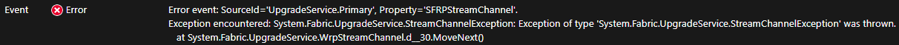

# NSG configuration for Service Fabric clusters (Applied at VNET level)
For FQDN firewall's its recommended you use Azure Firewall.

[Azure Firewall is a managed, cloud-based network security service that protects your Azure Virtual Network resources. It is a fully stateful firewall as a service with built-in high availability and unrestricted cloud scalability.](https://docs.microsoft.com/azure/firewall/overview); this enables the ability to limit outbound HTTP/S traffic to a specified list of fully qualified domain names (FQDN) including wild cards. This feature does not require SSL termination. Its recommended that you leverage Azure Firewall FQDN tags for Windows Updates, and to enable network traffic to Microsoft Windows Update endpoints can flow through your firewall.

## **The minimum rules are required for these ports on Service Fabric clusters:**
-   **Inbound** \[application specific ports such as 80/443 or others as required by your services\]
-   **Inbound** 19000 required for PowerShell management endpoint, Visual Studio (used by Client and Azure Portal) - management, status, and health report
-   **Inbound** 19080 required for Service Fabric Explorer Http management endpoint - management, status, and health report
-   **Inbound** 3389 (**Windows**) or 22 (**Linux**) required for RDP/SSH access to the nodes
-   **Inbound** VnetInbound (*) - node to node communication should never be blocked
    - Specifically (* these are the default ports used by SF, your configuration may be different)
		- Federation/Lease Layer: 1025-1027
		- Federation/Lease Layer: 19001 - 19010 (For Standalone SF clusters)
		- Application Range: 20000-30000
		- Ephemeral Range: 49152-65534
-   **Inbound** 168.63.129.16 - <https://docs.microsoft.com/en-us/azure/load-balancer/load-balancer-custom-probe-overview>
				<https://docs.microsoft.com/en-us/azure/virtual-network/what-is-ip-address-168-63-129-16>

-   **Outbound** VnetOutbound (*) - node to node communication should never be blocked
-   **Outbound** IP of the Regional Service Fabric Resource Provider (SFRP) endpoint(s) - see **SFRP endpoint** below
-   **Outbound** Internet 443/80
    If you have a **DenyAllInternetOutbound** Rule you may see issues with VMMS scale out operations, as new nodes will not be able to access http://download.microsoft.com, which has a highly variable IP address hosted by Akamai Technologies and therefore the node will be unable to download the .cab files required to self-configure and join the cluster; use Azure Firewall for securing outbound communications to download.microsoft.com.

```command
C:\temp\>ping download.microsoft.com
Pinging e3673.dscg.akamaiedge.net [23.15.148.186] with 32 bytes of data:
Reply from 23.15.148.186: bytes=32 time=1ms TTL=54
```

## **SFRP endpoint** 

    You need to allow outbound traffic to port 443 from the cluster to the IP of the Regional Service Fabric Resource Provider (SFRP) endpoint(s).

    Here is the example of how the Cluster communicates outbound:
        Cluster (fabric:/System/UpgradeService) -->  NSG --> Regional SFRP (Resource Provider) <-- -->  Azure Portal

- **Example**

    So if you have deployed the cluster to the westus region, the communication flow  will be 
        Cluster (fabric:/System/UpgradeService) -->  NSG --> westus.servicefabric.azure.com:443 (SFRP) <-- -->  Azure Portal

    Therefore if your NSG is blocking outbound traffic to westus.servicefabric.azure.com then the cluster will be unable to establish communication with the Resource Provider AND the portal will not be able to obtain current information about the cluster from the SFRP. Blocking this communication will also cause errors in the UpgradeService for SFRPStreamChannel, and when deploying a new cluster can cause a cluster to get stuck in a Deploying or WaitingForNodes state indefinitely.



* Currently these IP addresses for these regional SF providers are not static or published and have the possibility to change, although in practice it will be very rare for these to change. The IP addresses will also vary based on the region the SF cluster is deployed in to.

    - To find the correct IP addresses you can use NSLOOKUP for the regions you are deploying to:

```command
        NSLOOKUP westus.servicefabric.azure.com
        Addresses: 137.117.19.182
                   104.40.85.143
                   104.40.77.32
```

- Add the 137.117.19.182 and 104.40.85.143 and 104.40.77.32 ip address to your outbound NSG rule.  These IP addresses should rarely, if ever change, but if they do the impact is minor and should only affect the management endpoint connectivity and it shouldn't cause any serious issue for you applications.  If it were to change at some point in the future you would have to update your NSG again. 


**Note**  Some regions have SFRP dns names which are flipped so instead of japaneast you may need to try eastjapan

    nslookup eastjapan.servicefabric.azure.com
    Name: eastjapan.servicefabric.azure.com
    Address: 104.41.187.29 

- Alternatively, you can leverage **Service Tag** feature in Azure VNET. Ref. Article: https://docs.microsoft.com/en-us/azure/virtual-network/service-tags-overview#available-service-tags

## **Common related errors/symptoms**

* New clusters with an over restrictive NSG ruleset will cause clusters to be stuck in 'WaitingForNodes' status.  

If the Load Balancer (168.63.129.16) rule or the outbound SFRP endpoint rule is missing it can cause errors with the **fabric:/System/UpgradeService**

* Error event: SourceId=**\'UpgradeService.Primary**\', Property=\'**SFRPStreamChannel**\'. **Exception encountered**: System.Threading.Tasks.TaskCanceledException: A task was canceled. at System.Runtime.CompilerServices.TaskAwaiter.ThrowForNonSuccess(Task task) at System.Runtime.CompilerServices.TaskAwaiter.HandleNonSuccessAndDebuggerNotification(Task task) at System.Fabric.UpgradeService.WrpStreamChannel.d\_\_29.MoveNext()

    Or warnings on Node level for
* Unhealthy event: SourceId=\'**System.FabricNode**\', Property=**\'SecurityApi\_CertGetCertificateChain**\', HealthState=\'Warning\', ConsiderWarningAsError=false. **Security API:call duration = 15.002, configuration Setting Security/SlowApiThreshold = 10.000**

