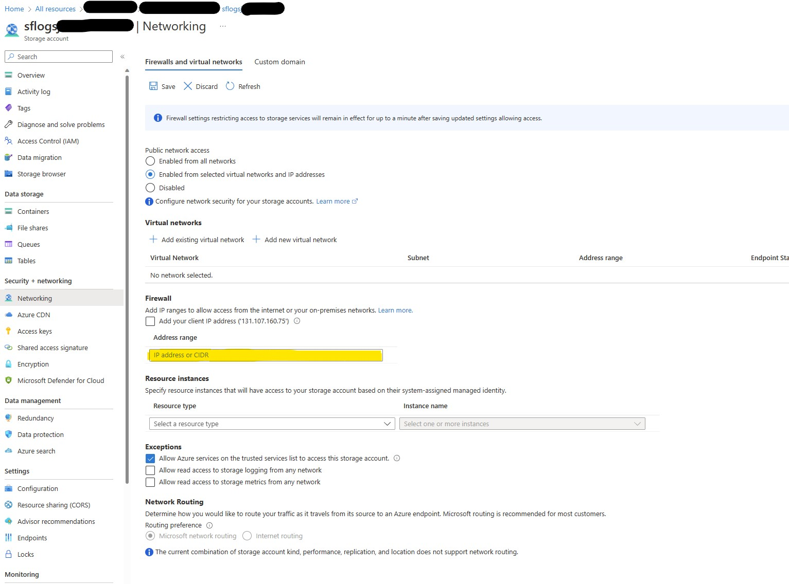

# How to provide access to diagnostic logs for Microsoft Customer Support?

## Why does the customer support need access?
In order to troubleshoot most issues that are related to Service Fabric, Service Fabric engineering and customer support can, with your permission, download diagnostic logs that are uploaded to your Service Fabric diagnostic storage account. Microsoft may access (including making temporary copies of) the data in this diagnostic storage account to assist with resolving your support incident.

## Which files are captured and uploaded to the storage account? 

Learn more about the diagnostic files.

Documentation: [Microsoft Azure Service Fabric Logs](https://learn.microsoft.com/en-us/troubleshoot/azure/general/fabric-logs)

## How to allow access to customer support?

In order to secure access to the Azure Storage account, customer might configure the storage account by lock down the public access to it completely.

To allow customer support to access the download from the storage account, the customer need to add a client IP address to allow access. This IP address can be one which is owned by Microsoft as part of the IP range which is restricted to users of Secure Admin Workstation. Please contact customer support to get more information.

Documentation: [Grant access from an internet IP range](https://learn.microsoft.com/en-us/azure/storage/common/storage-network-security?tabs=azure-portal#grant-access-from-an-internet-ip-range)

