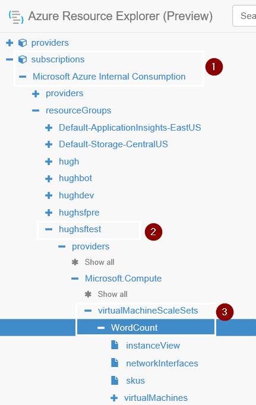
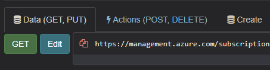
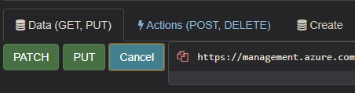
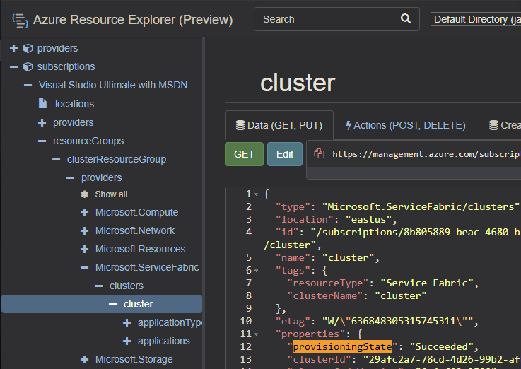
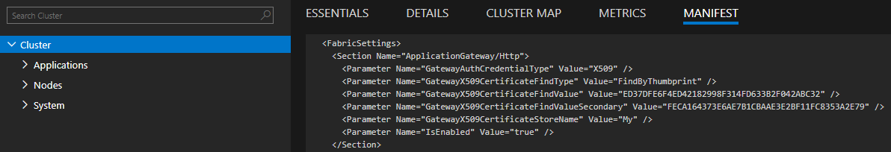
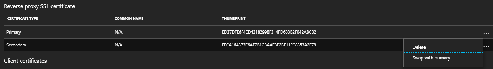

## Swap Reverse Proxy certificate

## Reference

https://github.com/ChackDan/Service-Fabric/tree/master/ARM%20Templates/ReverseProxySecureSample#rolling-over-reverse-proxy-certificate

## Steps

1. Create a new certificate and Upload to Key Vault (multiple options)

    a. Create with any reputable CA

    b. Generate Selfsigned, Import existing certs using Azure Portal -> Key Vault - https://blogs.technet.microsoft.com/kv/2016/09/26/get-started-with-azure-key-vault-certificates/

    c. Create and Upload using PowerShell - [CreateKeyVaultAndCertificateForServiceFabric.ps1](../Scripts/CreateKeyVaultAndCertificateForServiceFabric.ps1)


2. Go to <https://resources.azure.com> and find your subscription \-- \> resource group \-- \> providers/Microsoft.Compute/virtualMachineScaleSets \-- \> your VMSS



3. Click \"Edit\" and \"Read/Write\" permission




4. Update the VirtualMachineProfile for each nodetype, to add (aka **Deploy**) the new certificate to the VMMS

>> a. If the new certificate is in the **same Key Vault** as the Primary add it to the array of 'vaultCertificates' as shown below

```json
    "virtualMachineProfile": {
        "osProfile": {
        …
        "secrets": [
            {
                "sourceVault": {
                    "id": "/subscriptions/xxxxxxxx-xxxx-xxxx-xxxx-xxxxxxxxxxxx/resourceGroups/sampleVaultGroup/providers/Microsoft.KeyVault/vaults/samplevault1"
                },
                "vaultCertificates": [
                    {
                        "certificateUrl": "https://samplevault1.vault.azure.net/secrets/clustercert001/d5eeaf025c7d435f81e7420393b442a9",
                        "certificateStore": "My"
                    },
                    {
                        "certificateUrl": "https://samplevault1.vault.azure.net/secrets/sedeastrp01/e3a0dc94add34e418110729eaf7c11cf",
                        "certificateStore": "My"
                    },
                    {
                        "certificateUrl": "https://samplevault1.vault.azure.net/secrets/sedeastrp02/c5487522af3249bda482a5f5dbbb0357",
                        "certificateStore": "My"
                    }
                ]
            }
        ]
```

>> b. If the new certificate is in a **different Key Vault** as the Primary add an additional secret to the array of 'secrets' as shown below, or alternatively use [Add new cert to VMSS](.\Add_New_Cert_To_VMMS.ps1)

```json
"virtualMachineProfile": {
    "osProfile": {
    …
    "secrets": [
        {
        "sourceVault": {
                "id": "/subscriptions/xxxxxxxx-xxxx-xxxx-xxxx-xxxxxxxxxxxx/resourceGroups/sampleVaultGroup/providers/Microsoft.KeyVault/vaults/samplevault1"
            },
            "vaultCertificates": [
                {
                    "certificateUrl": "https://samplevault1.vault.azure.net/secrets/clustercert001/d5eeaf025c7d435f81e7420393b442a9",
                    "certificateStore": "My"
                }
            ]
        },
        {
        "sourceVault": {
                "id": "/subscriptions/xxxxxxxx-xxxx-xxxx-xxxx-xxxxxxxxxxxx/resourceGroups/sampleVaultGroup/providers/Microsoft.KeyVault/vaults/samplevault2"
            },
            "vaultCertificates": [
                {
                    "certificateUrl": "https://samplevault2.vault.azure.net/secrets/sedeastrp01/77ff7688258a41f7b0afdd890eb4aa8c",
                    "certificateStore": "My"
                }
            ]
        },
        {
        "sourceVault": {
                "id": "/subscriptions/xxxxxxxx-xxxx-xxxx-xxxx-xxxxxxxxxxxx/resourceGroups/sampleVaultGroup/providers/Microsoft.KeyVault/vaults/samplevault3"
            },
            "vaultCertificates": [
                {
                    "certificateUrl": "https://samplevault3.vault.azure.net/secrets/sedeastrp02/77ff7688258a41f7b0afdd890eb4aa8c",
                    "certificateStore": "My"
                }
            ]
        }
    ]
```

5. Add the following **\"reverseProxySecondaryCertificate\"** settings in VMSS/extensionProfile/extensions:

```json
"virtualMachineProfile": {
      "osProfile": {
        ...
        "extensionProfile": {
            "extensions": [
            {
                "properties": {
                "autoUpgradeMinorVersion": true,
                "settings": {
                    "clusterEndpoint": "https://westus.servicefabric.azure.com/runtime/clusters/d4556f3b-e496-4a46-9f20-3db88fecdf11",
                    "nodeTypeRef": "WordCount",
                    ...
                    "certificate": {
                        "thumbprint": "16A2561C8C691B9C683DB1CA06842E7FA85F6726",
                        "x509StoreName": "My"
                    },
                    "reverseProxyCertificate": {
                        "thumbprint": "FECA164373E6AE7B1CBAAE3E2BF11FC8353A2E79",
                        "x509StoreName": "My"
                    },
                    "reverseProxySecondaryCertificate": {
                        "thumbprint": "ED37DFE6F4ED42182998F314FD633B2F042ABC32",
                        "x509StoreName": "My"
                    }
                },
                "publisher": "Microsoft.Azure.ServiceFabric",
                "type": "ServiceFabricNode",
                "typeHandlerVersion": "1.0"
                },
                "name": "wordcount_ServiceFabricNode"
            },
```

* And then scroll back to the top of the page and click PUT.

    

6. Back in Azure Portal the VMMS resource will move to a 'Updating' status, **wait** to get back to \"Succeeded\" status before updating the Service Fabric cluster settings (step 7):


7. Next edit the Microsoft.ServiceFabric provider for your cluster

* Adding \"thumbprintSecondary\": \"ED37DFE6F4ED42182998F314FD633B2F042ABC32\" setting

```json
  "type": "Microsoft.ServiceFabric/clusters",
  "properties": {
    "provisioningState": "Succeeded",
    "clusterId": "d4556f3b-e496-4a46-9f20-3db88fecdf11",
    "clusterCodeVersion": "6.3.162.9494",
    "clusterState": "Ready",
    "managementEndpoint": "https://hughsftest.westus.cloudapp.azure.com:19080",
    "clusterEndpoint": "https://westus.servicefabric.azure.com/runtime/clusters/d4556f3b-e496-4a46-9f20-3db88fecdf11",
    "certificate": {
      "thumbprint": "8934E0494979684F2627EE382B5AD84A8FAD6823",
      "x509StoreName": "My"
    },
    "reverseProxyCertificate": {
      "thumbprint": "FECA164373E6AE7B1CBAAE3E2BF11FC8353A2E79",
      "thumbprintSecondary": "ED37DFE6F4ED42182998F314FD633B2F042ABC32",
      "x509StoreName": "My"
    }
```

8. **Wait** for the SF cluster Updating the secondary certificate to complete



* FAQ: [Why do cluster upgrades take so long](../Cluster/Why%20do%20cluster%20upgrades%20take%20so%20long.md)


9. Swap the values of "reverseProxyCertificate" and "reverseProxySecondaryCertificate" properties in the VMMS resource

```json
"virtualMachineProfile": {
      "osProfile": {
        ...
        "extensionProfile": {
            "extensions": [
            {
                "properties": {
                "autoUpgradeMinorVersion": true,
                "settings": {
                    "clusterEndpoint": "https://westus.servicefabric.azure.com/runtime/clusters/d4556f3b-e496-4a46-9f20-3db88fecdf11",
                    "nodeTypeRef": "WordCount",
                    ...
                    "certificate": {
                        "thumbprint": "16A2561C8C691B9C683DB1CA06842E7FA85F6726",
                        "x509StoreName": "My"
                    },
                    "reverseProxyCertificate": {
                        "thumbprint": "ED37DFE6F4ED42182998F314FD633B2F042ABC32",
                        "x509StoreName": "My"
                    },
                    "reverseProxySecondaryCertificate": {
                        "thumbprint": "FECA164373E6AE7B1CBAAE3E2BF11FC8353A2E79",
                        "x509StoreName": "My"
                    }
                },
                "publisher": "Microsoft.Azure.ServiceFabric",
                "type": "ServiceFabricNode",
                "typeHandlerVersion": "1.0"
                },
                "name": "wordcount_ServiceFabricNode"
            },
```

* And then scroll back to the top of the page and click PUT and Wait for the update to complete.

    

10. Swap the "reverseProxyCertificate" property values for "thumbprint" and "thumbprintSecondary" for the ServiceFabric Cluster resource

```json
  "type": "Microsoft.ServiceFabric/clusters",
  "properties": {
    "provisioningState": "Succeeded",
    "clusterId": "d4556f3b-e496-4a46-9f20-3db88fecdf11",
    "clusterCodeVersion": "6.3.162.9494",
    "clusterState": "Ready",
    "managementEndpoint": "https://hughsftest.westus.cloudapp.azure.com:19080",
    "clusterEndpoint": "https://westus.servicefabric.azure.com/runtime/clusters/d4556f3b-e496-4a46-9f20-3db88fecdf11",
    "certificate": {
      "thumbprint": "8934E0494979684F2627EE382B5AD84A8FAD6823",
      "x509StoreName": "My"
    },
    "reverseProxyCertificate": {
      "thumbprint": "ED37DFE6F4ED42182998F314FD633B2F042ABC32",
      "thumbprintSecondary": "FECA164373E6AE7B1CBAAE3E2BF11FC8353A2E79",
      "x509StoreName": "My"
    }
```

* And then scroll back to the top of the page and click PUT and Wait for the update to complete.

    

11. When the cluster updates are complete you should be able to verify the certificate thumbprints have swapped by checking from Service Fabric Explorer -> Cluster -> Manifest
    

* Or in the Azure portal > Cluster -> Security 

    

* Feel free to delete the old certificate at this point (now in the Secondary)


